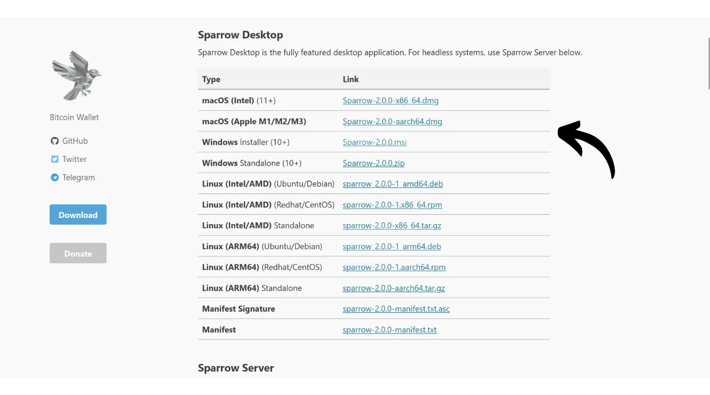
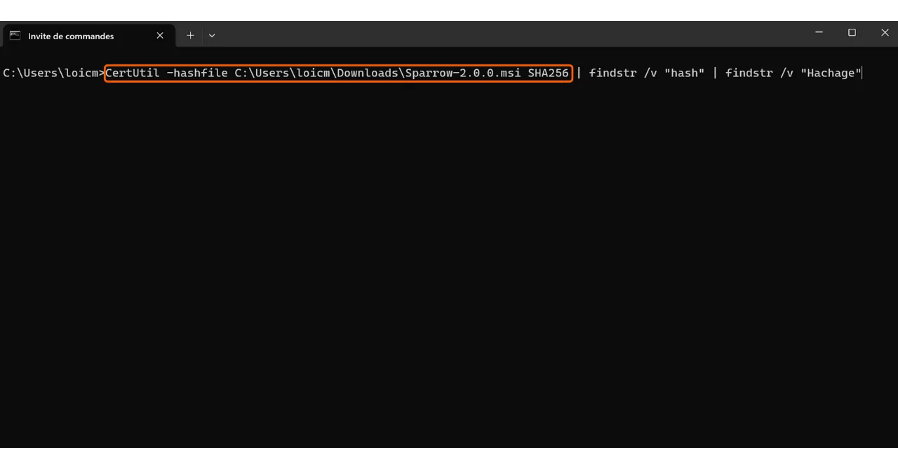

Beim Herunterladen von Software ist es sehr wichtig sicherzustellen, dass sie nicht verändert wurde und tatsächlich vom offiziellen Anbieter stammt. Dies gilt insbesondere für Software, die mit Bitcoin zu tun hat, wie Wallet-Software, mit der Sie die Schlüssel sichern können, die Zugang zu Ihren Geldmitteln bieten. In diesem Tutorial werden wir sehen, wie man die Integrität und Authentizität von Software vor der Installation überprüft. Wir werden Sparrow Wallet als Beispiel verwenden, eine beliebte Wallet-Software unter Bitcoin-Nutzern, aber das Verfahren ist das gleiche für jede andere Software.

Die Überprüfung der Integrität beinhaltet die Sicherstellung, dass die heruntergeladene Datei nicht durch den Vergleich ihres digitalen Fingerabdrucks (d.h. ihres Hashes) mit dem vom offiziellen Entwickler bereitgestellten verändert wurde. Wenn die beiden übereinstimmen, bedeutet dies, dass die Datei mit dem Original identisch ist und nicht von einem Angreifer beschädigt oder modifiziert wurde.

Die Überprüfung der Authentizität stellt andererseits sicher, dass die Datei tatsächlich vom offiziellen Entwickler und nicht von einem Betrüger stammt. Dies geschieht durch die Überprüfung einer digitalen Signatur. Diese Signatur beweist, dass die Software mit dem privaten Schlüssel des legitimen Entwicklers signiert wurde.

Wenn diese Überprüfungen nicht durchgeführt werden, besteht das Risiko, Malware zu installieren, die modifizierten Code enthalten könnte. Dieser Code könnte entweder Informationen wie Ihre privaten Schlüssel stehlen oder den Zugang zu Ihren Dateien blockieren. Diese Art von Angriff ist ziemlich häufig, insbesondere im Kontext von Open-Source-Software, bei der gefälschte Versionen verbreitet werden können.

Um diese Überprüfung durchzuführen, werden wir zwei Werkzeuge verwenden: Hashing-Funktionen zur Überprüfung der Integrität und GnuPG, ein Open-Source-Tool, das das PGP-Protokoll implementiert, zur Überprüfung der Authentizität.

## Voraussetzungen

Wenn Sie **Linux** verwenden, ist GPG auf den meisten Distributionen vorinstalliert. Wenn nicht, können Sie es mit folgendem Befehl installieren:

```bash
sudo apt install gnupg
```

Für **macOS**, falls Sie den Homebrew-Paketmanager noch nicht installiert haben, tun Sie dies mit den folgenden Befehlen:

```bash
/bin/bash -c "$(curl -fsSL https://raw.githubusercontent.com/Homebrew/install/HEAD/install.sh)"
```

```bash
echo 'eval "$(/opt/homebrew/bin/brew shellenv)"' >> ~/.zprofile
```

```bash
eval "$(/opt/homebrew/bin/brew shellenv)"
```

Installieren Sie dann GPG mit diesem Befehl:

```bash
brew install gnupg
```
Für **Windows**, falls Sie GPG nicht haben, können Sie die [Gpg4win](https://www.gpg4win.org/) Software installieren.


## Dokumente herunterladen

Zum Start benötigen wir verschiedene Dokumente. Besuchen Sie die offizielle Seite von [Sparrow Wallet im Abschnitt "*Download*"](https://sparrowwallet.com/download/). Wenn Sie eine andere Software überprüfen möchten, gehen Sie auf die Website dieser Software.


Sie können auch [zum GitHub-Repository des Projekts](https://github.com/sparrowwallet/sparrow/releases) gehen.


Laden Sie den Installer für die Software herunter, der zu Ihrem Betriebssystem passt.



Sie benötigen auch den Hash der Datei, oft als "*SHA256SUMS*" oder "*MANIFEST*" bezeichnet.


Laden Sie auch die PGP-Signatur der Datei herunter. Dies ist das Dokument im `.asc` Format.


Stellen Sie sicher, dass Sie alle diese Dateien im gleichen Ordner platzieren, um die folgenden Schritte durchzuführen.
Schließlich benötigen Sie den öffentlichen Schlüssel des Entwicklers, den wir verwenden werden, um die PGP-Signatur zu verifizieren. Dieser Schlüssel ist oft entweder auf der Website der Software, im GitHub-Repository des Projekts, manchmal auf den sozialen Medien des Entwicklers oder auf spezialisierten Seiten wie Keybase verfügbar. Im Fall von Sparrow Wallet können Sie den öffentlichen Schlüssel des Entwicklers Craig Raw [auf Keybase](https://keybase.io/craigraw) finden. Um ihn direkt aus dem Terminal herunterzuladen, führen Sie den Befehl aus:

```bash
curl https://keybase.io/craigraw/pgp_keys.asc | gpg --import
```


## Die Signatur verifizieren

Der Prozess der Signaturverifizierung ist auf **Windows**, **macOS** und **Linux** gleich. Normalerweise haben Sie den öffentlichen Schlüssel bereits im vorherigen Schritt importiert, falls nicht, tun Sie dies mit dem Befehl:

```bash
gpg --import [Schlüsselpfad]
```

Ersetzen Sie `[Schlüsselpfad]` mit dem Speicherort der Datei des öffentlichen Schlüssels des Entwicklers.


Verifizieren Sie die Signatur mit dem folgenden Befehl:

```bash
gpg --verify [Datei.asc]
```

Ersetzen Sie `[Datei.asc]` mit dem Pfad der Signaturdatei. Im Fall von Sparrow heißt diese Datei "*sparrow-2.0.0-manifest.txt.asc*" für die Version 2.0.0.


Wenn die Signatur gültig ist, wird GPG Ihnen dies anzeigen. Sie können dann zum nächsten Schritt übergehen, da dies die Authentizität der Datei bestätigt.


## Die Hash-Prüfung
Jetzt, da die Authentizität der Software bestätigt wurde, ist es auch notwendig, ihre Integrität zu überprüfen. Wir werden den Hash der Software mit dem vom Entwickler bereitgestellten Hash vergleichen. Wenn die beiden übereinstimmen, garantiert dies, dass der Softwarecode nicht verändert wurde.

Auf **Windows** öffnen Sie ein Terminal und führen den folgenden Befehl aus:

```bash
CertUtil -hashfile [Dateipfad] SHA256 | findstr /v "hash"
```

Ersetzen Sie `[Dateipfad]` mit dem Speicherort des Installationsprogramms.



Das Terminal gibt den Hash der heruntergeladenen Software zurück.


Beachten Sie, dass es für einige Software notwendig sein kann, eine andere Hash-Funktion als SHA256 zu verwenden. In diesem Fall ersetzen Sie einfach den Namen der Hash-Funktion im Befehl.

Vergleichen Sie dann das Ergebnis mit dem entsprechenden Wert in der Datei "*sparrow-2.0.0-manifest.txt*".


In meinem Fall sehen wir, dass die beiden Hashes perfekt übereinstimmen.

Auf **macOS** und **Linux** ist der Prozess der Hash-Verifizierung automatisiert. Es ist nicht notwendig, manuell die Übereinstimmung zwischen den beiden Hashes zu überprüfen, wie auf Windows.

Führen Sie einfach diesen Befehl auf **macOS** aus:

```bash
shasum --check [Dateiname] --ignore-missing
```

Ersetzen Sie `[Dateiname]` mit dem Namen des Installationsprogramms. Zum Beispiel für Sparrow Wallet:

```bash
shasum --check sparrow-2.0.0-manifest.txt --ignore-missing
```

Wenn die Hashes übereinstimmen, sollten Sie die folgende Ausgabe sehen:

```bash
Sparrow-2.0.0.dmg: OK
```
Unter **Linux** ist der Befehl ähnlich:
```bash
sha256sum --check [Dateiname] --ignore-missing
```

Und wenn die Hashes übereinstimmen, sollten Sie folgende Ausgabe sehen:

```bash
sparrow_2.0.0-1_amd64.deb: OK
```

Sie können nun sicher sein, dass die Software, die Sie heruntergeladen haben, sowohl authentisch als auch intakt ist. Sie können mit der Installation auf Ihrem Gerät fortfahren.

Wenn Sie dieses Tutorial hilfreich fanden, würde ich mich über ein Daumen hoch unten freuen. Fühlen Sie sich frei, diesen Artikel in Ihren sozialen Netzwerken zu teilen. Vielen Dank!

Ich empfehle auch, dieses andere Tutorial über VeraCrypt zu lesen, eine Software, die es Ihnen ermöglicht, Speichergeräte zu verschlüsseln und zu entschlüsseln.

https://planb.network/tutorials/others/veracrypt