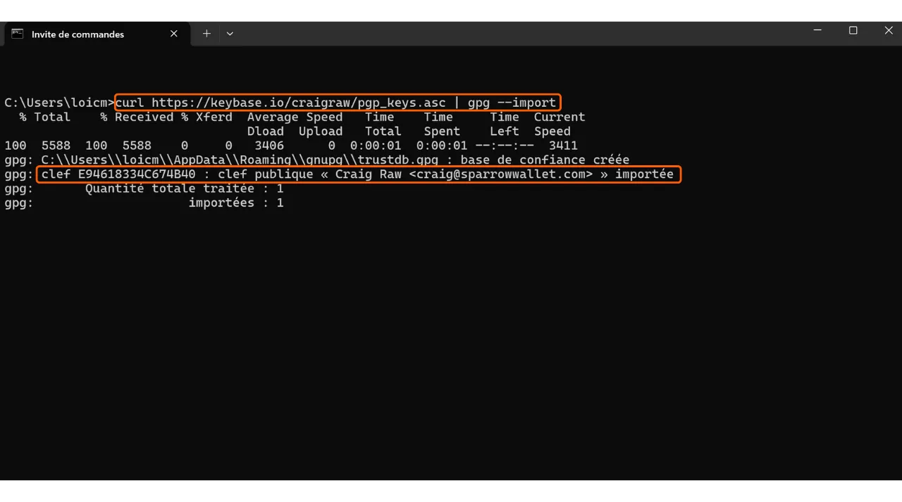

When downloading software, it's very important to ensure that it hasn't been altered and that it indeed comes from the official source. This is especially true for software related to Bitcoin, such as wallet software, which allows you to secure the keys giving access to your funds. In this tutorial, we will see how to verify the integrity and authenticity of software before installing it. We will use Sparrow Wallet as an example, a favorite wallet software among bitcoiners, but the procedure will be the same for any other software.

Verifying integrity involves ensuring that the downloaded file has not been modified by comparing its digital fingerprint (i.e., its hash) with the one provided by the official developer. If the two match, it means that the file is identical to the original and has not been corrupted or modified by an attacker.

Verifying authenticity, on the other hand, ensures that the file indeed comes from the official developer and not an impostor. This is done by verifying a digital signature. This signature proves that the software was signed with the legitimate developer's private key.

If these checks are not performed, there is a risk of installing malware that could contain modified code. This code could either steal information like your private keys or block access to your files. This type of attack is quite common, especially in the context of open-source software where counterfeit versions can be distributed.

To perform this verification, we will use two tools: hashing functions to verify integrity, and GnuPG, an open-source tool that implements the PGP protocol, to verify authenticity.

## Prerequisites

If you are on **Linux**, GPG is preinstalled on most distributions. If not, you can install it with the following command:

```bash
sudo apt install gnupg
```

For **macOS**, if you haven't already installed the Homebrew package manager, do so with the following commands:

```bash
/bin/bash -c "$(curl -fsSL https://raw.githubusercontent.com/Homebrew/install/HEAD/install.sh)"
```

```bash
echo 'eval "$(/opt/homebrew/bin/brew shellenv)"' >> ~/.zprofile
```

```bash
eval "$(/opt/homebrew/bin/brew shellenv)"
```

Then install GPG with this command:

```bash
brew install gnupg
```
For **Windows**, if you do not have GPG, you can install the [Gpg4win](https://www.gpg4win.org/) software.


## Downloading Documents

To start, we will need various documents. Visit the official site of [Sparrow Wallet in the "*Download*" section](https://sparrowwallet.com/download/). If you wish to verify another software, go to that software's website.


You can also go [to the GitHub repository of the project](https://github.com/sparrowwallet/sparrow/releases).


Download the installer for the software corresponding to your operating system.


You will also need the file's hash, often called "*SHA256SUMS*" or "*MANIFEST*".


Download the PGP signature of the file as well. This is the document in `.asc` format.


Make sure to place all these files in the same folder for the following steps.

Finally, you will need the developer's public key, which we will use to verify the PGP signature. This key is often available either on the software's website, on the GitHub repository of the project, sometimes on the developer's social media, or on specialized sites like Keybase. In the case of Sparrow Wallet, you can find developer Craig Raw's public key [on Keybase](https://keybase.io/craigraw). To download it directly from the terminal, execute the command:

```bash
curl https://keybase.io/craigraw/pgp_keys.asc | gpg --import
```



## Verifying the Signature

The process of verifying the signature is the same on **Windows**, **macOS**, and **Linux**. Normally, you have already imported the public key during the previous step, but if not, do so with the command:

```bash
gpg --import [key path]
```

Replace `[key path]` with the location of the developer's public key file.


Verify the signature with the following command:

```bash
gpg --verify [file.asc]
```

Replace `[file.asc]` with the path of the signature file. In the case of Sparrow, this file is called "*sparrow-2.0.0-manifest.txt.asc*" for version 2.0.0.


If the signature is valid, GPG will indicate this to you. You can then move on to the next step, as this confirms the file's authenticity.


## Verifying the Hash
Now that the software's authenticity has been confirmed, it's also necessary to verify its integrity. We will compare the software's hash with the hash provided by the developer. If the two match, it guarantees that the software code has not been altered.

On **Windows**, open a terminal and execute the following command:

```bash
CertUtil -hashfile [file path] SHA256 | findstr /v "hash"
```

Replace `[file path]` with the location of the installer.


The terminal will return the hash of the downloaded software.


Be aware, for some software, it may be necessary to use a different hash function than SHA256. In this case, simply replace the hash function's name in the command.

Then compare the result with the corresponding value in the file "*sparrow-2.0.0-manifest.txt*".


In my case, we see that the two hashes match perfectly.

On **macOS** and **Linux**, the hash verification process is automated. It's not necessary to manually check the match between the two hashes as on Windows.

Simply execute this command on **macOS**:

```bash
shasum --check [file name] --ignore-missing
```

Replace `[file name]` with the name of the installer. For example, for Sparrow Wallet:

```bash
shasum --check sparrow-2.0.0-manifest.txt --ignore-missing
```

If the hashes match, you should see the following output:

```bash
Sparrow-2.0.0.dmg: OK
```

On **Linux**, the command is similar:

```bash
sha256sum --check [file name] --ignore-missing
```

And if the hashes match, you should see the following output:

```bash
sparrow_2.0.0-1_amd64.deb: OK
```

You are now assured that the software you've downloaded is both authentic and intact. You can proceed with its installation on your machine.

If you found this tutorial helpful, I would appreciate a thumbs up below. Feel free to share this article on your social networks. Thank you very much!

I also recommend checking out this other tutorial on VeraCrypt, a software that allows you to encrypt and decrypt storage devices.

https://planb.network/tutorials/others/veracrypt