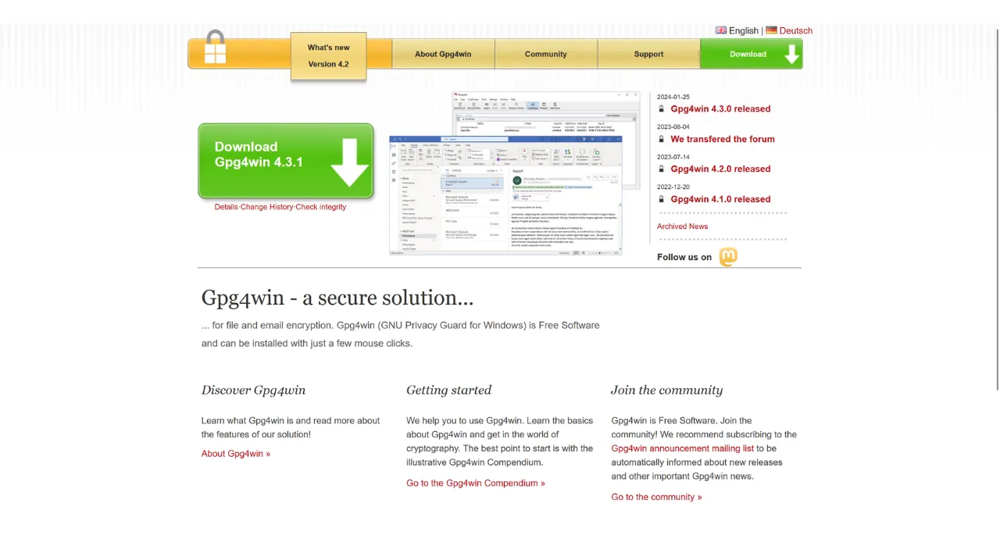

Quando si scarica un software, è molto importante assicurarsi che non sia stato alterato e che provenga effettivamente dalla fonte ufficiale. Questo è particolarmente vero per il software relativo a Bitcoin, come i software di portafoglio, che ti permettono di proteggere le chiavi che danno accesso ai tuoi fondi. In questo tutorial, vedremo come verificare l'integrità e l'autenticità di un software prima di installarlo. Useremo come esempio Sparrow Wallet, un software di portafoglio molto apprezzato tra gli utenti Bitcoin, ma la procedura sarà la stessa per qualsiasi altro software.

Verificare l'integrità comporta assicurarsi che il file scaricato non sia stato modificato confrontando la sua impronta digitale (ovvero il suo hash) con quella fornita dallo sviluppatore ufficiale. Se corrispondono, significa che il file è identico all'originale e non è stato corrotto o modificato da un attaccante.

Verificare l'autenticità, invece, assicura che il file provenga effettivamente dallo sviluppatore ufficiale e non da un impostore. Questo si fa verificando una firma digitale. Questa firma prova che il software è stato firmato con la chiave privata legittima dello sviluppatore.

Se questi controlli non vengono eseguiti, c'è il rischio di installare malware che potrebbe contenere codice modificato. Questo codice potrebbe rubare informazioni come le tue chiavi private o bloccare l'accesso ai tuoi file. Questo tipo di attacco è piuttosto comune, specialmente nel contesto del software open-source dove possono essere distribuite versioni contraffatte.

Per eseguire questa verifica, useremo due strumenti: le funzioni di hashing per verificare l'integrità, e GnuPG, uno strumento open-source che implementa il protocollo PGP, per verificare l'autenticità.

## Prerequisiti

Se sei su **Linux**, GPG è preinstallato nella maggior parte delle distribuzioni. Se non lo è, puoi installarlo con il seguente comando:

```bash
sudo apt install gnupg
```

Per **macOS**, se non hai già installato il gestore di pacchetti Homebrew, fallo con i seguenti comandi:

```bash
/bin/bash -c "$(curl -fsSL https://raw.githubusercontent.com/Homebrew/install/HEAD/install.sh)"
```

```bash
echo 'eval "$(/opt/homebrew/bin/brew shellenv)"' >> ~/.zprofile
```

```bash
eval "$(/opt/homebrew/bin/brew shellenv)"
```

Poi installa GPG con questo comando:

```bash
brew install gnupg
```
Per **Windows**, se non hai GPG, puoi installare il software [Gpg4win](https://www.gpg4win.org/).


## Scaricamento dei Documenti

Per iniziare, avremo bisogno di vari documenti. Visita il sito ufficiale di [Sparrow Wallet nella sezione "*Download*"](https://sparrowwallet.com/download/). Se desideri verificare un altro software, vai sul sito web di quel software.


Puoi anche andare [al repository GitHub del progetto](https://github.com/sparrowwallet/sparrow/releases).


Scarica l'installer del software corrispondente al tuo sistema operativo.


Avrai bisogno anche dell'hash del file, spesso chiamato "*SHA256SUMS*" o "*MANIFEST*".


Scarica anche la firma PGP del file. Questo è il documento in formato `.asc`.


Assicurati di posizionare tutti questi file nella stessa cartella per i passaggi successivi.
Infine, avrai bisogno della chiave pubblica dello sviluppatore, che useremo per verificare la firma PGP. Questa chiave è spesso disponibile sul sito web del software, sul repository GitHub del progetto, talvolta sui social media dello sviluppatore, o su siti specializzati come Keybase. Nel caso di Sparrow Wallet, puoi trovare la chiave pubblica dello sviluppatore Craig Raw [su Keybase](https://keybase.io/craigraw). Per scaricarla direttamente dal terminale, esegui il comando:

```bash
curl https://keybase.io/craigraw/pgp_keys.asc | gpg --import
```


## Verifica della Firma

Il processo di verifica della firma è lo stesso su **Windows**, **macOS** e **Linux**. Normalmente, avrai già importato la chiave pubblica durante il passaggio precedente, ma in caso contrario, fallo con il comando:

```bash
gpg --import [percorso chiave]
```

Sostituisci `[percorso chiave]` con la posizione del file della chiave pubblica dello sviluppatore.


Verifica la firma con il seguente comando:

```bash
gpg --verify [file.asc]
```

Sostituisci `[file.asc]` con il percorso del file della firma. Nel caso di Sparrow, questo file si chiama "*sparrow-2.0.0-manifest.txt.asc*" per la versione 2.0.0.


Se la firma è valida, GPG te lo indicherà. Puoi quindi passare al passaggio successivo, poiché ciò conferma l'autenticità del file.


## Verifica dell'Hash
Ora che l'autenticità del software è stata confermata, è necessario anche verificare la sua integrità. Confronteremo l'hash del software con l'hash fornito dallo sviluppatore. Se i due corrispondono, garantisce che il codice del software non sia stato alterato.

Su **Windows**, apri un terminale ed esegui il seguente comando:

```bash
CertUtil -hashfile [percorso file] SHA256 | findstr /v "hash"
```

Sostituisci `[percorso file]` con la posizione dell'installer.


Il terminale restituirà l'hash del software scaricato.


Sii consapevole che, per alcuni software, potrebbe essere necessario utilizzare una funzione di hash diversa da SHA256. In questo caso, sostituisci semplicemente il nome della funzione di hash nel comando.

Poi confronta il risultato con il valore corrispondente nel file "*sparrow-2.0.0-manifest.txt*".


Nel mio caso, vediamo che i due hash corrispondono perfettamente.

Su **macOS** e **Linux**, il processo di verifica dell'hash è automatizzato. Non è necessario controllare manualmente la corrispondenza tra i due hash come su Windows.

Esegui semplicemente questo comando su **macOS**:

```bash
shasum --check [nome file] --ignore-missing
```

Sostituisci `[nome file]` con il nome dell'installer. Ad esempio, per Sparrow Wallet:

```bash
shasum --check sparrow-2.0.0-manifest.txt --ignore-missing
```

Se gli hash corrispondono, dovresti vedere il seguente output:

```bash
Sparrow-2.0.0.dmg: OK
```
Su **Linux**, il comando è simile:
```bash
sha256sum --check [nome file] --ignore-missing
```

E se gli hash corrispondono, dovresti vedere il seguente output:

```bash
sparrow_2.0.0-1_amd64.deb: OK
```

Ora puoi essere sicuro che il software che hai scaricato sia autentico e integro. Puoi procedere con la sua installazione sul tuo computer.

Se hai trovato utile questo tutorial, apprezzerei un pollice in su qui sotto. Sentiti libero di condividere questo articolo sui tuoi social network. Grazie mille!

Raccomando anche di dare un'occhiata a questo altro tutorial su VeraCrypt, un software che ti permette di criptare e decriptare dispositivi di memorizzazione.

https://planb.network/tutorials/others/veracrypt