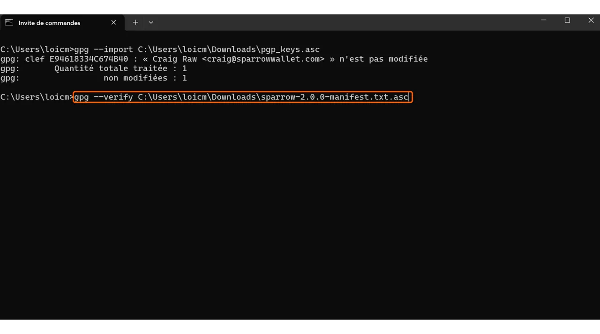

При скачивании программного обеспечения очень важно убедиться, что оно не было изменено и действительно поступает из официального источника. Это особенно актуально для программного обеспечения, связанного с Bitcoin, например, для кошельков, которые позволяют вам защищать ключи доступа к вашим средствам. В этом уроке мы увидим, как проверить целостность и подлинность программного обеспечения перед его установкой. В качестве примера мы будем использовать Sparrow Wallet, популярное программное обеспечение для кошельков среди биткойнеров, но процедура будет одинаковой для любого другого программного обеспечения.

Проверка целостности включает в себя убеждение в том, что скачанный файл не был изменен, путем сравнения его цифрового отпечатка (т.е. его хеша) с тем, который предоставлен официальным разработчиком. Если они совпадают, это означает, что файл идентичен оригиналу и не был поврежден или изменен злоумышленником.

Проверка подлинности, с другой стороны, убеждается, что файл действительно поступает от официального разработчика, а не от мошенника. Это делается путем проверки цифровой подписи. Эта подпись доказывает, что программное обеспечение было подписано закрытым ключом законного разработчика.

Если эти проверки не выполняются, существует риск установки вредоносного программного обеспечения, которое может содержать измененный код. Этот код может либо украсть информацию, например, ваши приватные ключи, либо заблокировать доступ к вашим файлам. Такой тип атаки довольно распространен, особенно в контексте программного обеспечения с открытым исходным кодом, где могут распространяться поддельные версии.

Для выполнения этой проверки мы будем использовать два инструмента: хеш-функции для проверки целостности и GnuPG, инструмент с открытым исходным кодом, реализующий протокол PGP, для проверки подлинности.

## Предварительные требования

Если вы используете **Linux**, GPG предустановлен в большинстве дистрибутивов. Если нет, вы можете установить его с помощью следующей команды:

```bash
sudo apt install gnupg
```

Для **macOS**, если вы еще не установили менеджер пакетов Homebrew, сделайте это с помощью следующих команд:

```bash
/bin/bash -c "$(curl -fsSL https://raw.githubusercontent.com/Homebrew/install/HEAD/install.sh)"
```

```bash
echo 'eval "$(/opt/homebrew/bin/brew shellenv)"' >> ~/.zprofile
```

```bash
eval "$(/opt/homebrew/bin/brew shellenv)"
```

Затем установите GPG с помощью этой команды:

```bash
brew install gnupg
```
Для **Windows**, если у вас нет GPG, вы можете установить программное обеспечение [Gpg4win](https://www.gpg4win.org/).


## Скачивание документов

Для начала нам понадобятся различные документы. Посетите официальный сайт [Sparrow Wallet в разделе "*Скачать*"](https://sparrowwallet.com/download/). Если вы хотите проверить другое программное обеспечение, перейдите на веб-сайт этого программного обеспечения.


Вы также можете перейти [в репозиторий проекта на GitHub](https://github.com/sparrowwallet/sparrow/releases).


Скачайте установщик программного обеспечения, соответствующий вашей операционной системе.


Вам также понадобится хеш файла, часто называемый "*SHA256SUMS*" или "*MANIFEST*".


Скачайте PGP-подпись файла также. Это документ в формате `.asc`.


Убедитесь, что все эти файлы находятся в одной папке для следующих шагов.
Наконец, вам понадобится публичный ключ разработчика, который мы будем использовать для проверки PGP-подписи. Этот ключ часто доступен либо на веб-сайте программного обеспечения, либо в репозитории GitHub проекта, иногда в социальных сетях разработчика, либо на специализированных сайтах, таких как Keybase. В случае с Sparrow Wallet, публичный ключ разработчика Craig Raw можно найти [на Keybase](https://keybase.io/craigraw). Чтобы скачать его напрямую из терминала, выполните команду:

```bash
curl https://keybase.io/craigraw/pgp_keys.asc | gpg --import
```


## Проверка подписи

Процесс проверки подписи одинаков для **Windows**, **macOS** и **Linux**. Обычно, вы уже импортировали публичный ключ на предыдущем шаге, но если нет, сделайте это с помощью команды:

```bash
gpg --import [путь к ключу]
```

Замените `[путь к ключу]` на расположение файла публичного ключа разработчика.


Проверьте подпись следующей командой:

```bash
gpg --verify [file.asc]
```

Замените `[file.asc]` на путь к файлу подписи. В случае с Sparrow, этот файл называется "*sparrow-2.0.0-manifest.txt.asc*" для версии 2.0.0.



Если подпись действительна, GPG сообщит вам об этом. Затем вы можете перейти к следующему шагу, так как это подтверждает подлинность файла.


## Проверка хеша
Теперь, когда подлинность программного обеспечения подтверждена, также необходимо проверить его целостность. Мы сравним хеш программного обеспечения с хешем, предоставленным разработчиком. Если они совпадают, это гарантирует, что код программного обеспечения не был изменен.

На **Windows** откройте терминал и выполните следующую команду:

```bash
CertUtil -hashfile [путь к файлу] SHA256 | findstr /v "hash"
```

Замените `[путь к файлу]` на расположение установщика.


Терминал вернет хеш загруженного программного обеспечения.


Имейте в виду, что для некоторого программного обеспечения может потребоваться использовать другую хеш-функцию, отличную от SHA256. В этом случае просто замените имя хеш-функции в команде.

Затем сравните результат с соответствующим значением в файле "*sparrow-2.0.0-manifest.txt*".


В моем случае мы видим, что два хеша идеально совпадают.

На **macOS** и **Linux** процесс проверки хеша автоматизирован. Не нужно вручную проверять совпадение между двумя хешами, как на Windows.

Просто выполните эту команду на **macOS**:

```bash
shasum --check [имя файла] --ignore-missing
```

Замените `[имя файла]` на имя установщика. Например, для Sparrow Wallet:

```bash
shasum --check sparrow-2.0.0-manifest.txt --ignore-missing
```

Если хеши совпадают, вы должны увидеть следующий вывод:

```bash
Sparrow-2.0.0.dmg: OK
```
На **Linux** команда выглядит похожим образом:
```bash
sha256sum --check [имя файла] --ignore-missing
```

И если хеши совпадают, вы должны увидеть следующий вывод:

```bash
sparrow_2.0.0-1_amd64.deb: OK
```

Теперь вы можете быть уверены, что скачанное вами программное обеспечение является подлинным и целостным. Вы можете приступить к его установке на вашем компьютере.

Если вы нашли этот учебник полезным, я был бы признателен за лайк ниже. Не стесняйтесь делиться этой статьей в своих социальных сетях. Большое спасибо!

Я также рекомендую ознакомиться с другим учебником о VeraCrypt, программном обеспечении, которое позволяет шифровать и расшифровывать устройства хранения данных.

https://planb.network/tutorials/others/veracrypt