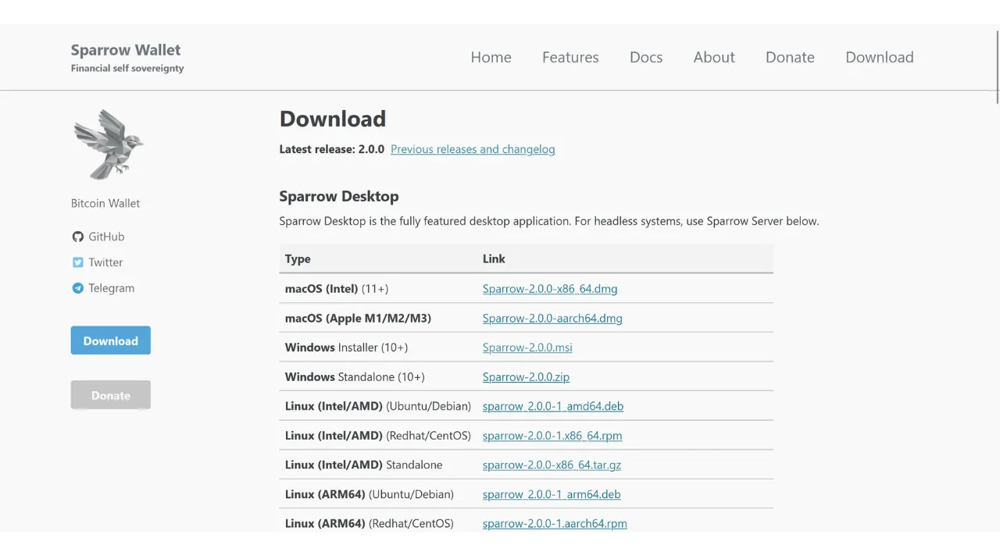
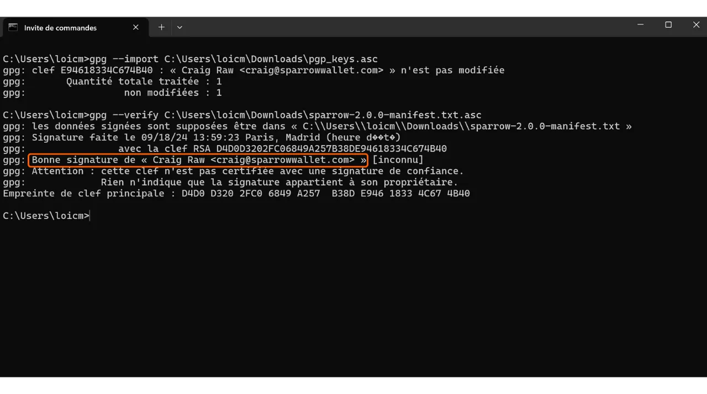

Khi tải phần mềm, việc đảm bảo rằng nó không bị thay đổi và thực sự đến từ nguồn chính thức là rất quan trọng. Điều này đặc biệt đúng với phần mềm liên quan đến Bitcoin, như phần mềm ví, giúp bạn bảo vệ các khóa truy cập vào quỹ của mình. Trong hướng dẫn này, chúng ta sẽ xem cách xác minh tính toàn vẹn và xác thực của phần mềm trước khi cài đặt. Chúng ta sẽ sử dụng Sparrow Wallet làm ví dụ, một phần mềm ví được nhiều người dùng bitcoin yêu thích, nhưng quy trình sẽ giống nhau cho bất kỳ phần mềm nào khác.

Xác minh tính toàn vẹn bao gồm việc đảm bảo rằng tệp đã tải không bị thay đổi bằng cách so sánh dấu vân tay số (tức là, hash) của nó với dấu vân tay do nhà phát triển chính thức cung cấp. Nếu hai dấu vân tay khớp nhau, điều đó có nghĩa là tệp giống hệt bản gốc và không bị hỏng hoặc bị kẻ tấn công sửa đổi.

Mặt khác, xác minh xác thực đảm bảo rằng tệp thực sự đến từ nhà phát triển chính thức và không phải là kẻ mạo danh. Điều này được thực hiện bằng cách xác minh chữ ký số. Chữ ký này chứng minh rằng phần mềm đã được ký bằng khóa riêng của nhà phát triển hợp pháp.

Nếu những kiểm tra này không được thực hiện, có nguy cơ cài đặt phần mềm độc hại có thể chứa mã đã được sửa đổi. Mã này có thể đánh cắp thông tin như khóa riêng của bạn hoặc chặn quyền truy cập vào các tệp của bạn. Loại tấn công này khá phổ biến, đặc biệt trong bối cảnh của phần mềm mã nguồn mở nơi các phiên bản giả mạo có thể được phân phối.

Để thực hiện việc xác minh này, chúng ta sẽ sử dụng hai công cụ: các hàm băm để xác minh tính toàn vẹn, và GnuPG, một công cụ mã nguồn mở thực hiện giao thức PGP, để xác minh xác thực.

## Yêu cầu trước

Nếu bạn đang sử dụng **Linux**, GPG đã được cài đặt sẵn trên hầu hết các bản phân phối. Nếu không, bạn có thể cài đặt nó với lệnh sau:

```bash
sudo apt install gnupg
```

Đối với **macOS**, nếu bạn chưa cài đặt trình quản lý gói Homebrew, hãy thực hiện với các lệnh sau:

```bash
/bin/bash -c "$(curl -fsSL https://raw.githubusercontent.com/Homebrew/install/HEAD/install.sh)"
```

```bash
echo 'eval "$(/opt/homebrew/bin/brew shellenv)"' >> ~/.zprofile
```

```bash
eval "$(/opt/homebrew/bin/brew shellenv)"
```

Sau đó cài đặt GPG với lệnh này:

```bash
brew install gnupg
```
Đối với **Windows**, nếu bạn chưa có GPG, bạn có thể cài đặt phần mềm [Gpg4win](https://www.gpg4win.org/).


## Tải Tài liệu

Để bắt đầu, chúng ta sẽ cần các tài liệu khác nhau. Truy cập trang web chính thức của [Sparrow Wallet trong phần "*Download*"](https://sparrowwallet.com/download/). Nếu bạn muốn xác minh phần mềm khác, hãy truy cập trang web của phần mềm đó.



Bạn cũng có thể truy cập [kho lưu trữ GitHub của dự án](https://github.com/sparrowwallet/sparrow/releases).


Tải bộ cài đặt phần mềm tương ứng với hệ điều hành của bạn.


Bạn cũng sẽ cần tệp hash, thường được gọi là "*SHA256SUMS*" hoặc "*MANIFEST*".


Tải chữ ký PGP của tệp cũng như vậy. Đây là tài liệu ở định dạng `.asc`.


Hãy đảm bảo đặt tất cả các tệp này vào cùng một thư mục cho các bước tiếp theo.
Cuối cùng, bạn sẽ cần khóa công khai của nhà phát triển, mà chúng ta sẽ sử dụng để xác minh chữ ký PGP. Khóa này thường có sẵn trên trang web của phần mềm, trên kho lưu trữ GitHub của dự án, đôi khi trên trang mạng xã hội của nhà phát triển, hoặc trên các trang chuyên biệt như Keybase. Trong trường hợp của Sparrow Wallet, bạn có thể tìm thấy khóa công khai của nhà phát triển Craig Raw [trên Keybase](https://keybase.io/craigraw). Để tải nó trực tiếp từ terminal, thực hiện lệnh:

```bash
curl https://keybase.io/craigraw/pgp_keys.asc | gpg --import
```


## Xác Minh Chữ Ký

Quy trình xác minh chữ ký giống nhau trên **Windows**, **macOS**, và **Linux**. Bình thường, bạn đã nhập khóa công khai trong bước trước, nhưng nếu chưa, hãy làm như vậy với lệnh:

```bash
gpg --import [đường dẫn khóa]
```

Thay thế `[đường dẫn khóa]` bằng vị trí của tệp khóa công khai của nhà phát triển.


Xác minh chữ ký với lệnh sau:

```bash
gpg --verify [file.asc]
```

Thay thế `[file.asc]` bằng đường dẫn của tệp chữ ký. Trong trường hợp của Sparrow, tệp này được gọi là "*sparrow-2.0.0-manifest.txt.asc*" cho phiên bản 2.0.0.


Nếu chữ ký hợp lệ, GPG sẽ thông báo cho bạn. Bạn có thể chuyển sang bước tiếp theo, vì điều này xác nhận tính xác thực của tệp.



## Xác Minh Hash
Bây giờ, khi tính xác thực của phần mềm đã được xác nhận, cũng cần thiết phải xác minh tính toàn vẹn của nó. Chúng ta sẽ so sánh hash của phần mềm với hash do nhà phát triển cung cấp. Nếu hai hash khớp với nhau, điều này đảm bảo rằng mã phần mềm không bị thay đổi.

Trên **Windows**, mở một terminal và thực hiện lệnh sau:

```bash
CertUtil -hashfile [đường dẫn tệp] SHA256 | findstr /v "hash"
```

Thay thế `[đường dẫn tệp]` bằng vị trí của bộ cài đặt.


Terminal sẽ trả về hash của phần mềm đã tải xuống.


Lưu ý, đối với một số phần mềm, có thể cần sử dụng một hàm hash khác ngoài SHA256. Trong trường hợp này, chỉ cần thay thế tên của hàm hash trong lệnh.

Sau đó so sánh kết quả với giá trị tương ứng trong tệp "*sparrow-2.0.0-manifest.txt*".


Trong trường hợp của tôi, chúng ta thấy rằng hai hash khớp hoàn hảo.

Trên **macOS** và **Linux**, quy trình xác minh hash được tự động hóa. Không cần thiết phải kiểm tra thủ công sự khớp nhau giữa hai hash như trên Windows.

Chỉ cần thực hiện lệnh này trên **macOS**:

```bash
shasum --check [tên tệp] --ignore-missing
```

Thay thế `[tên tệp]` bằng tên của bộ cài đặt. Ví dụ, đối với Sparrow Wallet:

```bash
shasum --check sparrow-2.0.0-manifest.txt --ignore-missing
```

Nếu các hash khớp, bạn sẽ thấy đầu ra sau:

```bash
Sparrow-2.0.0.dmg: OK
```
Trên **Linux**, lệnh tương tự như sau:
```bash
sha256sum --check [tên file] --ignore-missing
```

Và nếu các mã hash khớp, bạn sẽ thấy đầu ra sau:

```bash
sparrow_2.0.0-1_amd64.deb: OK
```

Bây giờ bạn có thể yên tâm rằng phần mềm bạn đã tải về là chính hãng và nguyên vẹn. Bạn có thể tiến hành cài đặt nó trên máy của mình.

Nếu bạn thấy hướng dẫn này hữu ích, tôi sẽ rất trân trọng nếu bạn để lại một lượt thích phía dưới. Đừng ngần ngại chia sẻ bài viết này trên các mạng xã hội của bạn. Cảm ơn bạn rất nhiều!

Tôi cũng khuyên bạn nên xem hướng dẫn khác về VeraCrypt, một phần mềm cho phép bạn mã hóa và giải mã các thiết bị lưu trữ.

https://planb.network/tutorials/others/veracrypt