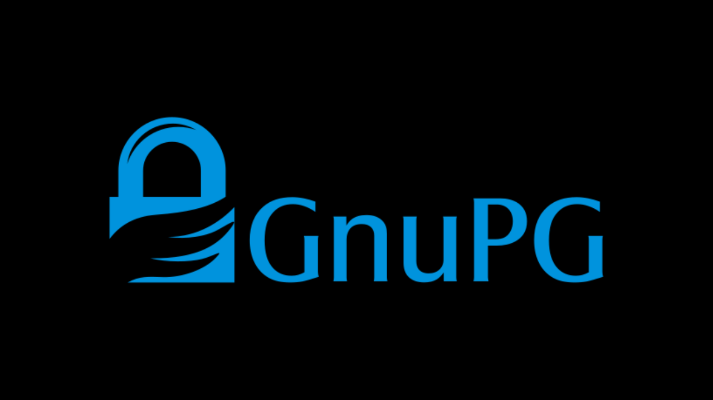
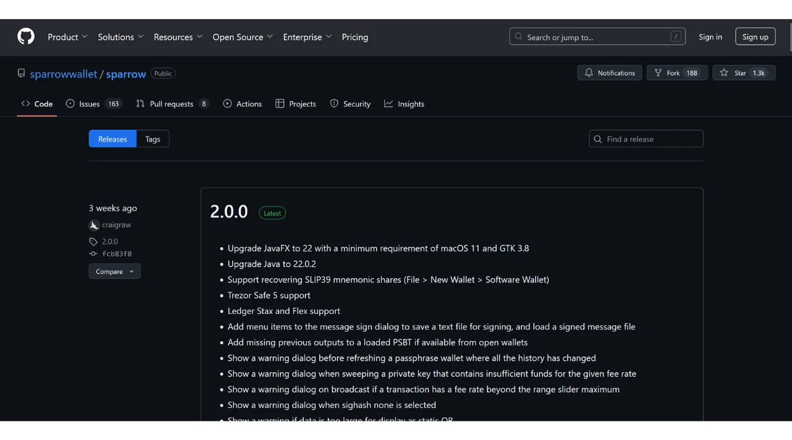

在下载软件时，确保软件未被篡改且确实来自官方源头是非常重要的。这一点对于与比特币相关的软件尤其重要，比如钱包软件，它允许你安全地管理访问你资金的密钥。在本教程中，我们将看到在安装软件之前如何验证软件的完整性和真实性。我们将以比特币用户中的首选钱包软件Sparrow Wallet为例，但该程序对任何其他软件都是相同的。

验证完整性涉及确保下载的文件未被修改，方法是将其数字指纹（即其哈希值）与官方开发者提供的指纹进行比较。如果两者匹配，意味着文件与原始文件相同，未被损坏或被攻击者修改。

另一方面，验证真实性确保文件确实来自官方开发者而非冒名顶替者。这是通过验证数字签名来完成的。这个签名证明软件是用合法开发者的私钥签名的。

如果不执行这些检查，就有安装恶意软件的风险，这些恶意软件可能包含修改过的代码。这些代码可能会窃取像你的私钥这样的信息，或阻止你访问你的文件。这种类型的攻击在开源软件的背景下尤其常见，因为可以分发伪造版本。

为了执行这种验证，我们将使用两个工具：哈希函数来验证完整性，以及GnuPG，一个实现PGP协议的开源工具，来验证真实性。

## 先决条件

如果你使用的是**Linux**，大多数发行版已预装GPG。如果没有，你可以使用以下命令安装：

```bash
sudo apt install gnupg
```

对于**macOS**，如果你还没有安装Homebrew包管理器，那么可以使用以下命令进行安装：

```bash
/bin/bash -c "$(curl -fsSL https://raw.githubusercontent.com/Homebrew/install/HEAD/install.sh)"
```

```bash
echo 'eval "$(/opt/homebrew/bin/brew shellenv)"' >> ~/.zprofile
```

```bash
eval "$(/opt/homebrew/bin/brew shellenv)"
```

然后使用这个命令安装GPG：

```bash
brew install gnupg
```
对于**Windows**，如果你没有GPG，你可以安装[Gpg4win](https://www.gpg4win.org/)软件。


## 下载文件

首先，我们需要各种文件。访问[Sparrow Wallet的官方网站，在“*下载*”部分](https://sparrowwallet.com/download/)。如果你希望验证另一个软件，请前往该软件的网站。


你也可以前往[该项目的GitHub仓库](https://github.com/sparrowwallet/sparrow/releases)。



下载与你的操作系统相对应的软件安装程序。


你还需要文件的哈希值，通常称为“*SHA256SUMS*”或“*MANIFEST*”。


同时下载文件的PGP签名。这是`.asc`格式的文档。


确保将所有这些文件放在同一个文件夹中，以便进行后续步骤。
最后，您将需要开发者的公钥，我们将使用它来验证PGP签名。这个密钥通常可以在软件的网站、项目的GitHub仓库、有时在开发者的社交媒体上，或者在像Keybase这样的专业网站上找到。在Sparrow Wallet的情况下，你可以在Keybase上找到开发者Craig Raw的公钥[在Keybase上](https://keybase.io/craigraw)。要直接从终端下载它，请执行以下命令：

```bash
curl https://keybase.io/craigraw/pgp_keys.asc | gpg --import
```


## 验证签名

无论是在**Windows**、**macOS**还是**Linux**上，验证签名的过程都是相同的。通常，您已经在前一步骤中导入了公钥，但如果没有，请使用以下命令导入：

```bash
gpg --import [key path]
```

将`[key path]`替换为开发者公钥文件的位置。


使用以下命令验证签名：

```bash
gpg --verify [file.asc]
```

将`[file.asc]`替换为签名文件的路径。在Sparrow的情况下，这个文件被命名为"*sparrow-2.0.0-manifest.txt.asc*"，适用于2.0.0版本。


如果签名有效，GPG会告诉您。然后您可以进行下一步，因为这确认了文件的真实性。


## 验证哈希值
现在软件的真实性已经得到确认，还需要验证其完整性。我们将比较软件的哈希值与开发者提供的哈希值。如果两者匹配，就保证了软件代码未被篡改。

在**Windows**上，打开终端并执行以下命令：

```bash
CertUtil -hashfile [file path] SHA256 | findstr /v "hash"
```

将`[file path]`替换为安装程序的位置。


终端将返回下载软件的哈希值。


请注意，对于某些软件，可能需要使用不同于SHA256的哈希函数。在这种情况下，只需在命令中替换哈希函数的名称即可。

然后将结果与"*sparrow-2.0.0-manifest.txt*"文件中的相应值进行比较。


在我的案例中，我们看到两个哈希值完美匹配。

在**macOS**和**Linux**上，哈希验证过程是自动化的。不需要像Windows上那样手动检查两个哈希值之间的匹配。

在**macOS**上，只需执行此命令：

```bash
shasum --check [file name] --ignore-missing
```

将`[file name]`替换为安装程序的名称。例如，对于Sparrow Wallet：

```bash
shasum --check sparrow-2.0.0-manifest.txt --ignore-missing
```

如果哈希值匹配，您应该会看到以下输出：

```bash
Sparrow-2.0.0.dmg: OK
```
在 **Linux** 上，命令类似：
```bash
sha256sum --check [文件名] --ignore-missing
```

如果哈希值匹配，你应该会看到以下输出：

```bash
sparrow_2.0.0-1_amd64.deb: OK
```

现在，你可以确信你下载的软件既是真实的，也是完整的。你可以继续在你的机器上安装它。

如果你觉得这个教程有帮助，我会很欣赏你在下面点个赞。欢迎在你的社交网络上分享这篇文章。非常感谢！

我还推荐查看这个关于VeraCrypt的教程，这是一个允许你加密和解密存储设备的软件。

https://planb.network/tutorials/others/veracrypt