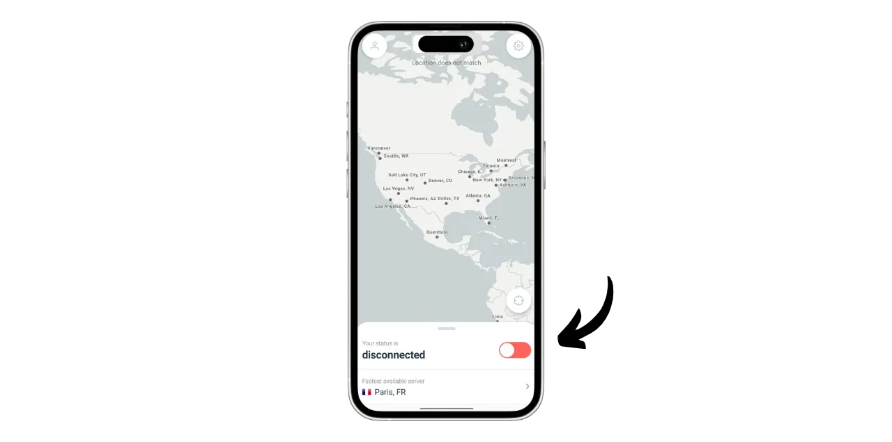
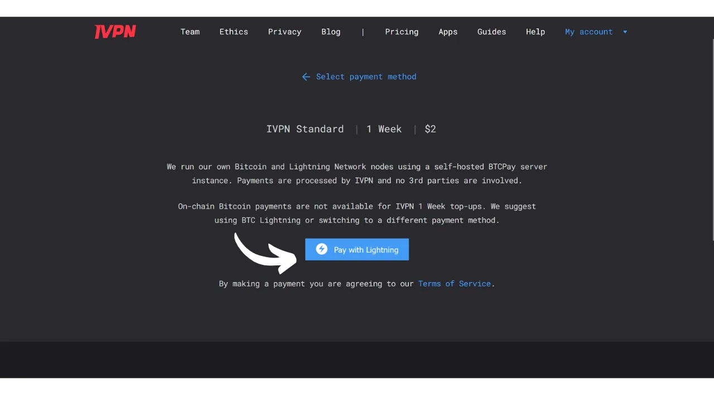
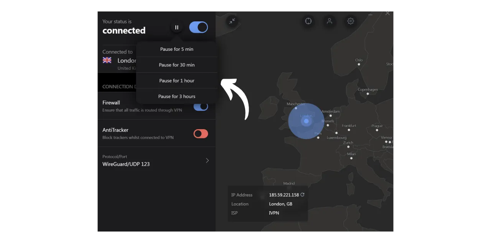

VPN ("*Virtual Private Network*" neboli Virtuální privátní síť) je služba, která vytváří bezpečné a šifrované spojení mezi vaším telefonem nebo počítačem a vzdáleným serverem spravovaným poskytovatelem VPN.

Technicky, při připojení k VPN je váš internetový provoz přesměrován skrze šifrovaný tunel na server VPN. Tento proces ztěžuje třetím stranám, jako jsou poskytovatelé internetových služeb (ISP) nebo zákeřní aktéři, zachytit nebo číst vaše data. Server VPN pak funguje jako prostředník, který se za vás připojuje k službě, kterou chcete používat. Přiřadí vašemu připojení novou IP adresu, což pomáhá skrýt vaši skutečnou IP adresu před navštívenými weby. Nicméně, na rozdíl od toho, co naznačují některé online reklamy, používání VPN vám neumožní anonymně procházet internet, protože vyžaduje formu důvěry v poskytovatele VPN, který může vidět veškerý váš provoz.

Výhody používání VPN jsou četné. Zaprvé, chrání soukromí vaší online aktivity před ISP nebo vládami, za předpokladu, že poskytovatel VPN nesdílí vaše informace. Zadruhé, zabezpečuje vaše data, zejména když jste připojeni k veřejným Wi-Fi sítím, které jsou zranitelné vůči útokům MITM (man-in-the-middle). Zatřetí, skrýváním vaší IP adresy VPN umožňuje obejít geografická omezení a cenzuru, abyste mohli přistupovat k obsahu, který by jinak nebyl dostupný nebo byl ve vašem regionu blokován.

Jak vidíte, VPN přesouvá riziko pozorování provozu na poskytovatele VPN. Proto je při výběru vašeho poskytovatele VPN důležité zvážit osobní údaje vyžadované pro registraci. Pokud poskytovatel požaduje informace, jako je vaše telefonní číslo, e-mailová adresa, údaje o bankovní kartě, nebo hůře, vaši poštovní adresu, riziko spojení vaší identity s vaším provozem se zvyšuje. V případě kompromitace poskytovatele nebo právního zajištění by bylo snadné spojit váš provoz s vašimi osobními údaji. Proto se doporučuje vybrat poskytovatele, který nevyžaduje žádné osobní údaje a přijímá anonymní platby, například bitcoiny.

V tomto návodu představím jednoduché, efektivní a cenově dostupné řešení VPN, které nevyžaduje pro jeho použití žádné osobní informace.

## Úvod do IVPN

IVPN je služba VPN navržená speciálně pro uživatele hledající formu soukromí. Na rozdíl od populárních poskytovatelů VPN často propagovaných na YouTube, IVPN vyniká svou transparentností, bezpečností a respektem k soukromí.
Zásady ochrany soukromí IVPN jsou striktní: při registraci není vyžadována žádná osobní informace. Účet můžete otevřít bez poskytnutí e-mailové adresy, jména nebo telefonního čísla. Pro platbu není nutné zadávat údaje o kreditní kartě, protože IVPN přijímá platby v bitcoinech (onchain a Lightning). Navíc IVPN tvrdí, že neuchovává žádné záznamy o aktivitě, což znamená, že teoreticky vaše internetový provoz není společností zaznamenáván.
IVPN je také [zcela open-source](https://github.com/ivpn), co se týče jejich softwaru, aplikací a dokonce i jejich webových stránek, což umožňuje komukoli ověřit a přezkoumat jejich kód. Také se podrobují nezávislým bezpečnostním auditům každoročně, jejichž výsledky jsou publikovány na jejich webových stránkách.

IVPN výhradně používá vlastní hostované servery, čímž eliminuje rizika spojená s používáním služeb třetích stran v cloudu, jako jsou AWS, Google Cloud nebo Microsoft Azure.

Služba nabízí mnoho pokročilých funkcí, jako je multi-hop, který směruje provoz přes více serverů umístěných v různých jurisdikcích, aby zlepšil anonymitu. IVPN také integruje blokátor sledovačů a reklam a nabízí možnost výběru z různých protokolů VPN.
Samozřejmě, tato kvalita služby má svou cenu, ale adekvátní cena často signalizuje kvalitu a poctivost. Může to naznačovat, že společnost má obchodní model, který nepotřebuje prodej osobních dat. IVPN poté nabízí 2 typy plánů: Standardní plán, který umožňuje připojení až 2 zařízení, a Pro plán, který umožňuje až 7 připojení a zahrnuje protokol "*Multi-hop*", který směruje váš provoz přes více serverů.
Na rozdíl od hlavních poskytovatelů VPN, IVPN funguje na modelu nákupu přístupového času ke službě, nikoli na opakovaném předplatném. Platíte jednou v bitcoinech za vybranou dobu. Například, pokud si koupíte jeden rok přístupu, můžete službu používat po tuto dobu, po které budete muset znovu navštívit webové stránky IVPN a zakoupit další přístupový čas.

Ceny [IVPN](https://www.ivpn.net/en/pricing/) jsou progresivní v závislosti na zakoupené době přístupu. Zde jsou ceny pro Standardní plán:
- 1 týden: $2
- 1 měsíc: $6
- 1 rok: $60
- 2 roky: $100
- 3 roky: $140

A pro Pro plán:
- 1 týden: $4
- 1 měsíc: $10
- 1 rok: $100
- 2 roky: $160
- 3 roky: $220

## Jak nainstalovat IVPN na počítač?
Stáhněte [nejnovější verzi softwaru](https://www.ivpn.net/en/apps-windows/) pro váš operační systém, poté pokračujte instalací podle kroků v instalačním průvodci. 
Pro uživatele Linuxu se odkazujte na instrukce specifické pro vaši distribuci dostupné na [této stránce](https://www.ivpn.net/en/apps-linux/).

Po dokončení instalace budete muset zadat své ID účtu. Jak jej získat, uvidíme v následujících částech tohoto návodu.

## Jak nainstalovat IVPN na smartphone?

Stáhněte si IVPN z vašeho obchodu s aplikacemi, ať už je to [AppStore](https://apps.apple.com/us/app/ivpn-secure-vpn-for-privacy/id1193122683) pro uživatele iOS, [Google Play Store](https://play.google.com/store/apps/details?id=net.ivpn.client) pro Android, nebo [F-Droid](https://f-droid.org/en/packages/net.ivpn.client). Pokud používáte Android, máte také možnost stáhnout soubor `.apk` přímo ze [stránek IVPN](https://www.ivpn.net/en/apps-android/).

Při prvním použití aplikace budete odhlášeni. Budete muset zadat své ID účtu, aby bylo možné službu aktivovat.

Nyní přejdeme k aktivaci IVPN na vašich zařízeních.

## Jak zaplatit a aktivovat IVPN?

Přejděte na oficiální webové stránky IVPN [na stránku s platbami](https://www.ivpn.net/en/pricing/).

Vyberte plán, který nejlépe vyhovuje vašim potřebám. Pro tento návod si vybereme Standardní plán, který nám umožní aktivovat VPN na našem počítači a smartphonu, například.

IVPN poté vytvoří váš účet. Není nutné poskytovat žádná osobní data. K přihlášení vám postačí pouze vaše ID účtu, které funguje podobně jako přístupový klíč. Uložte si jej na bezpečné místo, například do správce hesel. Můžete si také udělat papírovou kopii. 
Na téže stránce si vyberte dobu trvání vašeho předplatného služby.

Poté si vyberte způsob platby. Já osobně provedu platbu přes Lightning Network, takže kliknu na tlačítko "*Bitcoin*".

Zkontrolujte, že je vše podle vašich představ a poté klikněte na tlačítko "*Zaplatit přes Lightning*".

Na BTCPay Serveru se vám zobrazí faktura pro Lightning. Naskenujte QR kód pomocí vaší Lightning peněženky a proveďte platbu.
 Jakmile je faktura zaplacena, klikněte na tlačítko "*Vrátit se do IVPN*".

Váš účet je nyní označen jako "*Aktivní*", a můžete vidět datum, do kterého je váš přístup k VPN platný. Po tomto datu bude nutné obnovit platbu.

Pro aktivaci vašeho připojení přes IVPN na PC jednoduše zkopírujte vaše ID účtu.

A vložte jej do softwaru, který jste si předtím stáhli.

Poté klikněte na tlačítko "*Přihlásit se*".

Klikněte na zaškrtávací políčko pro aktivaci VPN připojení, a to je vše, internetový provoz vašeho počítače je nyní šifrován a směrován přes server IVPN.

Pro váš smartphone je postup identický. Vložte vaše ID účtu nebo naskenujte QR kód spojený s vaším účtem IVPN, který je přístupný z webové stránky. Poté klikněte na zaškrtávací políčko pro navázání spojení.

## Jak používat a konfigurovat IVPN?

Pokud jde o používání a nastavení, je to velmi jednoduché. Z hlavního rozhraní můžete připojení aktivovat nebo deaktivovat jednoduše pomocí zaškrtávacího políčka.

Máte také možnost pozastavit vaše VPN na určitou dobu.

Kliknutím na aktuální server můžete vybrat jiný server z dostupných.

Je také možné aktivovat nebo deaktivovat integrovanou bránu firewall stejně jako funkci proti sledování.

Pro přístup k dalším nastavením klikněte na ikonu nastavení.

V záložce "*Účet*" najdete nastavení související s vaším účtem.

V záložce "*Obecné*" jsou různá nastavení klienta. Doporučuji zaškrtnout možnosti "*Spustit při přihlášení*" a "*Při spuštění*" v sekci "*Automatické připojení*" pro automatické navázání spojení s VPN při spuštění vašeho stroje.

V záložce "*Připojení*" najdete různé možnosti související s připojením. Zde můžete změnit používaný VPN protokol.
Záložka "*IVPN Firewall*" umožňuje aktivovat firewall automaticky při startu počítače, čímž zajišťuje, že nebude navázáno žádné spojení mimo VPN.

Záložka "*Split Tunnel*" nabízí možnost vyloučit určité programy z VPN spojení. Aplikace zde přidané budou pokračovat v běžném internetovém spojení i když je VPN aktivní.

V záložce "*WiFi control*" máte možnost konfigurovat specifické akce podle sítí, ke kterým jste připojeni. Například můžete označit vaši domácí síť jako "*Trusted*" (Důvěryhodná) a nastavit VPN tak, aby se na této síti neaktivovala, ale na jakékoliv jiné WiFi síti se automaticky aktivovala.

V menu "*AntiTracker*" vyberte blokovací profil pro váš anti-tracker. Je navržen tak, aby blokoval reklamy, malware a sledovače dat tím, že blokuje požadavky na sledovací služby během procházení internetu. To zvyšuje vaše soukromí tím, že brání společnostem ve sběru a prodeji vašich prohlížecích dat. K dispozici je také "*Hardcore Mode*", který úplně blokuje všechny domény vlastněné společnostmi Google a Meta, stejně jako všechny závislé služby.

A to je vše, nyní jste vybaveni k plnému využití IVPN. Pokud chcete také zvýšit bezpečnost vašich online účtů použitím lokálního správce hesel, doporučuji se podívat na náš tutoriál o KeePass, volně dostupném a open-source řešení:

https://planb.network/tutorials/others/keepass

Pokud máte zájem objevit dalšího poskytovatele VPN podobného IVPN, jak z hlediska funkcí, tak cen, doporučuji také zkontrolovat náš tutoriál o Mullvad:

https://planb.network/tutorials/others/mullvad