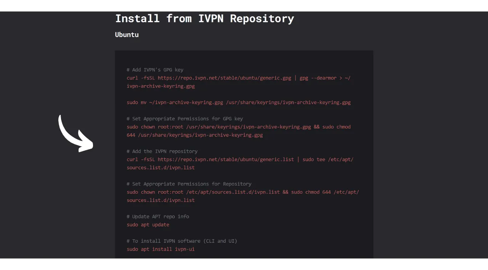
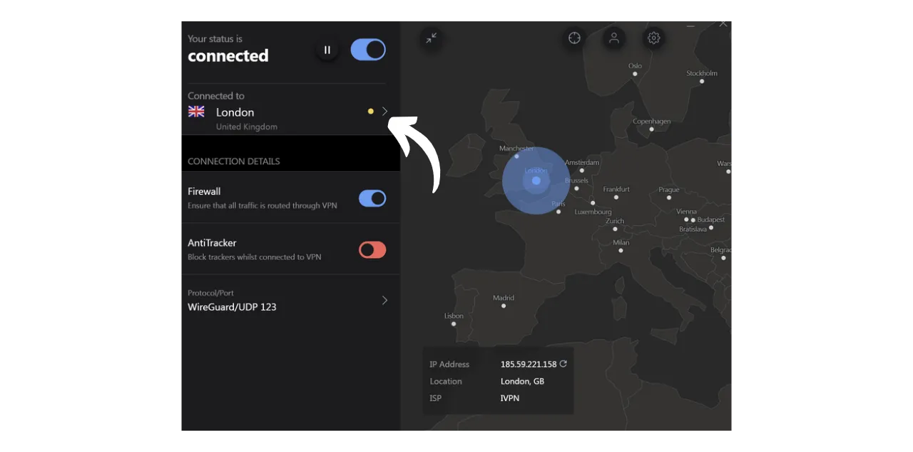
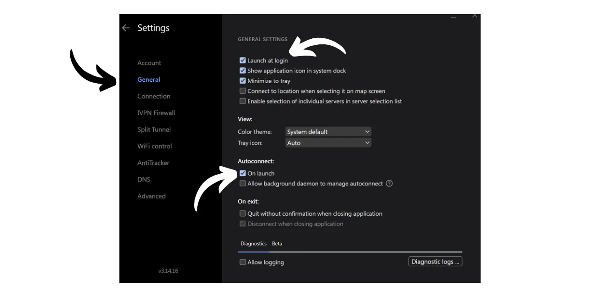

Ein VPN ("*Virtual Private Network*") ist ein Dienst, der eine sichere und verschlüsselte Verbindung zwischen Ihrem Telefon oder Computer und einem entfernten Server herstellt, der vom VPN-Anbieter verwaltet wird.

Technisch gesehen wird beim Verbinden mit einem VPN Ihr Internetverkehr durch einen verschlüsselten Tunnel zum VPN-Server umgeleitet. Dieser Prozess erschwert es Dritten, wie Internetdienstanbietern (ISPs) oder bösartigen Akteuren, Ihre Daten abzufangen oder zu lesen. Der VPN-Server fungiert dann als Vermittler, der sich in Ihrem Namen mit dem Dienst verbindet, den Sie nutzen möchten. Er weist Ihrer Verbindung eine neue IP-Adresse zu, was dazu beiträgt, Ihre echte IP-Adresse vor den besuchten Websites zu verbergen. Entgegen dem, was einige Online-Werbungen vorschlagen mögen, ermöglicht die Nutzung eines VPNs jedoch nicht, anonym im Internet zu surfen, da sie eine Vertrauensform in den VPN-Anbieter erfordert, der all Ihren Verkehr sehen kann.

Die Vorteile der Nutzung eines VPNs sind zahlreich. Erstens bewahrt es die Privatsphäre Ihrer Online-Aktivitäten vor ISPs oder Regierungen, vorausgesetzt, der VPN-Anbieter teilt Ihre Informationen nicht. Zweitens sichert es Ihre Daten, besonders wenn Sie mit öffentlichen WLAN-Netzwerken verbunden sind, die anfällig für MITM (Man-in-the-Middle)-Angriffe sind. Drittens ermöglicht ein VPN durch das Verbergen Ihrer IP-Adresse das Umgehen geografischer Beschränkungen und Zensur, um auf Inhalte zuzugreifen, die sonst in Ihrer Region nicht verfügbar oder blockiert wären.

Wie Sie sehen, verlagert das VPN das Risiko der Verkehrsbeobachtung auf den VPN-Anbieter. Daher ist es wichtig, bei der Auswahl Ihres VPN-Anbieters die für die Registrierung erforderlichen persönlichen Daten zu berücksichtigen. Wenn der Anbieter Informationen wie Ihre Telefonnummer, E-Mail-Adresse, Bankkartendetails oder schlimmer noch, Ihre Postanschrift verlangt, erhöht sich das Risiko, Ihre Identität mit Ihrem Verkehr zu verknüpfen. Im Falle eines Kompromisses des Anbieters oder einer rechtlichen Beschlagnahmung wäre es einfach, Ihren Verkehr mit Ihren persönlichen Daten in Verbindung zu bringen. Daher wird empfohlen, einen Anbieter zu wählen, der keine persönlichen Daten verlangt und anonyme Zahlungen akzeptiert, wie zum Beispiel mit Bitcoins.

In diesem Tutorial stelle ich eine einfache, effiziente und preislich angemessene VPN-Lösung vor, die keine persönlichen Informationen für ihre Nutzung erfordert.

## Einführung in IVPN

IVPN ist ein VPN-Dienst, der speziell für Benutzer entwickelt wurde, die eine Form von Privatsphäre suchen. Im Gegensatz zu beliebten VPN-Anbietern, die oft auf YouTube beworben werden, zeichnet sich IVPN durch seine Transparenz, Sicherheit und den Respekt vor der Privatsphäre aus.
Die Datenschutzrichtlinie von IVPN ist streng: Für die Anmeldung werden keine persönlichen Informationen benötigt. Sie können ein Konto eröffnen, ohne eine E-Mail-Adresse, einen Namen oder eine Telefonnummer anzugeben. Für die Zahlung ist es nicht notwendig, Kreditkartendetails einzugeben, da IVPN Zahlungen in Bitcoins (onchain und Lightning) akzeptiert. Darüber hinaus behauptet IVPN, keine Aktivitätsprotokolle zu führen, was bedeutet, dass Ihr Internetverkehr theoretisch nicht von der Firma aufgezeichnet wird.
IVPN ist auch [vollständig Open-Source](https://github.com/ivpn), was seine Software, Anwendungen und sogar ihre Website betrifft, was es jedem ermöglicht, ihren Code zu überprüfen und zu überprüfen. Sie unterziehen sich auch jährlich unabhängigen Sicherheitsaudits, deren Ergebnisse auf ihrer Website veröffentlicht werden.

IVPN verwendet ausschließlich selbst gehostete Server, wodurch die Risiken, die mit der Nutzung von Cloud-Diensten Dritter verbunden sind, wie AWS, Google Cloud oder Microsoft Azure, eliminiert werden.

Der Dienst bietet zahlreiche fortschrittliche Funktionen, wie Multi-Hop, das den Verkehr durch mehrere Server in verschiedenen Gerichtsbarkeiten leitet, um die Anonymität zu verbessern. IVPN integriert auch einen Tracker- und Ad-Blocker und bietet die Möglichkeit, zwischen verschiedenen VPN-Protokollen zu wählen.
Natürlich kommt diese Qualität des Dienstes zu einem Preis, aber ein angemessener Preis ist oft ein Indikator für Qualität und Ehrlichkeit. Es kann signalisieren, dass das Unternehmen ein Geschäftsmodell hat, das nicht den Verkauf persönlicher Daten erfordert. IVPN bietet dann zwei Arten von Plänen an: den Standardplan, der das Verbinden von bis zu 2 Geräten erlaubt, und den Pro-Plan, der bis zu 7 Verbindungen ermöglicht und das "*Multi-hop*" Protokoll beinhaltet, das Ihren Datenverkehr durch mehrere Server leitet.
Im Gegensatz zu den gängigen VPN-Anbietern basiert IVPN auf einem Modell des Kaufs von Zugangszeit zum Dienst, anstatt auf einem wiederkehrenden Abonnement. Sie zahlen einmalig in Bitcoins für die gewählte Dauer. Wenn Sie beispielsweise ein Jahr Zugang kaufen, können Sie den Dienst für diesen Zeitraum nutzen, nach dem Sie zur IVPN-Website zurückkehren müssen, um mehr Zugangszeit zu kaufen.

Die [IVPN-Preise](https://www.ivpn.net/en/pricing/) steigen je nach gekaufter Zugangsdauer. Hier sind die Preise für den Standardplan:
- 1 Woche: $2
- 1 Monat: $6
- 1 Jahr: $60
- 2 Jahre: $100
- 3 Jahre: $140

Und für den Pro-Plan:
- 1 Woche: $4
- 1 Monat: $10
- 1 Jahr: $100
- 2 Jahre: $160
- 3 Jahre: $220

## Wie installiert man IVPN auf einem Computer?
Laden Sie [die neueste Version der Software](https://www.ivpn.net/en/apps-windows/) für Ihr Betriebssystem herunter und fahren Sie dann mit der Installation fort, indem Sie den Schritten im Installationsassistenten folgen. 
Für Linux-Nutzer beziehen Sie sich auf die spezifischen Anweisungen für Ihre Distribution, die auf [dieser Seite](https://www.ivpn.net/en/apps-linux/) verfügbar sind.

Sobald die Installation abgeschlossen ist, müssen Sie Ihre Konten-ID eingeben. Wir werden sehen, wie man sie in den folgenden Abschnitten dieses Tutorials erhält.

## Wie installiert man IVPN auf einem Smartphone?

Laden Sie IVPN aus Ihrem App-Store herunter, egal ob es der [AppStore](https://apps.apple.com/us/app/ivpn-secure-vpn-for-privacy/id1193122683) für iOS-Nutzer, der [Google Play Store](https://play.google.com/store/apps/details?id=net.ivpn.client) für Android oder [F-Droid](https://f-droid.org/en/packages/net.ivpn.client) ist. Wenn Sie Android verwenden, haben Sie auch die Möglichkeit, die `.apk`-Datei direkt von [der IVPN-Seite](https://www.ivpn.net/en/apps-android/) herunterzuladen.

Beim ersten Gebrauch der App werden Sie ausgeloggt sein. Sie müssen Ihre Konten-ID eingeben, um den Dienst zu aktivieren.

Nun, lassen Sie uns fortfahren, um IVPN auf Ihren Geräten zu aktivieren.

## Wie bezahlt und aktiviert man IVPN?

Gehen Sie auf die offizielle IVPN-Website [auf der Zahlungsseite](https://www.ivpn.net/en/pricing/).

Wählen Sie den Plan, der am besten zu Ihren Bedürfnissen passt. Für dieses Tutorial werden wir uns für den Standardplan entscheiden, der es uns ermöglicht, das VPN auf unserem Computer und Smartphone zu aktivieren, zum Beispiel.

IVPN wird dann Ihr Konto erstellen. Sie müssen keine persönlichen Daten angeben. Es ist nur Ihre Kontonummer, die es Ihnen ermöglichen wird, sich einzuloggen. Sie fungiert gewissermaßen wie ein Zugangsschlüssel. Speichern Sie sie an einem sicheren Ort, wie zum Beispiel in Ihrem Passwortmanager. Sie können auch eine Papierkopie anfertigen.

Auf derselben Seite wählen Sie die Dauer Ihres Abonnements für den Dienst.

Wählen Sie dann Ihre Zahlungsmethode. Ich werde die Zahlung über das Lightning Network vornehmen, also klicke ich auf den "*Bitcoin*" Knopf.

Überprüfen Sie, ob alles Ihren Wünschen entspricht, und klicken Sie dann auf den "*Mit Lightning bezahlen*" Knopf.

Eine Lightning-Rechnung wird Ihnen auf ihrem BTCPay Server präsentiert. Scannen Sie den QR-Code mit Ihrer Lightning-Wallet und führen Sie die Zahlung durch.
 Sobald die Rechnung bezahlt ist, klicken Sie auf den "*Zurück zu IVPN*" Knopf.

Ihr Konto erscheint nun als "*Aktiv*", und Sie können das Datum sehen, bis zu dem Ihr Zugang zum VPN gültig ist. Nach diesem Datum müssen Sie Ihre Zahlung erneuern.

Um Ihre Verbindung über IVPN auf Ihrem PC zu aktivieren, kopieren Sie einfach Ihre Kontonummer.

Und fügen Sie sie in die Software ein, die Sie zuvor heruntergeladen haben.

Klicken Sie dann auf den "*Login*" Knopf.

Klicken Sie auf das Häkchen, um die VPN-Verbindung zu aktivieren, und voilà, der Internetverkehr Ihres Computers ist jetzt verschlüsselt und wird über einen IVPN-Server umgeleitet.

Für Ihr Smartphone ist das Verfahren identisch. Fügen Sie Ihre Kontonummer ein oder scannen Sie den QR-Code, der mit Ihrem IVPN-Konto verbunden ist und von der Website zugänglich ist. Klicken Sie dann auf das Häkchen, um die Verbindung herzustellen.

## Wie benutzt und konfiguriert man IVPN?

In Bezug auf Nutzung und Einstellungen ist es ganz einfach. Von der Hauptoberfläche aus können Sie die Verbindung einfach durch Verwenden des Häkchens aktivieren oder deaktivieren.

Sie haben auch die Möglichkeit, Ihr VPN für eine bestimmte Dauer zu pausieren.

Durch Klicken auf den aktuellen Server können Sie einen anderen Server aus den verfügbaren auswählen.

Es ist auch möglich, die integrierte Firewall sowie die Anti-Tracker-Funktion zu aktivieren oder zu deaktivieren.

Um auf zusätzliche Einstellungen zuzugreifen, klicken Sie auf das Einstellungssymbol.

Im Reiter "*Account*" finden Sie Einstellungen, die sich auf Ihr Konto beziehen.

Im Reiter "*General*" gibt es mehrere Client-Einstellungen. Ich rate Ihnen, die Optionen "*Beim Login starten*" und "*Beim Start*" im Abschnitt "*Autoconnect*" zu überprüfen, um die Verbindung mit dem VPN beim Starten Ihrer Maschine automatisch herzustellen.

Im Reiter "*Connection*" finden Sie verschiedene Optionen, die sich auf die Verbindung beziehen. Hier können Sie das verwendete VPN-Protokoll ändern.
Der Tab "*IVPN Firewall*" ermöglicht es Ihnen, die Firewall systematisch beim Start des Computers zu aktivieren, um sicherzustellen, dass keine Verbindung außerhalb des VPNs hergestellt wird.

Der Tab "*Split Tunnel*" bietet die Möglichkeit, bestimmte Software von der VPN-Verbindung auszuschließen. Hier hinzugefügte Anwendungen werden weiterhin mit einer normalen Internetverbindung funktionieren, auch wenn das VPN aktiviert ist.

Im Tab "*WiFi control*" haben Sie die Möglichkeit, spezifische Aktionen entsprechend den Netzwerken, mit denen Sie verbunden sind, zu konfigurieren. Zum Beispiel können Sie Ihr Heimnetzwerk als "*Trusted*" kennzeichnen und das VPN so konfigurieren, dass es in diesem Netzwerk nicht aktiviert wird, aber in jedem anderen WiFi-Netzwerk automatisch aktiviert wird.

Im Menü "*AntiTracker*" wählen Sie das Blockierungsprofil für Ihren Anti-Tracker aus. Dieser ist darauf ausgelegt, Werbung, Malware und Datentracker zu blockieren, indem Anfragen an Tracking-Dienste beim Surfen im Internet blockiert werden. Dies erhöht Ihre Privatsphäre, indem es Unternehmen daran hindert, Ihre Browserdaten zu sammeln und zu verkaufen. Ein "*Hardcore Mode*" ist ebenfalls verfügbar, um alle Domains, die Google und Meta gehören, sowie alle abhängigen Dienste komplett zu blockieren.

Und damit sind Sie nun ausgestattet, um IVPN vollständig zu genießen. Wenn Sie auch die Sicherheit Ihrer Online-Konten durch die Verwendung eines lokalen Passwort-Managers verbessern möchten, lade ich Sie ein, unser Tutorial über KeePass zu besuchen, eine kostenlose und Open-Source-Lösung:

https://planb.network/tutorials/others/keepass

Wenn Sie an der Entdeckung eines weiteren VPN-Anbieters interessiert sind, der IVPN in Bezug auf Funktionen und Preisgestaltung ähnlich ist, empfehle ich auch, unser Tutorial über Mullvad zu besuchen:

https://planb.network/tutorials/others/mullvad