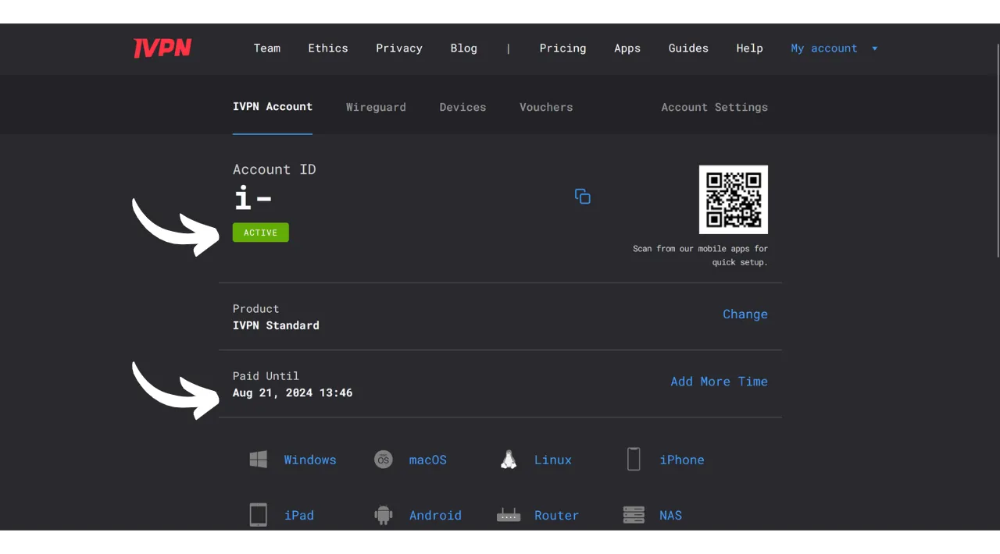

A VPN ("*Virtual Private Network*") is a service that establishes a secure and encrypted connection between your phone or computer and a remote server managed by the VPN provider.

Technically, when connecting to a VPN, your internet traffic is redirected through an encrypted tunnel to the VPN server. This process makes it difficult for third parties, such as Internet Service Providers (ISPs) or malicious actors, to intercept or read your data. The VPN server then acts as an intermediary that connects to the service you wish to use on your behalf. It assigns a new IP address to your connection, which helps to hide your real IP address from the sites you visit. However, contrary to what some online advertisements may suggest, using a VPN does not allow you to browse the internet anonymously, as it requires a form of trust in the VPN provider who can see all your traffic.

The benefits of using a VPN are numerous. Firstly, it preserves the privacy of your online activity from ISPs or governments, provided that the VPN provider does not share your information. Secondly, it secures your data, especially when you are connected to public Wi-Fi networks, which are vulnerable to MITM (man-in-the-middle) attacks. Thirdly, by hiding your IP address, a VPN allows you to bypass geographical restrictions and censorship, to access content that would otherwise be unavailable or blocked in your region.

As you can see, the VPN shifts the risk of traffic observation to the VPN provider. Therefore, when choosing your VPN provider, it is important to consider the personal data required for registration. If the provider asks for information such as your phone number, email address, bank card details, or worse, your postal address, the risk of associating your identity with your traffic is increased. In the event of a compromise of the provider or a legal seizure, it would be easy to associate your traffic with your personal data. Therefore, it is recommended to choose a provider that does not require any personal data and accepts anonymous payments, such as with bitcoins.

In this tutorial, I present a simple, efficient, reasonably priced VPN solution that requires no personal information for its use.

## Introduction to IVPN

IVPN is a VPN service designed specifically for users seeking a form of privacy. Unlike popular VPN providers often promoted on YouTube, IVPN stands out for its transparency, security, and respect for privacy.
IVPN's privacy policy is strict: no personal information is required at sign-up. You can open an account without providing an email address, name, or phone number. For payment, it's not necessary to enter credit card details, as IVPN accepts payments in bitcoins (onchain and Lightning). Moreover, IVPN claims to keep no activity logs, which means that, in theory, your internet traffic is not recorded by the company.
IVPN is also [entirely open-source](https://github.com/ivpn), regarding its software, applications, and even their website, allowing anyone to verify and review their code. They also undergo independent security audits annually, the results of which are published on their website.

IVPN exclusively uses self-hosted servers, thereby eliminating the risks associated with using third-party cloud services, such as AWS, Google Cloud, or Microsoft Azure.

The service offers numerous advanced features, such as multi-hop, which routes traffic through multiple servers located in different jurisdictions to improve anonymity. IVPN also integrates a tracker and ad blocker, and offers the option to choose from different VPN protocols.

Naturally, this quality of service comes at a cost, but an adequate price is often an indicator of quality and honesty. It may signal that the company has a business model without the need to sell personal data. IVPN then offers 2 types of plans: the Standard plan, which allows connecting up to 2 devices, and the Pro plan, which allows up to 7 connections and includes the "*Multi-hop*" protocol that routes your traffic through multiple servers.

Unlike mainstream VPN providers, IVPN operates on a model of buying access time to the service, rather than on a recurring subscription. You pay in bitcoins once for the chosen duration. For example, if you buy one year of access, you can use the service for that period, after which you will need to return to the IVPN website to purchase more access time.

The [IVPN rates](https://www.ivpn.net/en/pricing/) are progressive depending on the access duration purchased. Here are the prices for the Standard plan:
- 1 week: $2
- 1 month: $6
- 1 year: $60
- 2 years: $100
- 3 years: $140

And for the Pro plan:
- 1 week: $4
- 1 month: $10
- 1 year: $100
- 2 years: $160
- 3 years: $220

## How to install IVPN on a computer?
Download [the latest version of the software](https://www.ivpn.net/en/apps-windows/) for your operating system, then proceed with the installation by following the steps in the installation wizard. 
For Linux users, refer to the instructions specific to your distribution available on [this page](https://www.ivpn.net/en/apps-linux/).

Once the installation is complete, you will need to enter your account ID. We will see how to obtain it in the following sections of this tutorial.

## How to install IVPN on a smartphone?

Download IVPN from your app store, whether it's the [AppStore](https://apps.apple.com/us/app/ivpn-secure-vpn-for-privacy/id1193122683) for iOS users, the [Google Play Store](https://play.google.com/store/apps/details?id=net.ivpn.client) for Android, or [F-Droid](https://f-droid.org/en/packages/net.ivpn.client). If you are using Android, you also have the option to download the `.apk` file directly from [the IVPN site](https://www.ivpn.net/en/apps-android/).

Upon first use of the app, you will be logged out. You will need to enter your account ID to activate the service.

Now, let's move on to activating IVPN on your devices.

## How to pay for and activate IVPN?

Go to the official IVPN website [on the payment page](https://www.ivpn.net/en/pricing/).

Select the plan that best suits your needs. For this tutorial, we will opt for the Standard plan, which allows us to activate the VPN on our computer and smartphone, for example.

IVPN will then create your account. You do not need to provide any personal data. It is only your account ID that will allow you to log in. It acts somewhat like an access key. Save it in a safe place like your password manager, for example. You can also make a paper copy.

On the same page, choose the duration of your subscription to the service.

Then select your payment method. For my part, I will make the payment via the Lightning Network, so I click on the "*Bitcoin*" button.

Check that everything is to your liking then click on the "*Pay with Lightning*" button.

A Lightning invoice will be presented to you on their BTCPay Server. Scan the QR code with your Lightning wallet and proceed with the payment.
 Once the invoice is paid, click on the "*Return to IVPN*" button.

Your account now appears as "*Active*," and you can see the date until which your access to the VPN is valid. After this date, you will need to renew your payment.

To activate your connection via IVPN on your PC, simply copy your account ID.

And paste it into the software you previously downloaded.

Then click on the "*Login*" button.

Click on the checkmark to activate the VPN connection, and there you go, your computer's Internet traffic is now encrypted and routed through an IVPN server.

For your smartphone, the procedure is identical. Paste your account ID or scan the QR code associated with your IVPN account accessible from the website. Then, click on the checkmark to establish the connection.

## How to use and configure IVPN?

In terms of use and settings, it's quite simple. From the main interface, you can activate or deactivate the connection simply by using the checkmark.

You also have the option to pause your VPN for a specific duration.

By clicking on the current server, you can choose another server from those available.

It is also possible to activate or deactivate the integrated firewall as well as the anti-tracker function.

To access additional settings, click on the settings icon.

In the "*Account*" tab, you will find settings related to your account.

In the "*General*" tab, there are several client settings. I advise you to check the "*Launch at login*" and "*On launch*" options in the "*Autoconnect*" section to automatically establish the connection with the VPN upon starting your machine.

In the "*Connection*" tab, you will find various options related to the connection. This is where you can change the VPN protocol used.

The "*IVPN Firewall*" tab allows you to activate the firewall systematically at the start of the computer, ensuring that no connection is established outside of the VPN.

The "*Split Tunnel*" tab offers the possibility to exclude certain software from the VPN connection. Applications added here will continue to operate with a normal internet connection even when the VPN is enabled.

In the "*WiFi control*" tab, you have the option to configure specific actions according to the networks you are connected to. For example, you can designate your home network as "*Trusted*" and configure the VPN to not activate on this network, but to automatically activate on any other WiFi network.

In the "*AntiTracker*" menu, select the blocking profile for your anti-tracker. This is designed to block ads, malware, and data trackers by blocking requests to tracking services while you browse the Internet. This enhances your privacy by preventing companies from collecting and selling your browsing data. A "*Hardcore Mode*" is also available to completely block all domains owned by Google and Meta, as well as all dependent services.

And there you have it, you are now equipped to fully enjoy IVPN. If you also want to enhance the security of your online accounts by using a local password manager, I invite you to check out our tutorial on KeePass, a free and open-source solution:

https://planb.network/tutorials/others/keepass

If you are interested in discovering another VPN provider similar to IVPN, both in terms of features and pricing, I also recommend checking out our tutorial on Mullvad:

https://planb.network/tutorials/others/mullvad