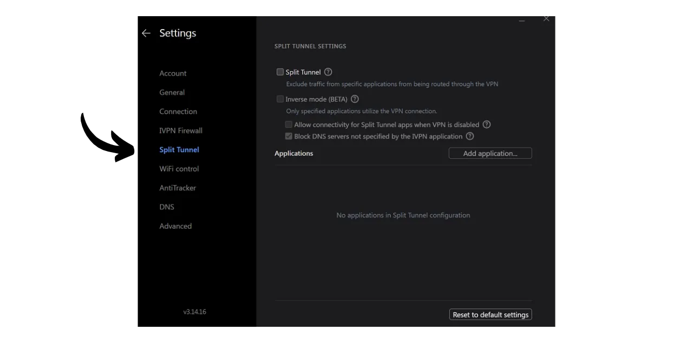

Una VPN ("*Virtual Private Network*" o "Red Privada Virtual") es un servicio que establece una conexión segura y cifrada entre tu teléfono o computadora y un servidor remoto gestionado por el proveedor de la VPN.

Técnicamente, al conectarte a una VPN, tu tráfico de internet se redirige a través de un túnel cifrado hacia el servidor de la VPN. Este proceso dificulta que terceros, como los Proveedores de Servicios de Internet (ISPs) o actores maliciosos, intercepten o lean tus datos. El servidor de la VPN actúa entonces como un intermediario que se conecta al servicio que deseas usar en tu nombre. Asigna una nueva dirección IP a tu conexión, lo que ayuda a ocultar tu dirección IP real de los sitios que visitas. Sin embargo, contrario a lo que algunas publicidades en línea pueden sugerir, usar una VPN no te permite navegar por internet de forma anónima, ya que requiere una forma de confianza en el proveedor de la VPN quien puede ver todo tu tráfico.

Los beneficios de usar una VPN son numerosos. En primer lugar, preserva la privacidad de tu actividad en línea de los ISPs o gobiernos, siempre que el proveedor de la VPN no comparta tu información. En segundo lugar, asegura tus datos, especialmente cuando estás conectado a redes Wi-Fi públicas, que son vulnerables a ataques de tipo MITM (man-in-the-middle). En tercer lugar, al ocultar tu dirección IP, una VPN te permite sortear restricciones geográficas y censura, para acceder a contenido que de otro modo estaría no disponible o bloqueado en tu región.

Como puedes ver, la VPN traslada el riesgo de observación del tráfico al proveedor de la VPN. Por lo tanto, al elegir tu proveedor de VPN, es importante considerar los datos personales requeridos para el registro. Si el proveedor solicita información como tu número de teléfono, dirección de correo electrónico, detalles de tarjeta bancaria, o peor aún, tu dirección postal, el riesgo de asociar tu identidad con tu tráfico aumenta. En caso de un compromiso del proveedor o una incautación legal, sería fácil asociar tu tráfico con tus datos personales. Por lo tanto, se recomienda elegir un proveedor que no requiera ningún dato personal y acepte pagos anónimos, como con bitcoins.

En este tutorial, presento una solución VPN simple, eficiente y a un precio razonable que no requiere información personal para su uso.

## Introducción a IVPN

IVPN es un servicio de VPN diseñado específicamente para usuarios que buscan una forma de privacidad. A diferencia de los proveedores de VPN populares a menudo promocionados en YouTube, IVPN se destaca por su transparencia, seguridad y respeto por la privacidad.
La política de privacidad de IVPN es estricta: no se requiere información personal al registrarse. Puedes abrir una cuenta sin proporcionar una dirección de correo electrónico, nombre o número de teléfono. Para el pago, no es necesario ingresar los detalles de la tarjeta de crédito, ya que IVPN acepta pagos en bitcoins (onchain y Lightning). Además, IVPN afirma no mantener registros de actividad, lo que significa que, en teoría, tu tráfico de internet no es grabado por la compañía.
IVPN es también [completamente de código abierto](https://github.com/ivpn), en cuanto a su software, aplicaciones e incluso su sitio web, permitiendo a cualquiera verificar y revisar su código. También se someten a auditorías de seguridad independientes anualmente, cuyos resultados se publican en su sitio web.

IVPN utiliza exclusivamente servidores autoalojados, eliminando así los riesgos asociados con el uso de servicios en la nube de terceros, como AWS, Google Cloud o Microsoft Azure.

El servicio ofrece numerosas características avanzadas, como multi-hop, que enruta el tráfico a través de múltiples servidores ubicados en diferentes jurisdicciones para mejorar el anonimato. IVPN también integra un bloqueador de rastreadores y anuncios, y ofrece la opción de elegir entre diferentes protocolos de VPN.
Naturalmente, esta calidad de servicio tiene un costo, pero un precio adecuado a menudo es un indicador de calidad y honestidad. Puede señalar que la empresa tiene un modelo de negocio sin la necesidad de vender datos personales. IVPN ofrece entonces 2 tipos de planes: el plan Estándar, que permite conectar hasta 2 dispositivos, y el plan Pro, que permite hasta 7 conexiones e incluye el protocolo "*Multi-hop*" que enruta tu tráfico a través de múltiples servidores.
A diferencia de los proveedores de VPN más populares, IVPN opera en un modelo de compra de tiempo de acceso al servicio, en lugar de en una suscripción recurrente. Pagas en bitcoins una vez por la duración elegida. Por ejemplo, si compras un año de acceso, puedes usar el servicio durante ese período, después del cual necesitarás volver al sitio web de IVPN para comprar más tiempo de acceso.

Las [tarifas de IVPN](https://www.ivpn.net/en/pricing/) son progresivas dependiendo de la duración del acceso comprado. Aquí están los precios para el plan Estándar:
- 1 semana: $2
- 1 mes: $6
- 1 año: $60
- 2 años: $100
- 3 años: $140

Y para el plan Pro:
- 1 semana: $4
- 1 mes: $10
- 1 año: $100
- 2 años: $160
- 3 años: $220

## ¿Cómo instalar IVPN en una computadora?
Descarga [la última versión del software](https://www.ivpn.net/en/apps-windows/) para tu sistema operativo, luego procede con la instalación siguiendo los pasos del asistente de instalación. 
Para usuarios de Linux, consulta las instrucciones específicas para tu distribución disponibles en [esta página](https://www.ivpn.net/en/apps-linux/).

Una vez completada la instalación, necesitarás ingresar tu ID de cuenta. Veremos cómo obtenerlo en las siguientes secciones de este tutorial.

## ¿Cómo instalar IVPN en un smartphone?

Descarga IVPN de tu tienda de aplicaciones, ya sea la [AppStore](https://apps.apple.com/us/app/ivpn-secure-vpn-for-privacy/id1193122683) para usuarios de iOS, la [Google Play Store](https://play.google.com/store/apps/details?id=net.ivpn.client) para Android, o [F-Droid](https://f-droid.org/en/packages/net.ivpn.client). Si usas Android, también tienes la opción de descargar el archivo `.apk` directamente desde [el sitio de IVPN](https://www.ivpn.net/en/apps-android/).

Al primer uso de la app, estarás deslogueado. Necesitarás ingresar tu ID de cuenta para activar el servicio.

Ahora, pasemos a activar IVPN en tus dispositivos.

## ¿Cómo pagar y activar IVPN?

Ve al sitio web oficial de IVPN [en la página de pago](https://www.ivpn.net/en/pricing/).

Selecciona el plan que mejor se ajuste a tus necesidades. Para este tutorial, optaremos por el plan Estándar, que nos permite activar la VPN en nuestro ordenador y smartphone, por ejemplo.

IVPN creará entonces tu cuenta. No necesitas proporcionar ningún dato personal. Solo tu ID de cuenta te permitirá iniciar sesión. Actúa algo así como una llave de acceso. Guárdala en un lugar seguro, como tu gestor de contraseñas, por ejemplo. También puedes hacer una copia en papel. 
En la misma página, elige la duración de tu suscripción al servicio.

Luego selecciona tu método de pago. Por mi parte, realizaré el pago a través de la Lightning Network, así que hago clic en el botón "*Bitcoin*".

Comprueba que todo esté de tu agrado y luego haz clic en el botón "*Pagar con Lightning*".

Se te presentará una factura de Lightning en su servidor BTCPay. Escanea el código QR con tu billetera Lightning y procede con el pago.
 Una vez pagada la factura, haz clic en el botón "*Volver a IVPN*".

Tu cuenta ahora aparece como "*Activa*", y puedes ver la fecha hasta la cual tu acceso a la VPN es válido. Después de esta fecha, necesitarás renovar tu pago.

Para activar tu conexión a través de IVPN en tu PC, simplemente copia tu ID de cuenta.

Y pégalo en el software que previamente descargaste.

Luego haz clic en el botón "*Iniciar sesión*".

Haz clic en la marca de verificación para activar la conexión VPN, y listo, el tráfico de Internet de tu computadora ahora está cifrado y enrutado a través de un servidor de IVPN.

Para tu smartphone, el procedimiento es idéntico. Pega tu ID de cuenta o escanea el código QR asociado con tu cuenta de IVPN accesible desde el sitio web. Luego, haz clic en la marca de verificación para establecer la conexión.

## ¿Cómo usar y configurar IVPN?

En términos de uso y configuración, es bastante simple. Desde la interfaz principal, puedes activar o desactivar la conexión simplemente usando la marca de verificación.

También tienes la opción de pausar tu VPN por una duración específica.

Al hacer clic en el servidor actual, puedes elegir otro servidor de los disponibles.

También es posible activar o desactivar el firewall integrado así como la función anti-rastreador.

Para acceder a configuraciones adicionales, haz clic en el icono de ajustes.

En la pestaña "*Account*", encontrarás configuraciones relacionadas con tu cuenta.

En la pestaña "*General*", hay varias configuraciones del cliente. Te aconsejo que marques las opciones "*Launch at login*" y "*On launch*" en la sección "*Autoconnect*" para establecer automáticamente la conexión con la VPN al iniciar tu máquina.

En la pestaña "*Connection*", encontrarás varias opciones relacionadas con la conexión. Aquí es donde puedes cambiar el protocolo VPN utilizado.
La pestaña "*IVPN Firewall*" te permite activar el firewall de manera sistemática al iniciar el ordenador, asegurando que no se establezca ninguna conexión fuera de la VPN.

La pestaña "*Split Tunnel*" ofrece la posibilidad de excluir cierto software de la conexión VPN. Las aplicaciones añadidas aquí continuarán operando con una conexión a internet normal incluso cuando la VPN esté habilitada.

En la pestaña "*WiFi control*", tienes la opción de configurar acciones específicas según las redes a las que estés conectado. Por ejemplo, puedes designar tu red doméstica como "*Trusted*" (Confiada) y configurar la VPN para que no se active en esta red, pero que se active automáticamente en cualquier otra red WiFi.

En el menú "*AntiTracker*", selecciona el perfil de bloqueo para tu anti-rastreador. Esto está diseñado para bloquear anuncios, malware y rastreadores de datos bloqueando solicitudes a servicios de seguimiento mientras navegas por Internet. Esto mejora tu privacidad al prevenir que las empresas recolecten y vendan tus datos de navegación. También está disponible un "*Modo Hardcore*" para bloquear completamente todos los dominios propiedad de Google y Meta, así como todos los servicios dependientes.

Y ahí lo tienes, ahora estás equipado para disfrutar plenamente de IVPN. Si también quieres mejorar la seguridad de tus cuentas en línea usando un gestor de contraseñas local, te invito a consultar nuestro tutorial sobre KeePass, una solución gratuita y de código abierto:

https://planb.network/tutorials/others/keepass

Si estás interesado en descubrir otro proveedor de VPN similar a IVPN, tanto en términos de características como de precios, también te recomiendo consultar nuestro tutorial sobre Mullvad:

https://planb.network/tutorials/others/mullvad