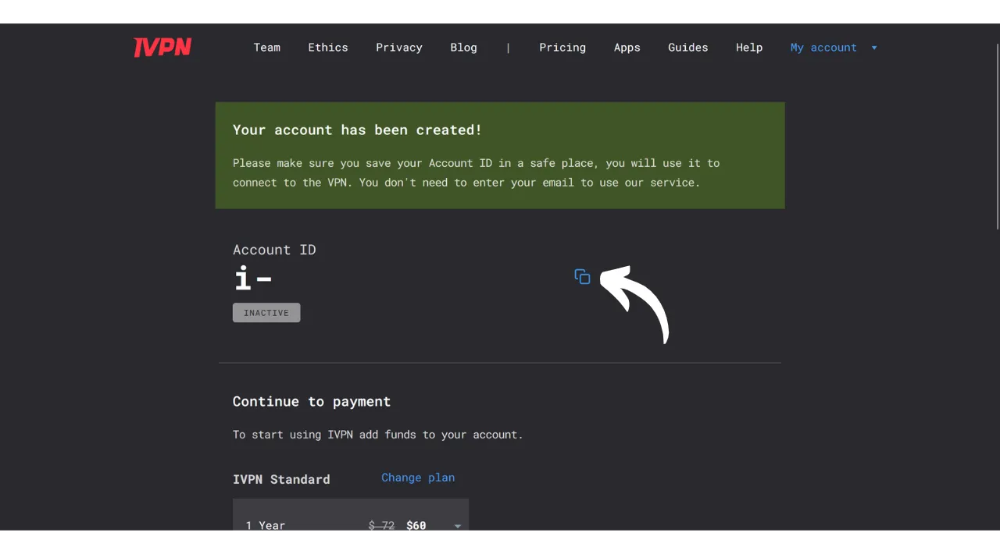
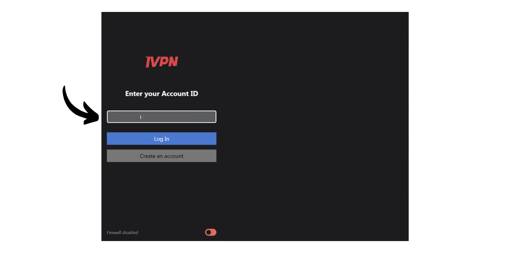

VPN ("*Virtual Private Network*" ehk virtuaalne privaatvõrk) on teenus, mis loob turvalise ja krüpteeritud ühenduse teie telefoni või arvuti ning VPN-i pakkuja hallatava kaugserveri vahel.

Tehniliselt, kui ühendute VPN-iga, suunatakse teie internetiliiklus läbi krüpteeritud tunneli VPN-serverisse. See protsess muudab kolmandate osapoolte, nagu internetiteenuse pakkujate (ISP) või pahatahtlike tegelaste, jaoks teie andmete pealtkuulamise või lugemise keeruliseks. VPN-server toimib seejärel vahendajana, mis ühendab teid teie soovitud teenusega. See omistab teie ühendusele uue IP-aadressi, mis aitab varjata teie tegelikku IP-aadressi külastatavatelt saitidelt. Siiski, vastupidiselt mõnele veebireklaamile, ei võimalda VPN-i kasutamine sirvida internetis anonüümselt, kuna see nõuab usaldust VPN-i pakkuja vastu, kes näeb kogu teie liiklust.

VPN-i kasutamise eelised on arvukad. Esiteks kaitseb see teie veebitegevuse privaatsust ISP-de või valitsuste eest, eeldusel, et VPN-i pakkuja ei jaga teie teavet. Teiseks turvab see teie andmeid, eriti kui olete ühendatud avalike Wi-Fi võrkudega, mis on haavatavad MITM (man-in-the-middle) rünnakute suhtes. Kolmandaks, varjates teie IP-aadressi, võimaldab VPN teil mööda minna geograafilistest piirangutest ja tsensuurist, et pääseda ligi sisule, mis muidu oleks teie piirkonnas kättesaamatu või blokeeritud.

Nagu näete, nihutab VPN liikluse jälgimise riski VPN-i pakkujale. Seetõttu on VPN-i pakkuja valimisel oluline arvestada registreerimiseks nõutavate isikuandmetega. Kui pakkuja küsib teavet nagu teie telefoninumber, e-posti aadress, pangakaardi andmed või veel hullem, teie postiaadress, suureneb risk seostada teie identiteet teie liiklusega. Pakkuja kompromiteerimise või seadusliku arestimise korral oleks teie liikluse seostamine teie isikuandmetega lihtne. Seetõttu soovitatakse valida pakkuja, kes ei nõua isikuandmeid ja aktsepteerib anonüümseid makseid, nagu bitcoinidega.

Selles õpetuses esitlen lihtsat, tõhusat, mõistliku hinnaga VPN-i lahendust, mis ei nõua selle kasutamiseks isiklikku teavet.

## Tutvustus IVPN-ile

IVPN on VPN-teenus, mis on spetsiaalselt loodud kasutajatele, kes otsivad privaatsust. Erinevalt populaarsetest VPN-i pakkujatest, mida tihti YouTube'is reklaamitakse, paistab IVPN silma oma läbipaistvuse, turvalisuse ja privaatsuse austamisega.
IVPN-i privaatsuspoliitika on range: registreerimisel ei nõuta isiklikku teavet. Konto saab avada ilma e-posti aadressi, nime või telefoninumbrit esitamata. Maksmiseks ei ole vaja sisestada krediitkaardi andmeid, kuna IVPN aktsepteerib makseid bitcoinides (onchain ja Lightning). Lisaks väidab IVPN, et ei pea tegevuslogisid, mis tähendab, et teoreetiliselt ei salvesta ettevõte teie internetiliiklust.
IVPN on ka [täielikult avatud lähtekoodiga](https://github.com/ivpn), sealhulgas nende tarkvara, rakendused ja isegi nende veebisait, võimaldades kõigil kontrollida ja üle vaadata nende koodi. Nad läbivad ka sõltumatuid turvaauditeid igal aastal, mille tulemused avaldatakse nende veebisaidil.

IVPN kasutab ainult ise majutatud servereid, kõrvaldades sellega riskid, mis on seotud kolmandate osapoolte pilveteenuste kasutamisega, nagu AWS, Google Cloud või Microsoft Azure.

Teenuse pakutavad edasijõudnud funktsioonid on arvukad, nagu näiteks mitmehüppeline liiklus, mis suunab liikluse läbi mitme erinevas jurisdiktsioonis asuva serveri, et parandada anonüümsust. IVPN integreerib ka jälgija ja reklaamiblokeerija ning pakub võimalust valida erinevate VPN-protokollide vahel.
Loomulikult kaasneb sellise kvaliteediga teenus teatud kuluga, kuid adekvaatne hind on tihti kvaliteedi ja aususe indikaatoriks. See võib viidata sellele, et ettevõttel on ärimudel, mis ei nõua isikuandmete müümist. IVPN pakub seejärel kahte tüüpi plaane: Standard plaan, mis lubab ühendada kuni 2 seadet, ja Pro plaan, mis lubab kuni 7 ühendust ja sisaldab "*Multi-hop*" protokolli, mis suunab teie liiklust läbi mitme serveri.
Erinevalt peavoolu VPNi pakkujatest, toimib IVPN mudelil, kus ostetakse juurdepääsuaega teenusele, mitte ei kasutata korduva tellimuse mudelit. Maksate bitcoiniides üks kord valitud kestuse eest. Näiteks, kui ostate ühe aasta juurdepääsu, saate teenust kasutada selle perioodi jooksul, pärast mida peate naasma IVPN veebilehele, et osta rohkem juurdepääsuaega.

[IVPN hinnad](https://www.ivpn.net/en/pricing/) on progressiivsed sõltuvalt ostetud juurdepääsu kestusest. Siin on hinnad Standard plaani jaoks:
- 1 nädal: $2
- 1 kuu: $6
- 1 aasta: $60
- 2 aastat: $100
- 3 aastat: $140

Ja Pro plaani jaoks:
- 1 nädal: $4
- 1 kuu: $10
- 1 aasta: $100
- 2 aastat: $160
- 3 aastat: $220

## Kuidas paigaldada IVPN arvutisse?
Laadige alla [tarkvara viimane versioon](https://www.ivpn.net/en/apps-windows/) oma operatsioonisüsteemile, seejärel järgige paigaldamisel installatsiooniviisardi samme. 
Linuxi kasutajad, vaadake oma distributsioonile kättesaadavaid juhiseid [sellel lehel](https://www.ivpn.net/en/apps-linux/).

Kui paigaldamine on lõpetatud, peate sisestama oma konto ID. Kuidas seda saada, vaatame järgmistes selle juhendi jaotistes.

## Kuidas paigaldada IVPN nutitelefoni?

Laadige IVPN alla oma rakenduste poest, olgu see siis [AppStore](https://apps.apple.com/us/app/ivpn-secure-vpn-for-privacy/id1193122683) iOSi kasutajatele, [Google Play Store](https://play.google.com/store/apps/details?id=net.ivpn.client) Androidile või [F-Droid](https://f-droid.org/en/packages/net.ivpn.client). Kui kasutate Androidi, on teil võimalus laadida `.apk` fail otse [IVPN saidilt](https://www.ivpn.net/en/apps-android/).

Rakenduse esmakordsel kasutamisel logitakse teid välja. Peate sisestama oma konto ID, et aktiveerida teenus.

Nüüd, liigume edasi IVPN aktiveerimisele teie seadmetes.

## Kuidas maksta ja aktiveerida IVPN?

Minge ametlikule IVPN veebilehele [makselehele](https://www.ivpn.net/en/pricing/).

Valige plaan, mis kõige paremini vastab teie vajadustele. Selle juhendi jaoks valime Standard plaani, mis võimaldab meil aktiveerida VPNi meie arvutis ja nutitelefonis, näiteks.

IVPN loob seejärel teie konto. Te ei pea esitama ühtegi isiklikku andmet. Ainult teie konto ID võimaldab teil sisse logida. See toimib omamoodi juurdepääsuvõtmena. Salvestage see turvalisse kohta, näiteks oma paroolihaldurisse. Võite teha ka paberkoopia.

Samal lehel valige oma tellimuse kestus teenusele.

Seejärel valige oma makseviis. Minu osa, ma teen makse läbi Lightning Network, seega klõpsan "*Bitcoin*" nupule.

Kontrollige, et kõik on teie meelest sobilik, seejärel klõpsake "*Maksa Lightningiga*" nupule.

Teile esitatakse Lightning arve nende BTCPay Serveris. Skaneerige QR-kood oma Lightning rahakotiga ja jätkake maksmisega.
 Kui arve on makstud, klõpsake "*Tagasi IVPN-i*" nupule.

Teie konto näib nüüd olevat "*Aktiivne*," ja näete kuupäeva, milleni teie juurdepääs VPN-ile kehtib. Pärast seda kuupäeva peate oma makse uuendama.

IVPN-i kaudu oma ühenduse aktiveerimiseks arvutis kopeerige lihtsalt oma konto ID.

Ja kleepige see tarkvarasse, mille te varem alla laadisite.

Seejärel klõpsake "*Logi sisse*" nupule.

Klõpsake linnukesel, et aktiveerida VPN-ühendus, ja ongi kõik, teie arvuti internetiliiklus on nüüd krüpteeritud ja suunatud läbi IVPN serveri.

Teie nutitelefoni jaoks on protseduur identne. Kleepige oma konto ID või skaneerige QR-kood, mis on seotud teie IVPN kontoga ja kättesaadav veebisaidilt. Seejärel klõpsake linnukesel, et luua ühendus.

## Kuidas kasutada ja seadistada IVPN?

Kasutamise ja seadistamise osas on see üsna lihtne. Peamenüüst saate ühenduse aktiveerida või deaktiveerida lihtsalt linnukese kasutamisega.

Teil on ka võimalus oma VPN peatada kindlaks ajaks.

Praeguse serveri klõpsamisel saate valida mõne teise saadaoleva serveri.

Samuti on võimalik aktiveerida või deaktiveerida integreeritud tulemüür ning anti-tracker funktsioon.

Lisaseadetele juurdepääsemiseks klõpsake seadete ikoonil.

"*Konto*" vahekaardil leiate oma konto seotud seaded.

"*Üldine*" vahekaardil on mitmeid kliendiseadeid. Soovitan kontrollida "*Käivita sisselogimisel*" ja "*Käivitamisel*" valikuid "*Automaatühenduse*" jaotises, et luua automaatselt ühendus VPN-iga masina käivitamisel.

"*Ühenduse*" vahekaardil leiate mitmesugused ühendusega seotud valikud. Siin saate muuta kasutatavat VPN protokolli.
 Vahekaart "*IVPN Firewall*" võimaldab teil aktiveerida tulemüüri süsteemselt arvuti käivitamisel, tagades, et ühendus väljaspool VPN-i ei looda.

Vahekaart "*Split Tunnel*" pakub võimalust välistada teatud tarkvara VPN-ühendusest. Siia lisatud rakendused jätkavad tavapärase internetiühendusega töötamist isegi siis, kui VPN on lubatud.

Vahekaardil "*WiFi control*" on teil võimalus seadistada spetsiifilisi tegevusi vastavalt võrkudele, millega olete ühendatud. Näiteks võite oma koduvõrgu määrata kui "*Trusted*" ja seadistada VPN-i nii, et see ei aktiveeru sellel võrgul, kuid aktiveerub automaatselt mis tahes muul WiFi-võrgul.

Menüüs "*AntiTracker*" valige oma anti-trackeri blokeerimisprofiil. See on mõeldud reklaamide, pahavara ja andmete jälgijate blokeerimiseks, blokeerides päringud jälgimisteenustele, kui sirvite Internetis. See suurendab teie privaatsust, takistades ettevõtetel teie sirvimisandmete kogumist ja müümist. Saadaval on ka "*Hardcore Mode*", mis blokeerib täielikult kõik Google'i ja Meta omanduses olevad domeenid ning kõik sõltuvad teenused.

Ja nüüd olete varustatud, et täielikult nautida IVPN-i. Kui soovite samuti suurendada oma veebikontode turvalisust, kasutades kohalikku paroolihaldurit, siis kutsun teid tutvuma meie õpetusega KeePassi kohta, mis on tasuta ja avatud lähtekoodiga lahendus:

https://planb.network/tutorials/others/keepass

Kui olete huvitatud teise VPN-i pakkujaga tutvumisest, mis on sarnane IVPN-iga nii omaduste kui ka hinnastamise poolest, soovitan samuti tutvuda meie õpetusega Mullvad kohta:

https://planb.network/tutorials/others/mullvad