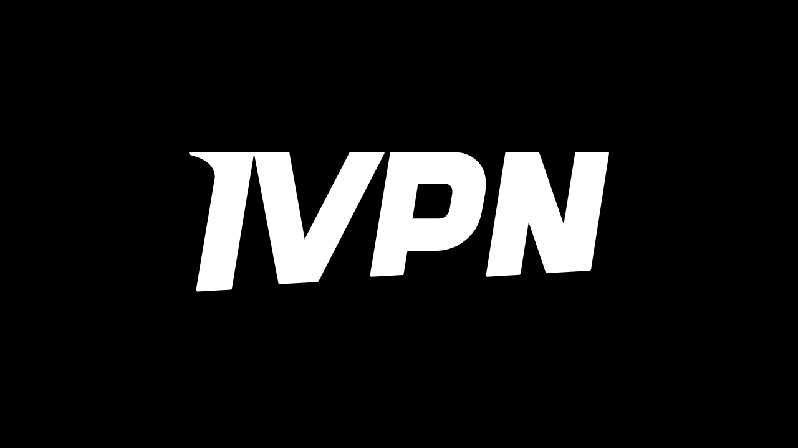

VPN ("*Virtual Private Network*" eli virtuaalinen erillisverkko) on palvelu, joka luo turvallisen ja salatun yhteyden puhelimesi tai tietokoneesi ja VPN-palveluntarjoajan hallinnoiman etäpalvelimen välille.

Teknisesti ottaen VPN-yhteyden muodostamisen yhteydessä internet-liikenteesi ohjataan salatun tunnelin kautta VPN-palvelimelle. Tämä prosessi vaikeuttaa kolmansien osapuolien, kuten internet-palveluntarjoajien (ISP) tai haitallisten toimijoiden, mahdollisuutta kaapata tai lukea tietojasi. VPN-palvelin toimii välittäjänä, joka yhdistää haluamaasi palveluun puolestasi. Se antaa yhteydellesi uuden IP-osoitteen, mikä auttaa piilottamaan todellisen IP-osoitteesi vierailtamiltasi sivustoilta. Kuitenkin, toisin kuin jotkut verkossa olevat mainokset saattavat ehdottaa, VPN:n käyttäminen ei mahdollista nimetöntä internetin selaamista, sillä se vaatii luottamusta VPN-palveluntarjoajaan, joka näkee kaiken liikenteesi.

VPN:n käytön hyödyt ovat lukuisat. Ensinnäkin, se säilyttää online-toimintasi yksityisyyden internet-palveluntarjoajilta tai hallituksilta, edellyttäen, että VPN-palveluntarjoaja ei jaa tietojasi. Toiseksi, se suojaa tietojasi, erityisesti kun olet yhteydessä julkisiin Wi-Fi-verkkoihin, jotka ovat alttiita MITM (man-in-the-middle) -hyökkäyksille. Kolmanneksi, IP-osoitteesi piilottamisen avulla VPN mahdollistaa maantieteellisten rajoitusten ja sensuurin kiertämisen, jotta pääset käsiksi sisältöön, joka muuten olisi saatavilla tai estetty alueellasi.

Kuten näet, VPN siirtää liikenteen tarkkailuriskin VPN-palveluntarjoajalle. Siksi VPN-palveluntarjoajaa valittaessa on tärkeää harkita rekisteröinnissä vaadittavia henkilötietoja. Jos palveluntarjoaja pyytää tietoja, kuten puhelinnumerosi, sähköpostiosoitteesi, pankkikorttitietosi tai pahempaa, postiosoitteesi, liikenteesi yhdistämisen riski henkilöllisyyteesi kasvaa. Palveluntarjoajan kompromissin tai laillisen takavarikon tapauksessa olisi helppo yhdistää liikenteesi henkilötietoihisi. Siksi on suositeltavaa valita palveluntarjoaja, joka ei vaadi henkilötietoja ja hyväksyy anonyymit maksut, kuten bitcoinit.

Tässä oppaassa esittelen yksinkertaisen, tehokkaan ja kohtuuhintaisen VPN-ratkaisun, joka ei vaadi henkilötietoja käyttöönsä.

## Johdanto IVPN:ään

IVPN on VPN-palvelu, joka on suunniteltu erityisesti yksityisyyttä etsiville käyttäjille. Toisin kuin suositut VPN-palveluntarjoajat, joita usein mainostetaan YouTubessa, IVPN erottuu läpinäkyvyydellään, turvallisuudellaan ja yksityisyyden kunnioittamisellaan.
IVPN:n tietosuojakäytäntö on tiukka: rekisteröitymisessä ei vaadita henkilötietoja. Voit avata tilin antamatta sähköpostiosoitetta, nimeä tai puhelinnumeroa. Maksua varten ei tarvitse syöttää luottokorttitietoja, sillä IVPN hyväksyy maksut bitcoineilla (onchain ja Lightning). Lisäksi IVPN väittää, ettei se pidä toimintalogeja, mikä tarkoittaa, että teoriassa yritys ei tallenna internet-liikennettäsi.
IVPN on myös [täysin avoimen lähdekoodin](https://github.com/ivpn) mukainen ohjelmistossaan, sovelluksissaan ja jopa verkkosivustossaan, mikä mahdollistaa kenen tahansa koodin tarkistamisen ja arvioinnin. He suorittavat myös vuosittain riippumattomia turvallisuusauditointeja, joiden tulokset julkaistaan heidän verkkosivustollaan.

IVPN käyttää yksinomaan itse isännöityjä palvelimia, mikä eliminoi riskit, jotka liittyvät kolmannen osapuolen pilvipalveluiden, kuten AWS:n, Google Cloudin tai Microsoft Azuren käyttöön.

Palvelu tarjoaa lukuisia edistyneitä ominaisuuksia, kuten moniportaisen reitityksen, joka ohjaa liikenteen useiden eri lainkäyttöalueilla sijaitsevien palvelimien kautta parantaakseen anonyymiyttä. IVPN integroi myös seurannan ja mainosten estäjän sekä tarjoaa mahdollisuuden valita eri VPN-protokollia.
Luonnollisesti tämän tason palvelu tulee hintansa, mutta asianmukainen hinta on usein laadun ja rehellisyyden merkki. Se voi viestiä, että yrityksellä on liiketoimintamalli, joka ei perustu henkilötietojen myyntiin. IVPN tarjoaa sitten kaksi tyyppistä suunnitelmaa: Standard-suunnitelman, joka sallii yhteyden muodostamisen enintään kahteen laitteeseen, ja Pro-suunnitelman, joka sallii jopa seitsemän yhteyden muodostamisen ja sisältää "*Multi-hop*" -protokollan, joka reitittää liikenteesi useiden palvelimien kautta.
Toisin kuin valtavirran VPN-tarjoajat, IVPN toimii mallilla, jossa ostetaan pääsyaikaa palveluun, ei toistuvan tilauksen perusteella. Maksat bitcoineilla kerran valitsemastasi kestosta. Esimerkiksi, jos ostat yhden vuoden pääsyn, voit käyttää palvelua kyseisenä aikana, jonka jälkeen sinun on palattava IVPN-verkkosivustolle ostamaan lisää pääsyaikaa.

[IVPN hinnat](https://www.ivpn.net/en/pricing/) ovat progressiivisia ostetun pääsyn keston mukaan. Tässä ovat hinnat Standard-suunnitelmalle:
- 1 viikko: $2
- 1 kuukausi: $6
- 1 vuosi: $60
- 2 vuotta: $100
- 3 vuotta: $140

Ja Pro-suunnitelmalle:
- 1 viikko: $4
- 1 kuukausi: $10
- 1 vuosi: $100
- 2 vuotta: $160
- 3 vuotta: $220

## Kuinka asentaa IVPN tietokoneelle?
Lataa [uusin ohjelmistoversio](https://www.ivpn.net/en/apps-windows/) käyttöjärjestelmällesi, ja jatka asennusta noudattamalla asennusvelhon ohjeita. 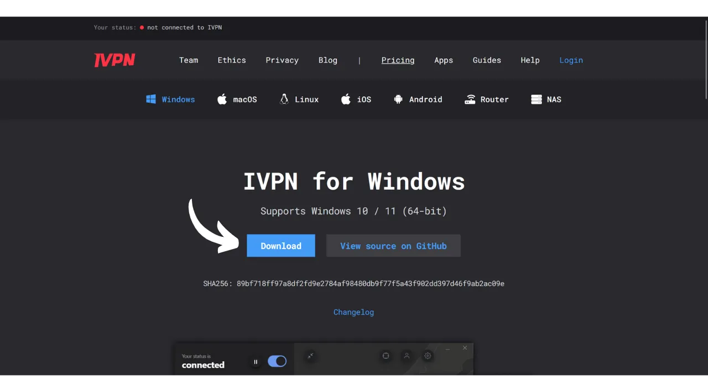
Linux-käyttäjien tulee viitata jakelunsa erityisohjeisiin, jotka löytyvät [tältä sivulta](https://www.ivpn.net/en/apps-linux/).
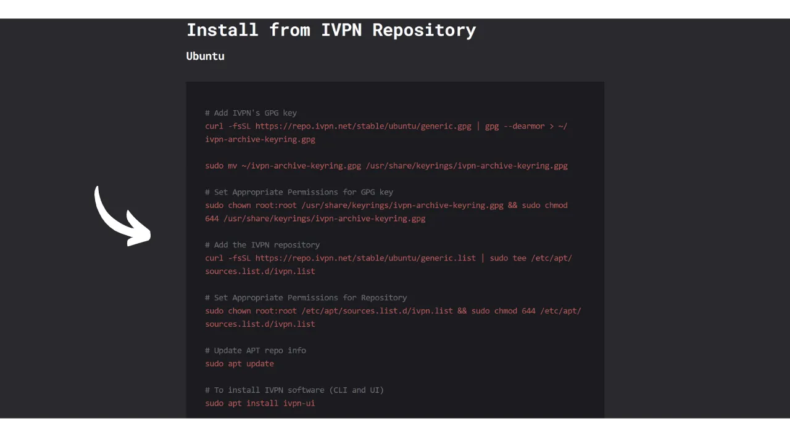
Kun asennus on valmis, sinun on syötettävä tilisi ID. Näemme, kuinka sen saa seuraavissa tämän oppaan osioissa.
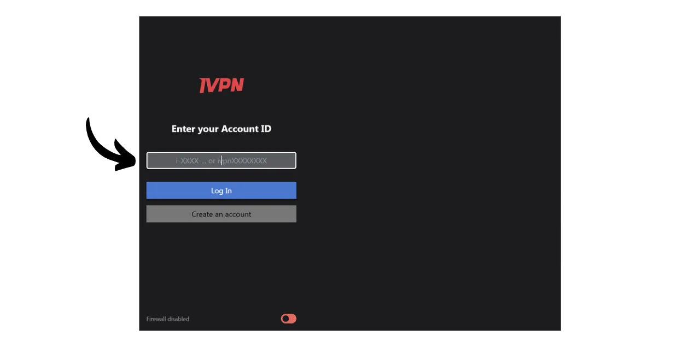
## Kuinka asentaa IVPN älypuhelimeen?

Lataa IVPN sovelluskaupastasi, olipa se sitten [AppStore](https://apps.apple.com/us/app/ivpn-secure-vpn-for-privacy/id1193122683) iOS-käyttäjille, [Google Play Store](https://play.google.com/store/apps/details?id=net.ivpn.client) Androidille, tai [F-Droid](https://f-droid.org/en/packages/net.ivpn.client). Jos käytät Androidia, voit myös ladata `.apk` tiedoston suoraan [IVPN-sivustolta](https://www.ivpn.net/en/apps-android/).
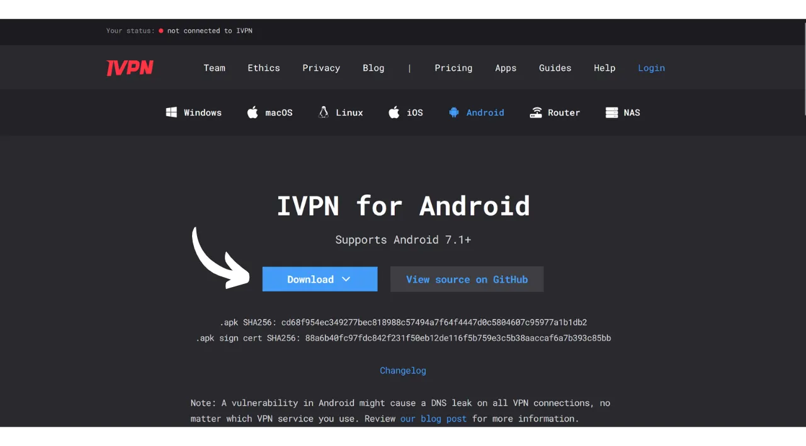
Sovelluksen ensimmäisellä käyttökerralla sinut kirjataan ulos. Sinun on syötettävä tilisi ID palvelun aktivoimiseksi.
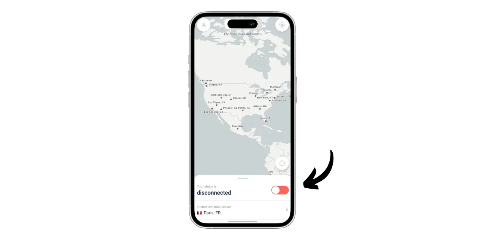
Nyt, siirrytään aktivoimaan IVPN laitteillasi.

## Kuinka maksaa ja aktivoida IVPN?

Siirry viralliselle IVPN-verkkosivustolle [maksusivulle](https://www.ivpn.net/en/pricing/).
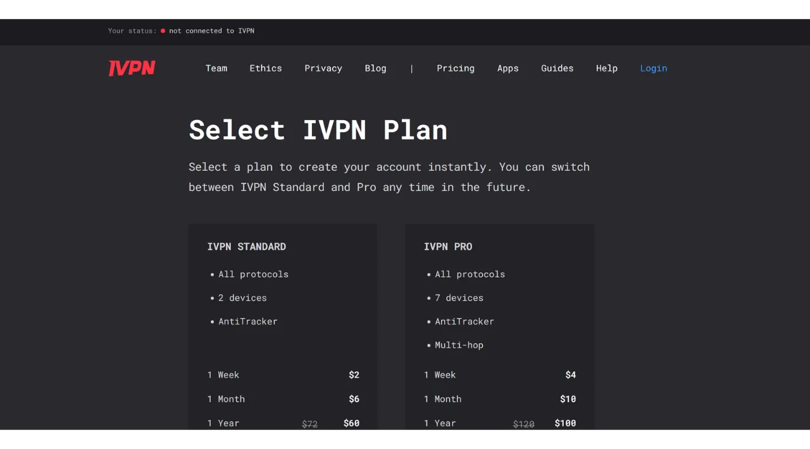
Valitse suunnitelma, joka parhaiten sopii tarpeisiisi. Tässä oppaassa valitsemme Standard-suunnitelman, joka mahdollistaa VPN:n aktivoimisen esimerkiksi tietokoneellemme ja älypuhelimellemme.
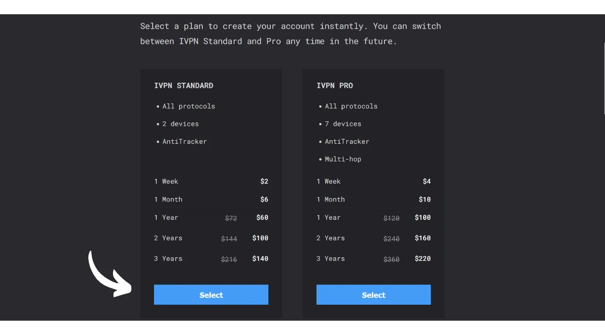
IVPN luo sen jälkeen tilisi. Sinun ei tarvitse antaa mitään henkilökohtaisia tietoja. Ainoastaan tilisi ID mahdollistaa kirjautumisen. Se toimii ikään kuin pääsyavaimena. Tallenna se turvalliseen paikkaan, kuten salasanojen hallintaohjelmaasi, esimerkiksi. Voit myös tehdä paperikopion.

Samalla sivulla valitse palvelun tilauksesi kesto.
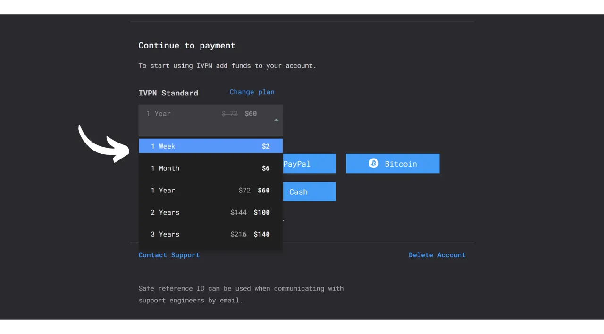
Valitse sen jälkeen maksutapasi. Oma osaltani maksan Lightning-verkon kautta, joten klikkaan "*Bitcoin*" -painiketta.

Tarkista, että kaikki on mieleisesi ja klikkaa sitten "*Maksa Lightningin kautta*" -painiketta.
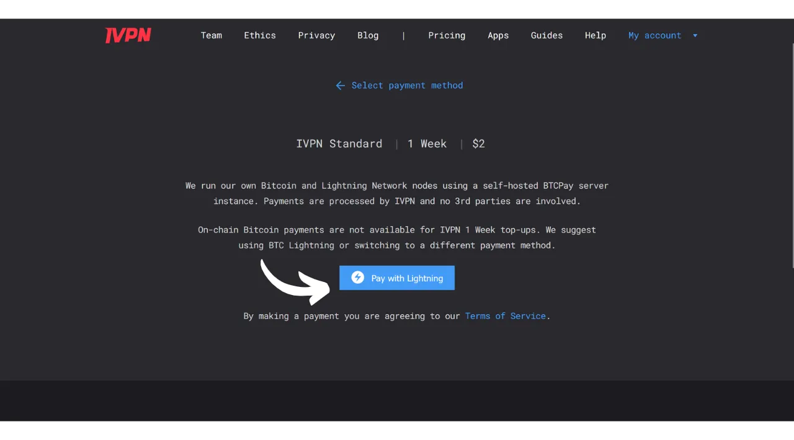
Lightning-lasku esitetään sinulle heidän BTCPay Serverillään. Skannaa QR-koodi Lightning-lompakollasi ja suorita maksu.
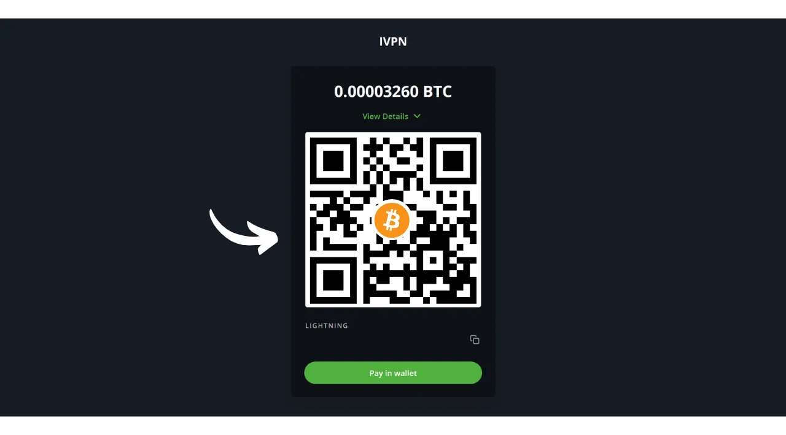 Kun lasku on maksettu, klikkaa "*Palaa IVPN:iin*" -painiketta.
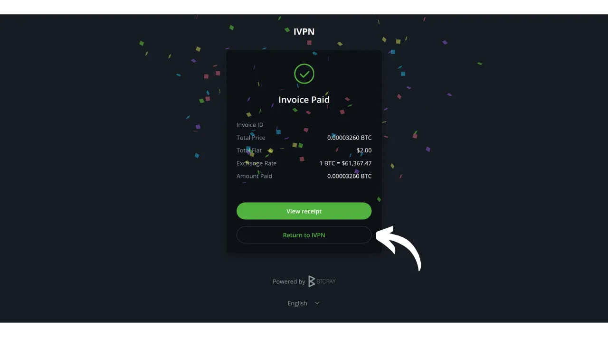
Tilisi näkyy nyt "*Aktiivisena*", ja näet päivämäärän, johon asti pääsysi VPN:ään on voimassa. Tämän päivämäärän jälkeen sinun on uusittava maksusi.

Aktivoidaksesi yhteyden IVPN:n kautta PC:lläsi, kopioi vain tilisi ID.
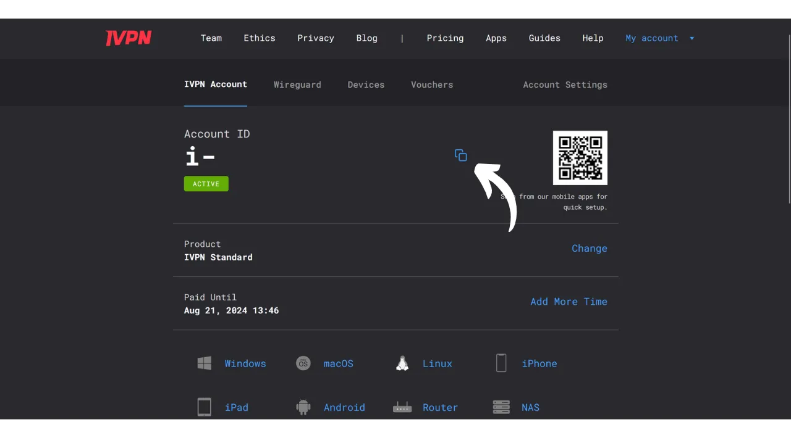
Ja liitä se aiemmin lataamaasi ohjelmistoon.
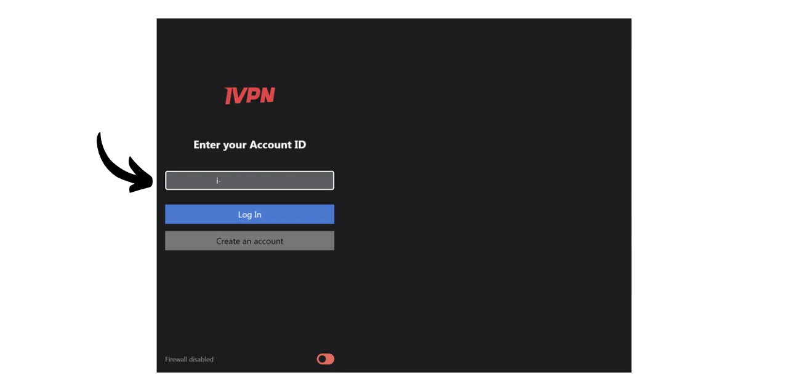
Klikkaa sitten "*Kirjaudu sisään*" -painiketta.
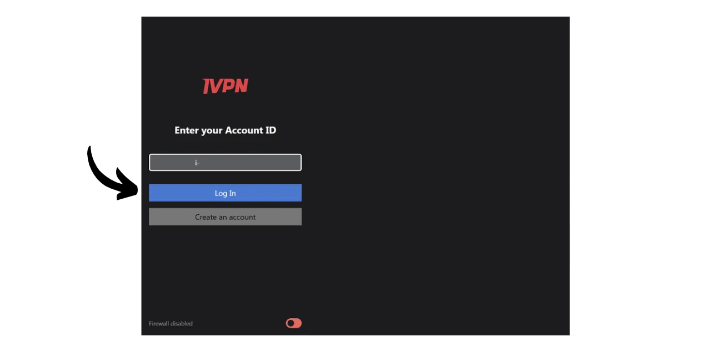
Klikkaa rastia aktivoidaksesi VPN-yhteyden, ja kas, tietokoneesi internet-liikenne on nyt salattu ja reititetty IVPN-palvelimen kautta.
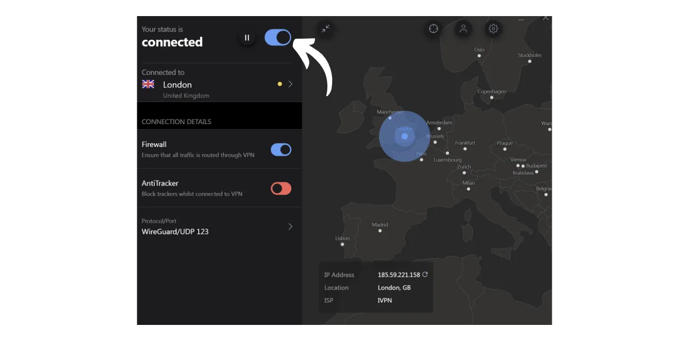
Älypuhelimen osalta menettely on identtinen. Liitä tilisi ID tai skannaa QR-koodi, joka liittyy IVPN-tiliisi ja on saatavilla verkkosivustolta. Klikkaa sitten rastia muodostaaksesi yhteyden.
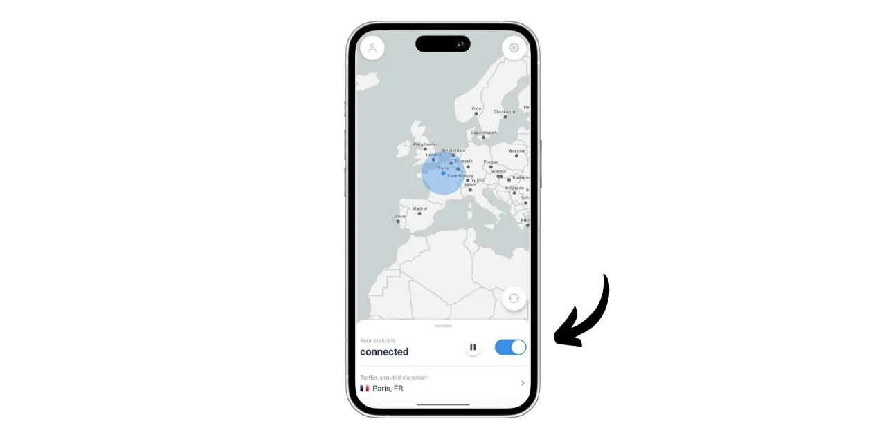
## Kuinka käyttää ja määrittää IVPN?

Käytön ja asetusten osalta se on melko yksinkertaista. Pääkäyttöliittymästä voit aktivoida tai deaktivoida yhteyden yksinkertaisesti käyttämällä rastia.

Sinulla on myös mahdollisuus keskeyttää VPN tietyn ajanjakson ajaksi.
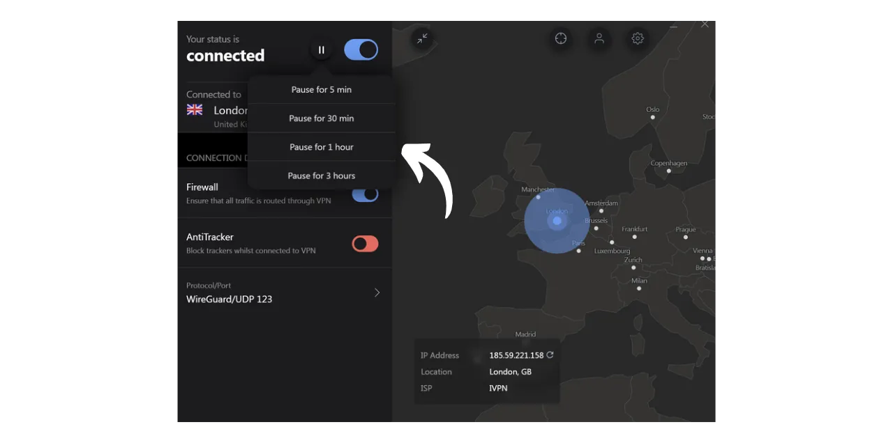
Klikkaamalla nykyistä palvelinta, voit valita toisen palvelimen saatavilla olevista.
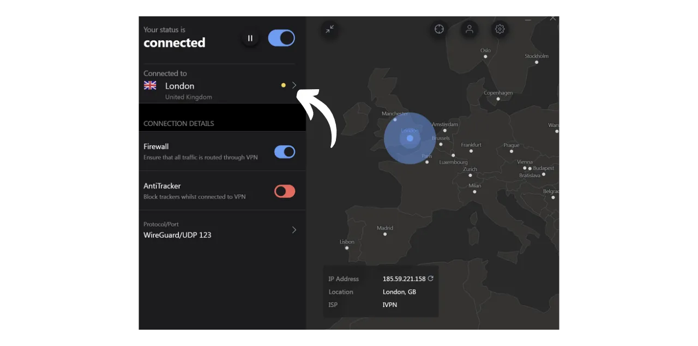
On myös mahdollista aktivoida tai deaktivoida integroitu palomuuri sekä anti-tracker -toiminto.
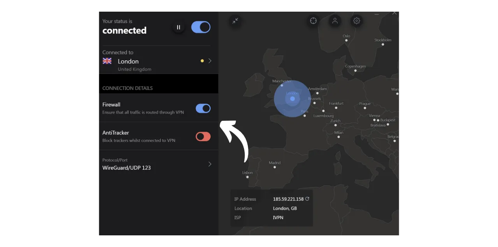
Päästäksesi lisäasetuksiin, klikkaa asetuskuvaketta.
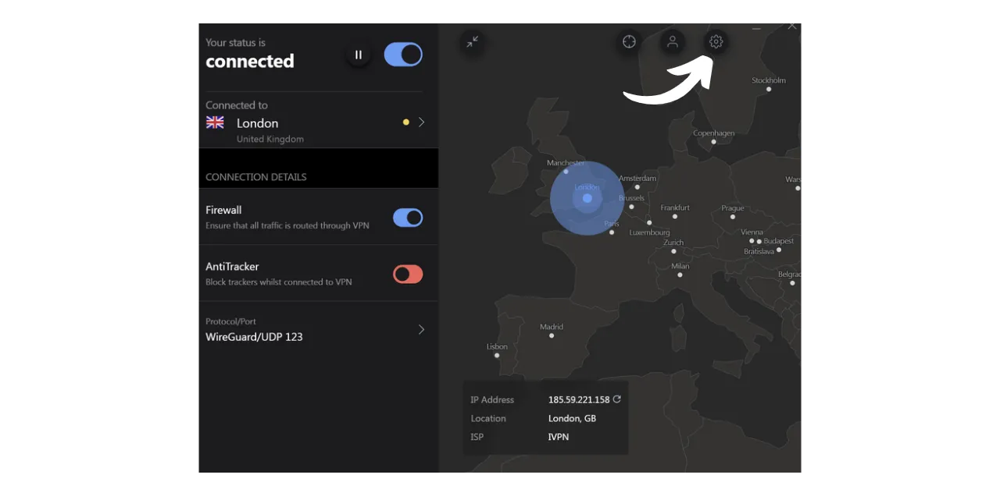
"*Tili*" -välilehdessä löydät tilisi asetuksiin liittyviä tietoja.
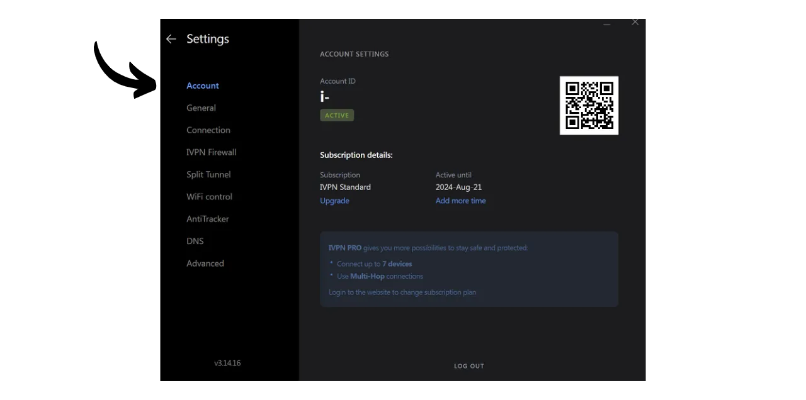
"*Yleiset*" -välilehdessä on useita asiakasasetuksia. Neuvon sinua valitsemaan "*Käynnistä kirjautumisen yhteydessä*" ja "*Käynnistyksen yhteydessä*" -vaihtoehdot "*Automaattiyhteys*" -osiossa, jotta VPN-yhteys muodostetaan automaattisesti koneesi käynnistyessä.

"*Yhteys*" -välilehdessä löydät erilaisia yhteyteen liittyviä vaihtoehtoja. Täällä voit vaihtaa käytettyä VPN-protokollaa.
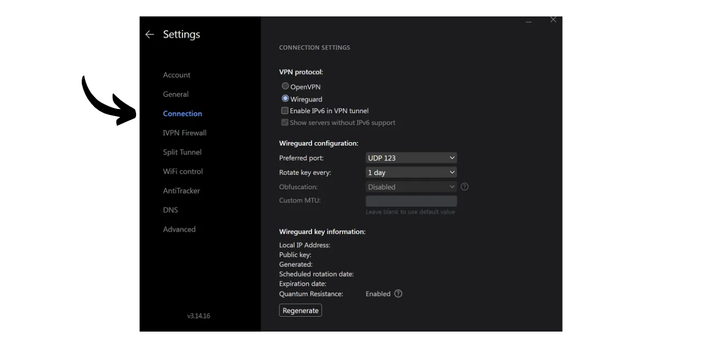 "*IVPN Palomuuri*" -välilehti mahdollistaa palomuurin aktivoimisen järjestelmällisesti tietokoneen käynnistyessä, varmistaen, että yhteyksiä ei muodosteta VPN:n ulkopuolelle.
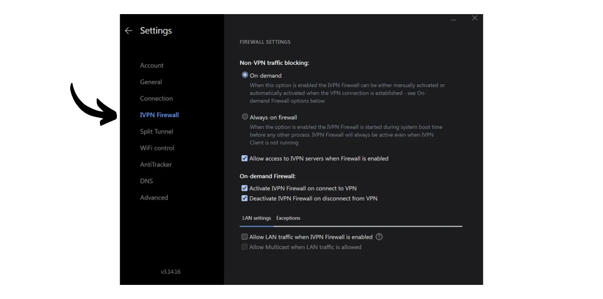
"*Split Tunnel*" -välilehti tarjoaa mahdollisuuden jättää tietyt ohjelmistot VPN-yhteyden ulkopuolelle. Täällä lisätyt sovellukset jatkavat toimintaansa normaalilla internet-yhteydellä, vaikka VPN olisi käytössä.

"*WiFi hallinta*" -välilehdessä voit määrittää tiettyjä toimintoja sen mukaan, mihin verkkoihin olet yhdistänyt. Voit esimerkiksi nimetä kotiverkkosi "*Luotetuksi*" ja määrittää VPN:n olemaan aktivoitumatta tällä verkolla, mutta aktivoitumaan automaattisesti millä tahansa muulla WiFi-verkolla.
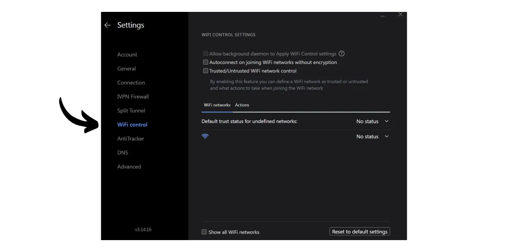
"*AntiTracker*" -valikossa voit valita estoprofiilin anti-trackerillesi. Tämä on suunniteltu estämään mainokset, haittaohjelmat ja datan seuranta estämällä pyynnöt seurantapalveluihin selatessasi Internetissä. Tämä parantaa yksityisyyttäsi estämällä yrityksiä keräämästä ja myymästä selaustietojasi. Saatavilla on myös "*Hardcore Mode*", joka estää kokonaan kaikki Googlen ja Metan omistamat domainit sekä kaikki riippuvaiset palvelut.

Ja siinä se, nyt olet varustautunut nauttimaan IVPN:stä täysin rinnoin. Jos haluat myös parantaa online-tiliesi turvallisuutta käyttämällä paikallista salasananhallintaa, suosittelen tutustumaan opastukseemme KeePassista, joka on ilmainen ja avoimen lähdekoodin ratkaisu:

https://planb.network/tutorials/others/keepass

Jos olet kiinnostunut tutustumaan toiseen VPN-tarjoajaan, joka on samankaltainen kuin IVPN ominaisuuksiltaan ja hinnoittelultaan, suosittelen myös tutustumaan opastukseemme Mullvadista:

https://planb.network/tutorials/others/mullvad