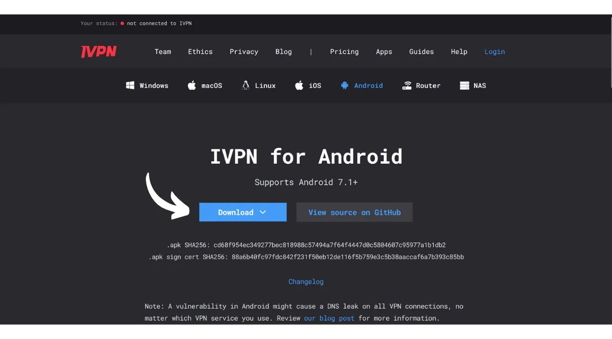
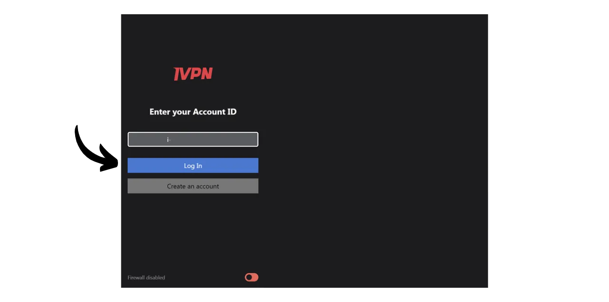
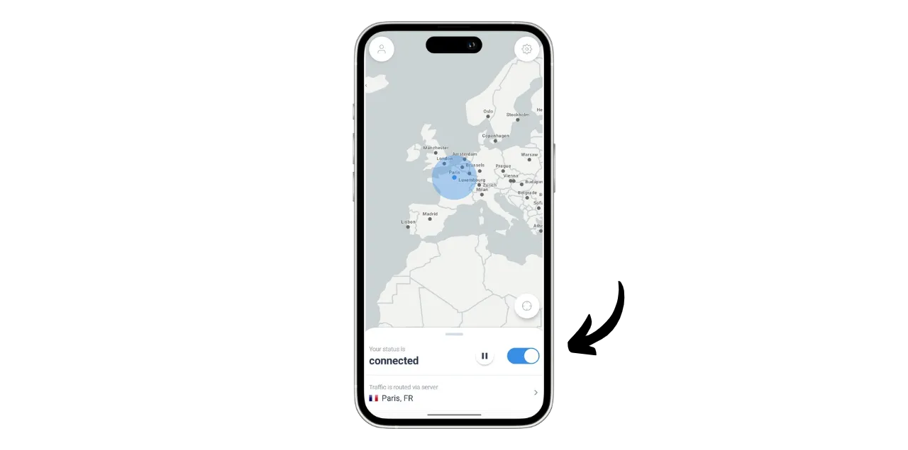
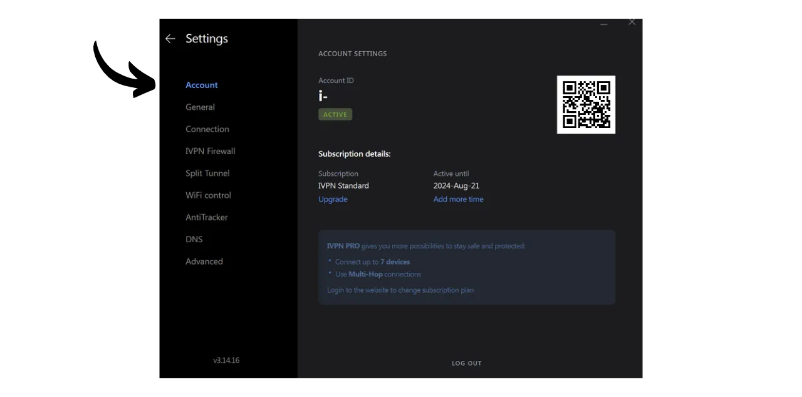
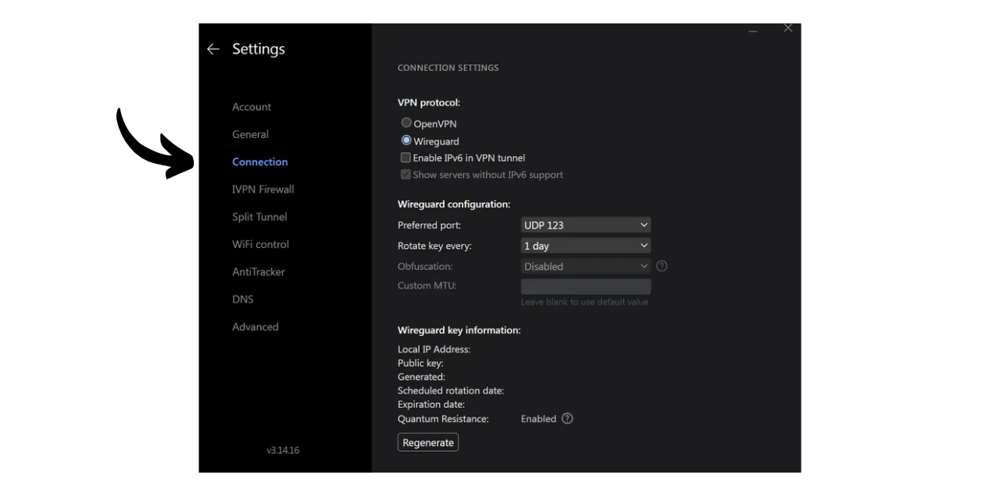

VPN ("*Virtual Private Network*") adalah layanan yang membangun koneksi yang aman dan terenkripsi antara ponsel atau komputer Anda dengan server jarak jauh yang dikelola oleh penyedia VPN.

Secara teknis, ketika terhubung ke VPN, lalu lintas internet Anda dialihkan melalui terowongan terenkripsi ke server VPN. Proses ini membuatnya sulit bagi pihak ketiga, seperti Penyedia Layanan Internet (ISP) atau aktor jahat, untuk mengintersepsi atau membaca data Anda. Server VPN kemudian bertindak sebagai perantara yang menghubungkan ke layanan yang ingin Anda gunakan atas nama Anda. Ini memberikan alamat IP baru ke koneksi Anda, yang membantu menyembunyikan alamat IP asli Anda dari situs yang Anda kunjungi. Namun, berbeda dengan apa yang mungkin disarankan oleh beberapa iklan online, menggunakan VPN tidak memungkinkan Anda untuk menjelajah internet secara anonim, karena memerlukan bentuk kepercayaan pada penyedia VPN yang dapat melihat seluruh lalu lintas Anda.

Manfaat menggunakan VPN sangat banyak. Pertama, itu menjaga privasi aktivitas online Anda dari ISP atau pemerintah, asalkan penyedia VPN tidak membagikan informasi Anda. Kedua, itu mengamankan data Anda, terutama ketika Anda terhubung ke jaringan Wi-Fi publik, yang rentan terhadap serangan MITM (man-in-the-middle). Ketiga, dengan menyembunyikan alamat IP Anda, VPN memungkinkan Anda untuk melewati pembatasan geografis dan sensor, untuk mengakses konten yang sebaliknya tidak tersedia atau diblokir di wilayah Anda.

Seperti yang Anda lihat, VPN menggeser risiko pengamatan lalu lintas ke penyedia VPN. Oleh karena itu, saat memilih penyedia VPN Anda, penting untuk mempertimbangkan data pribadi yang diperlukan untuk pendaftaran. Jika penyedia meminta informasi seperti nomor telepon, alamat email, detail kartu bank, atau lebih buruk lagi, alamat pos Anda, risiko mengaitkan identitas Anda dengan lalu lintas Anda meningkat. Dalam hal kompromi penyedia atau penyitaan hukum, akan mudah untuk mengaitkan lalu lintas Anda dengan data pribadi Anda. Oleh karena itu, disarankan untuk memilih penyedia yang tidak memerlukan data pribadi apa pun dan menerima pembayaran anonim, seperti dengan bitcoin.

Dalam tutorial ini, saya memperkenalkan solusi VPN yang sederhana, efisien, dengan harga yang wajar yang tidak memerlukan informasi pribadi untuk penggunaannya.

## Pengenalan ke IVPN

IVPN adalah layanan VPN yang dirancang khusus untuk pengguna yang mencari bentuk privasi. Tidak seperti penyedia VPN populer yang sering dipromosikan di YouTube, IVPN menonjol karena transparansinya, keamanan, dan penghormatan terhadap privasi.
Kebijakan privasi IVPN ketat: tidak diperlukan informasi pribadi saat mendaftar. Anda dapat membuka akun tanpa memberikan alamat email, nama, atau nomor telepon. Untuk pembayaran, tidak perlu memasukkan detail kartu kredit, karena IVPN menerima pembayaran dalam bitcoin (onchain dan Lightning). Selain itu, IVPN mengklaim tidak menyimpan log aktivitas, yang berarti bahwa, secara teori, lalu lintas internet Anda tidak direkam oleh perusahaan.
IVPN juga [sepenuhnya open-source](https://github.com/ivpn), terkait dengan perangkat lunaknya, aplikasi, dan bahkan situs web mereka, memungkinkan siapa saja untuk memverifikasi dan meninjau kode mereka. Mereka juga menjalani audit keamanan independen setiap tahun, hasilnya dipublikasikan di situs web mereka.

IVPN secara eksklusif menggunakan server yang dihosting sendiri, dengan demikian menghilangkan risiko yang terkait dengan menggunakan layanan cloud pihak ketiga, seperti AWS, Google Cloud, atau Microsoft Azure.

Layanan ini menawarkan banyak fitur canggih, seperti multi-hop, yang mengalirkan lalu lintas melalui beberapa server yang terletak di yurisdiksi yang berbeda untuk meningkatkan anonimitas. IVPN juga mengintegrasikan pemblokir pelacak dan iklan, dan menawarkan opsi untuk memilih dari protokol VPN yang berbeda.
Tentu saja, kualitas layanan ini datang dengan biaya, tetapi harga yang memadai sering kali merupakan indikator kualitas dan kejujuran. Ini mungkin menandakan bahwa perusahaan memiliki model bisnis tanpa kebutuhan untuk menjual data pribadi. IVPN kemudian menawarkan 2 jenis rencana: rencana Standar, yang memungkinkan koneksi hingga 2 perangkat, dan rencana Pro, yang memungkinkan hingga 7 koneksi dan termasuk protokol "*Multi-hop*" yang merutekan lalu lintas Anda melalui beberapa server.
Berbeda dengan penyedia VPN mainstream, IVPN beroperasi pada model membeli waktu akses ke layanan, bukan pada langganan berulang. Anda membayar dalam bitcoin sekali untuk durasi yang dipilih. Misalnya, jika Anda membeli satu tahun akses, Anda dapat menggunakan layanan tersebut untuk periode tersebut, setelah itu Anda perlu kembali ke situs web IVPN untuk membeli lebih banyak waktu akses.

[Tarif IVPN](https://www.ivpn.net/en/pricing/) progresif tergantung pada durasi akses yang dibeli. Berikut adalah harga untuk rencana Standar:
- 1 minggu: $2
- 1 bulan: $6
- 1 tahun: $60
- 2 tahun: $100
- 3 tahun: $140

Dan untuk rencana Pro:
- 1 minggu: $4
- 1 bulan: $10
- 1 tahun: $100
- 2 tahun: $160
- 3 tahun: $220

## Bagaimana cara menginstal IVPN di komputer?
Unduh [versi terbaru dari perangkat lunak](https://www.ivpn.net/en/apps-windows/) untuk sistem operasi Anda, kemudian lanjutkan dengan instalasi dengan mengikuti langkah-langkah dalam wizard instalasi. 
Untuk pengguna Linux, merujuk pada instruksi khusus untuk distribusi Anda yang tersedia di [halaman ini](https://www.ivpn.net/en/apps-linux/).

Setelah instalasi selesai, Anda perlu memasukkan ID akun Anda. Kita akan melihat bagaimana mendapatkannya di bagian selanjutnya dari tutorial ini.

## Bagaimana cara menginstal IVPN di smartphone?

Unduh IVPN dari toko aplikasi Anda, baik itu [AppStore](https://apps.apple.com/us/app/ivpn-secure-vpn-for-privacy/id1193122683) untuk pengguna iOS, [Google Play Store](https://play.google.com/store/apps/details?id=net.ivpn.client) untuk Android, atau [F-Droid](https://f-droid.org/en/packages/net.ivpn.client). Jika Anda menggunakan Android, Anda juga memiliki opsi untuk mengunduh file `.apk` langsung dari [situs IVPN](https://www.ivpn.net/en/apps-android/).

Pada penggunaan pertama aplikasi, Anda akan keluar. Anda perlu memasukkan ID akun Anda untuk mengaktifkan layanan.

Sekarang, mari kita lanjutkan ke mengaktifkan IVPN di perangkat Anda.

## Bagaimana cara membayar dan mengaktifkan IVPN?

Pergi ke situs web resmi IVPN [di halaman pembayaran](https://www.ivpn.net/en/pricing/).

Pilih rencana yang paling sesuai dengan kebutuhan Anda. Untuk tutorial ini, kami akan memilih rencana Standar, yang memungkinkan kami mengaktifkan VPN di komputer dan smartphone kami, misalnya.

IVPN kemudian akan membuat akun Anda. Anda tidak perlu memberikan data pribadi apa pun. Hanya ID akun Anda yang akan memungkinkan Anda untuk masuk. Ini berfungsi seperti kunci akses. Simpan di tempat yang aman seperti manajer kata sandi Anda, misalnya. Anda juga bisa membuat salinan kertas.

Di halaman yang sama, pilih durasi langganan Anda pada layanan tersebut.

Kemudian pilih metode pembayaran Anda. Untuk bagian saya, saya akan melakukan pembayaran melalui Lightning Network, jadi saya klik pada tombol "*Bitcoin*".

Periksa bahwa semuanya sesuai keinginan Anda kemudian klik pada tombol "*Bayar dengan Lightning*".

Sebuah faktur Lightning akan disajikan kepada Anda di BTCPay Server mereka. Pindai kode QR dengan dompet Lightning Anda dan lanjutkan dengan pembayaran.
 Setelah faktur dibayar, klik pada tombol "*Kembali ke IVPN*".

Akun Anda sekarang muncul sebagai "*Aktif*," dan Anda dapat melihat tanggal hingga akses Anda ke VPN berlaku. Setelah tanggal ini, Anda perlu memperbarui pembayaran Anda.

Untuk mengaktifkan koneksi Anda melalui IVPN di PC Anda, cukup salin ID akun Anda.

Dan tempelkan ke dalam perangkat lunak yang sebelumnya Anda unduh.

Kemudian klik pada tombol "*Login*".

Klik pada tanda centang untuk mengaktifkan koneksi VPN, dan sekarang, lalu lintas Internet komputer Anda sekarang dienkripsi dan dialihkan melalui server IVPN.

Untuk smartphone Anda, prosedurnya identik. Tempelkan ID akun Anda atau pindai kode QR yang terkait dengan akun IVPN Anda yang dapat diakses dari situs web. Kemudian, klik pada tanda centang untuk membangun koneksi.

## Bagaimana cara menggunakan dan mengkonfigurasi IVPN?

Dalam hal penggunaan dan pengaturan, ini cukup sederhana. Dari antarmuka utama, Anda dapat mengaktifkan atau menonaktifkan koneksi hanya dengan menggunakan tanda centang.

Anda juga memiliki opsi untuk menjeda VPN Anda untuk durasi tertentu.

Dengan mengklik server saat ini, Anda dapat memilih server lain dari yang tersedia.

Juga dimungkinkan untuk mengaktifkan atau menonaktifkan firewall terintegrasi serta fungsi anti-tracker.

Untuk mengakses pengaturan tambahan, klik pada ikon pengaturan.

Di tab "*Account*", Anda akan menemukan pengaturan yang terkait dengan akun Anda.

Di tab "*General*", ada beberapa pengaturan klien. Saya menyarankan Anda untuk memeriksa opsi "*Launch at login*" dan "*On launch*" di bagian "*Autoconnect*" untuk secara otomatis membangun koneksi dengan VPN saat memulai mesin Anda.

Di tab "*Connection*", Anda akan menemukan berbagai opsi yang terkait dengan koneksi. Di sinilah Anda dapat mengubah protokol VPN yang digunakan.
Tab "*IVPN Firewall*" memungkinkan Anda untuk mengaktifkan firewall secara sistematis pada saat komputer dihidupkan, memastikan tidak ada koneksi yang terjalin di luar VPN.

Tab "*Split Tunnel*" menawarkan kemungkinan untuk mengecualikan perangkat lunak tertentu dari koneksi VPN. Aplikasi yang ditambahkan di sini akan terus beroperasi dengan koneksi internet normal bahkan ketika VPN diaktifkan.

Di tab "*WiFi control*", Anda memiliki opsi untuk mengonfigurasi tindakan spesifik sesuai dengan jaringan yang Anda terhubung. Misalnya, Anda dapat menetapkan jaringan rumah Anda sebagai "*Trusted*" dan mengonfigurasi VPN untuk tidak diaktifkan pada jaringan ini, tetapi untuk secara otomatis diaktifkan pada jaringan WiFi lainnya.

Di menu "*AntiTracker*", pilih profil pemblokiran untuk anti-tracker Anda. Ini dirancang untuk memblokir iklan, malware, dan pelacak data dengan memblokir permintaan ke layanan pelacakan saat Anda menjelajah Internet. Ini meningkatkan privasi Anda dengan mencegah perusahaan mengumpulkan dan menjual data jelajah Anda. Sebuah "*Hardcore Mode*" juga tersedia untuk sepenuhnya memblokir semua domain yang dimiliki oleh Google dan Meta, serta semua layanan yang tergantung padanya.

Dan itulah, Anda sekarang dilengkapi untuk sepenuhnya menikmati IVPN. Jika Anda juga ingin meningkatkan keamanan akun online Anda dengan menggunakan manajer kata sandi lokal, saya mengundang Anda untuk melihat tutorial kami tentang KeePass, solusi gratis dan open-source:

https://planb.network/tutorials/others/keepass

Jika Anda tertarik untuk menemukan penyedia VPN lain yang serupa dengan IVPN, baik dalam hal fitur maupun harga, saya juga merekomendasikan untuk melihat tutorial kami tentang Mullvad:

https://planb.network/tutorials/others/mullvad