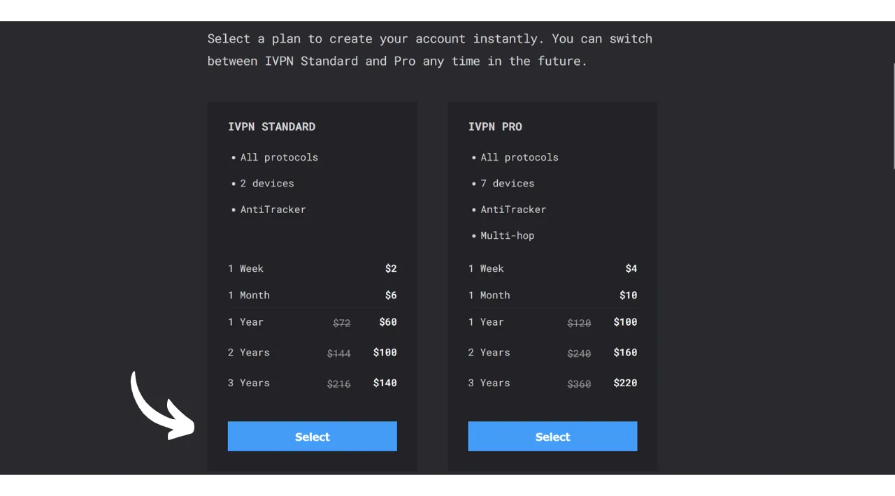

Una VPN ("*Virtual Private Network*") è un servizio che stabilisce una connessione sicura e criptata tra il tuo telefono o computer e un server remoto gestito dal fornitore della VPN.

Tecnicamente, quando ci si connette a una VPN, il traffico internet viene reindirizzato attraverso un tunnel criptato verso il server VPN. Questo processo rende difficile per terze parti, come i fornitori di servizi internet (ISP) o attori malevoli, intercettare o leggere i tuoi dati. Il server VPN agisce quindi come un intermediario che si connette al servizio che desideri utilizzare per tuo conto. Assegna un nuovo indirizzo IP alla tua connessione, il che aiuta a nascondere il tuo vero indirizzo IP dai siti che visiti. Tuttavia, contrariamente a quanto suggeriscono alcuni annunci online, l'uso di una VPN non consente di navigare in internet in modo anonimo, poiché richiede una forma di fiducia nel fornitore della VPN che può vedere tutto il tuo traffico.

I vantaggi dell'utilizzo di una VPN sono numerosi. In primo luogo, preserva la privacy della tua attività online da ISP o governi, a condizione che il fornitore della VPN non condivida le tue informazioni. In secondo luogo, protegge i tuoi dati, specialmente quando sei connesso a reti Wi-Fi pubbliche, vulnerabili ad attacchi MITM (man-in-the-middle). In terzo luogo, nascondendo il tuo indirizzo IP, una VPN ti consente di superare le restrizioni geografiche e la censura, per accedere a contenuti che altrimenti non sarebbero disponibili o bloccati nella tua regione.

Come puoi vedere, la VPN sposta il rischio di osservazione del traffico al fornitore della VPN. Pertanto, quando si sceglie il proprio fornitore di VPN, è importante considerare i dati personali richiesti per la registrazione. Se il fornitore chiede informazioni come il tuo numero di telefono, indirizzo email, dettagli della carta di credito, o peggio, il tuo indirizzo postale, il rischio di associare la tua identità al tuo traffico aumenta. In caso di compromissione del fornitore o di sequestro legale, sarebbe facile associare il tuo traffico ai tuoi dati personali. Pertanto, si raccomanda di scegliere un fornitore che non richieda alcun dato personale e accetti pagamenti anonimi, come con i bitcoin.

In questo tutorial, presento una soluzione VPN semplice, efficiente e a prezzo ragionevole che non richiede informazioni personali per il suo utilizzo.

## Introduzione a IVPN

IVPN è un servizio VPN progettato specificamente per utenti che cercano una forma di privacy. A differenza dei popolari fornitori di VPN spesso promossi su YouTube, IVPN si distingue per la sua trasparenza, sicurezza e rispetto della privacy.
La politica sulla privacy di IVPN è rigorosa: non sono richieste informazioni personali al momento dell'iscrizione. Puoi aprire un account senza fornire un indirizzo email, nome o numero di telefono. Per il pagamento, non è necessario inserire i dettagli della carta di credito, poiché IVPN accetta pagamenti in bitcoin (onchain e Lightning). Inoltre, IVPN afferma di non conservare alcun registro delle attività, il che significa che, in teoria, il tuo traffico internet non viene registrato dall'azienda.
IVPN è anche [completamente open-source](https://github.com/ivpn), riguardo al suo software, alle applicazioni e persino al loro sito web, permettendo a chiunque di verificare e rivedere il loro codice. Sottopongono inoltre a audit di sicurezza indipendenti annualmente, i cui risultati sono pubblicati sul loro sito web.

IVPN utilizza esclusivamente server auto-ospitati, eliminando così i rischi associati all'uso di servizi cloud di terze parti, come AWS, Google Cloud o Microsoft Azure.

Il servizio offre numerose funzionalità avanzate, come il multi-hop, che instrada il traffico attraverso più server situati in diverse giurisdizioni per migliorare l'anonimato. IVPN integra anche un bloccatore di tracker e annunci pubblicitari, e offre l'opzione di scegliere tra diversi protocolli VPN.
Naturalmente, questa qualità del servizio ha un costo, ma un prezzo adeguato è spesso indicatore di qualità e onestà. Può segnalare che l'azienda ha un modello di business che non necessita di vendere dati personali. IVPN offre quindi 2 tipi di piani: il piano Standard, che permette di connettere fino a 2 dispositivi, e il piano Pro, che consente fino a 7 connessioni e include il protocollo "*Multi-hop*" che instrada il tuo traffico attraverso più server.
A differenza dei principali fornitori di VPN, IVPN opera su un modello di acquisto di tempo di accesso al servizio, piuttosto che su un abbonamento ricorrente. Si paga in bitcoin una volta per la durata scelta. Ad esempio, se acquisti un anno di accesso, puoi utilizzare il servizio per quel periodo, dopo il quale dovrai tornare sul sito web di IVPN per acquistare più tempo di accesso.

Le [tariffe di IVPN](https://www.ivpn.net/en/pricing/) sono progressive a seconda della durata dell'accesso acquistato. Ecco i prezzi per il piano Standard:
- 1 settimana: $2
- 1 mese: $6
- 1 anno: $60
- 2 anni: $100
- 3 anni: $140

E per il piano Pro:
- 1 settimana: $4
- 1 mese: $10
- 1 anno: $100
- 2 anni: $160
- 3 anni: $220

## Come installare IVPN su un computer?
Scarica [l'ultima versione del software](https://www.ivpn.net/en/apps-windows/) per il tuo sistema operativo, quindi procedi con l'installazione seguendo i passaggi della procedura guidata di installazione. 
Per gli utenti Linux, fare riferimento alle istruzioni specifiche per la propria distribuzione disponibili su [questa pagina](https://www.ivpn.net/en/apps-linux/).

Una volta completata l'installazione, dovrai inserire il tuo ID account. Vedremo come ottenerlo nelle sezioni seguenti di questo tutorial.

## Come installare IVPN su uno smartphone?

Scarica IVPN dal tuo app store, che sia l'[AppStore](https://apps.apple.com/us/app/ivpn-secure-vpn-for-privacy/id1193122683) per gli utenti iOS, il [Google Play Store](https://play.google.com/store/apps/details?id=net.ivpn.client) per Android, o [F-Droid](https://f-droid.org/en/packages/net.ivpn.client). Se utilizzi Android, hai anche l'opzione di scaricare direttamente il file `.apk` dal [sito di IVPN](https://www.ivpn.net/en/apps-android/).

Al primo utilizzo dell'app, verrai disconnesso. Dovrai inserire il tuo ID account per attivare il servizio.

Ora, passiamo all'attivazione di IVPN sui tuoi dispositivi.

## Come pagare e attivare IVPN?

Vai sul sito ufficiale di IVPN [alla pagina dei pagamenti](https://www.ivpn.net/en/pricing/).

Seleziona il piano che meglio si adatta alle tue esigenze. Per questo tutorial, opteremo per il piano Standard, che ci permette di attivare la VPN sul nostro computer e smartphone, ad esempio.

IVPN creerà quindi il tuo account. Non è necessario fornire alcun dato personale. Sarà solo il tuo ID account a permetterti di accedere. Funziona in qualche modo come una chiave di accesso. Salvalo in un luogo sicuro, come ad esempio il tuo gestore di password. Puoi anche fare una copia cartacea.

Nella stessa pagina, scegli la durata della tua sottoscrizione al servizio.

Poi seleziona il tuo metodo di pagamento. Per quanto mi riguarda, effettuerò il pagamento tramite la Lightning Network, quindi clicco sul pulsante "*Bitcoin*".

Controlla che tutto sia di tuo gradimento poi clicca sul pulsante "*Paga con Lightning*".

Ti verrà presentata una fattura Lightning sul loro server BTCPay. Scansiona il codice QR con il tuo portafoglio Lightning e procedi con il pagamento.
 Una volta pagata la fattura, clicca sul pulsante "*Ritorna a IVPN*".

Il tuo account ora appare come "*Attivo*", e puoi vedere la data fino alla quale il tuo accesso alla VPN è valido. Dopo questa data, dovrai rinnovare il pagamento.

Per attivare la tua connessione tramite IVPN sul tuo PC, copia semplicemente il tuo ID account.

E incollalo nel software che hai precedentemente scaricato.

Poi clicca sul pulsante "*Login*".

Clicca sul segno di spunta per attivare la connessione VPN, ed ecco fatto, il traffico Internet del tuo computer è ora criptato e instradato attraverso un server IVPN.

Per il tuo smartphone, la procedura è identica. Incolla il tuo ID account o scansiona il codice QR associato al tuo account IVPN accessibile dal sito web. Poi, clicca sul segno di spunta per stabilire la connessione.

## Come usare e configurare IVPN?

Per quanto riguarda l'uso e le impostazioni, è abbastanza semplice. Dall'interfaccia principale, puoi attivare o disattivare la connessione semplicemente usando il segno di spunta.

Hai anche l'opzione di mettere in pausa la tua VPN per una durata specifica.

Cliccando sul server corrente, puoi scegliere un altro server tra quelli disponibili.

È anche possibile attivare o disattivare il firewall integrato così come la funzione anti-tracker.

Per accedere alle impostazioni aggiuntive, clicca sull'icona delle impostazioni.

Nella scheda "*Account*", troverai le impostazioni relative al tuo account.

Nella scheda "*Generale*", ci sono diverse impostazioni del client. Ti consiglio di selezionare le opzioni "*Avvia al login*" e "*All'avvio*" nella sezione "*Autoconnect*" per stabilire automaticamente la connessione con la VPN all'avvio della tua macchina.

Nella scheda "*Connessione*", troverai varie opzioni relative alla connessione. Qui è dove puoi cambiare il protocollo VPN utilizzato.
La scheda "*IVPN Firewall*" ti permette di attivare sistematicamente il firewall all'avvio del computer, assicurando che nessuna connessione venga stabilita al di fuori della VPN.
La scheda "*Split Tunnel*" offre la possibilità di escludere determinati software dalla connessione VPN. Le applicazioni aggiunte qui continueranno a funzionare con una normale connessione internet anche quando la VPN è attivata.
Nella scheda "*Controllo WiFi*", hai l'opzione di configurare azioni specifiche in base alle reti a cui sei connesso. Ad esempio, puoi designare la tua rete domestica come "*Affidabile*" e configurare la VPN per non attivarsi su questa rete, ma per attivarsi automaticamente su qualsiasi altra rete WiFi.
Nel menu "*AntiTracker*", seleziona il profilo di blocco per il tuo anti-tracker. Questo è progettato per bloccare annunci, malware e tracker di dati bloccando le richieste ai servizi di tracciamento mentre navighi su Internet. Ciò aumenta la tua privacy impedendo alle aziende di raccogliere e vendere i tuoi dati di navigazione. È disponibile anche una modalità "*Hardcore*" per bloccare completamente tutti i domini di proprietà di Google e Meta, così come tutti i servizi dipendenti.
Ed ecco fatto, ora sei attrezzato per goderti appieno IVPN. Se desideri anche migliorare la sicurezza dei tuoi account online utilizzando un gestore di password locale, ti invito a consultare il nostro tutorial su KeePass, una soluzione gratuita e open-source:

https://planb.network/tutorials/others/keepass

Se sei interessato a scoprire un altro provider VPN simile a IVPN, sia in termini di funzionalità che di prezzi, ti consiglio anche di consultare il nostro tutorial su Mullvad:

https://planb.network/tutorials/others/mullvad