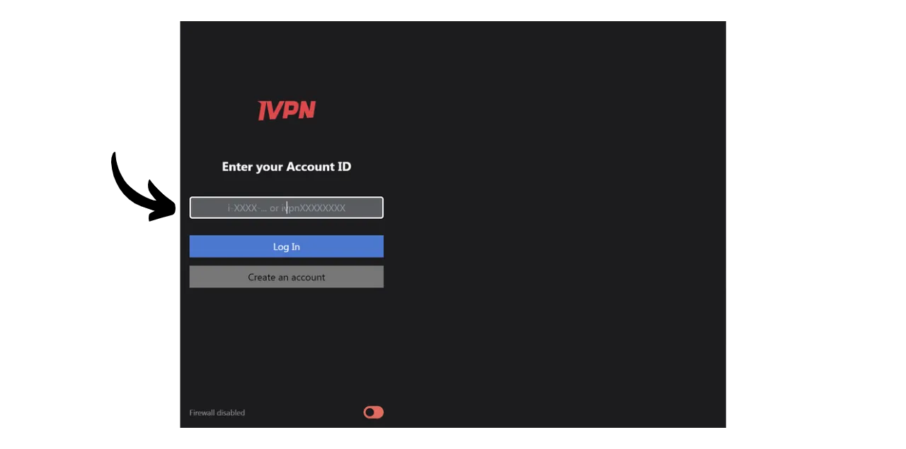
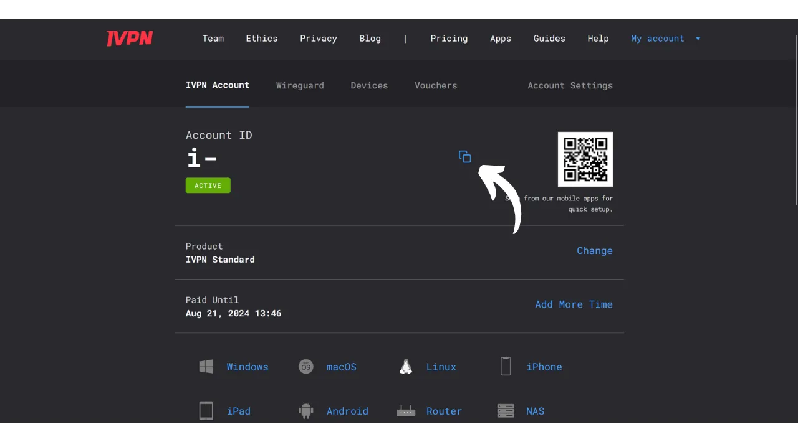

VPN（"*Virtual Private Network*"）は、あなたの電話やコンピュータとVPNプロバイダーが管理するリモートサーバーとの間に安全で暗号化された接続を確立するサービスです。

技術的には、VPNに接続すると、インターネットトラフィックは暗号化されたトンネルを通じてVPNサーバーにリダイレクトされます。このプロセスにより、インターネットサービスプロバイダー（ISP）や悪意のあるアクターなどの第三者があなたのデータを傍受または読み取ることが困難になります。VPNサーバーは、あなたに代わって使用したいサービスに接続する仲介者として機能します。それはあなたの接続に新しいIPアドレスを割り当て、訪問するサイトからあなたの実際のIPアドレスを隠すのに役立ちます。しかし、一部のオンライン広告が示唆するように、VPNを使用しても、VPNプロバイダーがあなたの全てのトラフィックを見ることができるため、インターネットを匿名で閲覧することはできません。

VPNを使用する利点は数多くあります。まず、VPNプロバイダーがあなたの情報を共有しない限り、ISPや政府からオンライン活動のプライバシーを保護します。次に、特にMITM（man-in-the-middle）攻撃に脆弱な公共Wi-Fiネットワークに接続している場合、データを保護します。第三に、IPアドレスを隠すことにより、VPNは地理的な制限や検閲を回避し、あなたの地域では利用できないかブロックされているコンテンツへのアクセスを可能にします。

ご覧のとおり、VPNはトラフィックの監視リスクをVPNプロバイダーに移します。そのため、VPNプロバイダーを選択する際には、登録に必要な個人データを考慮することが重要です。プロバイダーが電話番号、メールアドレス、銀行カードの詳細、あるいはもっと悪いことに郵便住所などの情報を求める場合、あなたの身元をあなたのトラフィックと関連付けるリスクが高まります。プロバイダーが妥協されたり、法的に押収されたりした場合、あなたのトラフィックをあなたの個人データと関連付けることは容易です。そのため、個人データを必要とせず、ビットコインなどの匿名の支払いを受け入れるプロバイダーを選択することが推奨されます。

このチュートリアルでは、個人情報を必要とせず、シンプルで効率的で手頃な価格のVPNソリューションを紹介します。

## IVPNについての紹介

IVPNは、プライバシーを求めるユーザー向けに特別に設計されたVPNサービスです。YouTubeでよく宣伝される人気のVPNプロバイダーとは異なり、IVPNはその透明性、セキュリティ、およびプライバシーへの尊重で際立っています。
IVPNのプライバシーポリシーは厳格です：サインアップ時に個人情報は必要ありません。メールアドレス、名前、電話番号を提供せずにアカウントを開設できます。支払いには、クレジットカードの詳細を入力する必要はなく、IVPNはビットコイン（オンチェーンおよびライトニング）での支払いを受け入れます。さらに、IVPNは活動ログを一切保持しないと主張しており、理論的には、あなたのインターネットトラフィックは会社によって記録されないことを意味します。
IVPNは、そのソフトウェア、アプリケーション、さらにはウェブサイトに至るまで、[完全にオープンソース](https://github.com/ivpn)であり、誰でもそのコードを検証しレビューできます。彼らはまた、独立したセキュリティ監査を毎年実施しており、その結果はウェブサイトに公開されています。

IVPNは自社運営のサーバーのみを使用しており、AWS、Google Cloud、Microsoft Azureなどのサードパーティのクラウドサービスを使用する際に関連するリスクを排除しています。

このサービスは、匿名性を向上させるためにトラフィックを異なる管轄区域にある複数のサーバーを経由してルーティングするマルチホップなど、数多くの高度な機能を提供しています。IVPNはトラッカーや広告ブロッカーを統合しており、異なるVPNプロトコルから選択するオプションも提供しています。
このサービスの品質は費用がかかりますが、適切な価格はしばしば品質と誠実さの指標となります。これは、個人データを販売する必要がないビジネスモデルを会社が持っていることを示すかもしれません。IVPNでは、2種類のプランを提供しています：最大2台のデバイスを接続できるStandardプランと、最大7つの接続が可能で"*Multi-hop*"プロトコルを含むProプランです。このプロトコルは、あなたのトラフィックを複数のサーバーを経由してルーティングします。

主流のVPNプロバイダーとは異なり、IVPNは定期購読ではなく、サービスへのアクセス時間を購入するモデルで運営しています。選択した期間のビットコインで一度支払います。例えば、1年間のアクセスを購入した場合、その期間サービスを利用でき、その後はIVPNのウェブサイトに戻ってさらにアクセス時間を購入する必要があります。

[IVPNの料金](https://www.ivpn.net/en/pricing/)は、購入したアクセス期間に応じて段階的です。Standardプランの価格は以下の通りです：
- 1週間: $2
- 1ヶ月: $6
- 1年: $60
- 2年: $100
- 3年: $140

Proプランの場合は以下の通りです：
- 1週間: $4
- 1ヶ月: $10
- 1年: $100
- 2年: $160
- 3年: $220

## コンピューターにIVPNをインストールする方法は？
お使いのオペレーティングシステム用の[最新バージョンのソフトウェア](https://www.ivpn.net/en/apps-windows/)をダウンロードし、インストールウィザードの手順に従ってインストールを進めてください。 
Linuxユーザーの場合は、[このページ](https://www.ivpn.net/en/apps-linux/)にあるディストリビューション固有の指示に従ってください。

インストールが完了したら、アカウントIDを入力する必要があります。このチュートリアルの後のセクションで、それを取得する方法を見ていきます。

## スマートフォンにIVPNをインストールする方法は？

iOSユーザーの場合は[AppStore](https://apps.apple.com/us/app/ivpn-secure-vpn-for-privacy/id1193122683)、Androidユーザーの場合は[Google Play Store](https://play.google.com/store/apps/details?id=net.ivpn.client)または[F-Droid](https://f-droid.org/en/packages/net.ivpn.client)からIVPNをダウンロードします。Androidを使用している場合は、[IVPNサイト](https://www.ivpn.net/en/apps-android/)から直接`.apk`ファイルをダウンロードするオプションもあります。

アプリを初めて使用する際にはログアウトされます。サービスをアクティブにするためにアカウントIDを入力する必要があります。

では、デバイスでIVPNをアクティブにする方法に進みましょう。

## IVPNの支払いとアクティブ化方法は？

公式IVPNウェブサイトの[支払いページ](https://www.ivpn.net/en/pricing/)にアクセスします。

ニーズに最も適したプランを選択します。このチュートリアルでは、たとえば、コンピューターとスマートフォンでVPNをアクティブにできるStandardプランを選択します。

IVPNはその後、あなたのアカウントを作成します。個人データを提供する必要はありません。ログインするために必要なのはアカウントIDのみです。これはアクセスキーのような役割を果たします。例えばパスワードマネージャーのような安全な場所に保存してください。紙のコピーを作成することもできます。

同じページで、サービスのサブスクリプション期間を選択してください。

次に、支払い方法を選択します。私の場合、Lightning Networkを介して支払いを行うので、"*Bitcoin*"ボタンをクリックします。

全てがご希望通りであることを確認したら、"*Pay with Lightning*"ボタンをクリックしてください。

BTCPay Server上でLightning請求書が提示されます。LightningウォレットでQRコードをスキャンし、支払いを進めてください。
 請求書の支払いが完了したら、"*Return to IVPN*"ボタンをクリックしてください。

あなたのアカウントは"*Active*"と表示され、VPNへのアクセスが有効な日付まで表示されます。この日付の後は、支払いを更新する必要があります。

PC経由でIVPNをアクティブにするには、単にあなたのアカウントIDをコピーします。

そして、以前にダウンロードしたソフトウェアに貼り付けます。

その後、"*Login*"ボタンをクリックします。

チェックマークをクリックしてVPN接続をアクティブにし、これで、あなたのコンピュータのインターネットトラフィックは暗号化され、IVPNサーバーを経由してルーティングされます。

スマートフォンの場合、手順は同じです。アカウントIDを貼り付けるか、ウェブサイトからアクセス可能なIVPNアカウントに関連付けられたQRコードをスキャンします。その後、接続を確立するためにチェックマークをクリックします。

## IVPNの使用方法と設定方法は？

使用方法と設定については、非常にシンプルです。メインインターフェースから、チェックマークを使用して接続をアクティブ化または非アクティブ化できます。

特定の期間、VPNを一時停止するオプションもあります。

現在のサーバーをクリックすると、利用可能な他のサーバーから選択できます。

統合ファイアウォールやアンチトラッカー機能をアクティブ化または非アクティブ化することも可能です。

追加の設定にアクセスするには、設定アイコンをクリックしてください。

"*Account*"タブでは、アカウントに関連する設定が見つかります。

"*General*"タブには、いくつかのクライアント設定があります。"*Autoconnect*"セクションの"*Launch at login*"と"*On launch*"オプションをチェックすることをお勧めします。これにより、マシンの起動時に自動的にVPN接続が確立されます。

"*Connection*"タブでは、接続に関連するさまざまなオプションが見つかります。ここで使用するVPNプロトコルを変更できます。
「*IVPN ファイアウォール*」タブでは、コンピュータの起動時にシステマティックにファイアウォールを有効にすることができ、VPN外の接続が確立されないようにすることができます。

「*スプリットトンネル*」タブでは、特定のソフトウェアをVPN接続から除外する可能性を提供します。ここに追加されたアプリケーションは、VPNが有効になっていても通常のインターネット接続で操作を続けることができます。

「*WiFi コントロール*」タブでは、接続しているネットワークに応じて特定のアクションを設定するオプションがあります。例えば、自宅のネットワークを「*信頼できる*」と指定し、このネットワーク上ではVPNを有効にしないが、他のどのWiFiネットワークに接続した場合は自動的にVPNを有効にするように設定することができます。

「*アンチトラッカー*」メニューでは、アンチトラッカーのブロッキングプロファイルを選択します。これは、インターネットをブラウズ中にトラッキングサービスへのリクエストをブロックすることで広告、マルウェア、データトラッカーをブロックするように設計されています。これにより、企業があなたのブラウジングデータを収集して販売するのを防ぎ、プライバシーを強化します。「*ハードコアモード*」も利用可能で、GoogleとMetaが所有するすべてのドメインおよびすべての依存サービスを完全にブロックします。

これで、IVPNを完全に楽しむ準備が整いました。オンラインアカウントのセキュリティをローカルのパスワードマネージャーを使用して強化したい場合は、無料でオープンソースのソリューションであるKeePassに関する私たちのチュートリアルをチェックすることをお勧めします：

https://planb.network/tutorials/others/keepass

IVPNと機能や価格の面で類似した別のVPNプロバイダーを探している場合は、Mullvadに関する私たちのチュートリアルもチェックすることをお勧めします：

https://planb.network/tutorials/others/mullvad