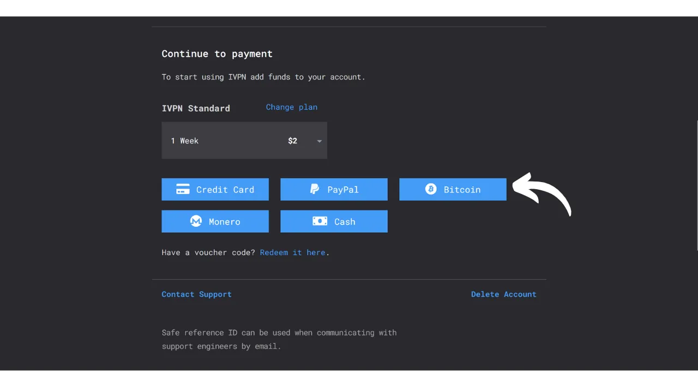
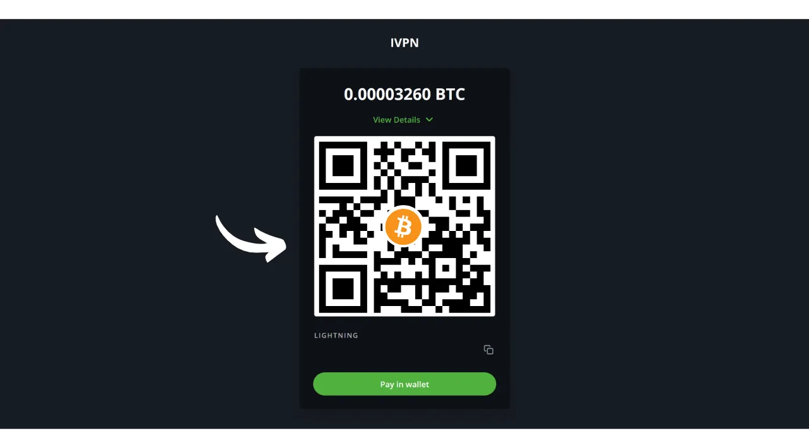
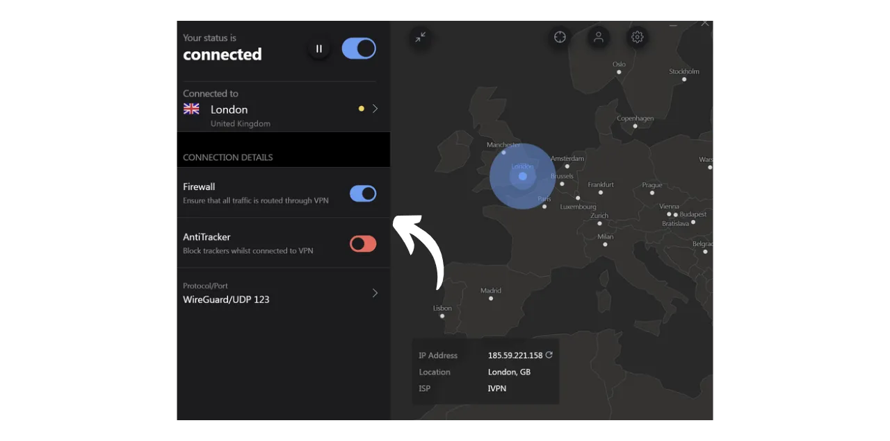
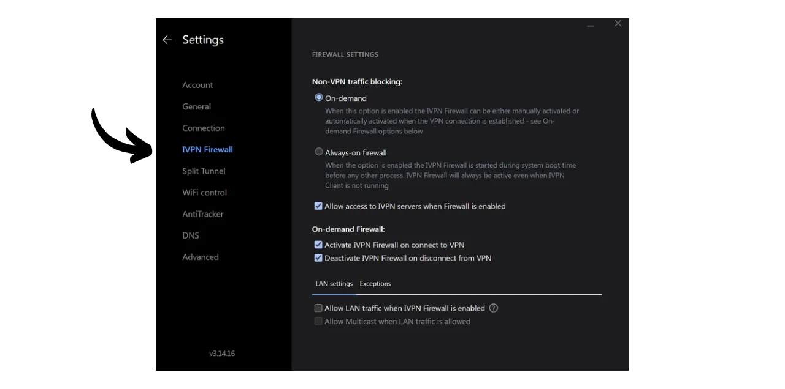

Uma VPN ("*Virtual Private Network*" ou Rede Privada Virtual) é um serviço que estabelece uma conexão segura e criptografada entre seu telefone ou computador e um servidor remoto gerenciado pelo provedor da VPN.

Tecnicamente, ao se conectar a uma VPN, o tráfego da internet é redirecionado através de um túnel criptografado para o servidor da VPN. Esse processo dificulta que terceiros, como Provedores de Serviços de Internet (ISPs) ou atores maliciosos, interceptem ou leiam seus dados. O servidor da VPN então atua como um intermediário que se conecta ao serviço que você deseja usar em seu nome. Ele atribui um novo endereço IP à sua conexão, o que ajuda a ocultar seu endereço IP real dos sites que você visita. No entanto, ao contrário do que alguns anúncios online podem sugerir, usar uma VPN não permite que você navegue na internet anonimamente, pois requer uma forma de confiança no provedor da VPN, que pode ver todo o seu tráfego.

Os benefícios de usar uma VPN são numerosos. Primeiramente, preserva a privacidade da sua atividade online de ISPs ou governos, desde que o provedor da VPN não compartilhe suas informações. Em segundo lugar, protege seus dados, especialmente quando você está conectado a redes Wi-Fi públicas, que são vulneráveis a ataques MITM (man-in-the-middle). Em terceiro lugar, ao ocultar seu endereço IP, uma VPN permite que você contorne restrições geográficas e censura, para acessar conteúdo que de outra forma estaria indisponível ou bloqueado em sua região.

Como você pode ver, a VPN transfere o risco de observação do tráfego para o provedor da VPN. Portanto, ao escolher seu provedor de VPN, é importante considerar os dados pessoais exigidos para o registro. Se o provedor pedir informações como seu número de telefone, endereço de e-mail, detalhes do cartão bancário, ou pior, seu endereço postal, o risco de associar sua identidade ao seu tráfego aumenta. No caso de um comprometimento do provedor ou uma apreensão legal, seria fácil associar seu tráfego aos seus dados pessoais. Portanto, é recomendado escolher um provedor que não exija nenhum dado pessoal e aceite pagamentos anônimos, como com bitcoins.

Neste tutorial, apresento uma solução de VPN simples, eficiente e com preço razoável que não requer nenhuma informação pessoal para seu uso.

## Introdução ao IVPN

O IVPN é um serviço de VPN projetado especificamente para usuários que buscam uma forma de privacidade. Ao contrário de provedores de VPN populares frequentemente promovidos no YouTube, o IVPN se destaca por sua transparência, segurança e respeito à privacidade.
A política de privacidade do IVPN é rigorosa: nenhuma informação pessoal é necessária no momento da inscrição. Você pode abrir uma conta sem fornecer um endereço de e-mail, nome ou número de telefone. Para pagamento, não é necessário inserir detalhes de cartão de crédito, pois o IVPN aceita pagamentos em bitcoins (onchain e Lightning). Além disso, o IVPN afirma não manter registros de atividades, o que significa que, em teoria, seu tráfego na internet não é gravado pela empresa.
O IVPN é também [totalmente open-source](https://github.com/ivpn), em relação ao seu software, aplicações e até mesmo seu site, permitindo que qualquer pessoa verifique e revise seu código. Eles também passam por auditorias de segurança independentes anualmente, cujos resultados são publicados em seu site.

O IVPN usa exclusivamente servidores auto-hospedados, eliminando assim os riscos associados ao uso de serviços de nuvem de terceiros, como AWS, Google Cloud ou Microsoft Azure.

O serviço oferece inúmeras funcionalidades avançadas, como multi-hop, que roteia o tráfego através de múltiplos servidores localizados em diferentes jurisdições para melhorar o anonimato. O IVPN também integra um bloqueador de rastreadores e anúncios, e oferece a opção de escolher entre diferentes protocolos de VPN.
Naturalmente, essa qualidade de serviço tem um custo, mas um preço adequado é frequentemente um indicador de qualidade e honestidade. Pode sinalizar que a empresa possui um modelo de negócios sem a necessidade de vender dados pessoais. A IVPN, então, oferece 2 tipos de planos: o plano Standard, que permite conectar até 2 dispositivos, e o plano Pro, que permite até 7 conexões e inclui o protocolo "*Multi-hop*" que roteia seu tráfego por múltiplos servidores.
Diferentemente dos provedores de VPN mainstream, a IVPN opera em um modelo de compra de tempo de acesso ao serviço, em vez de uma assinatura recorrente. Você paga em bitcoins uma vez pela duração escolhida. Por exemplo, se você comprar um ano de acesso, pode usar o serviço por esse período, após o qual precisará retornar ao site da IVPN para comprar mais tempo de acesso.

As [tarifas da IVPN](https://www.ivpn.net/en/pricing/) são progressivas dependendo da duração do acesso comprado. Aqui estão os preços para o plano Standard:
- 1 semana: $2
- 1 mês: $6
- 1 ano: $60
- 2 anos: $100
- 3 anos: $140

E para o plano Pro:
- 1 semana: $4
- 1 mês: $10
- 1 ano: $100
- 2 anos: $160
- 3 anos: $220

## Como instalar a IVPN em um computador?
Baixe [a última versão do software](https://www.ivpn.net/en/apps-windows/) para o seu sistema operacional, e então prossiga com a instalação seguindo os passos do assistente de instalação. 
Para usuários Linux, consulte as instruções específicas para a sua distribuição disponíveis [nesta página](https://www.ivpn.net/en/apps-linux/).

Uma vez que a instalação esteja completa, você precisará inserir seu ID de conta. Veremos como obtê-lo nas próximas seções deste tutorial.

## Como instalar a IVPN em um smartphone?

Baixe a IVPN da sua loja de aplicativos, seja a [AppStore](https://apps.apple.com/us/app/ivpn-secure-vpn-for-privacy/id1193122683) para usuários de iOS, a [Google Play Store](https://play.google.com/store/apps/details?id=net.ivpn.client) para Android, ou [F-Droid](https://f-droid.org/en/packages/net.ivpn.client). Se você estiver usando Android, também tem a opção de baixar o arquivo `.apk` diretamente do [site da IVPN](https://www.ivpn.net/en/apps-android/).

Na primeira utilização do aplicativo, você será deslogado. Você precisará inserir seu ID de conta para ativar o serviço.

Agora, vamos passar para a ativação da IVPN em seus dispositivos.

## Como pagar e ativar a IVPN?

Vá ao site oficial da IVPN [na página de pagamento](https://www.ivpn.net/en/pricing/).

Selecione o plano que melhor atende às suas necessidades. Para este tutorial, optaremos pelo plano Standard, que nos permite ativar a VPN em nosso computador e smartphone, por exemplo.

A IVPN criará então sua conta. Você não precisa fornecer nenhum dado pessoal. É apenas o seu ID de conta que permitirá que você faça login. Ele funciona de certa forma como uma chave de acesso. Salve-o em um local seguro, como seu gerenciador de senhas, por exemplo. Você também pode fazer uma cópia em papel. 
Na mesma página, escolha a duração da sua assinatura do serviço.

Em seguida, selecione seu método de pagamento. Por minha parte, farei o pagamento via Lightning Network, então eu clico no botão "*Bitcoin*".

Verifique se tudo está ao seu gosto e então clique no botão "*Pagar com Lightning*".

Uma fatura Lightning será apresentada a você no seu servidor BTCPay. Escaneie o código QR com sua carteira Lightning e prossiga com o pagamento.
 Uma vez que a fatura esteja paga, clique no botão "*Retornar para a IVPN*".

Sua conta agora aparece como "*Ativa*", e você pode ver a data até a qual seu acesso à VPN é válido. Após esta data, você precisará renovar seu pagamento.

Para ativar sua conexão via IVPN no seu PC, simplesmente copie seu ID de conta.

E cole-o no software que você baixou anteriormente.

Então clique no botão "*Login*".

Clique no símbolo de verificação para ativar a conexão VPN, e pronto, o tráfego de Internet do seu computador agora está criptografado e roteado através de um servidor IVPN.

Para o seu smartphone, o procedimento é idêntico. Cole seu ID de conta ou escaneie o código QR associado à sua conta IVPN acessível a partir do site. Então, clique no símbolo de verificação para estabelecer a conexão.

## Como usar e configurar a IVPN?

Em termos de uso e configurações, é bastante simples. A partir da interface principal, você pode ativar ou desativar a conexão simplesmente usando o símbolo de verificação.

Você também tem a opção de pausar sua VPN por uma duração específica.

Clicando no servidor atual, você pode escolher outro servidor dentre os disponíveis.

Também é possível ativar ou desativar o firewall integrado, bem como a função anti-rastreador.

Para acessar configurações adicionais, clique no ícone de configurações.

Na aba "*Account*", você encontrará configurações relacionadas à sua conta.

Na aba "*General*", há várias configurações do cliente. Aconselho que você marque as opções "*Launch at login*" e "*On launch*" na seção "*Autoconnect*" para estabelecer automaticamente a conexão com a VPN ao iniciar sua máquina.

Na aba "*Connection*", você encontrará várias opções relacionadas à conexão. É aqui que você pode mudar o protocolo VPN usado.
A aba "*IVPN Firewall*" permite que você ative o firewall sistematicamente no início do computador, garantindo que nenhuma conexão seja estabelecida fora da VPN.

A aba "*Split Tunnel*" oferece a possibilidade de excluir certos softwares da conexão VPN. Aplicativos adicionados aqui continuarão a operar com uma conexão normal à internet mesmo quando a VPN estiver ativada.

Na aba "*WiFi control*", você tem a opção de configurar ações específicas de acordo com as redes às quais está conectado. Por exemplo, você pode designar sua rede doméstica como "*Trusted*" (Confiável) e configurar a VPN para não ativar nesta rede, mas para ativar automaticamente em qualquer outra rede WiFi.

No menu "*AntiTracker*", selecione o perfil de bloqueio para o seu anti-rastreador. Isso é projetado para bloquear anúncios, malware e rastreadores de dados bloqueando solicitações a serviços de rastreamento enquanto você navega na Internet. Isso aumenta sua privacidade ao impedir que empresas colem e vendam seus dados de navegação. Um "*Modo Hardcore*" também está disponível para bloquear completamente todos os domínios pertencentes ao Google e Meta, bem como todos os serviços dependentes.

E aí está, você agora está equipado para aproveitar plenamente o IVPN. Se você também deseja aumentar a segurança de suas contas online usando um gerenciador de senhas local, convido você a conferir nosso tutorial sobre o KeePass, uma solução gratuita e de código aberto:

https://planb.network/tutorials/others/keepass

Se você tem interesse em descobrir outro provedor de VPN semelhante ao IVPN, tanto em termos de recursos quanto de preços, também recomendo conferir nosso tutorial sobre o Mullvad:

https://planb.network/tutorials/others/mullvad