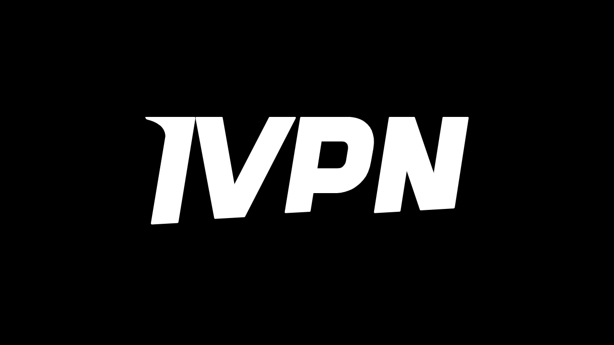

VPN («*Virtual Private Network*» или «*Виртуальная Частная Сеть*») — это сервис, создающий защищенное и шифрованное соединение между вашим телефоном или компьютером и удаленным сервером, управляемым провайдером VPN.

Технически, при подключении к VPN ваш интернет-трафик перенаправляется через зашифрованный туннель к серверу VPN. Этот процесс затрудняет для третьих сторон, таких как провайдеры интернет-услуг (ISP) или злоумышленники, возможность перехватить или прочитать ваши данные. Затем сервер VPN выступает в качестве посредника, подключаясь к нужному вам сервису от вашего имени. Он назначает вашему соединению новый IP-адрес, что помогает скрыть ваш реальный IP-адрес от посещаемых вами сайтов. Однако, вопреки тому, что могут предлагать некоторые онлайн-рекламы, использование VPN не позволяет анонимно серфить в интернете, поскольку это требует доверия к провайдеру VPN, который видит весь ваш трафик.

Преимущества использования VPN многочисленны. Во-первых, это сохранение конфиденциальности вашей онлайн-активности от провайдеров интернет-услуг или правительств, при условии, что провайдер VPN не делится вашей информацией. Во-вторых, это защита ваших данных, особенно когда вы подключены к общественным Wi-Fi сетям, которые уязвимы для атак типа "человек посередине" (MITM). В-третьих, скрывая ваш IP-адрес, VPN позволяет обходить географические ограничения и цензуру, чтобы получить доступ к контенту, который в противном случае был бы недоступен или заблокирован в вашем регионе.

Как видите, VPN переносит риск наблюдения за трафиком на провайдера VPN. Поэтому, выбирая провайдера VPN, важно учитывать, какие личные данные требуются для регистрации. Если провайдер запрашивает информацию, такую как ваш номер телефона, адрес электронной почты, данные банковской карты или, что еще хуже, ваш почтовый адрес, риск ассоциации вашей личности с вашим трафиком увеличивается. В случае компрометации провайдера или юридического изъятия, связать ваш трафик с вашими личными данными было бы легко. Поэтому рекомендуется выбирать провайдера, который не требует никаких личных данных и принимает анонимные платежи, например, биткоинами.

В этом руководстве я представляю простое, эффективное и разумно ценовое решение VPN, которое не требует никакой личной информации для его использования.

## Введение в IVPN

IVPN — это сервис VPN, специально разработанный для пользователей, ищущих приватность. В отличие от популярных провайдеров VPN, часто продвигаемых на YouTube, IVPN выделяется своей прозрачностью, безопасностью и уважением к приватности.
Политика конфиденциальности IVPN строга: при регистрации не требуется никакой личной информации. Вы можете открыть аккаунт, не предоставляя адрес электронной почты, имя или номер телефона. Для оплаты не нужно вводить данные кредитной карты, поскольку IVPN принимает платежи биткоинами (через onchain и Lightning). Более того, IVPN утверждает, что не ведет журналов активности, что означает, что, теоретически, ваш интернет-трафик не записывается компанией.
IVPN также [полностью открытый исходный код](https://github.com/ivpn), включая их программное обеспечение, приложения и даже их веб-сайт, что позволяет любому проверить и оценить их код. Они также проходят независимые аудиты безопасности ежегодно, результаты которых публикуются на их веб-сайте.

IVPN исключительно использует собственные серверы, тем самым исключая риски, связанные с использованием сторонних облачных сервисов, таких как AWS, Google Cloud или Microsoft Azure.

Сервис предлагает множество продвинутых функций, таких как мульти-хоп, который маршрутизирует трафик через несколько серверов, расположенных в разных юрисдикциях, для улучшения анонимности. IVPN также интегрирует блокировщик трекеров и рекламы и предлагает выбор из различных протоколов VPN.
Естественно, такое качество услуги имеет свою цену, но адекватная стоимость часто является показателем качества и честности. Это может сигнализировать о том, что компания имеет бизнес-модель, не требующую продажи личных данных. IVPN предлагает два типа тарифных планов: Стандартный план, который позволяет подключать до 2 устройств, и Профессиональный план, который позволяет до 7 подключений и включает протокол "*Multi-hop*", который направляет ваш трафик через несколько серверов.
В отличие от основных провайдеров VPN, IVPN работает по модели покупки времени доступа к сервису, а не на основе повторяющейся подписки. Вы платите биткоинами один раз за выбранный период. Например, если вы купите доступ на один год, вы сможете использовать сервис в течение этого периода, после чего вам нужно будет вернуться на сайт IVPN, чтобы купить больше времени доступа.

[Тарифы IVPN](https://www.ivpn.net/en/pricing/) прогрессивно зависят от купленной продолжительности доступа. Вот цены для Стандартного плана:
- 1 неделя: $2
- 1 месяц: $6
- 1 год: $60
- 2 года: $100
- 3 года: $140

И для Профессионального плана:
- 1 неделя: $4
- 1 месяц: $10
- 1 год: $100
- 2 года: $160
- 3 года: $220

## Как установить IVPN на компьютер?
Скачайте [последнюю версию программы](https://www.ivpn.net/en/apps-windows/) для вашей операционной системы, затем продолжите установку, следуя шагам мастера установки. 
Для пользователей Linux обратитесь к инструкциям, специфичным для вашего дистрибутива, доступным на [этой странице](https://www.ivpn.net/en/apps-linux/).

После завершения установки вам нужно будет ввести ваш идентификатор учетной записи. Как его получить, мы увидим в следующих разделах этого руководства.

## Как установить IVPN на смартфон?

Скачайте IVPN из вашего магазина приложений, будь то [AppStore](https://apps.apple.com/us/app/ivpn-secure-vpn-for-privacy/id1193122683) для пользователей iOS, [Google Play Store](https://play.google.com/store/apps/details?id=net.ivpn.client) для Android, или [F-Droid](https://f-droid.org/en/packages/net.ivpn.client). Если вы используете Android, у вас также есть возможность скачать файл `.apk` напрямую с [сайта IVPN](https://www.ivpn.net/en/apps-android/).

При первом использовании приложения вы будете выведены из системы. Вам нужно будет ввести ваш идентификатор учетной записи, чтобы активировать сервис.

Теперь перейдем к активации IVPN на ваших устройствах.

## Как оплатить и активировать IVPN?

Перейдите на официальный сайт IVPN [на страницу оплаты](https://www.ivpn.net/en/pricing/).

Выберите план, который наилучшим образом соответствует вашим потребностям. Для этого руководства мы выберем Стандартный план, который позволяет нам активировать VPN на нашем компьютере и смартфоне, например.

IVPN затем создаст ваш аккаунт. Вам не нужно предоставлять какие-либо личные данные. Для входа в систему будет использоваться только ваш идентификатор аккаунта. Он действует вроде ключа доступа. Сохраните его в надежном месте, например, в менеджере паролей. Вы также можете сделать бумажную копию. 
На той же странице выберите срок вашей подписки на сервис.

Затем выберите способ оплаты. Я, например, совершу платеж через Lightning Network, поэтому нажму на кнопку "*Bitcoin*".

Убедитесь, что все устраивает, затем нажмите на кнопку "*Оплатить через Lightning*".

На сервере BTCPay IVPN будет представлен счет Lightning. Отсканируйте QR-код с помощью вашего кошелька Lightning и произведите оплату.
 После оплаты счета нажмите на кнопку "*Вернуться в IVPN*".

Теперь ваш аккаунт отображается как "*Активный*", и вы можете видеть дату, до которой ваш доступ к VPN действителен. После этой даты вам нужно будет продлить оплату.

Чтобы активировать соединение через IVPN на вашем ПК, просто скопируйте ваш идентификатор аккаунта.

И вставьте его в программное обеспечение, которое вы предварительно загрузили.

Затем нажмите на кнопку "*Войти*".

Нажмите на галочку, чтобы активировать VPN-соединение, и вот, интернет-трафик вашего компьютера теперь зашифрован и направлен через сервер IVPN.

Для вашего смартфона процедура идентична. Вставьте ваш идентификатор аккаунта или отсканируйте QR-код, связанный с вашим аккаунтом IVPN, доступный на веб-сайте. Затем нажмите на галочку, чтобы установить соединение.

## Как использовать и настраивать IVPN?

С точки зрения использования и настроек, это довольно просто. Из главного интерфейса вы можете активировать или деактивировать соединение, просто используя галочку.

У вас также есть возможность приостановить работу вашего VPN на определенный период.

Нажав на текущий сервер, вы можете выбрать другой сервер из доступных.

Также возможно активировать или деактивировать встроенный фаервол, а также функцию анти-трекера.

Для доступа к дополнительным настройкам нажмите на иконку настроек.

Во вкладке "*Account*" вы найдете настройки, связанные с вашим аккаунтом.

Во вкладке "*General*" находятся различные настройки клиента. Я советую проверить опции "*Запуск при входе в систему*" и "*При запуске*" в разделе "*Автоподключение*", чтобы автоматически устанавливать соединение с VPN при запуске вашего устройства.

Во вкладке "*Connection*" вы найдете различные опции, связанные с соединением. Здесь вы можете изменить используемый VPN-протокол.
 Вкладка "*IVPN Firewall*" позволяет активировать фаервол автоматически при запуске компьютера, обеспечивая отсутствие подключений вне VPN.

Вкладка "*Split Tunnel*" предлагает возможность исключить определенные программы из VPN-соединения. Добавленные здесь приложения будут продолжать работать с обычным интернет-соединением, даже когда VPN включен.

На вкладке "*WiFi control*" вы можете настроить специфические действия в зависимости от подключенных сетей. Например, вы можете обозначить вашу домашнюю сеть как "*Trusted*" (Доверенная) и настроить VPN так, чтобы он не активировался в этой сети, но автоматически активировался в любой другой WiFi-сети.

В меню "*AntiTracker*" выберите профиль блокировки для вашего антитрекера. Он предназначен для блокировки рекламы, вредоносных программ и трекеров данных путем блокировки запросов к службам отслеживания во время просмотра интернета. Это повышает вашу конфиденциальность, предотвращая сбор и продажу данных о вашем веб-сёрфинге компаниями. Также доступен "*Hardcore Mode*" для полной блокировки всех доменов, принадлежащих Google и Meta, а также всех зависимых сервисов.

Вот и все, теперь вы полностью готовы к использованию IVPN. Если вы также хотите повысить безопасность ваших онлайн-аккаунтов с помощью локального менеджера паролей, я приглашаю вас ознакомиться с нашим учебным пособием по KeePass, бесплатному и открытому решению:

https://planb.network/tutorials/others/keepass

Если вас интересует знакомство с другим провайдером VPN, похожим на IVPN как по функционалу, так и по цене, я также рекомендую ознакомиться с нашим учебным пособием по Mullvad:

https://planb.network/tutorials/others/mullvad