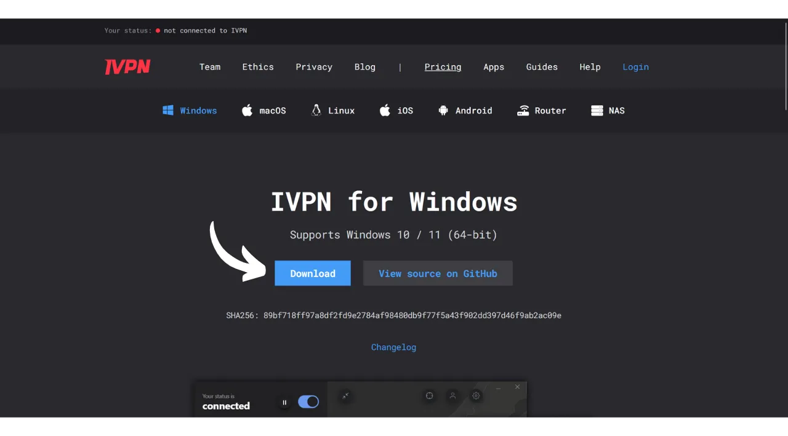
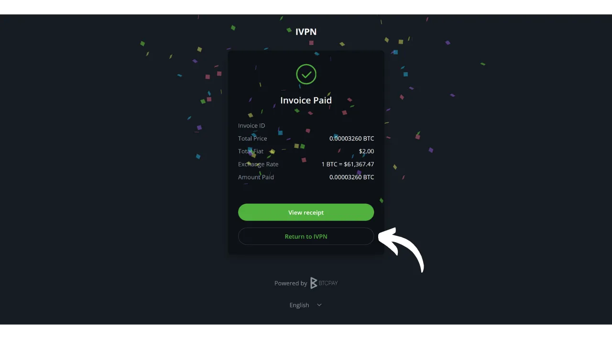

VPN ("*Virtual Private Network*" hay Mạng Riêng Ảo) là một dịch vụ thiết lập một kết nối an toàn và được mã hóa giữa điện thoại hoặc máy tính của bạn với một máy chủ từ xa được quản lý bởi nhà cung cấp VPN.

Về mặt kỹ thuật, khi kết nối với VPN, lưu lượng internet của bạn được chuyển hướng qua một đường hầm được mã hóa đến máy chủ VPN. Quá trình này làm cho việc bên thứ ba, như Nhà cung cấp Dịch vụ Internet (ISPs) hoặc các tác nhân xấu, khó có thể chặn hoặc đọc dữ liệu của bạn. Máy chủ VPN sau đó hoạt động như một trung gian kết nối với dịch vụ bạn muốn sử dụng thay mặt bạn. Nó gán một địa chỉ IP mới cho kết nối của bạn, giúp ẩn địa chỉ IP thực của bạn khỏi các trang web bạn truy cập. Tuy nhiên, trái với những gì một số quảng cáo trực tuyến có thể gợi ý, sử dụng VPN không cho phép bạn duyệt internet một cách ẩn danh, vì nó đòi hỏi một hình thức tin tưởng vào nhà cung cấp VPN, người có thể thấy tất cả lưu lượng truy cập của bạn.

Lợi ích của việc sử dụng VPN là rất nhiều. Đầu tiên, nó bảo vệ sự riêng tư của hoạt động trực tuyến của bạn khỏi ISPs hoặc chính phủ, miễn là nhà cung cấp VPN không chia sẻ thông tin của bạn. Thứ hai, nó bảo vệ dữ liệu của bạn, đặc biệt khi bạn kết nối với mạng Wi-Fi công cộng, nơi dễ bị tấn công MITM (man-in-the-middle). Thứ ba, bằng cách ẩn địa chỉ IP của bạn, VPN cho phép bạn vượt qua các hạn chế địa lý và kiểm duyệt, để truy cập nội dung mà nếu không thì sẽ không khả dụng hoặc bị chặn trong khu vực của bạn.

Như bạn thấy, VPN chuyển rủi ro quan sát lưu lượng truy cập sang nhà cung cấp VPN. Do đó, khi chọn nhà cung cấp VPN của bạn, điều quan trọng là phải xem xét dữ liệu cá nhân yêu cầu khi đăng ký. Nếu nhà cung cấp yêu cầu thông tin như số điện thoại, địa chỉ email, chi tiết thẻ ngân hàng, hoặc tồi tệ hơn, địa chỉ bưu điện của bạn, rủi ro liên kết danh tính của bạn với lưu lượng truy cập của bạn được tăng lên. Trong trường hợp nhà cung cấp bị xâm phạm hoặc bị tịch thu pháp lý, việc liên kết lưu lượng truy cập của bạn với dữ liệu cá nhân sẽ dễ dàng. Do đó, được khuyến nghị chọn một nhà cung cấp không yêu cầu bất kỳ dữ liệu cá nhân nào và chấp nhận thanh toán ẩn danh, như bằng bitcoin.

Trong hướng dẫn này, tôi giới thiệu một giải pháp VPN đơn giản, hiệu quả, có giá cả hợp lý mà không yêu cầu thông tin cá nhân nào cho việc sử dụng.

## Giới thiệu về IVPN

IVPN là một dịch vụ VPN được thiết kế đặc biệt cho người dùng tìm kiếm một hình thức riêng tư. Không giống như các nhà cung cấp VPN phổ biến thường được quảng cáo trên YouTube, IVPN nổi bật với sự minh bạch, an ninh, và tôn trọng sự riêng tư.
Chính sách riêng tư của IVPN là nghiêm ngặt: không yêu cầu thông tin cá nhân khi đăng ký. Bạn có thể mở một tài khoản mà không cần cung cấp địa chỉ email, tên, hoặc số điện thoại. Đối với thanh toán, không cần nhập chi tiết thẻ tín dụng, vì IVPN chấp nhận thanh toán bằng bitcoin (onchain và Lightning). Hơn nữa, IVPN tuyên bố không giữ bất kỳ nhật ký hoạt động nào, có nghĩa là, theo lý thuyết, lưu lượng truy cập internet của bạn không được công ty ghi lại.
IVPN cũng là [hoàn toàn mã nguồn mở](https://github.com/ivpn), liên quan đến phần mềm, ứng dụng, và thậm chí là trang web của họ, cho phép bất kỳ ai kiểm tra và xem xét mã của họ. Họ cũng trải qua các cuộc kiểm toán bảo mật độc lập hàng năm, kết quả của đó được công bố trên trang web của họ.

IVPN sử dụng độc quyền các máy chủ tự lưu trữ, do đó loại bỏ rủi ro liên quan đến việc sử dụng các dịch vụ đám mây của bên thứ ba, như AWS, Google Cloud, hoặc Microsoft Azure.

Dịch vụ cung cấp nhiều tính năng tiên tiến, như multi-hop, điều hướng lưu lượng qua nhiều máy chủ đặt tại các quốc gia khác nhau để cải thiện sự ẩn danh. IVPN cũng tích hợp chặn theo dõi và quảng cáo, và cung cấp tùy chọn chọn từ các giao thức VPN khác nhau.
Rõ ràng, chất lượng dịch vụ như vậy đi kèm với một mức giá, nhưng một mức giá phù hợp thường là dấu hiệu của chất lượng và sự trung thực. Điều này có thể báo hiệu rằng công ty có một mô hình kinh doanh không cần bán dữ liệu cá nhân. IVPN sau đó cung cấp 2 loại kế hoạch: kế hoạch Tiêu chuẩn, cho phép kết nối tối đa 2 thiết bị, và kế hoạch Pro, cho phép tới 7 kết nối và bao gồm giao thức "*Multi-hop*" định tuyến lưu lượng truy cập của bạn qua nhiều máy chủ.

Không giống như các nhà cung cấp VPN chính thống, IVPN hoạt động trên một mô hình mua thời gian truy cập dịch vụ, thay vì trên một đăng ký định kỳ. Bạn trả bằng bitcoin một lần cho thời gian đã chọn. Ví dụ, nếu bạn mua một năm truy cập, bạn có thể sử dụng dịch vụ trong khoảng thời gian đó, sau đó bạn sẽ cần quay lại trang web IVPN để mua thêm thời gian truy cập.

Các [mức giá IVPN](https://www.ivpn.net/en/pricing/) tăng dần tùy thuộc vào thời gian truy cập đã mua. Dưới đây là giá cho kế hoạch Tiêu chuẩn:
- 1 tuần: $2
- 1 tháng: $6
- 1 năm: $60
- 2 năm: $100
- 3 năm: $140

Và cho kế hoạch Pro:
- 1 tuần: $4
- 1 tháng: $10
- 1 năm: $100
- 2 năm: $160
- 3 năm: $220

## Cách cài đặt IVPN trên máy tính?
Tải [phiên bản mới nhất của phần mềm](https://www.ivpn.net/en/apps-windows/) cho hệ điều hành của bạn, sau đó tiến hành cài đặt theo các bước trong trình hướng dẫn cài đặt. 
Đối với người dùng Linux, tham khảo hướng dẫn cụ thể cho bản phân phối của bạn có sẵn trên [trang này](https://www.ivpn.net/en/apps-linux/).

Khi cài đặt hoàn tất, bạn sẽ cần nhập ID tài khoản của mình. Chúng ta sẽ xem cách lấy nó trong các phần tiếp theo của hướng dẫn này.

## Cách cài đặt IVPN trên điện thoại thông minh?

Tải IVPN từ cửa hàng ứng dụng của bạn, dù là [AppStore](https://apps.apple.com/us/app/ivpn-secure-vpn-for-privacy/id1193122683) cho người dùng iOS, [Google Play Store](https://play.google.com/store/apps/details?id=net.ivpn.client) cho Android, hay [F-Droid](https://f-droid.org/en/packages/net.ivpn.client). Nếu bạn sử dụng Android, bạn cũng có tùy chọn tải tệp `.apk` trực tiếp từ [trang web IVPN](https://www.ivpn.net/en/apps-android/).

Khi sử dụng ứng dụng lần đầu, bạn sẽ bị đăng xuất. Bạn sẽ cần nhập ID tài khoản của mình để kích hoạt dịch vụ.

Bây giờ, chúng ta hãy chuyển sang kích hoạt IVPN trên các thiết bị của bạn.

## Cách thanh toán và kích hoạt IVPN?

Truy cập trang web chính thức của IVPN [trên trang thanh toán](https://www.ivpn.net/en/pricing/).

Chọn kế hoạch phù hợp nhất với nhu cầu của bạn. Đối với hướng dẫn này, chúng tôi sẽ chọn kế hoạch Tiêu chuẩn, cho phép chúng tôi kích hoạt VPN trên máy tính và điện thoại thông minh của mình, ví dụ.

IVPN sẽ tạo tài khoản cho bạn. Bạn không cần phải cung cấp bất kỳ dữ liệu cá nhân nào. Chỉ có ID tài khoản của bạn mới cho phép bạn đăng nhập. Nó hoạt động giống như một chìa khóa truy cập. Hãy lưu nó ở một nơi an toàn như trình quản lý mật khẩu của bạn, chẳng hạn. Bạn cũng có thể tạo một bản sao giấy.
Trên cùng một trang, chọn thời hạn đăng ký dịch vụ của bạn.

Sau đó chọn phương thức thanh toán của bạn. Về phần mình, tôi sẽ thực hiện thanh toán qua Lightning Network, vì vậy tôi nhấp vào nút "*Bitcoin*".

Kiểm tra xem mọi thứ có đúng ý bạn không sau đó nhấp vào nút "*Thanh toán bằng Lightning*".

Một hóa đơn Lightning sẽ được trình bày cho bạn trên máy chủ BTCPay của họ. Quét mã QR bằng ví Lightning của bạn và tiến hành thanh toán.
 Một khi hóa đơn được thanh toán, nhấp vào nút "*Quay lại IVPN*".

Tài khoản của bạn giờ đây xuất hiện như là "*Hoạt động*", và bạn có thể thấy ngày hết hạn truy cập VPN của bạn. Sau ngày này, bạn sẽ cần phải gia hạn thanh toán.

Để kích hoạt kết nối qua IVPN trên PC của bạn, chỉ cần sao chép ID tài khoản của bạn.

Và dán nó vào phần mềm bạn đã tải về trước đó.

Sau đó nhấp vào nút "*Đăng nhập*".

Nhấp vào dấu kiểm để kích hoạt kết nối VPN, và đó là, lưu lượng Internet của máy tính bạn giờ đây được mã hóa và định tuyến qua máy chủ IVPN.

Đối với điện thoại thông minh của bạn, quy trình là giống hệt. Dán ID tài khoản của bạn hoặc quét mã QR liên kết với tài khoản IVPN của bạn có thể truy cập từ trang web. Sau đó, nhấp vào dấu kiểm để thiết lập kết nối.

## Làm thế nào để sử dụng và cấu hình IVPN?

Về việc sử dụng và cài đặt, nó khá đơn giản. Từ giao diện chính, bạn có thể kích hoạt hoặc vô hiệu hóa kết nối chỉ bằng cách sử dụng dấu kiểm.

Bạn cũng có tùy chọn tạm dừng VPN của mình trong một khoảng thời gian cụ thể.

Bằng cách nhấp vào máy chủ hiện tại, bạn có thể chọn một máy chủ khác từ những máy chủ có sẵn.

Cũng có thể kích hoạt hoặc vô hiệu hóa tường lửa tích hợp cũng như chức năng chống theo dõi.

Để truy cập các cài đặt bổ sung, nhấp vào biểu tượng cài đặt.

Trong tab "*Tài khoản*", bạn sẽ tìm thấy các cài đặt liên quan đến tài khoản của bạn.

Trong tab "*Chung*", có một số cài đặt của khách hàng. Tôi khuyên bạn nên kiểm tra các tùy chọn "*Khởi động cùng hệ thống*" và "*Khi khởi động*" trong phần "*Tự động kết nối*" để tự động thiết lập kết nối với VPN khi khởi động máy của bạn.

Trong tab "*Kết nối*", bạn sẽ tìm thấy các tùy chọn liên quan đến kết nối. Đây là nơi bạn có thể thay đổi giao thức VPN được sử dụng.
Tab "*IVPN Firewall*" cho phép bạn kích hoạt tường lửa một cách hệ thống tại thời điểm khởi động máy tính, đảm bảo không có kết nối nào được thiết lập bên ngoài VPN.

Tab "*Split Tunnel*" cung cấp khả năng loại trừ một số phần mềm khỏi kết nối VPN. Các ứng dụng được thêm vào đây sẽ tiếp tục hoạt động với một kết nối internet bình thường ngay cả khi VPN được kích hoạt.

Trong tab "*WiFi control*", bạn có tùy chọn cấu hình các hành động cụ thể theo các mạng mà bạn đang kết nối. Ví dụ, bạn có thể chỉ định mạng nhà của mình là "*Trusted*" và cấu hình VPN để không kích hoạt trên mạng này, nhưng tự động kích hoạt trên bất kỳ mạng WiFi nào khác.

Trong menu "*AntiTracker*", chọn hồ sơ chặn cho anti-tracker của bạn. Điều này được thiết kế để chặn quảng cáo, malware và các bộ theo dõi dữ liệu bằng cách chặn các yêu cầu đến các dịch vụ theo dõi trong khi bạn duyệt Internet. Điều này tăng cường quyền riêng tư của bạn bằng cách ngăn các công ty thu thập và bán dữ liệu duyệt web của bạn. Một "*Hardcore Mode*" cũng có sẵn để hoàn toàn chặn tất cả các tên miền thuộc sở hữu của Google và Meta, cũng như tất cả các dịch vụ phụ thuộc.

Và đó là tất cả, bạn giờ đã được trang bị đầy đủ để tận hưởng IVPN. Nếu bạn cũng muốn tăng cường bảo mật cho các tài khoản trực tuyến của mình bằng cách sử dụng một trình quản lý mật khẩu địa phương, tôi mời bạn xem qua hướng dẫn của chúng tôi về KeePass, một giải pháp miễn phí và mã nguồn mở:

https://planb.network/tutorials/others/keepass

Nếu bạn quan tâm đến việc khám phá một nhà cung cấp VPN khác tương tự như IVPN, cả về tính năng và giá cả, tôi cũng khuyên bạn nên xem qua hướng dẫn của chúng tôi về Mullvad:

https://planb.network/tutorials/others/mullvad