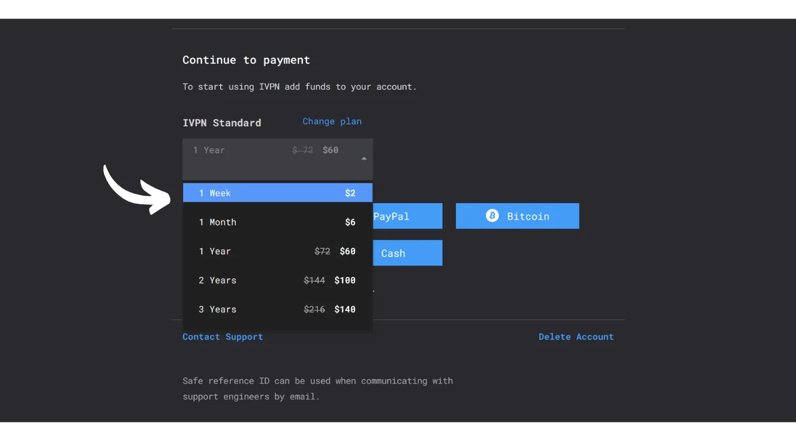
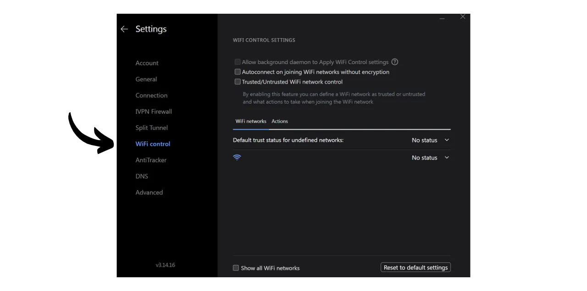

VPN（*虚拟私人网络*）是一项服务，它在您的手机或计算机与VPN提供商管理的远程服务器之间建立一个安全且加密的连接。

技术上讲，连接到VPN时，您的互联网流量会通过一个加密隧道重定向到VPN服务器。这个过程使得第三方，如互联网服务提供商（ISPs）或恶意行为者，难以拦截或读取您的数据。然后VPN服务器充当中介，代表您连接到您希望使用的服务。它为您的连接分配一个新的IP地址，这有助于隐藏您访问的网站的真实IP地址。然而，与一些在线广告可能暗示的相反，使用VPN并不允许您匿名浏览互联网，因为这需要对VPN提供商有一定的信任，VPN提供商可以看到您的所有流量。

使用VPN的好处有很多。首先，它保护了您的在线活动隐私，不受ISPs或政府的侵扰，前提是VPN提供商不共享您的信息。其次，它保护了您的数据，特别是当您连接到公共Wi-Fi网络时，这些网络容易受到MITM（中间人）攻击。第三，通过隐藏您的IP地址，VPN允许您绕过地理限制和审查，访问在您所在地区否则无法获得或被封锁的内容。

正如您所见，VPN将流量观察的风险转移到了VPN提供商身上。因此，在选择VPN提供商时，考虑注册所需的个人数据是很重要的。如果提供商要求提供诸如电话号码、电子邮件地址、银行卡详细信息，或更糟的是，您的邮政地址等信息，将您的身份与您的流量关联起来的风险就增加了。如果提供商遭到妥协或法律查封，将您的流量与您的个人数据关联起来将会很容易。因此，建议选择一个不需要任何个人数据并接受匿名支付的提供商，比如使用比特币。

在本教程中，我将介绍一个简单、高效、价格合理的VPN解决方案，它不需要使用任何个人信息。

## 介绍IVPN

IVPN是一项专为寻求隐私形式的用户设计的VPN服务。与经常在YouTube上推广的流行VPN提供商不同，IVPN以其透明度、安全性和对隐私的尊重而脱颖而出。
IVPN的隐私政策非常严格：注册时不需要提供任何个人信息。您可以在不提供电子邮件地址、姓名或电话号码的情况下开设账户。对于支付，不需要输入信用卡详细信息，因为IVPN接受比特币支付（链上和闪电网络）。此外，IVPN声称不保留任何活动日志，这意味着，理论上，您的互联网流量不会被公司记录。
IVPN还是[完全开源的](https://github.com/ivpn)，包括其软件、应用程序甚至他们的网站，允许任何人验证和审查他们的代码。他们还每年进行独立的安全审计，其结果发布在他们的网站上。

IVPN专门使用自托管服务器，从而消除了使用第三方云服务（如AWS、Google Cloud或Microsoft Azure）相关的风险。

该服务提供许多高级功能，例如多跳，它通过位于不同司法管辖区的多个服务器路由流量以提高匿名性。IVPN还集成了跟踪器和广告拦截器，并提供选择不同VPN协议的选项。
自然地，这种服务质量是有成本的，但适当的价格往往是质量和诚信的指标。这可能表明该公司拥有一个不需要出售个人数据的商业模式。IVPN提供两种类型的计划：标准计划，允许连接最多2个设备；以及专业计划，允许最多7个连接，并包括“*多跳*”协议，该协议通过多个服务器路由您的流量。

与主流VPN提供商不同，IVPN采用的是购买服务访问时间的模式，而不是基于周期性订阅。您一次性用比特币支付所选时长。例如，如果您购买了一年的访问权限，您可以在该期间使用服务，之后您需要返回IVPN网站购买更多的访问时间。

[IVPN价格](https://www.ivpn.net/en/pricing/)根据购买的访问时长而递增。以下是标准计划的价格：
- 1周：$2
- 1个月：$6
- 1年：$60
- 2年：$100
- 3年：$140

专业计划的价格为：
- 1周：$4
- 1个月：$10
- 1年：$100
- 2年：$160
- 3年：$220

## 如何在电脑上安装IVPN？
下载适用于您操作系统的[最新版本软件](https://www.ivpn.net/en/apps-windows/)，然后按照安装向导中的步骤进行安装。
对于Linux用户，请参考[此页面](https://www.ivpn.net/en/apps-linux/)上针对您发行版的特定说明。

安装完成后，您需要输入您的账户ID。我们将在本教程的后续部分看到如何获取它。

## 如何在智能手机上安装IVPN？

从您的应用商店下载IVPN，无论是iOS用户的[AppStore](https://apps.apple.com/us/app/ivpn-secure-vpn-for-privacy/id1193122683)，Android用户的[Google Play商店](https://play.google.com/store/apps/details?id=net.ivpn.client)，还是[F-Droid](https://f-droid.org/en/packages/net.ivpn.client)。如果您使用的是Android，您还可以选择直接从[IVPN网站](https://www.ivpn.net/en/apps-android/)下载`.apk`文件。

首次使用应用时，您将被登出。您需要输入您的账户ID以激活服务。

现在，让我们继续在您的设备上激活IVPN。

## 如何支付并激活IVPN？

前往IVPN官方网站的[支付页面](https://www.ivpn.net/en/pricing/)。

选择最适合您需求的计划。对于本教程，我们将选择标准计划，这样我们就可以在我们的电脑和智能手机上激活VPN，例如。

IVPN将会创建您的账户。您无需提供任何个人数据。只需通过您的账户ID登录即可。它有点像一个访问密钥。请将其保存在像密码管理器这样的安全地方。您也可以制作一份纸质副本。
在同一页面，选择您订阅服务的时长。

然后选择您的支付方式。就我而言，我将通过闪电网络进行支付，所以我点击了“*比特币*”按钮。

检查一切是否符合您的喜好，然后点击“*通过闪电支付*”按钮。

他们的BTCPay服务器上会向您展示一个闪电网络发票。用您的闪电钱包扫描二维码并继续支付。
 一旦发票支付完成，点击“*返回IVPN*”按钮。

您的账户现在显示为“*激活*”，您可以看到您访问VPN的有效日期。过了这个日期，您需要续费。

要通过IVPN在您的PC上激活连接，只需复制您的账户ID。

并将其粘贴到您之前下载的软件中。

然后点击“*登录*”按钮。

点击勾选标记以激活VPN连接，就这样，您的电脑的互联网流量现在通过IVPN服务器加密和路由了。

对于您的智能手机，程序是相同的。粘贴您的账户ID或扫描与您的IVPN账户相关联的二维码，该二维码可从网站访问。然后，点击勾选标记以建立连接。

## 如何使用和配置IVPN？

在使用和设置方面，这是相当简单的。从主界面，您可以简单地使用勾选标记来激活或停用连接。

您还可以选择暂停您的VPN一段特定的时间。

通过点击当前服务器，您可以从可用的服务器中选择另一个服务器。

也可以激活或停用集成的防火墙以及反追踪功能。

要访问额外的设置，请点击设置图标。

在“*账户*”标签页中，您将找到与您的账户相关的设置。

在“*通用*”标签页中，有几个客户端设置。我建议您在“*自动连接*”部分勾选“*登录时启动*”和“*启动时*”选项，以便在启动机器时自动建立与VPN的连接。

在“*连接*”标签页中，您将找到与连接相关的各种选项。这里您可以更改使用的VPN协议。
“*IVPN 防火墙*”标签页允许您在计算机启动时系统性地激活防火墙，确保不会在VPN之外建立任何连接。

“*分流*”标签页提供了将某些软件排除在VPN连接之外的可能性。添加到此处的应用程序即使在VPN启用时也将继续通过正常的互联网连接操作。

在“*WiFi 控制*”标签页中，您可以根据您连接到的网络配置特定操作。例如，您可以将您的家庭网络指定为“*可信任的*”，并配置VPN在此网络上不激活，但在任何其他WiFi网络上自动激活。

在“*反追踪器*”菜单中，选择您的反追踪器的阻止配置文件。这旨在通过阻止对追踪服务的请求来阻止广告、恶意软件和数据追踪器，从而在您浏览互联网时增强您的隐私。这通过防止公司收集和销售您的浏览数据来增强您的隐私。还提供了一个“*极限模式*”，以完全阻止所有属于Google和Meta的域名以及所有依赖服务。

现在您已经准备好充分享受IVPN了。如果您还想通过使用本地密码管理器来增强您在线账户的安全性，我邀请您查看我们关于KeePass的教程，这是一个免费且开源的解决方案：

https://planb.network/tutorials/others/keepass

如果您对发现另一个类似于IVPN的VPN提供商感兴趣，无论是在功能还是定价方面，我还推荐您查看我们关于Mullvad的教程：

https://planb.network/tutorials/others/mullvad