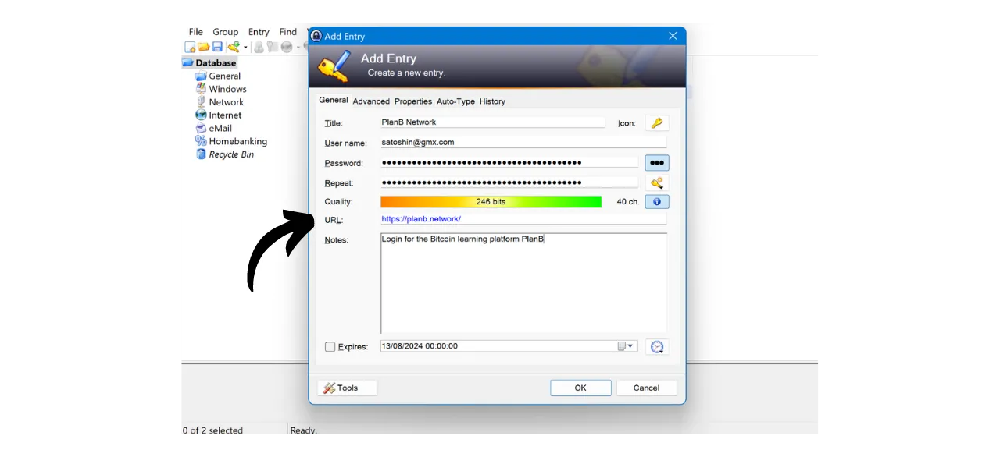
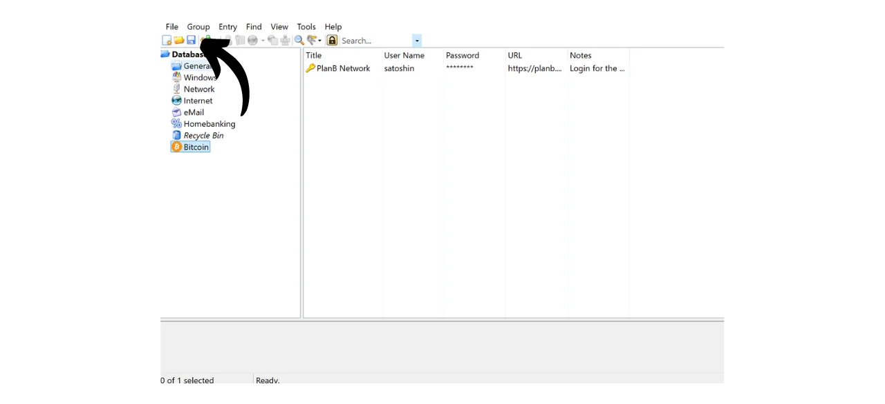

V digitálním věku potřebujeme spravovat množství online účtů, které pokrývají různé aspekty našeho každodenního života, včetně bankovnictví, finančních platforem, emailů, úložiště souborů, zdraví, administrativy, sociálních sítí, videoher atd.

Pro autentizaci na každém z těchto účtů používáme identifikátor, často emailovou adresu, doprovázenou heslem. Vzhledem k nemožnosti zapamatovat si velké množství unikátních hesel by někdo mohl být lákán k opětovnému použití stejného hesla nebo k jeho mírné modifikaci na společném základu, aby si ho bylo snazší zapamatovat. Tyto praktiky však vážně ohrožují bezpečnost vašich účtů.

Prvním principem, kterého bychom se měli držet u hesel, je jejich neopakování. Každý online účet by měl být chráněn unikátním a zcela odlišným heslem. To je důležité, protože pokud útočník dokáže kompromitovat jedno z vašich hesel, nechcete, aby měl přístup ke všem vašim účtům. Mít unikátní heslo pro každý účet izoluje potenciální útoky a omezuje jejich rozsah. Například, pokud používáte stejné heslo pro platformu videoher a pro váš email, a toto heslo je kompromitováno prostřednictvím phishingové stránky související s herní platformou, útočník by pak mohl snadno získat přístup k vašemu emailu a ovládnout všechny vaše další online účty.

Druhým zásadním principem je síla hesla. Heslo je považováno za silné, pokud je těžké ho uhodnout metodou pokus-omyl. To znamená, že vaše hesla musí být co nejvíce náhodná, dlouhá a obsahovat různorodé znaky (malá písmena, velká písmena, čísla a symboly).

Aplikace těchto dvou principů bezpečnosti hesel (unikátnost a robustnost) se může v každodenním životě ukázat jako obtížná, jelikož je téměř nemožné si zapamatovat unikátní, náhodné a silné heslo pro všechny naše účty. Zde přichází na řadu správce hesel.

Správce hesel generuje a bezpečně ukládá silná hesla, což vám umožňuje přistupovat ke všem vašim online účtům bez nutnosti je individuálně pamatovat. Potřebujete si zapamatovat pouze jedno heslo, hlavní heslo, které vám dává přístup ke všem vašim uloženým heslům ve správci. Používání správce hesel zvyšuje vaši online bezpečnost, protože brání opětovnému použití hesel a systematicky generuje náhodná hesla. Ale také zjednodušuje vaše každodenní používání účtů centralizací přístupu k vašim citlivým informacím.
V tomto tutoriálu se naučíme, jak nastavit a používat lokální správce hesel pro zvýšení vaší online bezpečnosti. Zde vám představím KeePass. Pokud jste však začátečník a chtěli byste mít online správce hesel schopného synchronizace napříč více zařízeními, doporučuji následovat náš tutoriál na Bitwarden:
https://planb.network/tutorials/others/bitwarden

---

*Pozor: Správce hesel je skvělý pro ukládání hesel, ale **nikdy byste v něm neměli ukládat mnemonickou frázi vaší Bitcoinové peněženky!** Pamětujte, mnemonická fráze by měla být výhradně uložena ve fyzickém formátu, jako je kus papíru nebo kovu.*

---

## Úvod do KeePass

KeePass je bezplatný a open-source správce hesel, ideální pro ty, kteří chtějí bezplatné a bezpečné řešení pro lokální správu. Je to software, který se instaluje na váš PC a bez přidání pluginů nekomunikuje s internetem. To je zásadně odlišný přístup od Bitwardenu, který jsme pokryli v předchozím tutoriálu. Bitwarden, na rozdíl od KeePassu, umožňuje synchronizaci napříč více zařízeními a tedy vyžaduje ukládání vašich hesel na online server.
Ve výchozím nastavení KeePass nepodporuje používání rozšíření prohlížeče, jako je Bitwarden; proto budete muset ručně kopírovat a vkládat svá hesla z programu. Ačkoli se to může zdát jako omezení, kopírování a vkládání hesel místo používání automatického vyplňování je dobrá praxe pro vaši online bezpečnost.
KeePass je navržen tak, aby byl jak lehký, tak snadno použitelný, přičemž dodržuje vysoké bezpečnostní standardy. Software šifruje vaši databázi lokálně pro optimální ochranu vašich přihlašovacích údajů. KeePass je také jediný správce hesel ověřený ANSSI (francouzským úřadem pro kybernetickou bezpečnost).

Jednou z hlavních výhod KeePass je jeho flexibilita. Lze jej používat mnoha různými způsoby, například na USB klíči bez nutnosti instalace na počítači. Navíc díky jeho [prostředí pro pluginy](https://keepass.info/plugins.html) lze KeePass přizpůsobit pro splnění specifičtějších potřeb.

## Jak stáhnout KeePass?

Proces instalace KeePass se liší v závislosti na operačním systému, který používáte. Pro uživatele Windows nebo Linuxu je instalace poměrně jednoduchá. Pokud však používáte macOS, je nutný dodatečný krok kvůli vývoji KeePass na platformě .NET, která není přímo podporována macOS. Proto budete muset nakonfigurovat kompatibilní prostředí, aby KeePass mohl běžet na zařízeních Apple.

Pro uživatele Debian/Ubuntu otevřete terminál a zadejte následující příkazy:

```bash
sudo apt-get update
sudo apt-get install keepass2
```

Pro Fedora:

```bash
sudo dnf install keepass
```

Pro Arch Linux:

```bash
sudo pacman -S keepass
```

Pokud používáte počítač s Windows, přejděte na [oficiální stránku ke stažení KeePass](https://keepass.info/download.html) a stáhněte nejnovější verzi instalátoru:

Klikněte na stažený soubor, aby se spustil, a poté postupujte podle pokynů instalačního průvodce k dokončení instalace (viz další sekce).

Pro uživatele macOS je instalace trochu složitější. Pokud si přejete používat původní verzi KeePass jako na Windows, postupujte podle níže uvedených pokynů. Jinak můžete zvolit [KeePassXC](https://keepassxc.org/), alternativní verzi kompatibilní s macOS, která nabízí mírně odlišné rozhraní.

Pro použití KeePass budete potřebovat běhové prostředí pro aplikace .NET. Doporučuji nainstalovat Mono. Přejděte na [oficiální stránku Mono](https://www.mono-project.com/download/stable/#download-mac) v sekci "*macOS*" a klikněte na odkaz ke stažení instalačního balíčku (`.pkg`).

Otevřete stažený soubor `.pkg` a postupujte podle pokynů k instalaci Mono na vašem Macu.

Dále přejděte na oficiální webové stránky KeePass a stáhněte nejnovější přenosnou verzi ve formátu `.zip`.

Po stažení souboru `.zip` na něj dvakrát klikněte, aby se extrahoval. Získáte složku obsahující několik souborů, včetně `KeePass.exe`. Otevřete terminál, přejděte do složky KeePass (nahraďte `xx` číslem verze):

```bash
cd ~/Downloads/KeePass-2.xx
```

A nakonec spusťte KeePass s Mono:

```bash
mono KeePass.exe
```

## Jak nainstalovat KeePass?

Při prvním spuštění si můžete vybrat jazyk rozhraní.

Přijměte podmínky licence.

Vyberte složku, do které bude KeePass nainstalován.

Volitelně můžete upravit komponenty aplikace, které budou nainstalovány. Pokud máte dostatek místa, můžete jednoduše zvolit "*Plnou instalaci*".

A nakonec si můžete vybrat, zda přidáte na plochu zástupce.

Klikněte na tlačítko "*Instalovat*".

Počkejte během instalace, poté klikněte na tlačítko "*Dokončit*".

## Jak nakonfigurovat KeePass?

Nyní se dostanete do rozhraní KeePass.
Pro vytvoření vaší první databáze klikněte na záložku "*Soubor*".

Poté na menu "*Nový*".

Software vytvoří novou databázi, kde budou uložena vaše hesla. Musíte vybrat umístění pro tuto složku. Vyberte místo, které je snadno dostupné.

Poté byste měli pravidelně zálohovat tuto složku, abyste předešli ztrátě vašich přihlašovacích údajů v případě ztráty, poškození nebo krádeže vašeho počítače. Například byste mohli kopírovat databázi na USB klíč každý týden. Soubor obsahující vaši databázi se jmenuje `Database.kdbx` (dokument je šifrován vaším hlavním heslem). Pro další rady ohledně nejlepších zálohovacích postupů doporučuji také konzultovat tento další návod:

https://planb.network/tutorials/others/proton-drive

Následuje výběr vašeho hlavního hesla.

Jak jsme viděli v úvodu, toto heslo je velmi důležité, protože vám umožňuje přístup ke všem vašim ostatním uloženým heslům v databázi. Toto heslo bude použito k šifrování databáze `Database.kdbx`. Představuje dva hlavní rizika: ztrátu a kompromitaci. Pokud ztratíte přístup k tomuto heslu, již nebudete moci přistupovat ke všem vašim přihlašovacím údajům. Pokud je vaše heslo ukradeno, útočník bude moci kromě šifrované databáze přistupovat ke všem vašim účtům.

Aby se minimalizovalo riziko ztráty, doporučuji udělat fyzickou zálohu vašeho hlavního hesla na papíře a uložit ji na bezpečném místě. Pokud je to možné, zapečetěte tuto zálohu do bezpečné obálky, abyste pravidelně zajišťovali, že k ní nikdo jiný neměl přístup.

Aby se předešlo kompromitaci vašeho hlavního hesla, musí být mimořádně robustní. Mělo by být co nejdelší, používat širokou škálu znaků a být vybráno náhodně. V roce 2024 jsou minimální doporučení pro bezpečné heslo 13 znaků včetně čísel, malých a velkých písmen, stejně jako symbolů, za předpokladu, že je heslo skutečně náhodné. Nicméně, doporučuji zvolit heslo o délce alespoň 20 znaků, včetně všech možných typů znaků, aby byla jeho bezpečnost zajištěna na delší dobu.

Zadejte své hlavní heslo do příslušného pole a potvrďte ho v následujícím poli, poté klikněte na "*OK*".

Pojmenujte svou databázi a přidejte popis, pokud je to nutné. To vám může pomoci rozlišit mezi různými databázemi, pokud jich vytvoříte více, například jednu pro osobní použití a další pro profesionální použití.

Pro ostatní nastavení doporučuji ponechat výchozí možnosti. Poté klikněte na tlačítko "*OK*".
KeePass poté nabídne vytisknout nouzový list.

Na tomto listu najdete umístění vaší databáze ve vašich souborech, místo pro ruční zapsání vašeho hlavního hesla, stejně jako instrukce pro jeho přístup. Tento list by měl být svěřen důvěryhodným osobám, jelikož umožňuje obnovu přístupu k vašim přihlašovacím údajům v případě problému.

Nicméně, vzhledem k tomu, že tento list poskytuje přístup k vašim heslům odhalením vašeho hlavního hesla, musí být používán s opatrností. Doporučuje se jej uchovávat alespoň v zapečetěné obálce, což umožňuje pravidelné kontroly, zda nebyl konzultován. Nejste povinni tento list používat a můžete zvážit jiné metody zálohování pro vaše blízké.

Poté můžete přistoupit k vašemu správci hesel.

Než začnete ukládat vaše přihlašovací údaje, doporučuji změnit nastavení generování hesel. K tomu přejděte na záložku "*Nástroje*" a vyberte "*Generovat heslo...*".

Zde vám radím zvýšit délku generovaných hesel na 40 znaků. Nyní, když máte správce hesel, který si je pro vás pamatuje, není důvod šetřit na počtu znaků. Navíc, nemusíte hesla zapisovat ručně, protože je můžete kopírovat a vkládat. Takže pro vás není rozdíl mít velmi dlouhá hesla o 40 znacích, nicméně, jejich bezpečnost je tím výrazně zvýšena. Doporučuji to udělat, a také zaškrtnout políčko pro speciální znaky.

Potvrďte kliknutím na malou ikonu uložení.

Přidejte název vašemu profilu hesel.

## Jak zabezpečit vaše účty s KeePassem?

Pro registraci nového přihlašovacího údaje ve vašem správci KeePass, jednoduše klikněte na ikonu klíče se zelenou šipkou.

V okně pro generování a ukládání klikněte na malou ikonu klíče a vyberte váš profil hesla o 40 znacích.

Zadejte uživatelské jméno pro tento účet spolu s názvem pro snadné vyhledání ve vaší databázi.  Je také možné přidat URL, pokud chcete později používat zkratky, a pokud je to nutné, poznámku.  Pokud je vše k vaší spokojenosti, klikněte na "*OK*" pro uložení hesla.  Své heslo najdete na domovské stránce vašeho správce KeePass.  Pro zkopírování hesla stačí na něj dvojitě kliknout. Zůstane ve vaší schránce po dobu 12 sekund, což vám umožní vložit ho na webovou stránku při vašem příštím přihlášení.  Pokud si přejete prodloužit dobu, po kterou zůstane heslo ve schránce, klikněte na záložku "*Nástroje*", poté na "*Možnosti...*".  V záložce "*Bezpečnost*" upravte dobu změnou počtu sekund v poli "*Čas automatického vymazání schránky*". Poté klikněte na "*OK*" pro uložení vašich změn.  Na levé straně vašeho rozhraní si všimnete, že existuje několik složek pro organizaci vašich hesel.  Máte možnost smazat výchozí složky nebo přidat nové pravým kliknutím a výběrem "*Přidat skupinu...*".  Zvolte název pro novou složku a vyberte ikonu. Můžete také importovat vlastní ikony ve formátu `.ico`. Poté klikněte na tlačítko "*OK*" pro dokončení vytvoření složky.  Vaše složka se objeví vlevo.  Pro přidání hesla do složky jednoduše přetáhněte z databáze do požadované složky.  Tato funkce vám pomáhá organizovat váš správce hesel a snadněji nalézt vaše přihlašovací údaje.
Další metoda, jak najít heslo, je použití vyhledávací funkce. Do vyhledávacího pole umístěného v horní části rozhraní napište název identifikátoru, který chcete najít, a přímo se k němu dostanete.  Buďte opatrní, protože KeePass funguje trochu jako textový dokument. Před zavřením aplikace, pokud jste do svého správce přidali nové položky, nezapomeňte databázi uložit. Můžete to udělat kliknutím na ikonu uložení nebo použitím klávesové zkratky `Ctrl+S`. 
Pokud necháte KeePass otevřený na pozadí, software se standardně nezavře. Pokud však KeePass zavřete nebo vypnete počítač, budete muset při opětovném otevření softwaru zadat své hlavní heslo pro dešifrování vaší databáze. 
To pokrývá základní funkce KeePass. Samozřejmě, tento tutoriál určený pro začátečníky pouze lehce pokryl mnoho dostupných možností tohoto softwaru. Existuje mnoho dalších funkcí k prozkoumání, nemluvě o [všech pluginech vyvinutých komunitou](https://keepass.info/plugins.html), které mohou dále rozšířit možnosti KeePass.

Pokud máte zájem dozvědět se, jak výrazně zlepšit bezpečnost vašich online účtů a vyhnout se hackování s 2FA, doporučuji také prohlédnout tento další tutoriál:

https://planb.network/tutorials/others/authy