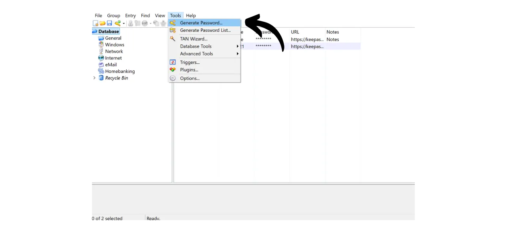
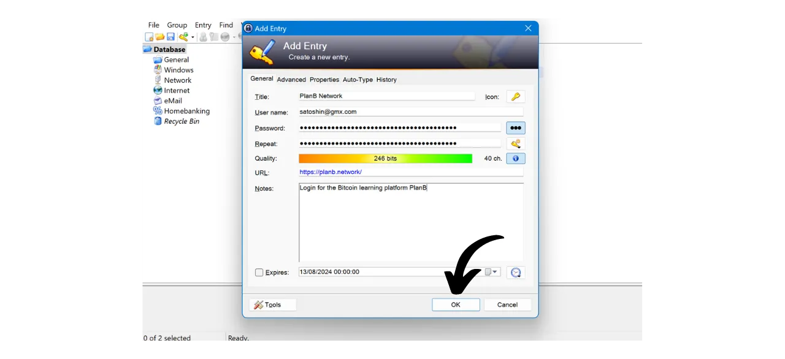
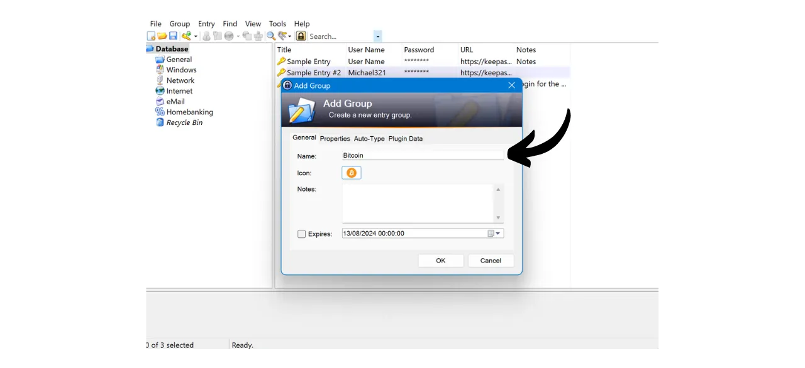

Im digitalen Zeitalter müssen wir eine Vielzahl von Online-Konten verwalten, die verschiedene Aspekte unseres täglichen Lebens abdecken, einschließlich Bankwesen, Finanzplattformen, E-Mails, Dateispeicherung, Gesundheit, Verwaltung, soziale Netzwerke, Videospiele usw.

Um uns bei jedem dieser Konten zu authentifizieren, verwenden wir einen Identifikator, oft eine E-Mail-Adresse, begleitet von einem Passwort. Angesichts der Unmöglichkeit, sich eine große Anzahl einzigartiger Passwörter zu merken, könnte man versucht sein, dasselbe Passwort wiederzuverwenden oder eine gemeinsame Basis leicht zu modifizieren, um es leichter merkbar zu machen. Diese Praktiken gefährden jedoch ernsthaft die Sicherheit Ihrer Konten.

Das erste Prinzip für Passwörter ist, sie nicht wiederzuverwenden. Jedes Online-Konto sollte durch ein einzigartiges und völlig unterschiedliches Passwort geschützt sein. Dies ist wichtig, denn wenn ein Angreifer eines Ihrer Passwörter kompromittieren kann, möchten Sie nicht, dass er Zugang zu all Ihren Konten hat. Ein einzigartiges Passwort für jedes Konto zu haben, isoliert potenzielle Angriffe und begrenzt deren Reichweite. Wenn Sie beispielsweise dasselbe Passwort für eine Videospieleplattform und für Ihre E-Mail verwenden und dieses Passwort über eine Phishing-Seite im Zusammenhang mit der Spieleplattform kompromittiert wird, könnte der Angreifer dann leicht auf Ihre E-Mail zugreifen und die Kontrolle über alle Ihre anderen Online-Konten übernehmen.

Das zweite wesentliche Prinzip ist die Stärke des Passworts. Ein Passwort gilt als stark, wenn es schwer durch Brute-Force, also durch Ausprobieren, zu erraten ist. Das bedeutet, dass Ihre Passwörter so zufällig wie möglich, lang und mit einer Vielfalt an Zeichen (Kleinbuchstaben, Großbuchstaben, Zahlen und Symbole) sein müssen.

Diese beiden Sicherheitsprinzipien für Passwörter (Einzigartigkeit und Robustheit) im Alltag anzuwenden, kann schwierig sein, da es fast unmöglich ist, sich ein einzigartiges, zufälliges und starkes Passwort für all unsere Konten zu merken. Hier kommt der Passwortmanager ins Spiel.

Ein Passwortmanager generiert und speichert sicher starke Passwörter und ermöglicht Ihnen den Zugriff auf alle Ihre Online-Konten, ohne dass Sie sich diese einzeln merken müssen. Sie müssen sich nur ein Passwort merken, das Master-Passwort, das Ihnen Zugang zu allen Ihren im Manager gespeicherten Passwörtern gibt. Die Verwendung eines Passwortmanagers verbessert Ihre Online-Sicherheit, da sie die Wiederverwendung von Passwörtern verhindert und systematisch zufällige Passwörter generiert. Aber es vereinfacht auch Ihre tägliche Nutzung Ihrer Konten, indem es den Zugang zu Ihren sensiblen Informationen zentralisiert.
In diesem Tutorial werden wir lernen, wie man einen lokalen Passwortmanager einrichtet und verwendet, um Ihre Online-Sicherheit zu verbessern. Hier werde ich Ihnen KeePass vorstellen. Wenn Sie jedoch ein Anfänger sind und einen Online-Passwortmanager wünschen, der eine Synchronisierung über mehrere Geräte hinweg ermöglicht, empfehle ich, unserem Tutorial zu Bitwarden zu folgen:
https://planb.network/tutorials/others/bitwarden

---

*Vorsicht: Ein Passwortmanager ist großartig für die Speicherung von Passwörtern, aber **Sie sollten niemals die mnemonische Phrase Ihres Bitcoin-Wallets darin speichern!** Denken Sie daran, eine mnemonische Phrase sollte ausschließlich in einem physischen Format gespeichert werden, wie einem Stück Papier oder Metall.*

---

## Einführung in KeePass

KeePass ist ein kostenloser und Open-Source-Passwortmanager, perfekt für diejenigen, die eine kostenlose und sichere Lösung für die lokale Verwaltung suchen. Es ist eine Software, die auf Ihrem PC installiert wird und ohne Hinzufügung von Plugins nicht mit dem Internet kommuniziert. Dies ist ein radikal anderer Ansatz als der von Bitwarden, den wir in einem vorherigen Tutorial behandelt haben. Bitwarden ermöglicht im Gegensatz zu KeePass die Synchronisierung über mehrere Geräte und erfordert daher die Speicherung Ihrer Passwörter auf einem Online-Server.
Standardmäßig unterstützt KeePass nicht die Verwendung von Browsererweiterungen wie Bitwarden; daher müssen Sie Ihre Passwörter manuell aus der Software kopieren und einfügen. Obwohl dies wie eine Einschränkung erscheinen mag, ist das Kopieren und Einfügen von Passwörtern anstelle der Verwendung von Auto-Fill eine gute Praxis für Ihre Online-Sicherheit.
KeePass ist so konzipiert, dass es sowohl leichtgewichtig als auch einfach zu bedienen ist, während es hohen Sicherheitsstandards entspricht. Die Software verschlüsselt Ihre Datenbank lokal, um optimalen Schutz Ihrer Zugangsdaten zu gewährleisten. KeePass ist auch der einzige Passwortmanager, der von der ANSSI (der französischen Cybersicherheitsbehörde) validiert wurde.

Einer der Hauptvorteile von KeePass ist seine Flexibilität. Es kann auf viele verschiedene Arten verwendet werden, wie zum Beispiel auf einem USB-Stick ohne die Notwendigkeit einer Installation auf einem Computer. Darüber hinaus kann KeePass dank seiner [Plugin-Umgebung](https://keepass.info/plugins.html) angepasst werden, um spezifischere Bedürfnisse zu erfüllen.

## Wie lädt man KeePass herunter?

Der Installationsprozess für KeePass variiert je nach dem Betriebssystem, das Sie verwenden. Für Windows- oder Linux-Benutzer ist die Installation relativ unkompliziert. Wenn Sie jedoch macOS verwenden, ist ein zusätzlicher Schritt notwendig, da KeePass auf der .NET-Plattform entwickelt wurde, die nicht direkt von macOS unterstützt wird. Daher müssen Sie eine kompatible Umgebung konfigurieren, um KeePass auf Apple-Geräten ausführen zu können.

Für Debian/Ubuntu-Benutzer, öffnen Sie das Terminal und geben Sie die folgenden Befehle ein:

```bash
sudo apt-get update
sudo apt-get install keepass2
```

Für Fedora:

```bash
sudo dnf install keepass
```

Für Arch Linux:

```bash
sudo pacman -S keepass
```

Wenn Sie einen Windows-Computer verwenden, gehen Sie zur [offiziellen KeePass-Downloadseite](https://keepass.info/download.html) und laden Sie die neueste Version des Installationsprogramms herunter:

Klicken Sie auf die heruntergeladene Datei, um sie auszuführen, und folgen Sie den Anweisungen des Setup-Assistenten, um die Installation abzuschließen (siehe nächster Abschnitt).

Für macOS-Benutzer ist die Installation etwas komplexer. Wenn Sie die Originalversion von KeePass wie unter Windows verwenden möchten, folgen Sie den untenstehenden Anweisungen. Andernfalls können Sie sich für [KeePassXC](https://keepassxc.org/) entscheiden, eine alternative Version, die mit macOS kompatibel ist und eine leicht abweichende Benutzeroberfläche bietet.

Um KeePass zu verwenden, benötigen Sie eine Laufzeitumgebung für .NET-Anwendungen. Ich empfehle die Installation von Mono dafür. Gehen Sie zur [offiziellen Mono-Seite](https://www.mono-project.com/download/stable/#download-mac) im Abschnitt "*macOS*" und klicken Sie auf den Link, um das Installationspaket (`.pkg`) herunterzuladen.

Öffnen Sie die heruntergeladene `.pkg`-Datei und folgen Sie den Anweisungen, um Mono auf Ihrem Mac zu installieren.

Gehen Sie anschließend zur offiziellen KeePass-Website und laden Sie die neueste portable Version im `.zip`-Format herunter.

Nachdem Sie die `.zip`-Datei heruntergeladen haben, doppelklicken Sie darauf, um sie zu extrahieren. Sie erhalten einen Ordner mit mehreren Dateien, einschließlich `KeePass.exe`. Öffnen Sie ein Terminal, navigieren Sie zum KeePass-Ordner (ersetzen Sie `xx` durch die Versionsnummer):

```bash
cd ~/Downloads/KeePass-2.xx
```

Und schließlich führen Sie KeePass mit Mono aus:

```bash
mono KeePass.exe
```

## Wie installiert man KeePass?

Beim ersten Start können Sie die Benutzeroberflächensprache wählen.

Akzeptieren Sie die Bedingungen der Lizenz. 
Wählen Sie den Ordner, in dem KeePass installiert werden soll.

Optional können Sie die Komponenten der Anwendung, die installiert werden, anpassen. Wenn Sie genügend Speicherplatz haben, können Sie einfach "*Vollinstallation*" wählen.

Und schließlich können Sie wählen, ob Sie eine Verknüpfung auf Ihrem Desktop hinzufügen möchten.

Klicken Sie auf den Button "*Installieren*".

Warten Sie während der Installation und klicken Sie dann auf den Button "*Fertigstellen*".

## Wie konfiguriert man KeePass?

Sie gelangen nun zur KeePass-Oberfläche.
Um Ihre erste Datenbank zu erstellen, klicken Sie auf den Tab "*Datei*".

Dann auf das Menü "*Neu*".

Die Software wird eine neue Datenbank erstellen, in der Ihre Passwörter gespeichert werden. Sie müssen den Speicherort für diesen Ordner auswählen. Wählen Sie einen Ort, der leicht zugänglich ist.

Danach sollten Sie daran denken, diesen Ordner regelmäßig zu sichern, um den Verlust Ihrer Zugangsdaten im Falle eines Verlusts, Schadens oder Diebstahls Ihres Computers zu vermeiden. Sie könnten beispielsweise jede Woche die Datenbank auf einen USB-Stick kopieren. Die Datei, die Ihre Datenbank enthält, heißt `Database.kdbx` (das Dokument ist mit Ihrem Hauptpasswort verschlüsselt). Für weitere Ratschläge zu den besten Backup-Praktiken empfehle ich auch, dieses andere Tutorial zu konsultieren:

https://planb.network/tutorials/others/proton-drive

Als Nächstes kommt die Wahl Ihres Hauptpassworts.

Wie wir in der Einleitung gesehen haben, ist dieses Passwort sehr wichtig, da es Ihnen Zugang zu allen Ihren anderen gespeicherten Passwörtern in der Datenbank gibt. Dieses Passwort wird verwendet, um die `Database.kdbx`-Datenbank zu verschlüsseln. Es birgt zwei Hauptgefahren: Verlust und Kompromittierung. Wenn Sie den Zugang zu diesem Passwort verlieren, werden Sie nicht mehr auf all Ihre Zugangsdaten zugreifen können. Wenn Ihr Passwort gestohlen wird, kann der Angreifer zusätzlich zur verschlüsselten Datenbank auf all Ihre Konten zugreifen.

Um das Risiko eines Verlusts zu minimieren, empfehle ich, eine physische Sicherung Ihres Hauptpassworts auf Papier zu machen und an einem sicheren Ort aufzubewahren. Wenn möglich, versiegeln Sie diese Sicherung in einem sicheren Umschlag, um regelmäßig sicherzustellen, dass niemand anderes darauf zugegriffen hat.

Um die Kompromittierung Ihres Hauptpassworts zu verhindern, muss es extrem robust sein. Es sollte so lang wie möglich sein, eine breite Vielfalt an Zeichen verwenden und zufällig gewählt werden. Im Jahr 2024 sind die Mindestempfehlungen für ein sicheres Passwort 13 Zeichen, einschließlich Zahlen, Klein- und Großbuchstaben sowie Symbole, vorausgesetzt, das Passwort ist wirklich zufällig. Ich empfehle jedoch, ein Passwort von mindestens 20 Zeichen zu wählen, das alle möglichen Arten von Zeichen enthält, um seine Sicherheit länger zu gewährleisten.

Geben Sie Ihr Hauptpasswort in das dafür vorgesehene Feld ein und bestätigen Sie es im folgenden Feld, dann klicken Sie auf "*OK*".

Benennen Sie Ihre Datenbank und fügen Sie bei Bedarf eine Beschreibung hinzu. Dies kann Ihnen helfen, zwischen verschiedenen Datenbanken zu unterscheiden, wenn Sie beispielsweise mehrere erstellen, eine für den persönlichen Gebrauch und eine andere für den beruflichen Gebrauch.

Für andere Einstellungen empfehle ich, die Standardoptionen beizubehalten. Dann klicken Sie auf den Button "*OK*".
KeePass bietet dann an, ein Notfallblatt auszudrucken.

Auf diesem Blatt finden Sie den Speicherort Ihrer Datenbank in Ihren Dateien, einen Platz, um Ihr Master-Passwort manuell zu notieren, sowie Anweisungen für den Zugriff darauf. Dieses Blatt sollte vertrauenswürdigen Personen anvertraut werden, da es die Wiederherstellung des Zugriffs auf Ihre Anmeldeinformationen im Falle eines Problems ermöglicht.

Da dieses Blatt jedoch durch Offenlegung Ihres Master-Passworts Zugang zu Ihren Passwörtern bietet, muss es mit Vorsicht verwendet werden. Es wird empfohlen, es mindestens in einem versiegelten Umschlag aufzubewahren, was regelmäßige Kontrollen ermöglicht, um sicherzustellen, dass es nicht eingesehen wurde. Sie sind nicht verpflichtet, dieses Blatt zu verwenden und können andere Backup-Methoden für Ihre Liebsten in Betracht ziehen.

Dann können Sie auf Ihren Passwort-Manager zugreifen.

Bevor Sie beginnen, Ihre Anmeldeinformationen zu speichern, empfehle ich, die Einstellungen zur Passwortgenerierung zu ändern. Gehen Sie dazu auf den Tab "*Tools*" und wählen Sie "*Generate Password...*".

Hier rate ich Ihnen, die Länge der generierten Passwörter auf 40 Zeichen zu erhöhen. Jetzt, da Sie einen Passwort-Manager haben, der sich für Sie daran erinnert, gibt es keinen Grund, bei der Anzahl der Zeichen zu sparen. Außerdem müssen Sie die Passwörter nicht von Hand aufschreiben, da Sie sie kopieren und einfügen können. Es macht also keinen Unterschied für Sie, sehr lange Passwörter von 40 Zeichen zu haben, jedoch wird deren Sicherheit dadurch erheblich verbessert. Ich rate Ihnen, dies zu tun und auch das Kästchen für Sonderzeichen anzukreuzen.

Bestätigen Sie durch Klicken auf das kleine Speicher-Symbol.

Fügen Sie einen Namen zu Ihrem Passwortprofil hinzu.

## Wie sichern Sie Ihre Konten mit KeePass?

Um eine neue Anmeldeinformation in Ihrem KeePass-Manager zu registrieren, klicken Sie einfach auf das Schlüsselsymbol mit dem grünen Pfeil.

Im Fenster für die Generierung und Speicherung klicken Sie auf das kleine Schlüsselsymbol und wählen Ihr 40-Zeichen-Passwortprofil aus.

Geben Sie den Benutzernamen für dieses Konto sowie einen Titel ein, um es leicht in Ihrer Datenbank zu finden.  Es ist auch möglich, eine URL hinzuzufügen, falls Sie später Verknüpfungen verwenden möchten, und falls notwendig, eine Notiz.  Wenn alles zu Ihrer Zufriedenheit ist, klicken Sie auf "*OK*", um das Passwort zu speichern.  Sie können Ihr Passwort auf der Startseite Ihres KeePass-Managers finden.  Um ein Passwort zu kopieren, doppelklicken Sie einfach darauf. Es bleibt 12 Sekunden lang in Ihrer Zwischenablage, sodass Sie es beim nächsten Login auf der Webseite einfügen können.  Wenn Sie die Dauer verlängern möchten, wie lange das Passwort in der Zwischenablage bleibt, klicken Sie auf den Tab "*Werkzeuge*", dann auf "*Optionen...*".  Unter dem Tab "*Sicherheit*" passen Sie die Dauer an, indem Sie die Anzahl der Sekunden im Feld "*Clipboard auto-clear time*" ändern. Klicken Sie dann auf "*OK*", um Ihre Änderungen zu speichern.  Auf der linken Seite Ihrer Schnittstelle werden Sie bemerken, dass es mehrere Ordner gibt, um Ihre Passwörter zu organisieren.  Sie haben die Möglichkeit, die Standardordner zu löschen oder neue hinzuzufügen, indem Sie mit der rechten Maustaste klicken und "*Gruppe hinzufügen...*" auswählen.  Wählen Sie einen Namen für den neuen Ordner und wählen Sie ein Symbol. Sie können auch Ihre eigenen Symbole im `.ico`-Format importieren. Klicken Sie dann auf den "*OK*" Button, um die Erstellung des Ordners abzuschließen.  Ihr Ordner erscheint auf der linken Seite.  Um ein Passwort zu einem Ordner hinzuzufügen, ziehen Sie es einfach aus der Datenbank in den gewünschten Ordner.  Diese Funktion hilft Ihnen, Ihren Passwort-Manager zu organisieren und Ihre Zugangsdaten leichter zu finden.
Eine weitere Methode, um ein Passwort zu finden, ist die Verwendung der Suchfunktion. Geben Sie den Titel des Identifikators, den Sie finden möchten, in die Suchleiste oben in der Schnittstelle ein, und Sie gelangen direkt dorthin.  Seien Sie wachsam, da KeePass ein bisschen wie ein Textdokument funktioniert. Bevor Sie die Anwendung schließen, wenn Sie neue Elemente zu Ihrem Manager hinzugefügt haben, denken Sie daran, die Datenbank zu speichern. Dies können Sie tun, indem Sie auf das Speicher-Symbol klicken oder die Tastenkombination `Strg+S` verwenden. 
Wenn Sie KeePass im Hintergrund offen lassen, wird die Software standardmäßig nicht geschlossen. Wenn Sie jedoch KeePass schließen oder Ihren Computer herunterfahren, müssen Sie Ihr Master-Passwort eingeben, um Ihre Datenbank beim Wiederöffnen der Software zu entschlüsseln. 
Das deckt die grundlegenden Funktionen von KeePass ab. Natürlich hat dieses Tutorial für Anfänger nur die Oberfläche der vielen verfügbaren Optionen dieser Software angekratzt. Es gibt eine Vielzahl von zusätzlichen Funktionen zu entdecken, ganz zu schweigen von [all den Plugins, die von der Community entwickelt wurden](https://keepass.info/plugins.html), die die Fähigkeiten von KeePass weiter erweitern können.

Wenn Sie daran interessiert sind zu lernen, wie Sie die Sicherheit Ihrer Online-Konten drastisch verbessern können, um Hacking mit 2FA zu vermeiden, empfehle ich auch, dieses andere Tutorial zu überprüfen:

https://planb.network/tutorials/others/authy