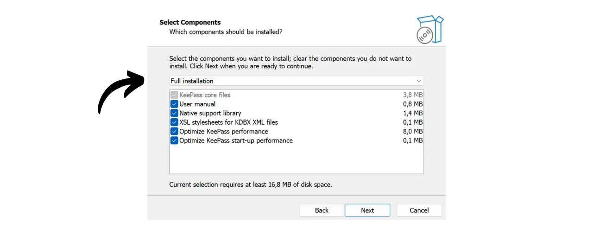
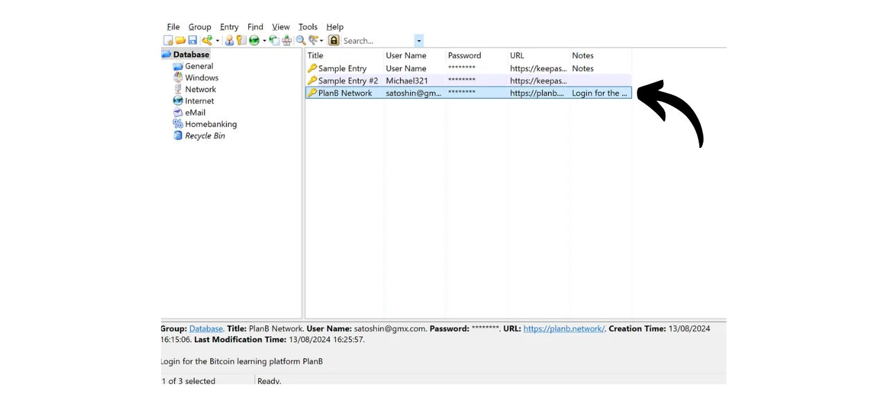
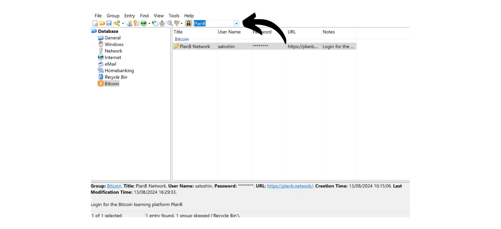

In the digital age, we need to manage a multitude of online accounts covering various aspects of our daily lives, including banking, financial platforms, emails, file storage, health, administration, social networks, video games, etc.

To authenticate ourselves on each of these accounts, we use an identifier, often an email address, accompanied by a password. Faced with the impossibility of memorizing a large number of unique passwords, one might be tempted to reuse the same password or to slightly modify a common base to make it easier to remember. However, these practices seriously compromise the security of your accounts.

The first principle to follow for passwords is not to reuse them. Each online account should be protected by a unique and completely distinct password. This is important because, if an attacker manages to compromise one of your passwords, you do not want them to have access to all your accounts. Having a unique password for each account isolates potential attacks and limits their scope. For example, if you use the same password for a video game platform and for your email, and that password is compromised via a phishing site related to the gaming platform, the attacker could then easily access your email and take control of all your other online accounts.

The second essential principle is the strength of the password. A password is considered strong if it is difficult to brute force, that is, to guess through trial and error. This means that your passwords must be as random as possible, long, and include a diversity of characters (lowercase, uppercase, numbers, and symbols).

Applying these two password security principles (uniqueness and robustness) can prove difficult in everyday life, as it is almost impossible to memorize a unique, random, and strong password for all our accounts. This is where the password manager comes into play.

A password manager generates and securely stores strong passwords, allowing you to access all your online accounts without the need to memorize them individually. You only need to remember one password, the master password, which gives you access to all your saved passwords in the manager. Using a password manager enhances your online security because it prevents the reuse of passwords and systematically generates random passwords. But it also simplifies your daily use of your accounts by centralizing access to your sensitive information.
In this tutorial, we will learn how to set up and use a local password manager to enhance your online security. Here, I will introduce you to KeePass. However, if you are a beginner and would like to have an online password manager capable of syncing across multiple devices, I recommend following our tutorial on Bitwarden:
https://planb.network/tutorials/others/bitwarden

---

*Caution: A password manager is great for storing passwords, but **you should never store your Bitcoin wallet's mnemonic phrase in it!** Remember, a mnemonic phrase should be exclusively saved in a physical format, like a piece of paper or metal.*

---

## Introduction to KeePass

KeePass is a free and open-source password manager, perfect for those who want a free and secure solution for local management. It is software to be installed on your PC that, without the addition of plugins, does not communicate with the Internet. This is a radically different approach from that of Bitwarden, which we covered in a previous tutorial. Bitwarden, unlike KeePass, allows synchronization across multiple devices and thus requires storing your passwords on an online server.

By default, KeePass does not support the use of browser extensions like Bitwarden; therefore, you will need to manually copy and paste your passwords from the software. Although this may seem like a constraint, copying and pasting passwords rather than using auto-fill is a good practice for your online security.

KeePass is designed to be both lightweight and easy to use, while adhering to high security standards. The software encrypts your database locally for optimal protection of your credentials. KeePass is also the only password manager validated by the ANSSI (the French cybersecurity authority).

One of the main advantages of KeePass is its flexibility. It can be used in many different ways, such as on a USB stick without the need for installation on a computer. Moreover, thanks to its [plugin environment](https://keepass.info/plugins.html), KeePass can be customized to meet more specific needs.

## How to Download KeePass?

The installation process for KeePass varies depending on the operating system you are using. For Windows or Linux users, the installation is relatively straightforward. However, if you are on macOS, an additional step is necessary due to KeePass's development on the .NET platform, which is not directly supported by macOS. Therefore, you will need to configure a compatible environment to allow KeePass to run on Apple devices.

For Debian/Ubuntu users, open the terminal and enter the following commands:

```bash
```bash
sudo apt-get update
sudo apt-get install keepass2
```

For Fedora:

```bash
sudo dnf install keepass
```

For Arch Linux:

```bash
sudo pacman -S keepass
```

If you are on a Windows computer, go to the [official KeePass download page](https://keepass.info/download.html), and download the latest version of the installer:

Click on the downloaded file to run it, then follow the instructions of the setup wizard to complete the installation (see next section).

For macOS users, the installation is a bit more complex. If you wish to use the original version of KeePass as on Windows, follow the instructions below. Otherwise, you can opt for [KeePassXC](https://keepassxc.org/), an alternative version compatible with macOS, which offers a slightly different interface.

To use KeePass, you will need a runtime environment for .NET applications. I recommend installing Mono for this. Go to the [official Mono page](https://www.mono-project.com/download/stable/#download-mac) in the "*macOS*" section, and click on the link to download the installation package (`.pkg`).

Open the downloaded `.pkg` file and follow the instructions to install Mono on your Mac.

Next, go to the official KeePass website and download the latest portable version in `.zip` format.

After downloading the `.zip` file, double-click to extract it. You will get a folder containing several files, including `KeePass.exe`. Open a terminal, navigate to the KeePass folder (replace `xx` with the version number):

```bash
cd ~/Downloads/KeePass-2.xx
```

And finally, run KeePass with Mono:

```bash
mono KeePass.exe
```

## How to install KeePass?

Upon the first launch, you can choose the interface language.

Accept the terms of the license.

Choose the folder where KeePass will be installed.

You may optionally modify the components of the application that are installed. If you have enough space, you can simply choose "*Full installation*".

And finally, you can choose to add a shortcut on your desktop.

Click on the "*Install*" button.

Wait during the installation, then click on the "*Finish*" button.

## How to configure KeePass?

You now arrive at your KeePass interface.
To create your first database, click on the "*File*" tab.

Then on the "*New*" menu.

The software will create a new database where your passwords will be stored. You need to select the location for this folder. Choose a location that is easily accessible.

Afterward, you should think about regularly backing up this folder to avoid losing your credentials in case of loss, damage, or theft of your computer. For example, you could copy the database onto a USB stick every week. The file containing your database is named `Database.kdbx` (the document is encrypted with your master password). For more advice on best backup practices, I also recommend consulting this other tutorial:

https://planb.network/tutorials/others/proton-drive

Next comes the choice of your master password.

As we saw in the introduction, this password is very important, as it gives you access to all your other saved passwords in the database. This password will be used to encrypt the `Database.kdbx` database. It presents two main risks: loss and compromise. If you lose access to this password, you will no longer be able to access all of your credentials. If your password is stolen, in addition to the encrypted database, the attacker will be able to access all of your accounts.

To minimize the risk of loss, I recommend making a physical backup of your master password on paper and storing it in a safe place. If possible, seal this backup in a secure envelope to regularly ensure that no one else has accessed it.

To prevent the compromise of your master password, it must be extremely robust. It should be as long as possible, use a wide variety of characters, and be chosen randomly. In 2024, the minimum recommendations for a secure password are 13 characters including numbers, lowercase and uppercase letters, as well as symbols, provided that the password is truly random. However, I recommend opting for a password of at least 20 characters, including all possible types of characters, to ensure its security for a longer time.

Enter your master password in the dedicated box and confirm it in the following box, then click on "*OK*".

Name your database and add a description if necessary. This can help you distinguish between different databases if you create multiple ones, for example, one for personal use and another for professional use.

For other settings, I recommend keeping the default options. Then click on the "*OK*" button.

KeePass then offers to print an emergency sheet.

On this sheet, you will find the location of your database in your files, a space to manually write down your master password, as well as instructions for accessing it. This sheet should be entrusted to trusted individuals, as it allows for the recovery of access to your credentials in case of a problem.

However, since this sheet provides access to your passwords by revealing your master password, it must be used with caution. It is advisable to keep it in a sealed envelope at a minimum, which allows for periodic checks to ensure it has not been consulted. You are not obliged to use this sheet and may consider other backup methods for your loved ones.

You can then access your password manager.

Before you start saving your credentials, I recommend changing the password generation settings. To do this, go to the "*Tools*" tab and select "*Generate Password...*".

Here, I advise you to increase the length of the generated passwords to 40 characters. Now that you have a password manager to remember them for you, there's no need to skimp on the number of characters. Moreover, you won't need to write down the passwords by hand, since you can copy and paste them. So, it makes no difference to you to have very long passwords of 40 characters, however, their security is greatly enhanced. I advise you to do this, and also to check the box for special characters.

Confirm by clicking on the small save icon.

Add a name to your password profile.

## How to secure your accounts with KeePass?

To register a new credential in your KeePass manager, simply click on the key icon with the green arrow.

In the generation and saving window, click on the small key icon and select your 40-character password profile.

Enter the username for this account as well as a title to easily find it in your database.  It is also possible to add a URL if you wish to use shortcuts later, and if necessary, a note.  If everything is to your satisfaction, click on "*OK*" to save the password.  You can find your password on the homepage of your KeePass manager.  To copy a password, simply double-click on it. It will remain in your clipboard for 12 seconds, allowing you to paste it on the website during your next login.  If you wish to extend the duration the password remains in the clipboard, click on the "*Tools*" tab, then on "*Options...*".  Under the "*Security*" tab, adjust the duration by changing the number of seconds in the "*Clipboard auto-clear time*" box. Then click on "*OK*" to save your changes.  On the left side of your interface, you will notice that there are several folders to organize your passwords.  You have the option to delete the default folders or to add new ones by right-clicking and selecting "*Add Group...*".  Choose a name for the new folder and select an icon. You can also import your own icons in `.ico` format. Then click on the "*OK*" button to finalize the creation of the folder.  Your folder appears on the left.  To add a password to a folder, simply drag it from the database to the desired folder.  This feature helps you organize your password manager and find your credentials more easily.

Another method to locate a password is to use the search function. Type the title of the identifier you wish to find in the search bar located at the top of the interface, and you will directly access it.  Be vigilant, as KeePass works a bit like a text document. Before closing the application, if you have added new items to your manager, remember to save the database. You can do this by clicking on the save icon or by using the keyboard shortcut `Ctrl+S`. 
If you leave KeePass open in the background, the software will not close by default. However, if you close KeePass or shut down your computer, you will need to enter your master password to decrypt your database when reopening the software. 
That covers the basic features of KeePass. Of course, this tutorial aimed at beginners has only scratched the surface of the many options available with this software. There are a multitude of additional features to explore, not to mention [all the plugins developed by the community](https://keepass.info/plugins.html) that can further extend the capabilities of KeePass.

If you're interested in learning how to drastically improve the security of your online accounts to avoid hacking with 2FA, I also recommend checking out this other tutorial:

https://planb.network/tutorials/others/authy