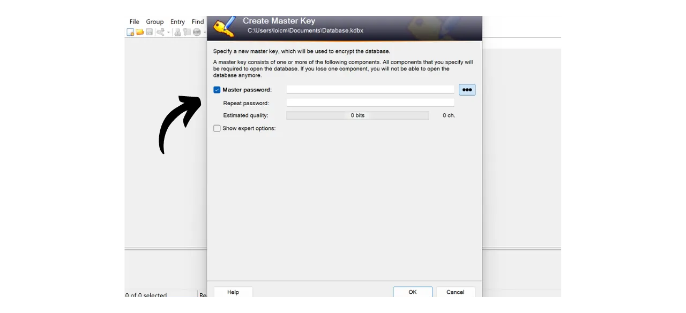
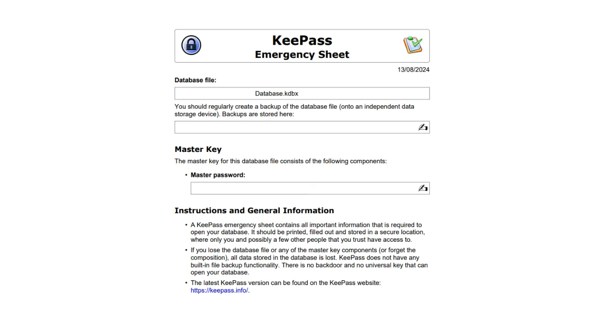
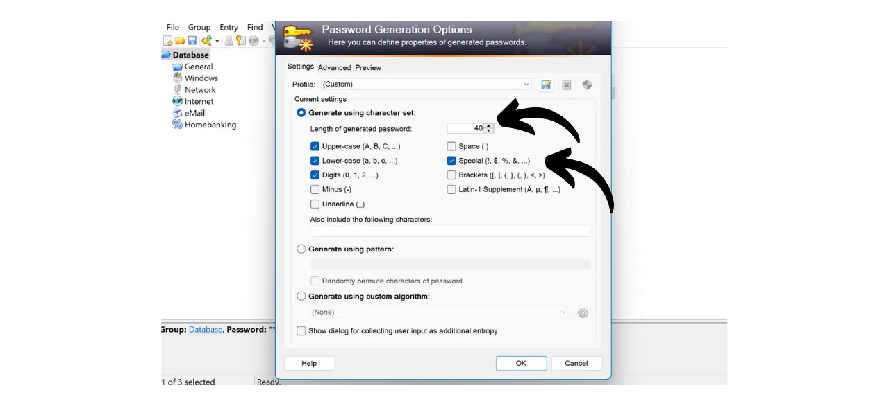
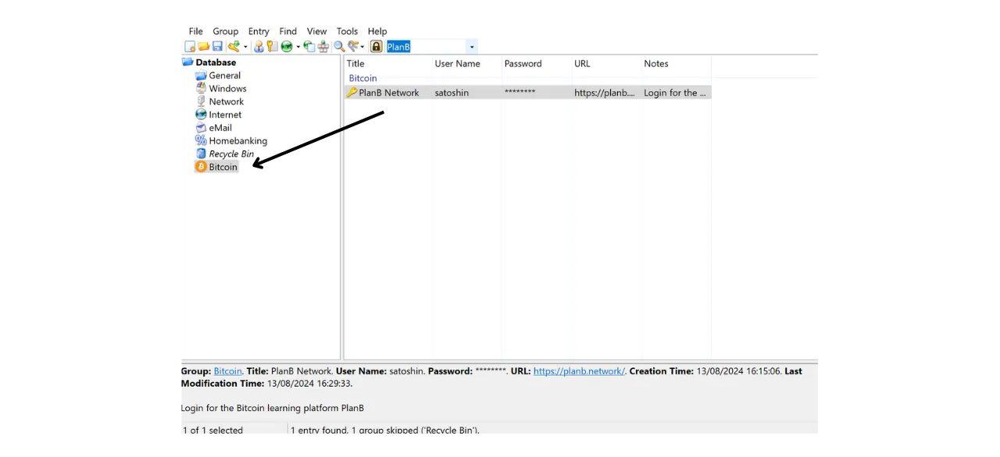

En la era digital, necesitamos gestionar multitud de cuentas en línea que abarcan varios aspectos de nuestras vidas diarias, incluyendo banca, plataformas financieras, correos electrónicos, almacenamiento de archivos, salud, administración, redes sociales, videojuegos, etc.

Para autenticarnos en cada una de estas cuentas, utilizamos un identificador, a menudo una dirección de correo electrónico, acompañado de una contraseña. Ante la imposibilidad de memorizar un gran número de contraseñas únicas, uno podría sentirse tentado a reutilizar la misma contraseña o a modificar ligeramente una base común para facilitar su recuerdo. Sin embargo, estas prácticas comprometen seriamente la seguridad de tus cuentas.

El primer principio a seguir para las contraseñas es no reutilizarlas. Cada cuenta en línea debe estar protegida por una contraseña única y completamente distinta. Esto es importante porque, si un atacante logra comprometer una de tus contraseñas, no querrás que tenga acceso a todas tus cuentas. Tener una contraseña única para cada cuenta aísla los ataques potenciales y limita su alcance. Por ejemplo, si usas la misma contraseña para una plataforma de videojuegos y para tu correo electrónico, y esa contraseña se ve comprometida a través de un sitio de phishing relacionado con la plataforma de juegos, el atacante podría entonces acceder fácilmente a tu correo electrónico y tomar control de todas tus otras cuentas en línea.

El segundo principio esencial es la fortaleza de la contraseña. Se considera que una contraseña es fuerte si es difícil de forzar bruscamente, es decir, de adivinar mediante prueba y error. Esto significa que tus contraseñas deben ser lo más aleatorias posible, largas e incluir una diversidad de caracteres (minúsculas, mayúsculas, números y símbolos).

Aplicar estos dos principios de seguridad de contraseñas (unicidad y robustez) puede resultar difícil en la vida cotidiana, ya que es casi imposible memorizar una contraseña única, aleatoria y fuerte para todas nuestras cuentas. Aquí es donde entra en juego el gestor de contraseñas.

Un gestor de contraseñas genera y almacena de forma segura contraseñas fuertes, permitiéndote acceder a todas tus cuentas en línea sin la necesidad de memorizarlas individualmente. Solo necesitas recordar una contraseña, la contraseña maestra, que te da acceso a todas tus contraseñas guardadas en el gestor. Usar un gestor de contraseñas mejora tu seguridad en línea porque previene la reutilización de contraseñas y genera sistemáticamente contraseñas aleatorias. Pero también simplifica tu uso diario de tus cuentas centralizando el acceso a tu información sensible.
En este tutorial, aprenderemos cómo configurar y usar un gestor de contraseñas local para mejorar tu seguridad en línea. Aquí, te presentaré KeePass. Sin embargo, si eres principiante y te gustaría tener un gestor de contraseñas en línea capaz de sincronizarse a través de múltiples dispositivos, te recomiendo seguir nuestro tutorial sobre Bitwarden:
https://planb.network/tutorials/others/bitwarden

---

*Cuidado: Un gestor de contraseñas es excelente para almacenar contraseñas, pero **¡nunca debes almacenar la frase mnemotécnica de tu billetera Bitcoin en él!** Recuerda, una frase mnemotécnica debe guardarse exclusivamente en un formato físico, como un pedazo de papel o metal.*

---

## Introducción a KeePass

KeePass es un gestor de contraseñas gratuito y de código abierto, perfecto para aquellos que desean una solución segura y gratuita para la gestión local. Es un software que se instala en tu PC que, sin la adición de complementos, no se comunica con Internet. Este es un enfoque radicalmente diferente al de Bitwarden, que cubrimos en un tutorial anterior. Bitwarden, a diferencia de KeePass, permite la sincronización a través de múltiples dispositivos y, por lo tanto, requiere almacenar tus contraseñas en un servidor en línea.
Por defecto, KeePass no admite el uso de extensiones de navegador como Bitwarden; por lo tanto, necesitarás copiar y pegar manualmente tus contraseñas desde el software. Aunque esto puede parecer una limitación, copiar y pegar contraseñas en lugar de usar el auto-relleno es una buena práctica para tu seguridad en línea.
KeePass está diseñado para ser ligero y fácil de usar, mientras se adhiere a altos estándares de seguridad. El software cifra tu base de datos localmente para una protección óptima de tus credenciales. KeePass es también el único gestor de contraseñas validado por la ANSSI (la autoridad francesa de ciberseguridad).

Una de las principales ventajas de KeePass es su flexibilidad. Se puede utilizar de muchas maneras diferentes, como en una memoria USB sin necesidad de instalación en un ordenador. Además, gracias a su [entorno de plugins](https://keepass.info/plugins.html), KeePass puede personalizarse para satisfacer necesidades más específicas.

## ¿Cómo descargar KeePass?

El proceso de instalación de KeePass varía dependiendo del sistema operativo que estés utilizando. Para usuarios de Windows o Linux, la instalación es relativamente sencilla. Sin embargo, si estás en macOS, un paso adicional es necesario debido al desarrollo de KeePass en la plataforma .NET, que no es directamente compatible con macOS. Por lo tanto, necesitarás configurar un entorno compatible para permitir que KeePass funcione en dispositivos Apple.

Para usuarios de Debian/Ubuntu, abre la terminal e introduce los siguientes comandos:

```bash
sudo apt-get update
sudo apt-get install keepass2
```

Para Fedora:

```bash
sudo dnf install keepass
```

Para Arch Linux:

```bash
sudo pacman -S keepass
```

Si estás en un ordenador con Windows, ve a la [página oficial de descarga de KeePass](https://keepass.info/download.html) y descarga la última versión del instalador:

Haz clic en el archivo descargado para ejecutarlo, luego sigue las instrucciones del asistente de instalación para completar la instalación (ver la siguiente sección).

Para usuarios de macOS, la instalación es un poco más compleja. Si deseas usar la versión original de KeePass como en Windows, sigue las instrucciones a continuación. De lo contrario, puedes optar por [KeePassXC](https://keepassxc.org/), una versión alternativa compatible con macOS, que ofrece una interfaz ligeramente diferente.

Para usar KeePass, necesitarás un entorno de ejecución para aplicaciones .NET. Recomiendo instalar Mono para esto. Ve a la [página oficial de Mono](https://www.mono-project.com/download/stable/#download-mac) en la sección "*macOS*", y haz clic en el enlace para descargar el paquete de instalación (`.pkg`).

Abre el archivo `.pkg` descargado y sigue las instrucciones para instalar Mono en tu Mac.

A continuación, ve al sitio web oficial de KeePass y descarga la última versión portátil en formato `.zip`.

Después de descargar el archivo `.zip`, haz doble clic para extraerlo. Obtendrás una carpeta que contiene varios archivos, incluyendo `KeePass.exe`. Abre una terminal, navega a la carpeta de KeePass (reemplaza `xx` con el número de versión):

```bash
cd ~/Downloads/KeePass-2.xx
```

Y finalmente, ejecuta KeePass con Mono:

```bash
mono KeePass.exe
```

## ¿Cómo instalar KeePass?

En el primer lanzamiento, puedes elegir el idioma de la interfaz.

Acepta los términos de la licencia.

Elige la carpeta donde se instalará KeePass.

Opcionalmente, puedes modificar los componentes de la aplicación que se instalarán. Si tienes suficiente espacio, simplemente puedes elegir "*Instalación completa*".

Y finalmente, puedes elegir añadir un acceso directo en tu escritorio.

Haz clic en el botón "*Instalar*".

Espera durante la instalación, luego haz clic en el botón "*Finalizar*".

## ¿Cómo configurar KeePass?

Ahora llegas a tu interfaz de KeePass.
Para crear tu primera base de datos, haz clic en la pestaña "*Archivo*".

Luego en el menú "*Nuevo*".

El software creará una nueva base de datos donde se almacenarán tus contraseñas. Necesitas seleccionar la ubicación para esta carpeta. Elige un lugar que sea fácilmente accesible.

Después, deberías pensar en hacer copias de seguridad de esta carpeta regularmente para evitar perder tus credenciales en caso de pérdida, daño o robo de tu computadora. Por ejemplo, podrías copiar la base de datos en una memoria USB cada semana. El archivo que contiene tu base de datos se llama `Database.kdbx` (el documento está cifrado con tu contraseña maestra). Para más consejos sobre las mejores prácticas de respaldo, también recomiendo consultar este otro tutorial:

https://planb.network/tutorials/others/proton-drive

A continuación, viene la elección de tu contraseña maestra.

Como vimos en la introducción, esta contraseña es muy importante, ya que te da acceso a todas tus otras contraseñas guardadas en la base de datos. Esta contraseña se utilizará para cifrar la base de datos `Database.kdbx`. Presenta dos riesgos principales: pérdida y compromiso. Si pierdes acceso a esta contraseña, ya no podrás acceder a todas tus credenciales. Si tu contraseña es robada, además de la base de datos cifrada, el atacante podrá acceder a todas tus cuentas.

Para minimizar el riesgo de pérdida, recomiendo hacer una copia de seguridad física de tu contraseña maestra en papel y almacenarla en un lugar seguro. Si es posible, sella esta copia de seguridad en un sobre seguro para asegurarte regularmente de que nadie más ha accedido a ella.

Para prevenir el compromiso de tu contraseña maestra, debe ser extremadamente robusta. Debe ser lo más larga posible, usar una amplia variedad de caracteres y ser elegida al azar. En 2024, las recomendaciones mínimas para una contraseña segura son 13 caracteres incluyendo números, letras minúsculas y mayúsculas, así como símbolos, siempre que la contraseña sea verdaderamente aleatoria. Sin embargo, recomiendo optar por una contraseña de al menos 20 caracteres, incluyendo todos los tipos posibles de caracteres, para asegurar su seguridad por más tiempo.

Ingresa tu contraseña maestra en el cuadro dedicado y confírmala en el siguiente cuadro, luego haz clic en "*OK*".

Nombra tu base de datos y añade una descripción si es necesario. Esto puede ayudarte a distinguir entre diferentes bases de datos si creas varias, por ejemplo, una para uso personal y otra para uso profesional.

Para otros ajustes, recomiendo mantener las opciones predeterminadas. Luego haz clic en el botón "*OK*".
KeePass entonces ofrece imprimir una hoja de emergencia.

En esta hoja, encontrarás la ubicación de tu base de datos en tus archivos, un espacio para escribir manualmente tu contraseña maestra, así como instrucciones para acceder a ella. Esta hoja debe ser confiada a personas de confianza, ya que permite la recuperación del acceso a tus credenciales en caso de un problema.

Sin embargo, dado que esta hoja proporciona acceso a tus contraseñas al revelar tu contraseña maestra, debe usarse con precaución. Es aconsejable mantenerla en un sobre sellado como mínimo, lo que permite realizar chequeos periódicos para asegurarse de que no ha sido consultada. No estás obligado a usar esta hoja y podrías considerar otros métodos de respaldo para tus seres queridos.

Luego puedes acceder a tu gestor de contraseñas.

Antes de comenzar a guardar tus credenciales, recomiendo cambiar la configuración de generación de contraseñas. Para hacer esto, ve a la pestaña "*Herramientas*" y selecciona "*Generar Contraseña...*".

Aquí, te aconsejo aumentar la longitud de las contraseñas generadas a 40 caracteres. Ahora que tienes un gestor de contraseñas para recordarlas por ti, no hay necesidad de escatimar en el número de caracteres. Además, no necesitarás escribir las contraseñas a mano, ya que puedes copiarlas y pegarlas. Por lo tanto, no te hace ninguna diferencia tener contraseñas muy largas de 40 caracteres, sin embargo, su seguridad se mejora enormemente. Te aconsejo hacer esto, y también marcar la casilla de caracteres especiales.

Confirma haciendo clic en el pequeño icono de guardar.

Agrega un nombre a tu perfil de contraseña.

## ¿Cómo asegurar tus cuentas con KeePass?

Para registrar una nueva credencial en tu gestor KeePass, simplemente haz clic en el icono de la llave con la flecha verde.

En la ventana de generación y guardado, haz clic en el pequeño icono de la llave y selecciona tu perfil de contraseña de 40 caracteres.

Introduce el nombre de usuario para esta cuenta así como un título para encontrarlo fácilmente en tu base de datos.  También es posible añadir una URL si deseas usar atajos más tarde, y si es necesario, una nota.  Si todo es de tu agrado, haz clic en "*OK*" para guardar la contraseña.  Puedes encontrar tu contraseña en la página de inicio de tu gestor KeePass.  Para copiar una contraseña, simplemente haz doble clic en ella. Permanecerá en tu portapapeles durante 12 segundos, permitiéndote pegarla en el sitio web durante tu próximo inicio de sesión.  Si deseas extender la duración que la contraseña permanece en el portapapeles, haz clic en la pestaña "*Herramientas*", luego en "*Opciones...*".  Bajo la pestaña "*Seguridad*", ajusta la duración cambiando el número de segundos en el cuadro "*Tiempo de auto-limpieza del portapapeles*". Luego haz clic en "*OK*" para guardar tus cambios.  En el lado izquierdo de tu interfaz, notarás que hay varias carpetas para organizar tus contraseñas.  Tienes la opción de eliminar las carpetas predeterminadas o de añadir nuevas haciendo clic derecho y seleccionando "*Añadir Grupo...*".  Elige un nombre para la nueva carpeta y selecciona un icono. También puedes importar tus propios iconos en formato `.ico`. Luego haz clic en el botón "*OK*" para finalizar la creación de la carpeta.  Tu carpeta aparece a la izquierda.  Para añadir una contraseña a una carpeta, simplemente arrástrala desde la base de datos a la carpeta deseada.  Esta característica te ayuda a organizar tu gestor de contraseñas y encontrar tus credenciales más fácilmente.
Otro método para localizar una contraseña es usar la función de búsqueda. Escribe el título del identificador que deseas encontrar en la barra de búsqueda ubicada en la parte superior de la interfaz, y accederás directamente a él.  Sé vigilante, ya que KeePass funciona un poco como un documento de texto. Antes de cerrar la aplicación, si has añadido nuevos elementos a tu gestor, recuerda guardar la base de datos. Puedes hacerlo haciendo clic en el icono de guardar o usando el atajo de teclado `Ctrl+S`. 
Si dejas KeePass abierto en segundo plano, el software no se cerrará por defecto. Sin embargo, si cierras KeePass o apagas tu computadora, necesitarás ingresar tu contraseña maestra para descifrar tu base de datos al reabrir el software. 
Eso cubre las características básicas de KeePass. Por supuesto, este tutorial dirigido a principiantes solo ha rozado la superficie de las muchas opciones disponibles con este software. Hay una multitud de características adicionales por explorar, sin mencionar [todos los complementos desarrollados por la comunidad](https://keepass.info/plugins.html) que pueden ampliar aún más las capacidades de KeePass.

Si estás interesado en aprender cómo mejorar drásticamente la seguridad de tus cuentas en línea para evitar hackeos con 2FA, también te recomiendo revisar este otro tutorial:

https://planb.network/tutorials/others/authy