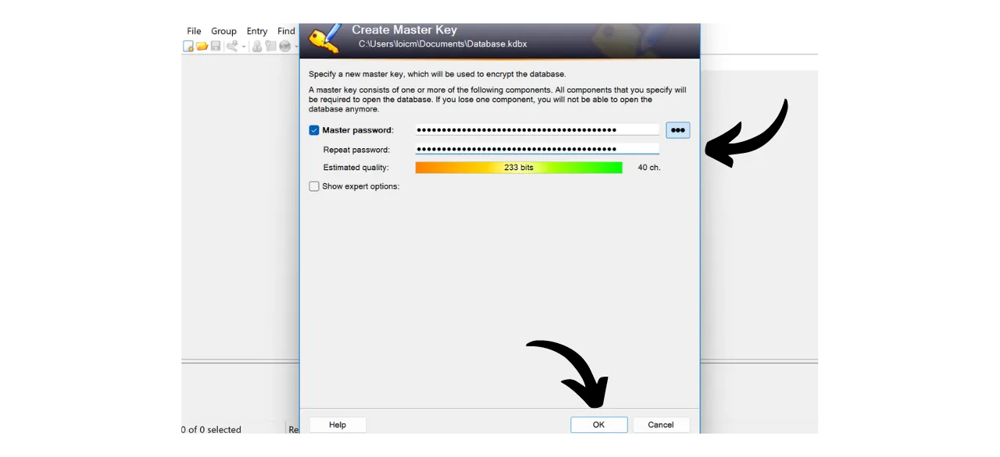
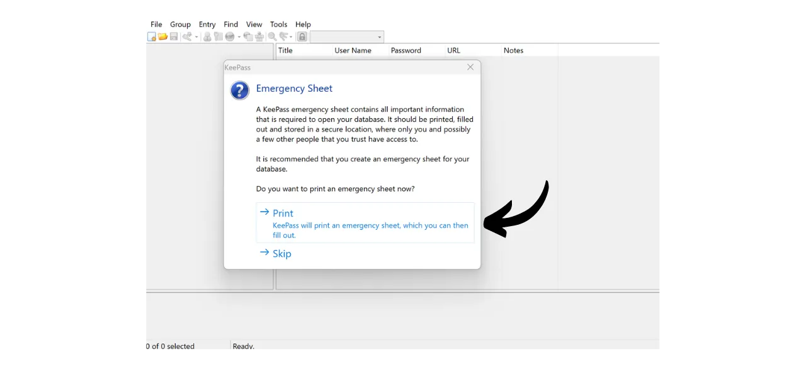
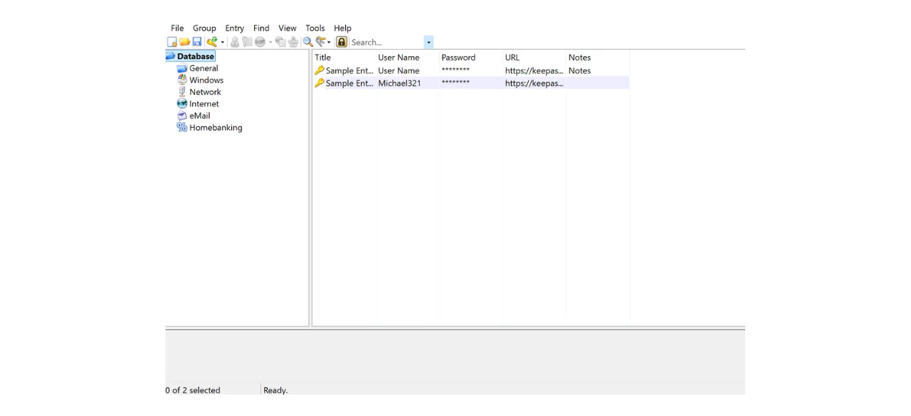
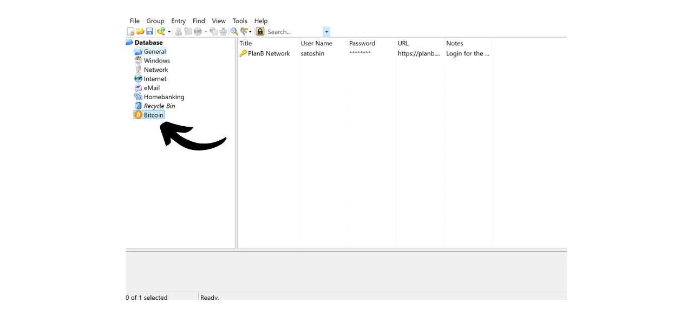

Digiajastul peame haldama paljusid veebikontosid, mis hõlmavad meie igapäevaelu erinevaid aspekte, sealhulgas pangandust, finantsplatvorme, e-posti, failihoidlat, tervist, administratsiooni, sotsiaalvõrgustikke, videomänge jne.

Iga sellise konto autentimiseks kasutame identifikaatorit, sageli e-posti aadressi, millele lisandub parool. Silmitsi seistes võimatusega meelde jätta suur hulk unikaalseid paroole, võib tekkida kiusatus kasutada sama parooli või muuta veidi ühist alust, et seda oleks lihtsam meelde jätta. Siiski ohustavad need praktikad tõsiselt teie kontode turvalisust.

Esimene põhimõte paroolide puhul on mitte neid taaskasutada. Iga veebikonto peaks olema kaitstud ainulaadse ja täiesti eristuva parooliga. See on oluline, sest kui ründaja suudab kompromiteerida ühe teie paroolidest, ei soovi te, et tal oleks juurdepääs kõigile teie kontodele. Iga konto jaoks ainulaadse parooli omamine isoleerib potentsiaalsed rünnakud ja piirab nende ulatust. Näiteks, kui kasutate sama parooli videomänguplatvormi ja oma e-posti jaoks ning see parool kompromiteeritakse läbi videomänguplatvormiga seotud õngitsussaidi, võiks ründaja seejärel hõlpsasti juurde pääseda teie e-postile ja võtta kontrolli kõigi teiste veebikontode üle.

Teine oluline põhimõte on parooli tugevus. Parooli peetakse tugevaks, kui seda on raske jõuga lahti murda, st arvata katse-eksituse meetodil. See tähendab, et teie paroolid peavad olema võimalikult juhuslikud, pikad ja sisaldama erinevaid tähemärke (väiketähed, suurtähed, numbrid ja sümbolid).

Nende kahe parooliturvalisuse põhimõtte (ainulaadsus ja robustsus) rakendamine igapäevaelus võib osutuda keeruliseks, kuna on peaaegu võimatu meelde jätta unikaalne, juhuslik ja tugev parool kõigile meie kontodele. Siin tuleb mängu paroolihaldur.

Paroolihaldur genereerib ja hoiab turvaliselt tugevaid paroole, võimaldades teil juurde pääseda kõigile oma veebikontodele ilma, et peaksite neid individuaalselt meelde jätma. Peate meeles pidama ainult ühte parooli, peaparooli, mis annab teile juurdepääsu kõigile halduris salvestatud paroolidele. Paroolihalduri kasutamine suurendab teie veebiturvalisust, kuna see hoiab ära paroolide taaskasutamise ja genereerib süstemaatiliselt juhuslikke paroole. Kuid see lihtsustab ka teie igapäevast kontode kasutamist, keskendades juurdepääsu teie tundlikule teabele.
Selles õpetuses õpime, kuidas seadistada ja kasutada kohalikku paroolihaldurit, et suurendada teie veebiturvalisust. Siin tutvustan teile KeePassi. Kui olete aga algaja ja sooviksite kasutada veebipõhist paroolihaldurit, mis suudab sünkroniseerida mitme seadme vahel, soovitan järgida meie õpetust Bitwardeni kohta:
https://planb.network/tutorials/others/bitwarden

---

*Ettevaatust: Paroolihaldur on suurepärane paroolide hoiustamiseks, kuid **te ei tohiks kunagi selles hoida oma Bitcoini rahakoti mnemoonilist fraasi!** Pea meeles, et mnemooniline fraas tuleks eksklusiivselt salvestada füüsilisel kujul, nagu paberil või metallil.*

---

## KeePassi tutvustus

KeePass on tasuta ja avatud lähtekoodiga paroolihaldur, mis on ideaalne neile, kes soovivad tasuta ja turvalist lahendust kohalikuks halduseks. See on tarkvara, mis tuleb paigaldada teie arvutisse ja mis, ilma pluginateta, ei suhtle internetiga. See on radikaalselt erinev lähenemine Bitwardenile, mida käsitlesime eelmises õpetuses. Bitwarden, erinevalt KeePassist, võimaldab sünkroniseerimist mitme seadme vahel ja seetõttu nõuab teie paroolide hoidmist veebiserveris.
Vaikimisi ei toeta KeePass brauserilaiendite, nagu Bitwarden, kasutamist; seetõttu peate oma paroolid tarkvarast käsitsi kopeerima ja kleepima. Kuigi see võib tunduda piiranguna, on paroolide kopeerimine ja kleepimine auto-täitmise kasutamise asemel hea praktika teie veebiturvalisuse jaoks.
KeePass on loodud olema nii kergekaaluline kui ka lihtsasti kasutatav, järgides samal ajal kõrgeid turvastandardeid. Tarkvara krüpteerib teie andmebaasi kohapeal, tagamaks teie volituste optimaalse kaitse. KeePass on ka ainus paroolihaldur, mille on valideerinud ANSSI (Prantsuse küberjulgeoleku amet).

Üks KeePassi peamisi eeliseid on selle paindlikkus. Seda saab kasutada mitmel erineval viisil, näiteks USB-mälupulgal ilma vajaduseta installida arvutisse. Lisaks, tänu selle [plugin keskkonnale](https://keepass.info/plugins.html), saab KeePassi kohandada spetsiifilisemate vajaduste rahuldamiseks.

## Kuidas KeePassi alla laadida?

KeePassi installimisprotsess sõltub kasutatavast operatsioonisüsteemist. Windowsi või Linuxi kasutajate jaoks on installimine suhteliselt lihtne. Kui aga kasutate macOS-i, on vajalik lisasamm, kuna KeePass on arendatud .NET platvormil, mida macOS otseselt ei toeta. Seetõttu peate seadistama ühilduva keskkonna, mis võimaldab KeePassi käitada Apple'i seadmetes.

Debian/Ubuntu kasutajatele, avage terminal ja sisestage järgmised käsud:

```bash
sudo apt-get update
sudo apt-get install keepass2
```

Fedora jaoks:

```bash
sudo dnf install keepass
```

Arch Linuxi jaoks:

```bash
sudo pacman -S keepass
```

Kui olete Windowsi arvutis, minge [ametlikule KeePassi allalaadimise lehele](https://keepass.info/download.html) ja laadige alla viimane installeri versioon:

Klõpsake allalaaditud failil, et seda käivitada, seejärel järgige seadistusviisardi juhiseid installimise lõpuleviimiseks (vt järgmist jaotist).

macOS kasutajate jaoks on installimine veidi keerulisem. Kui soovite kasutada KeePassi originaalversiooni nagu Windowsis, järgige allpool toodud juhiseid. Võite valida ka [KeePassXC](https://keepassxc.org/), alternatiivse versiooni, mis on ühilduv macOS-iga ja pakub veidi erinevat liidest.

KeePassi kasutamiseks vajate .NET rakenduste jaoks jooksuaega. Soovitan selleks installida Mono. Minge [ametlikule Mono lehele](https://www.mono-project.com/download/stable/#download-mac) jaotises "*macOS*", ja klõpsake lingil, et alla laadida installipakett (`.pkg`).

Avage allalaaditud `.pkg` fail ja järgige Mono installimiseks oma Maci juhiseid.

Seejärel minge ametlikule KeePassi veebisaidile ja laadige alla viimane kaasaskantav versioon `.zip` formaadis.

Pärast `.zip` faili allalaadimist topeltklõpsake sellel, et see lahti pakkida. Saate kausta, mis sisaldab mitmeid faile, sealhulgas `KeePass.exe`. Avage terminal, navigeerige KeePassi kausta (asendage `xx` versiooninumbriga):

```bash
cd ~/Downloads/KeePass-2.xx
```

Ja lõpuks, käivitage KeePass Monoga:

```bash
mono KeePass.exe
```

## Kuidas KeePassi installida?

Esimesel käivitamisel saate valida liidese keele.

Nõustuge litsentsi tingimustega. 
Valige kaust, kuhu KeePass installitakse.

Võite valikuliselt muuta rakenduse komponente, mis installitakse. Kui teil on piisavalt ruumi, võite lihtsalt valida "*Täisinstallatsioon*".

Ja lõpuks võite valida töölauale otsetee lisamise.

Klõpsake nuppu "*Installi*".

Oodake installimise ajal, seejärel klõpsake nuppu "*Lõpeta*".

## Kuidas seadistada KeePassi?

Nüüd jõuate oma KeePassi liidesesse.
Oma esimese andmebaasi loomiseks klõpsake vahekaardil "*Fail*".

Seejärel menüül "*Uus*".

Tarkvara loob uue andmebaasi, kuhu teie paroolid salvestatakse. Peate valima selle kausta asukoha. Valige kergesti ligipääsetav asukoht.

Seejärel peaksite mõtlema selle kausta regulaarsele varundamisele, et vältida oma volituste kaotamist arvuti kaotuse, kahjustumise või varguse korral. Näiteks võiksite andmebaasi iga nädal USB-pulgale kopeerida. Teie andmebaasi sisaldavat faili nimetatakse `Database.kdbx` (dokument on krüpteeritud teie peaparooliga). Parimate varundamistavade kohta soovitan samuti konsulteerida selle teise õpetusega:

https://planb.network/tutorials/others/proton-drive

Järgneb teie peaparooli valik.

Nagu sissejuhatuses nägime, on see parool väga oluline, kuna see annab teile juurdepääsu kõigile teie teistele salvestatud paroolidele andmebaasis. Seda parooli kasutatakse `Database.kdbx` andmebaasi krüpteerimiseks. See esitab kaks peamist riski: kaotus ja kompromiteerimine. Kui kaotate juurdepääsu sellele paroolile, ei saa te enam kõigile oma volitustele juurde pääseda. Kui teie parool varastatakse, saab ründaja lisaks krüpteeritud andmebaasile juurdepääsu kõigile teie kontodele.

Kaotuse riski minimeerimiseks soovitan teha oma peaparoolist füüsilise varukoopia paberil ja hoida seda turvalises kohas. Kui võimalik, pitseerige see varukoopia turvalises ümbrikus, et regulaarselt tagada, et keegi teine pole sellele juurde pääsenud.

Oma peaparooli kompromiteerimise vältimiseks peab see olema äärmiselt tugev. See peaks olema võimalikult pikk, kasutama laia valikut tähemärke ja olema valitud juhuslikult. 2024. aasta minimaalsed soovitused turvalise parooli jaoks on 13 tähemärki, sealhulgas numbrid, väiketähed ja suurtähed, samuti sümbolid, eeldusel, et parool on tõeliselt juhuslik. Siiski soovitan valida vähemalt 20 tähemärgi pikkuse parooli, mis sisaldab kõiki võimalikke tähemärkide tüüpe, et tagada selle turvalisus pikemaks ajaks.

Sisestage oma peaparool vastavasse lahtrisse ja kinnitage see järgmises lahtris, seejärel klõpsake nuppu "*OK*".

Nimetage oma andmebaas ja lisage vajadusel kirjeldus. See võib aidata teil eristada erinevaid andmebaase, kui loote mitu, näiteks ühe isiklikuks kasutamiseks ja teise professionaalseks kasutamiseks.

Teiste seadete puhul soovitan hoida vaikimisi valikuid. Seejärel klõpsake nuppu "*OK*".
Seejärel pakub KeePass võimalust printida hädaolukorra leht.

Sellel lehel leiate oma andmebaasi asukoha failides, koha, kuhu käsitsi oma peaparooli kirjutada, samuti juhised sellele juurdepääsuks. Seda lehte tuleks usaldada usaldusväärsetele isikutele, kuna see võimaldab juurdepääsu teie volitustele probleemi korral taastada.

Kuna see leht aga annab juurdepääsu teie paroolidele, paljastades teie peaparooli, tuleb seda kasutada ettevaatlikult. On soovitatav hoida seda vähemalt suletud ümbrikus, mis võimaldab perioodilisi kontrolle, et veenduda, kas seda on vaadatud. Te ei ole kohustatud seda lehte kasutama ja võite kaaluda oma lähedaste jaoks muid varundamismeetodeid.

Seejärel pääsete juurde oma paroolihaldurile.

Enne kui hakkate oma volitusi salvestama, soovitan muuta paroolide genereerimise seadeid. Selleks minge vahekaardile "*Tools*" ja valige "*Generate Password...*".

Siin soovitan suurendada genereeritud paroolide pikkust 40 tähemärgini. Nüüd, kui teil on paroolihaldur, kes need teie eest meeles peab, pole põhjust tähemärkide arvu pealt kokku hoida. Lisaks ei pea te paroole käsitsi üles kirjutama, kuna saate neid kopeerida ja kleepida. Seega ei tee see teile vahet, kas teil on väga pikad 40-tähemärgilised paroolid, kuid nende turvalisus on oluliselt suurenenud. Soovitan seda teha ja samuti märkida ruut erimärkide jaoks.

Kinnitage, klõpsates väikesel salvestamise ikoonil.

Lisage oma parooliprofiilile nimi.

## Kuidas oma kontosid KeePassiga turvata?

Uue volituse registreerimiseks oma KeePassi halduris klõpsake lihtsalt võtmikoonil rohelise noolega.

Generatsiooni ja salvestamise aknas klõpsake väikesel võtmikoonil ja valige oma 40-tähemärgiline parooliprofiil.

Sisestage selle konto kasutajanimi ja pealkiri, et seda oma andmebaasis hõlpsasti leida.  Samuti on võimalik lisada URL, kui soovite hiljem kasutada otseteid, ja vajadusel märkus.  Kui kõik on teie rahuloluks, klõpsake parooli salvestamiseks nupul "*OK*".  Oma KeePassi halduri avalehel leiate oma parooli.  Parooli kopeerimiseks topeltklõpsake sellel. See jääb teie lõikelauale 12 sekundiks, võimaldades teil selle järgmisel sisselogimisel veebisaidile kleepida.  Kui soovite pikendada aega, mil parool lõikelauale jääb, klõpsake vahekaardil "*Tööriistad*", seejärel "*Valikud...*".  Vahekaardil "*Turvalisus*" saate kestust kohandada, muutes sekundite arvu väljal "*Clipboard auto-clear time*". Seejärel klõpsake muudatuste salvestamiseks nupul "*OK*".  Oma liidese vasakul küljel märkate, et on mitu kausta paroolide organiseerimiseks.  Teil on võimalus kustutada vaikimisi kaustad või lisada uusi, paremklõpsates ja valides "*Lisa grupp...*".  Valige uuele kaustale nimi ja valige ikoon. Saate ka importida oma ikoone `.ico` formaadis. Seejärel klõpsake kausta loomise lõpuleviimiseks nupul "*OK*".  Teie kaust ilmub vasakule.  Parooli kausta lisamiseks lohistage see lihtsalt andmebaasist soovitud kausta.  See funktsioon aitab teil oma paroolihaldurit korraldada ja oma mandaate kergemini leida.
Teine viis parooli leidmiseks on kasutada otsingufunktsiooni. Tippige otsinguribale liidese ülaosas identifikaatori pealkiri, mida soovite leida, ja pääsete sellele otse juurde.  Olge ettevaatlik, kuna KeePass töötab natuke nagu tekstidokument. Enne rakenduse sulgemist, kui olete oma haldurile lisanud uusi üksusi, ärge unustage andmebaasi salvestada. Seda saate teha salvestusikoonil klõpsates või kasutades klaviatuuri otseteed `Ctrl+S`. 
Kui jätate KeePassi taustal avatuks, ei sulgu tarkvara vaikimisi. Kui aga sulgete KeePassi või lülitate arvuti välja, peate tarkvara uuesti avamisel oma andmebaasi dekrüpteerimiseks sisestama oma peaparooli. 
See katab KeePassi põhifunktsioonid. Loomulikult on see algajatele mõeldud õpetus vaid põgusalt puudutanud paljusid selle tarkvara saadaolevaid võimalusi. On palju lisafunktsioone, mida uurida, rääkimata [kõigist kogukonna poolt välja töötatud pistikprogrammidest](https://keepass.info/plugins.html), mis võivad KeePassi võimalusi veelgi laiendada.

Kui olete huvitatud õppimast, kuidas oma veebikontode turvalisust 2FA abil oluliselt parandada, et vältida häkkimist, soovitan tutvuda ka selle teise õpetusega:

https://planb.network/tutorials/others/authy