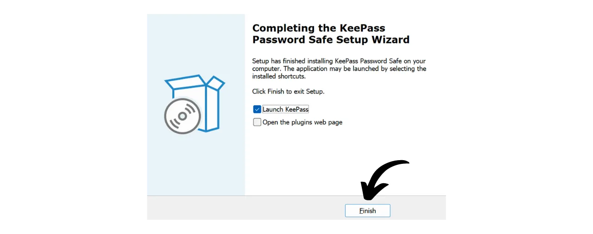
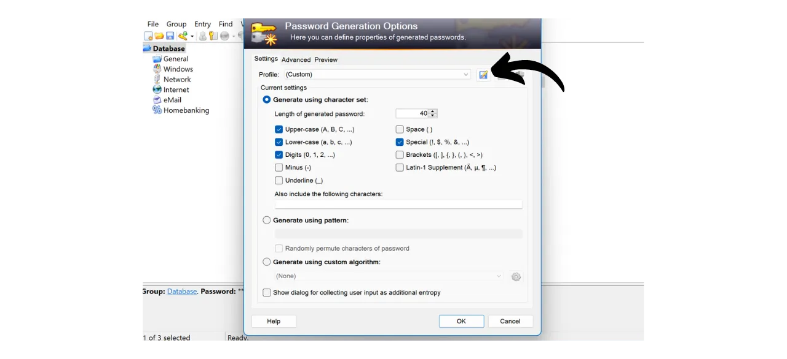

Digitaalisella aikakaudella meidän täytyy hallita lukuisia verkkotilejä, jotka kattavat eri osa-alueita päivittäisessä elämässämme, mukaan lukien pankkiasiat, talousalustat, sähköpostit, tiedostojen tallennus, terveys, hallinto, sosiaaliset verkostot, videopelit jne.

Tunnistautuaksemme kullakin näistä tileistä käytämme tunnistetta, usein sähköpostiosoitetta, jonka yhteydessä on salasana. Kun kohtaamme mahdottomuuden muistaa suuri määrä uniikkeja salasanoja, saatamme houkutella käyttämään samaa salasanaa uudelleen tai hieman muokata yhteistä perustaa, jotta se olisi helpompi muistaa. Kuitenkin nämä käytännöt vakavasti vaarantavat tiliesi turvallisuuden.

Ensimmäinen periaate salasanojen osalta on, ettei niitä tulisi käyttää uudelleen. Jokaisen verkkotilin tulisi olla suojattu uniikilla ja täysin erillisellä salasanalla. Tämä on tärkeää, koska jos hyökkääjä onnistuu murtamaan jonkin salasanasi, et halua heidän pääsevän käsiksi kaikkiin tileihisi. Uniikin salasanan käyttäminen kullakin tilillä eristää potentiaaliset hyökkäykset ja rajoittaa niiden vaikutusaluetta. Esimerkiksi, jos käytät samaa salasanaa videopelialustalla ja sähköpostissasi, ja kyseinen salasana murretaan phishing-sivuston kautta, joka liittyy pelialustaan, hyökkääjä voisi helposti päästä käsiksi sähköpostiisi ja ottaa hallintaansa kaikki muut verkkotilisi.

Toinen olennainen periaate on salasanan vahvuus. Salasanaa pidetään vahvana, jos sitä on vaikea murtaa brute force -menetelmällä, eli arvaamalla kokeilemalla. Tämä tarkoittaa, että salasanasi tulee olla mahdollisimman satunnaisia, pitkiä ja sisältää erilaisten merkkien monimuotoisuutta (pienet kirjaimet, isot kirjaimet, numerot ja symbolit).

Näiden kahden salasanaturvallisuuden periaatteen (uniikkius ja vahvuus) soveltaminen arkielämässä voi osoittautua vaikeaksi, sillä on lähes mahdotonta muistaa uniikkia, satunnaista ja vahvaa salasanaa kaikille tileillemme. Tässä kohtaa salasanojen hallintaohjelma astuu kuvaan.

Salasanojen hallintaohjelma luo ja tallentaa turvallisesti vahvoja salasanoja, mahdollistaen pääsyn kaikkiin verkkotileihisi ilman, että sinun tarvitsee muistaa niitä yksitellen. Sinun tarvitsee muistaa vain yksi salasana, pääsalasana, joka antaa sinulle pääsyn kaikkiin tallennettuihin salasanoihisi hallintaohjelmassa. Salasanojen hallintaohjelman käyttö parantaa verkkoturvallisuuttasi, koska se estää salasanojen uudelleenkäytön ja luo systemaattisesti satunnaisia salasanoja. Mutta se myös yksinkertaistaa päivittäistä tilien käyttöäsi keskittämällä pääsyn arkaluonteisiin tietoihisi.
Tässä oppaassa opimme, kuinka perustaa ja käyttää paikallista salasanojen hallintaohjelmaa parantaaksemme verkkoturvallisuuttamme. Tässä esittelen sinulle KeePassin. Jos kuitenkin olet aloittelija ja haluaisit käyttää verkkopohjaista salasanojen hallintaohjelmaa, joka pystyy synkronoimaan useiden laitteiden välillä, suosittelen seuraamaan opastamme Bitwardenista:
https://planb.network/tutorials/others/bitwarden

---

*Varoitus: Salasanojen hallintaohjelma on loistava salasanojen tallentamiseen, mutta **sinun ei koskaan tulisi tallentaa Bitcoin-lompakkosi mnemonic-lausetta siihen!** Muista, että mnemonic-lause tulee tallentaa yksinomaan fyysiseen muotoon, kuten paperille tai metallille.*

---

## Johdanto KeePassiin

KeePass on ilmainen ja avoimen lähdekoodin salasanojen hallintaohjelma, täydellinen niille, jotka haluavat ilmaisen ja turvallisen ratkaisun paikalliseen hallintaan. Se on ohjelmisto, joka asennetaan PC:lle ja joka, ilman lisäosien lisäämistä, ei kommunikoi Internetin kanssa. Tämä on radikaalisti erilainen lähestymistapa kuin Bitwardenissa, josta kerroimme aiemmassa oppaassa. Bitwarden, toisin kuin KeePass, mahdollistaa synkronoinnin useiden laitteiden välillä ja edellyttää näin ollen salasanojesi tallentamista verkkopalvelimelle.
Oletuksena KeePass ei tue selainlaajennusten, kuten Bitwardenin, käyttöä; siksi sinun täytyy manuaalisesti kopioida ja liittää salasanasi ohjelmistosta. Vaikka tämä saattaa tuntua rajoitteelta, salasanojen kopioiminen ja liittäminen auto-täytön sijaan on hyvä käytäntö verkkoturvallisuutesi kannalta.
KeePass on suunniteltu olemaan sekä kevyt että helppokäyttöinen, samalla noudattaen korkeita turvallisuusstandardeja. Ohjelmisto salaa tietokantasi paikallisesti tarjoten optimaalisen suojan tunnistetiedoillesi. KeePass on myös ainoa salasananhallintaohjelma, jonka ANSSI (ranskalainen kyberturvallisuusviranomainen) on validoinut.

Yksi KeePassin pääeduista on sen joustavuus. Sitä voidaan käyttää monin eri tavoin, kuten USB-tikulla ilman tarvetta asentaa ohjelmistoa tietokoneelle. Lisäksi, kiitos sen [plugin-ympäristön](https://keepass.info/plugins.html), KeePassia voidaan mukauttaa täyttämään tarkemmat tarpeet.

## Miten ladata KeePass?

KeePassin asennusprosessi vaihtelee käyttöjärjestelmästä riippuen. Windows- tai Linux-käyttäjille asennus on suhteellisen yksinkertainen. Jos kuitenkin käytät macOS:ää, tarvitaan lisävaihe KeePassin kehityksen vuoksi .NET-alustalla, jota macOS ei suoraan tue. Siksi sinun täytyy konfiguroida yhteensopiva ympäristö, jotta KeePass toimisi Apple-laitteilla.

Debian/Ubuntu-käyttäjille, avaa terminaali ja syötä seuraavat komennot:

```bash
sudo apt-get update
sudo apt-get install keepass2
```

Fedora-käyttäjille:

```bash
sudo dnf install keepass
```

Arch Linux -käyttäjille:

```bash
sudo pacman -S keepass
```

Jos käytät Windows-tietokonetta, mene [viralliselle KeePassin lataussivulle](https://keepass.info/download.html) ja lataa asennusohjelman uusin versio:

Klikkaa ladattua tiedostoa suorittaaksesi sen, ja seuraa asennusvelhon ohjeita asennuksen loppuun saattamiseksi (katso seuraava osio).

macOS-käyttäjille asennus on hieman monimutkaisempi. Jos haluat käyttää KeePassin alkuperäistä versiota kuten Windowsissa, seuraa alla olevia ohjeita. Vaihtoehtoisesti voit valita [KeePassXC:n](https://keepassxc.org/), macOS-yhteensopivan vaihtoehtoisen version, joka tarjoaa hieman erilaisen käyttöliittymän.

KeePassin käyttämiseksi tarvitset .NET-sovellusten ajamiseen tarvittavan runtime-ympäristön. Suosittelen asentamaan Monoa tähän. Mene [viralliselle Mono-sivulle](https://www.mono-project.com/download/stable/#download-mac) kohdassa "*macOS*" ja klikkaa linkkiä ladataksesi asennuspaketin (`.pkg`).

Avaa ladattu `.pkg`-tiedosto ja seuraa ohjeita asentaaksesi Monon Maciisi.

Seuraavaksi, mene viralliselle KeePass-sivustolle ja lataa uusin kannettava versio `.zip`-muodossa.

Ladattuasi `.zip`-tiedoston, kaksoisklikkaa purkaaksesi sen. Saat kansion, joka sisältää useita tiedostoja, mukaan lukien `KeePass.exe`. Avaa terminaali, navigoi KeePass-kansioon (korvaa `xx` versionumerolla):

```bash
cd ~/Downloads/KeePass-2.xx
```

Ja lopuksi, suorita KeePass Monon avulla:

```bash
mono KeePass.exe
```

## Miten asentaa KeePass?

Ensimmäisellä käynnistyskerralla voit valita käyttöliittymän kielen.

Hyväksy lisenssin ehdot. 
Valitse kansio, johon KeePass asennetaan.

Voit valinnaisesti muokata asennettavien sovelluksen osien kokoonpanoa. Jos sinulla on tarpeeksi tilaa, voit yksinkertaisesti valita "*Täysi asennus*".

Lopuksi voit valita lisääväsi pikakuvakkeen työpöydällesi.

Napsauta "*Asenna*" -painiketta.

Odota asennuksen aikana, sitten napsauta "*Valmis*" -painiketta.

## Kuinka konfiguroida KeePass?

Nyt saavut KeePass-käyttöliittymääsi.
 Luodaksesi ensimmäisen tietokantasi, napsauta "*Tiedosto*" -välilehteä.

Sitten "*Uusi*" -valikkoa.

Ohjelmisto luo uuden tietokannan, johon salasanasi tallennetaan. Sinun on valittava tämän kansion sijainti. Valitse helposti saavutettava sijainti.

Tämän jälkeen sinun tulisi harkita tämän kansion säännöllistä varmuuskopiointia, jotta et menetä tunnisteitasi tietokoneesi katoamisen, vahingoittumisen tai varkauden sattuessa. Voisit esimerkiksi kopioida tietokannan USB-tikulle joka viikko. Tietokantaasi sisältävä tiedosto on nimeltään `Database.kdbx` (asiakirja on salattu pääsalasanallasi). Parhaiden varmuuskopiointikäytäntöjen osalta suosittelen myös tämän toisen oppaan konsultointia:

https://planb.network/tutorials/others/proton-drive

Seuraavaksi tulee pääsalasanasi valinta.

Kuten johdannossa näimme, tämä salasana on erittäin tärkeä, sillä se antaa sinulle pääsyn kaikkiin muihin tietokannassa tallennettuihin salasanoihisi. Tätä salasanaa käytetään `Database.kdbx` tietokannan salaamiseen. Se esittää kaksi pääriskiä: kadottaminen ja kompromissi. Jos menetät pääsyn tähän salasanaan, et enää pääse käsiksi kaikkiin tunnisteisiisi. Jos salasanasi varastetaan, salatun tietokannan lisäksi hyökkääjä pääsee käsiksi kaikkiin tileihisi.

Kadottamisen riskin minimoimiseksi suosittelen tekemään fyysisen varmuuskopion pääsalasanastasi paperille ja säilyttämään sen turvallisessa paikassa. Jos mahdollista, sinetöi tämä varmuuskopio turvallisessa kirjekuoressa säännöllisesti varmistaaksesi, ettei kukaan muu ole päässyt siihen käsiksi.

Pääsalasanasi kompromissin estämiseksi sen on oltava erittäin vahva. Sen tulisi olla mahdollisimman pitkä, käyttää laajaa valikoimaa merkkejä ja valita satunnaisesti. Vuonna 2024 turvallisen salasanan vähimmäissuositukset ovat 13 merkkiä, mukaan lukien numerot, pienet ja suuret kirjaimet sekä symbolit, edellyttäen, että salasana on todella satunnainen. Suosittelen kuitenkin valitsemaan vähintään 20 merkin salasanan, joka sisältää kaikki mahdolliset merkkityypit, varmistaaksesi sen turvallisuuden pidemmän aikaa.

Syötä pääsalasanasi omistettuun kenttään ja vahvista se seuraavassa kentässä, sitten napsauta "*OK*".

Nimeä tietokantasi ja lisää tarvittaessa kuvaus. Tämä voi auttaa sinua erottamaan eri tietokannat, jos luot useita, esimerkiksi yhden henkilökohtaiseen käyttöön ja toisen ammatilliseen käyttöön.

Muiden asetusten osalta suosittelen pitämään oletusvaihtoehdot. Sitten napsauta "*OK*" -painiketta.
KeePass tarjoaa mahdollisuuden tulostaa hätätilanteen varatiedotteen.

Tällä tiedotteella löydät tietokantasi sijainnin tiedostoissasi, tilan johon voit manuaalisesti kirjoittaa pääsalasanasi, sekä ohjeet sen käyttöön. Tämän tiedotteen tulisi antaa luotettavien henkilöiden haltuun, sillä se mahdollistaa pääsyn tietoihisi ongelmatilanteessa.

Koska tämä tiedote kuitenkin antaa pääsyn salasanoihisi paljastamalla pääsalasanasi, sitä tulee käyttää varoen. On suositeltavaa säilyttää sitä vähintään sinetöidyssä kirjekuoressa, mikä mahdollistaa säännölliset tarkistukset sen avaamattomuuden varmistamiseksi. Sinun ei ole pakko käyttää tätä tiedotetta ja voit harkita muita varmuuskopiointimenetelmiä läheisillesi.

Tämän jälkeen voit käyttää salasananhallintaohjelmaasi.

Ennen kuin aloitat tunnustietojesi tallentamisen, suosittelen muuttamaan salasanojen luontiasetuksia. Tee tämä menemällä "*Työkalut*" -välilehdelle ja valitsemalla "*Luo salasana...*".

Tässä suosittelen lisäämään luotavien salasanojen pituuden 40 merkkiin. Nyt kun sinulla on salasanojenhallintaohjelma muistamaan ne puolestasi, ei ole syytä säästellä merkkien määrässä. Lisäksi, sinun ei tarvitse kirjoittaa salasanoja käsin, koska voit kopioida ja liittää ne. Joten sinulle ei ole eroa, onko salasanoissa 40 merkkiä, mutta niiden turvallisuus paranee huomattavasti. Suosittelen tekemään näin ja myös valitsemaan erikoismerkkien käytön.

Vahvista klikkaamalla pientä tallennusikonia.

Lisää nimi salasanaprofiilillesi.

## Kuinka turvata tilisi KeePassin avulla?

Uuden tunnistetiedon rekisteröimiseksi KeePass-manageriisi, klikkaa vain avainkuvaketta, jossa on vihreä nuoli.

Luonti- ja tallennusikkunassa, klikkaa pientä avainkuvaketta ja valitse 40-merkkinen salasanaprofiilisi.

Syötä tämän tilin käyttäjänimi sekä otsikko, jotta löydät sen helposti tietokannastasi.  On myös mahdollista lisätä URL-osoite, jos haluat käyttää pikakuvakkeita myöhemmin, ja tarvittaessa muistiinpano.  Jos kaikki on mielestäsi kunnossa, klikkaa "*OK*" tallentaaksesi salasanan.  Löydät salasanasi KeePass-managerisi kotisivulta.  Salasanan kopioimiseksi kaksoisklikkaa sitä. Se pysyy leikepöydälläsi 12 sekuntia, jolloin voit liittää sen verkkosivustolle seuraavan kirjautumisesi aikana.  Jos haluat pidentää aikaa, jonka salasana pysyy leikepöydällä, klikkaa "*Työkalut*" -välilehteä, sitten "*Asetukset...*".  "*Turvallisuus*" -välilehdellä voit säätää kestoa muuttamalla sekuntien määrää "*Leikepöydän automaattinen tyhjennysaika*" -kentässä. Klikkaa sitten "*OK*" tallentaaksesi muutoksesi.  Käyttöliittymäsi vasemmalla puolella huomaat, että on useita kansioita salasanojesi järjestämiseen.  Voit poistaa oletuskansiot tai lisätä uusia napsauttamalla oikealla ja valitsemalla "*Lisää ryhmä...*".  Valitse uudelle kansiolle nimi ja valitse kuvake. Voit myös tuoda omia kuvakkeita `.ico` -muodossa. Klikkaa sitten "*OK*" -painiketta viimeistelläksesi kansion luomisen.  Kansiosi näkyy vasemmalla.  Salasanan lisäämiseksi kansioon, vedä se yksinkertaisesti tietokannasta haluamaasi kansioon.  Tämä ominaisuus auttaa järjestämään salasananhallintasi ja löytämään tunnistetietosi helpommin.
Toinen tapa löytää salasana on käyttää hakutoimintoa. Kirjoita haluamasi tunnisteen otsikko hakupalkkiin, joka sijaitsee käyttöliittymän yläosassa, ja pääset suoraan siihen.  Ole valpas, sillä KeePass toimii hieman kuin tekstidokumentti. Ennen sovelluksen sulkemista, jos olet lisännyt uusia kohteita hallintaasi, muista tallentaa tietokanta. Voit tehdä tämän napsauttamalla tallennuskuvaketta tai käyttämällä pikanäppäintä `Ctrl+S`. 
Jos jätät KeePassin taustalle avoimeksi, ohjelma ei sulkeudu oletusarvoisesti. Kuitenkin, jos suljet KeePassin tai sammutat tietokoneesi, sinun on syötettävä pääsalasanasi purkaaksesi tietokantasi, kun avaat ohjelman uudelleen. 
Tämä kattaa KeePassin perusominaisuudet. Tietenkin tämä aloittelijoille suunnattu opas on vain raapaissut pintaa monista saatavilla olevista vaihtoehdoista tässä ohjelmistossa. On olemassa lukuisia lisäominaisuuksia tutkittavaksi, puhumattakaan [kaikista yhteisön kehittämistä lisäosista](https://keepass.info/plugins.html), jotka voivat laajentaa KeePassin kykyjä entisestään.

Jos olet kiinnostunut oppimaan, kuinka voit merkittävästi parantaa online-tiliesi turvallisuutta välttääksesi hakkeroinnin 2FA:n avulla, suosittelen myös tutustumaan tähän toiseen oppaaseen:

https://planb.network/tutorials/others/authy