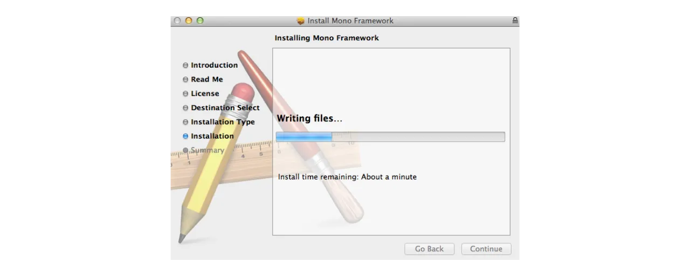
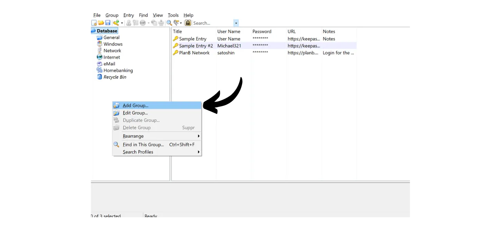

À l'ère numérique, nous devons gérer une multitude de comptes en ligne couvrant divers aspects de notre vie quotidienne, notamment la banque, les plateformes financières, les emails, le stockage de fichiers, la santé, l'administration, les réseaux sociaux, les jeux vidéo, etc.

Pour nous authentifier sur chacun de ces comptes, nous utilisons un identifiant, souvent une adresse email, accompagné d'un mot de passe. Face à l'impossibilité de mémoriser une grande quantité de mots de passe uniques, on peut être tenté de réutiliser le même mot de passe ou d'en modifier légèrement une base commune pour s'en rappeler facilement. Cependant, ces pratiques compromettent gravement la sécurité de vos comptes.

Le premier principe à suivre pour les mots de passe est de ne pas les réutiliser. Chaque compte en ligne devrait être protégé par un mot de passe unique et complètement distinct des autres. C'est important, car, si un attaquant parvient à compromettre un de vos mots de passe, vous ne voulez pas qu'il ait accès à l'ensemble de vos comptes. Avoir un mot de passe unique pour chaque compte isole les attaques potentielles et en limite la portée. Par exemple, si vous utilisez le même mot de passe pour une plateforme de jeux vidéos et pour votre boîte mail, et que ce mot de passe est compromis via un site de phishing lié à la plateforme de jeux, l'attaquant pourrait alors accéder facilement à votre messagerie et prendre le contrôle de tous vos autres comptes en ligne.

Le second principe essentiel est la force du mot de passe. Un mot de passe est considéré comme fort s'il est difficile à brute forcer, c'est-à-dire à trouver par tâtonnement. Cela signifie que vos mots de passe doivent être le plus aléatoires possible, longs, et inclure une diversité de caractères (minuscules, majuscules, chiffres et symboles).

Appliquer ces deux principes de sécurité des mots de passe (unicité et robustesse) peut s'avérer difficile au quotidien, car il est quasiment impossible de mémoriser un mot de passe unique, aléatoire et robuste pour tous nos comptes. C'est ici qu'intervient le gestionnaire de mots de passe.

Un gestionnaire de mots de passe génère et stocke de manière sécurisée des mots de passe forts, ce qui vous permet d'accéder à tous vos comptes en ligne sans nécessité de les mémoriser individuellement. Vous n'avez à retenir qu'un seul mot de passe, le mot de passe maître, qui vous donne accès à l'ensemble de vos mots de passe sauvegardés dans le gestionnaire. L'utilisation d'un gestionnaire de mots de passe renforce votre sécurité en ligne, car il évite la réutilisation de mots de passe et génère systématiquement des mots de passe aléatoires. Mais il va également simplifier votre utilisation quotidienne de vos comptes en centralisant l'accès à vos informations sensibles.

Dans ce tutoriel, nous allons découvrir comment configurer et utiliser un gestionnaire de mots de passe local pour améliorer votre sécurité en ligne. Je vous propose ici de découvrir KeePass. Toutefois, si vous êtes novice et que vous souhaitez avoir un gestionnaire de mots de passe en ligne capable de se synchroniser sur plusieurs appareils, je vous recommande plutôt de suivre notre tutoriel sur Bitwarden :

https://planb.network/tutorials/others/bitwarden

---

*Attention : Un gestionnaire de mots de passe, c'est très bien pour enregistrer les mots de passe, mais **il ne faut surtout pas y enregistrer la phrase mnémonique de votre portefeuille Bitcoin !** Pour rappel, une phrase mnémonique doit être sauvegardée exclusivement sous un format physique, comme un bout de papier ou de métal.*

---

## Présentation de KeePass

KeePass est un gestionnaire de mots de passe libre et open-source, parfait pour ceux qui souhaitent avoir une solution gratuite et sécurisée pour une gestion en local. Il s'agit d'un logiciel à installer sur votre PC qui, sans l'ajout de plugins, ne communique pas avec Internet. C'est donc une approche radicalement différente de celle de Bitwarden, que nous avons vu dans un précédent tutoriel. Bitwarden, contrairement à KeePass, permet la synchronisation sur plusieurs appareils, et requiert ainsi de stocker vos mots de passe sur un serveur en ligne.

KeePass ne supporte pas par défaut l'utilisation d'extensions de navigateur comme Bitwarden ; vous devrez donc copier-coller vos mots de passe manuellement à partir du logiciel. Bien que cela semble être une contrainte, le fait de copier-coller les mots de passe plutôt que d'utiliser le remplissage automatique constitue une bonne pratique pour votre sécurité en ligne.

KeePass est conçu pour être à la fois léger et facile à utiliser, tout en respectant des standards de sécurité élevés. Le logiciel chiffre votre base de données en local pour une protection optimale de vos identifiants. KeePass est d'ailleurs le seul gestionnaire de mots de passe validé par l'ANSSI (l'autorité française de la cybersécurité).

L'un des principaux avantages de KeePass est sa flexibilité. Il peut être utilisé de nombreuses façons différentes, comme par exemple sur une clé USB sans nécessité d'installation sur un ordinateur. De plus, grâce à son [environnement de plugins](https://keepass.info/plugins.html), KeePass peut être personnalisé pour répondre à des besoins plus spécifiques.

## Comment télécharger KeePass ?

Le processus d'installation de KeePass varie selon le système d'exploitation que vous utilisez. Pour les utilisateurs de Windows ou Linux, l'installation est relativement simple. En revanche, si vous êtes sur macOS, une étape supplémentaire est nécessaire en raison du développement de KeePass sur la plateforme .NET, qui n'est pas directement supportée par macOS. Il faudra donc configurer un environnement compatible pour permettre l'exécution de KeePass sur les appareils Apple.

Pour les utilisateurs de Debian/Ubuntu, ouvrez le terminal et saisissez les commandes suivantes :

```bash
sudo apt-get update
sudo apt-get install keepass2
```

Pour Fedora :

```bash
sudo dnf install keepass
```

Pour Arch Linux :

```bash
sudo pacman -S keepass
```

Si vous êtes sur un ordinateur sous Windows, rendez-vous sur [la page officielle de téléchargement de KeePass](https://keepass.info/download.html), et téléchargez la dernière version de l'installateur :

Cliquez sur le fichier téléchargé pour l'exécuter, puis suivez les instructions de l'assistant pour terminer l'installation (voir partie suivante).

Pour les utilisateurs de macOS, l'installation est un peu plus complexe. Si vous souhaitez utiliser la version originale de KeePass comme sur Windows, suivez les instructions ci-dessous. Autrement, vous pouvez opter pour [KeePassXC](https://keepassxc.org/), une version alternative compatible avec macOS, qui propose une interface légèrement différente.

Pour utiliser KeePass, vous aurez besoin d'un environnement d'exécution pour les applications .NET. Je vous recommande d'installer Mono pour cela. Rendez-vous sur [la page officielle de Mono](https://www.mono-project.com/download/stable/#download-mac) dans la section "*macOS*", et cliquez sur le lien pour télécharger le package d'installation (`.pkg`).

Ouvrez le fichier `.pkg` téléchargé et suivez les instructions pour installer Mono sur votre Mac.

Ensuite, allez sur le site officiel de KeePass et téléchargez la dernière version portable au format `.zip`.

Après avoir téléchargé le fichier `.zip`, double-cliquez pour l'extraire. Vous obtiendrez un dossier contenant plusieurs fichiers, y compris `KeePass.exe`. Ouvrez un terminal, naviguez jusqu'au dossier de KeePass (remplacez `xx` par le numéro de version) :

```bash
cd ~/Downloads/KeePass-2.xx
```

Et enfin, exécutez KeePass avec Mono :

```bash
mono KeePass.exe
```

## Comment installer KeePass ?

Lors du premier lancement, vous pouvez choisir la langue de l'interface.

Acceptez les termes de la licence.

Choisissez le dossier où sera installé KeePass.

Vous pouvez éventuellement modifier les composants de l'application qui sont installés. Si vous avez suffisamment de place, vous pouvez simplement choisir "*Full installation*".

Et enfin, vous pouvez choisir d'ajouter un raccourci sur votre bureau.

Cliquez sur le bouton "*Install*".

Patientez durant l'installation, puis cliquez sur le bouton "*Finish*".

## Comment configurer KeePass ?

Vous arrivez maintenant sur votre interface KeePass.

Pour créer votre première base de données, cliquez sur l'onglet "*File*".

Puis sur le menu "*New*".

Le logiciel va créer une nouvelle base de données où seront conservés vos mots de passe. Vous devez sélectionner l'emplacement de ce dossier. Choisissez un emplacement facilement accessible.

Par la suite, il faudra penser à effectuer régulièrement des sauvegardes de ce dossier pour éviter la perte de vos identifiants en cas de perte, de casse ou de vol de votre ordinateur. Vous pourriez, par exemple, copier la base de données sur une clé USB chaque semaine. Le fichier contenant votre base de données porte le nom de `Database.kdbx` (le document est chiffré avec votre mot de passe maître). Pour plus de conseils sur les meilleures pratiques de sauvegarde, je vous recommande également de consulter cet autre tutoriel :

https://planb.network/tutorials/others/proton-drive

Vient ensuite le choix de votre mot de passe maître.

Comme nous l'avons vu dans l'introduction, ce mot de passe est très important, car il vous donne accès à tous vos autres mots de passe sauvegardés dans la base de données. C'est ce mot de passe qui sera utilisé pour chiffrer la base de données `Database.kdbx`. Il présente alors deux principaux risques : la perte et la compromission. Si vous perdez l'accès à ce mot de passe, vous ne pourrez plus accéder à l'intégralité de vos identifiants. Si vous vous faites voler ce mot de passe, en plus de la base de données chiffrée, l'attaquant pourra accéder à l'intégralité de vos comptes. 

Pour minimiser le risque de perte, je recommande de faire une sauvegarde physique de votre mot de passe maître sur du papier et de la stocker en lieu sûr. Si possible, scellez cette sauvegarde dans une enveloppe sécurisée pour vous assurer régulièrement que personne d'autre n'y a accédé.

Pour prévenir la compromission de votre mot de passe maître, celui-ci doit être extrêmement robuste. Il doit être le plus long possible, utiliser une grande diversité de caractères, et être choisi de manière aléatoire. En 2024, les recommandations minimales pour un mot de passe sécurisé sont de 13 caractères en incluant des chiffres, des lettres minuscules et majuscules, ainsi que des symboles, à condition que le mot de passe soit réellement aléatoire. Toutefois, je vous recommande d'opter pour un mot de passe d'au moins 20 caractères, comprenant tous types de caractères possibles, pour garantir sa sécurité plus longtemps.

Entrez votre mot de passe maître dans la case dédiée et confirmez-le dans la case suivante, puis cliquez sur "*OK*".

Nommez votre base de données et ajoutez-y une description si nécessaire. Cela peut vous aider à distinguer les différentes bases de données si vous en créez plusieurs, par exemple, une pour un usage personnel et une autre pour un usage professionnel.

Pour les autres paramètres, je vous recommande de conserver les options par défaut. Cliquez ensuite sur le bouton "*OK*".

KeePass vous propose alors d'imprimer une feuille d'urgence.

Sur cette feuille, vous trouverez l'emplacement de votre base de données dans vos fichiers, un espace pour inscrire à la main votre mot de passe maître, ainsi que des instructions pour y accéder. Cette feuille doit être confiée à des personnes de confiance, car elle permet de récupérer l'accès à vos identifiants en cas de problème.

Toutefois, puisque cette feuille donne accès à vos mots de passe en révélant votre mot de passe maître, elle doit être utilisée avec prudence. Il est conseillé de la conserver au minimum dans une enveloppe scellée, ce qui permet de vérifier périodiquement qu'elle n'a pas été consultée. Vous n'êtes pas obligé d'utiliser cette feuille et pouvez envisager d'autres méthodes de sauvegarde pour vos proches.

Vous pouvez ensuite accéder à votre gestionnaire de mots de passe.

Avant de commencer à enregistrer vos identifiants, je vous recommande de modifier les paramètres de génération de mots de passe. Pour cela, allez dans l'onglet "*Tools*" et sélectionnez "*Generate Password...*".

Ici, je vous conseille de passer la taille des mots de passes générés à 40 caractères. Maintenant que vous avez un gestionnaire de mot de passe qui les retient à votre place, nul besoin d'être radin sur le nombre de caractères. De plus, vous ne devrez pas noter les mots de passe à la main, puisque vous pourrez les copier-coller. Donc ça ne vous change rien d'avoir des mots de passe très longs de 40 caractères, en revanche, leur sécurité est largement supérieure. Je vous conseille donc de faire cela, et de cocher également la case des caractères spéciaux.

Validez en cliquant sur la petite icône d'enregistrement.

Ajoutez un nom à votre profil de mots de passe.

## Comment sécuriser ses comptes avec KeePass ?

Pour enregistrer un nouvel identifiant dans votre gestionnaire KeePass, cliquez simplement sur l'icône de la clé avec la flèche verte.

Dans la fenêtre de génération et d'enregistrement, cliquez sur la petite icône de clé et sélectionnez votre profil de mot de passe à 40 caractères.

Saisissez le nom d'utilisateur pour ce compte ainsi qu'un titre pour le retrouver facilement dans votre base de données.

Il est également possible d'ajouter une URL si vous souhaitez utiliser les raccourcis ultérieurement, et si nécessaire, une note.

Si tout vous convient, cliquez sur "*OK*" pour enregistrer le mot de passe.

Vous pouvez retrouver votre mot de passe sur la page d'accueil de votre gestionnaire KeePass.

Pour copier un mot de passe, effectuez simplement un double-clic dessus. Il restera dans votre presse-papiers pendant 12 secondes, ce qui vous permettra de le coller sur le site web lors de votre prochaine connexion.

Si vous désirez prolonger la durée pendant laquelle le mot de passe reste dans le presse-papiers, cliquez sur l'onglet "*Tools*", puis sur "*Options...*".

Sous l'onglet "*Security*", ajustez la durée en modifiant le nombre de secondes dans la case "*Clipboard auto-clear time*". Cliquez ensuite sur "*OK*" pour sauvegarder vos modifications.

Sur la gauche de votre interface, vous remarquerez qu'il y a plusieurs dossiers pour organiser vos mots de passe.

Vous avez la possibilité de supprimer les dossiers par défaut ou d'en ajouter de nouveaux en faisant un clic droit et en sélectionnant "*Add Group...*".

Choisissez un nom pour le nouveau dossier et sélectionnez une icône. Vous pouvez également importer vos propres icônes au format `.ico`. Cliquez ensuite sur le bouton "*OK*" pour finaliser la création du dossier.

Votre dossier apparait sur la gauche.

Pour ajouter un mot de passe à un dossier, il suffit de le glisser depuis la base de données jusqu'au dossier souhaité.

Cette fonctionnalité vous aide à organiser votre gestionnaire de mots de passe et à retrouver plus facilement vos identifiants.

Une autre méthode pour localiser un mot de passe est d'utiliser la fonction de recherche. Tapez le titre de l'identifiant que vous souhaitez retrouver dans la barre de recherche située en haut de l'interface, et vous accéderez directement à celui-ci.

Soyez vigilant, car KeePass fonctionne un peu comme un document texte. Avant de fermer l'application, si vous avez ajouté de nouveaux éléments à votre gestionnaire, pensez à sauvegarder la base de données. Vous pouvez le faire en cliquant sur l'icône d'enregistrement ou en utilisant le raccourci clavier `Ctrl+S`.

Si vous laissez KeePass ouvert en arrière-plan, le logiciel ne se fermera pas par défaut. Cependant, si vous fermez KeePass ou éteignez votre ordinateur, vous devrez saisir votre mot de passe maître pour déchiffrer votre base de données lors de la réouverture du logiciel.

Voilà pour les fonctionnalités de base concernant KeePass. Évidemment, ce tutoriel destiné aux débutants n'a fait qu'effleurer les nombreuses options disponibles avec ce logiciel. Il existe une multitude de fonctionnalités supplémentaires à explorer, sans compter [tous les plugins développés par la communauté](https://keepass.info/plugins.html) qui peuvent étendre encore davantage les capacités de KeePass.

Si vous souhaitez découvrir comment améliorer drastiquement la sécurité de vos comptes en ligne pour éviter les piratages avec le 2FA, je vous conseille également de découvrir cet autre tutoriel :

https://planb.network/tutorials/others/authy
