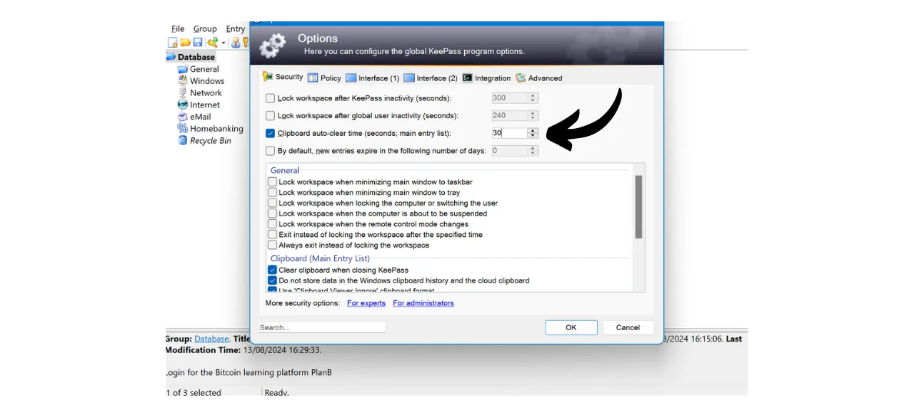

Di era digital, kita perlu mengelola berbagai akun online yang mencakup berbagai aspek kehidupan sehari-hari, termasuk perbankan, platform keuangan, email, penyimpanan file, kesehatan, administrasi, jejaring sosial, video game, dll.

Untuk mengautentikasi diri kita pada masing-masing akun ini, kita menggunakan pengenal, seringkali alamat email, yang disertai dengan kata sandi. Menghadapi ketidakmungkinan untuk mengingat sejumlah besar kata sandi unik, seseorang mungkin tergoda untuk menggunakan kata sandi yang sama atau sedikit memodifikasi basis umum agar lebih mudah diingat. Namun, praktik ini serius mengkompromikan keamanan akun Anda.

Prinsip pertama yang harus diikuti untuk kata sandi adalah tidak menggunakannya kembali. Setiap akun online harus dilindungi oleh kata sandi yang unik dan sepenuhnya berbeda. Ini penting karena, jika seorang penyerang berhasil mengkompromikan salah satu kata sandi Anda, Anda tidak ingin mereka memiliki akses ke semua akun Anda. Memiliki kata sandi unik untuk setiap akun mengisolasi serangan potensial dan membatasi lingkupnya. Misalnya, jika Anda menggunakan kata sandi yang sama untuk platform video game dan untuk email Anda, dan kata sandi tersebut dikompromikan melalui situs phishing yang terkait dengan platform game, penyerang kemudian dapat dengan mudah mengakses email Anda dan mengambil kendali atas semua akun online lainnya.

Prinsip penting kedua adalah kekuatan kata sandi. Kata sandi dianggap kuat jika sulit untuk ditebak melalui coba-coba. Ini berarti bahwa kata sandi Anda harus seacak mungkin, panjang, dan mencakup beragam karakter (huruf kecil, huruf besar, angka, dan simbol).

Menerapkan dua prinsip keamanan kata sandi ini (keunikan dan kekuatan) dapat terbukti sulit dalam kehidupan sehari-hari, karena hampir mustahil untuk mengingat kata sandi yang unik, acak, dan kuat untuk semua akun kita. Di sinilah manajer kata sandi berperan.

Manajer kata sandi menghasilkan dan menyimpan kata sandi yang kuat secara aman, memungkinkan Anda untuk mengakses semua akun online Anda tanpa perlu mengingatnya secara individu. Anda hanya perlu mengingat satu kata sandi, kata sandi induk, yang memberi Anda akses ke semua kata sandi yang disimpan dalam manajer. Menggunakan manajer kata sandi meningkatkan keamanan online Anda karena mencegah penggunaan kembali kata sandi dan secara sistematis menghasilkan kata sandi acak. Tapi itu juga mempermudah penggunaan harian akun Anda dengan memusatkan akses ke informasi sensitif Anda.
Dalam tutorial ini, kita akan belajar cara mengatur dan menggunakan manajer kata sandi lokal untuk meningkatkan keamanan online Anda. Di sini, saya akan memperkenalkan Anda kepada KeePass. Namun, jika Anda pemula dan ingin memiliki manajer kata sandi online yang mampu sinkronisasi lintas perangkat, saya sarankan mengikuti tutorial kami tentang Bitwarden:
https://planb.network/tutorials/others/bitwarden

---

*Perhatian: Manajer kata sandi sangat bagus untuk menyimpan kata sandi, tetapi **Anda tidak boleh menyimpan frasa mnemonik dompet Bitcoin Anda di dalamnya!** Ingat, frasa mnemonik harus disimpan secara eksklusif dalam format fisik, seperti selembar kertas atau logam.*

---

## Pengenalan ke KeePass

KeePass adalah manajer kata sandi gratis dan open-source, sempurna bagi mereka yang menginginkan solusi gratis dan aman untuk pengelolaan lokal. Ini adalah perangkat lunak yang harus diinstal pada PC Anda yang, tanpa penambahan plugin, tidak berkomunikasi dengan Internet. Ini adalah pendekatan yang radikal berbeda dari Bitwarden, yang telah kami bahas dalam tutorial sebelumnya. Bitwarden, tidak seperti KeePass, memungkinkan sinkronisasi lintas perangkat dan dengan demikian memerlukan penyimpanan kata sandi Anda pada server online.
Secara default, KeePass tidak mendukung penggunaan ekstensi browser seperti Bitwarden; oleh karena itu, Anda perlu menyalin dan menempelkan kata sandi Anda secara manual dari perangkat lunak tersebut. Meskipun ini mungkin terlihat sebagai sebuah keterbatasan, menyalin dan menempelkan kata sandi daripada menggunakan auto-fill adalah praktik yang baik untuk keamanan online Anda.
KeePass dirancang untuk menjadi ringan dan mudah digunakan, sambil tetap mematuhi standar keamanan yang tinggi. Perangkat lunak ini mengenkripsi database Anda secara lokal untuk perlindungan optimal terhadap kredensial Anda. KeePass juga merupakan satu-satunya pengelola kata sandi yang divalidasi oleh ANSSI (otoritas keamanan siber Prancis).

Salah satu keuntungan utama dari KeePass adalah fleksibilitasnya. Ini dapat digunakan dalam berbagai cara, seperti pada USB stick tanpa perlu instalasi pada komputer. Selain itu, berkat [lingkungan plugin](https://keepass.info/plugins.html)nya, KeePass dapat disesuaikan untuk memenuhi kebutuhan yang lebih spesifik.

## Bagaimana Cara Mengunduh KeePass?

Proses instalasi KeePass bervariasi tergantung pada sistem operasi yang Anda gunakan. Untuk pengguna Windows atau Linux, instalasinya relatif mudah. Namun, jika Anda menggunakan macOS, langkah tambahan diperlukan karena pengembangan KeePass pada platform .NET, yang tidak langsung didukung oleh macOS. Oleh karena itu, Anda perlu mengonfigurasi lingkungan yang kompatibel agar KeePass dapat berjalan pada perangkat Apple.

Untuk pengguna Debian/Ubuntu, buka terminal dan masukkan perintah berikut:

```bash
sudo apt-get update
sudo apt-get install keepass2
```

Untuk Fedora:

```bash
sudo dnf install keepass
```

Untuk Arch Linux:

```bash
sudo pacman -S keepass
```

Jika Anda menggunakan komputer Windows, kunjungi [halaman unduhan KeePass resmi](https://keepass.info/download.html), dan unduh versi terbaru dari installer:

Klik pada file yang diunduh untuk menjalankannya, kemudian ikuti instruksi dari wizard setup untuk menyelesaikan instalasi (lihat bagian selanjutnya).

Untuk pengguna macOS, instalasinya sedikit lebih kompleks. Jika Anda ingin menggunakan versi asli KeePass seperti di Windows, ikuti instruksi di bawah ini. Jika tidak, Anda dapat memilih [KeePassXC](https://keepassxc.org/), versi alternatif yang kompatibel dengan macOS, yang menawarkan antarmuka yang sedikit berbeda.

Untuk menggunakan KeePass, Anda akan memerlukan lingkungan runtime untuk aplikasi .NET. Saya merekomendasikan menginstal Mono untuk ini. Kunjungi [halaman resmi Mono](https://www.mono-project.com/download/stable/#download-mac) di bagian "*macOS*", dan klik pada link untuk mengunduh paket instalasi (`.pkg`).

Buka file `.pkg` yang diunduh dan ikuti instruksi untuk menginstal Mono di Mac Anda.

Selanjutnya, kunjungi situs web resmi KeePass dan unduh versi portabel terbaru dalam format `.zip`.

Setelah mengunduh file `.zip`, klik dua kali untuk mengekstraknya. Anda akan mendapatkan folder yang berisi beberapa file, termasuk `KeePass.exe`. Buka terminal, navigasikan ke folder KeePass (ganti `xx` dengan nomor versi):

```bash
cd ~/Downloads/KeePass-2.xx
```

Dan akhirnya, jalankan KeePass dengan Mono:

```bash
mono KeePass.exe
```

## Bagaimana Cara Menginstal KeePass?

Pada peluncuran pertama, Anda dapat memilih bahasa antarmuka.

Terima ketentuan lisensi.

Pilih folder tempat KeePass akan diinstal.

Anda dapat secara opsional memodifikasi komponen aplikasi yang diinstal. Jika Anda memiliki cukup ruang, Anda bisa memilih "*Instalasi Penuh*".

Dan akhirnya, Anda dapat memilih untuk menambahkan shortcut di desktop Anda.

Klik tombol "*Instal*".

Tunggu selama instalasi, kemudian klik tombol "*Selesai*".

## Bagaimana cara mengonfigurasi KeePass?

Anda sekarang berada di antarmuka KeePass Anda.
Untuk membuat database pertama Anda, klik pada tab "*File*".

Kemudian pada menu "*Baru*".

Perangkat lunak akan membuat database baru tempat kata sandi Anda akan disimpan. Anda perlu memilih lokasi untuk folder ini. Pilih lokasi yang mudah diakses.

Setelah itu, Anda harus memikirkan tentang secara rutin membackup folder ini untuk menghindari kehilangan kredensial Anda dalam kasus kehilangan, kerusakan, atau pencurian komputer Anda. Sebagai contoh, Anda bisa menyalin database ke USB stick setiap minggu. File yang berisi database Anda bernama `Database.kdbx` (dokumen ini dienkripsi dengan master password Anda). Untuk saran lebih lanjut tentang praktik backup terbaik, saya juga merekomendasikan untuk berkonsultasi dengan tutorial lain ini:

https://planb.network/tutorials/others/proton-drive

Selanjutnya adalah pilihan master password Anda.

Seperti yang kita lihat di pengantar, password ini sangat penting, karena memberi Anda akses ke semua password lain yang disimpan di database. Password ini akan digunakan untuk mengenkripsi database `Database.kdbx`. Ini menyajikan dua risiko utama: kehilangan dan kompromi. Jika Anda kehilangan akses ke password ini, Anda tidak akan lagi dapat mengakses semua kredensial Anda. Jika password Anda dicuri, selain database yang terenkripsi, penyerang akan dapat mengakses semua akun Anda.

Untuk meminimalkan risiko kehilangan, saya merekomendasikan membuat backup fisik dari master password Anda di kertas dan menyimpannya di tempat yang aman. Jika mungkin, segel backup ini dalam amplop yang aman untuk secara rutin memastikan bahwa tidak ada orang lain yang mengaksesnya.

Untuk mencegah kompromi dari master password Anda, itu harus sangat kuat. Ini harus sepanjang mungkin, menggunakan berbagai karakter yang luas, dan dipilih secara acak. Pada tahun 2024, rekomendasi minimum untuk password yang aman adalah 13 karakter termasuk angka, huruf kecil dan huruf besar, serta simbol, asalkan password tersebut benar-benar acak. Namun, saya merekomendasikan untuk memilih password setidaknya 20 karakter, termasuk semua jenis karakter yang mungkin, untuk memastikan keamanannya untuk waktu yang lebih lama.

Masukkan master password Anda di kotak yang disediakan dan konfirmasikan di kotak berikutnya, kemudian klik pada "*OK*".

Namai database Anda dan tambahkan deskripsi jika perlu. Ini dapat membantu Anda membedakan antara database yang berbeda jika Anda membuat beberapa, misalnya, satu untuk penggunaan pribadi dan yang lain untuk penggunaan profesional.

Untuk pengaturan lain, saya merekomendasikan untuk mempertahankan opsi default. Kemudian klik tombol "*OK*".
KeePass kemudian menawarkan untuk mencetak lembar darurat.

Di lembar ini, Anda akan menemukan lokasi database Anda di dalam file, sebuah ruang untuk menulis kata sandi utama Anda secara manual, serta instruksi untuk mengaksesnya. Lembar ini harus dipercayakan kepada orang-orang yang dipercaya, karena memungkinkan pemulihan akses ke kredensial Anda dalam kasus terjadi masalah.

Namun, karena lembar ini memberikan akses ke kata sandi Anda dengan mengungkapkan kata sandi utama Anda, lembar ini harus digunakan dengan hati-hati. Disarankan untuk menyimpannya dalam amplop yang disegel sebagai minimum, yang memungkinkan pemeriksaan periodik untuk memastikan tidak ada yang telah mengkonsultasikannya. Anda tidak diwajibkan untuk menggunakan lembar ini dan mungkin mempertimbangkan metode cadangan lain untuk orang-orang terkasih Anda.

Anda kemudian dapat mengakses manajer kata sandi Anda.

Sebelum Anda mulai menyimpan kredensial Anda, saya merekomendasikan untuk mengubah pengaturan pembuatan kata sandi. Untuk melakukan ini, pergi ke tab "*Tools*" dan pilih "*Generate Password...*".

Di sini, saya menyarankan Anda untuk meningkatkan panjang kata sandi yang dihasilkan menjadi 40 karakter. Sekarang karena Anda memiliki manajer kata sandi untuk mengingatnya untuk Anda, tidak perlu untuk mengurangi jumlah karakter. Selain itu, Anda tidak perlu menulis kata sandi dengan tangan, karena Anda dapat menyalin dan menempelkannya. Jadi, tidak masalah bagi Anda untuk memiliki kata sandi yang sangat panjang sebanyak 40 karakter, namun, keamanannya sangat ditingkatkan. Saya menyarankan Anda untuk melakukan ini, dan juga untuk mencentang kotak untuk karakter khusus.

Konfirmasi dengan mengklik ikon simpan kecil.

Tambahkan nama ke profil kata sandi Anda.

## Bagaimana cara mengamankan akun Anda dengan KeePass?

Untuk mendaftarkan kredensial baru di manajer KeePass Anda, cukup klik pada ikon kunci dengan panah hijau.

Di jendela pembuatan dan penyimpanan, klik pada ikon kunci kecil dan pilih profil kata sandi 40-karakter Anda.

Masukkan nama pengguna untuk akun ini serta judul untuk memudahkan pencarian dalam basis data Anda.  Anda juga dapat menambahkan URL jika ingin menggunakan pintasan nanti, dan jika perlu, sebuah catatan.  Jika semuanya sesuai dengan keinginan Anda, klik pada "*OK*" untuk menyimpan kata sandi.  Anda dapat menemukan kata sandi Anda di halaman utama manajer KeePass Anda.  Untuk menyalin kata sandi, cukup klik dua kali pada itu. Kata sandi akan tetap di clipboard Anda selama 12 detik, memungkinkan Anda untuk menempelkannya di situs web saat login berikutnya.  Jika Anda ingin memperpanjang durasi kata sandi tetap di clipboard, klik pada tab "*Tools*", kemudian pada "*Options...*".  Di bawah tab "*Security*", sesuaikan durasinya dengan mengubah jumlah detik dalam kotak "*Clipboard auto-clear time*". Kemudian klik pada "*OK*" untuk menyimpan perubahan Anda.  Di sisi kiri antarmuka Anda, Anda akan melihat bahwa ada beberapa folder untuk mengorganisir kata sandi Anda.  Anda memiliki opsi untuk menghapus folder default atau menambahkan yang baru dengan klik kanan dan memilih "*Add Group...*".  Pilih nama untuk folder baru dan pilih ikon. Anda juga dapat mengimpor ikon Anda sendiri dalam format `.ico`. Kemudian klik pada tombol "*OK*" untuk menyelesaikan pembuatan folder.  Folder Anda muncul di sebelah kiri.  Untuk menambahkan kata sandi ke folder, cukup seret dari basis data ke folder yang diinginkan.  Fitur ini membantu Anda mengorganisir manajer kata sandi Anda dan menemukan kredensial Anda dengan lebih mudah.
Metode lain untuk menemukan kata sandi adalah menggunakan fungsi pencarian. Ketik judul pengenal yang ingin Anda temukan di bilah pencarian yang terletak di bagian atas antarmuka, dan Anda akan langsung mengaksesnya.  Berhati-hatilah, karena KeePass bekerja sedikit seperti dokumen teks. Sebelum menutup aplikasi, jika Anda telah menambahkan item baru ke manajer Anda, ingatlah untuk menyimpan basis data. Anda dapat melakukan ini dengan mengklik ikon simpan atau dengan menggunakan pintasan keyboard `Ctrl+S`. 
Jika Anda meninggalkan KeePass terbuka di latar belakang, perangkat lunak tidak akan tertutup secara default. Namun, jika Anda menutup KeePass atau mematikan komputer Anda, Anda perlu memasukkan kata sandi utama untuk mendekripsi basis data Anda saat membuka kembali perangkat lunak. 
Itu mencakup fitur dasar dari KeePass. Tentu saja, tutorial ini yang ditujukan untuk pemula hanya menggarisbawahi permukaan dari banyak opsi yang tersedia dengan perangkat lunak ini. Ada banyak fitur tambahan untuk dijelajahi, belum lagi [semua plugin yang dikembangkan oleh komunitas](https://keepass.info/plugins.html) yang dapat lebih memperluas kemampuan KeePass.

Jika Anda tertarik untuk belajar bagaimana secara drastis meningkatkan keamanan akun online Anda untuk menghindari peretasan dengan 2FA, saya juga merekomendasikan untuk memeriksa tutorial lain ini:

https://planb.network/tutorials/others/authy