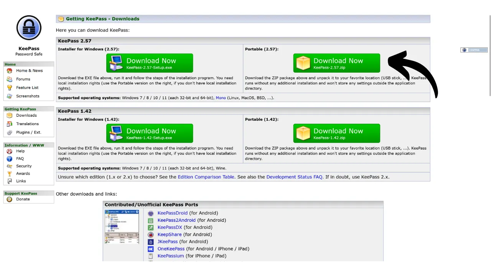
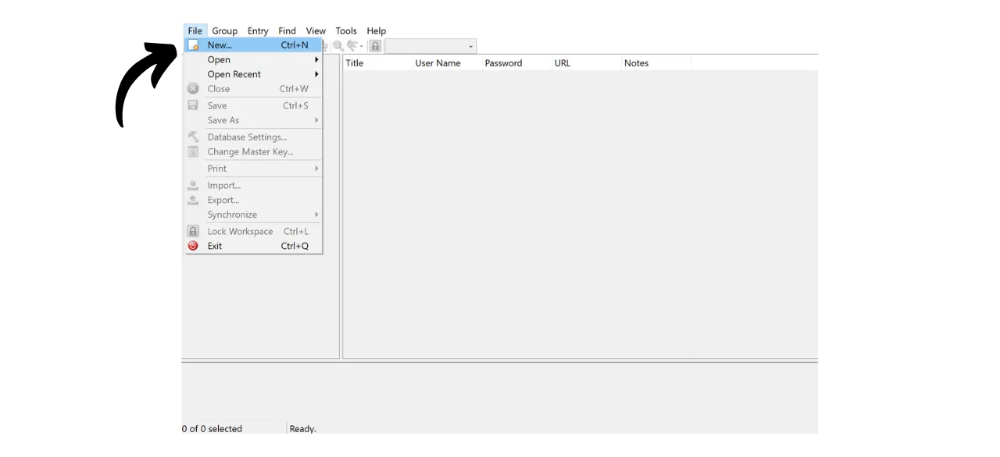

Nell'era digitale, abbiamo la necessità di gestire una moltitudine di account online che coprono vari aspetti della nostra vita quotidiana, inclusi servizi bancari, piattaforme finanziarie, email, archiviazione di file, salute, amministrazione, reti sociali, videogiochi, ecc.

Per autenticarci su ciascuno di questi account, utilizziamo un identificativo, spesso un indirizzo email, accompagnato da una password. Di fronte all'impossibilità di memorizzare un gran numero di password uniche, si potrebbe essere tentati di riutilizzare la stessa password o di modificarne leggermente una base comune per renderla più facile da ricordare. Tuttavia, queste pratiche compromettono seriamente la sicurezza dei vostri account.

Il primo principio da seguire per le password è di non riutilizzarle. Ogni account online dovrebbe essere protetto da una password unica e completamente distinta. Questo è importante perché, se un attaccante riesce a compromettere una delle vostre password, non vorrete che abbia accesso a tutti i vostri account. Avere una password unica per ogni account isola gli attacchi potenziali e limita il loro raggio d'azione. Ad esempio, se usate la stessa password per una piattaforma di videogiochi e per la vostra email, e quella password viene compromessa tramite un sito di phishing relativo alla piattaforma di gioco, l'attaccante potrebbe poi facilmente accedere alla vostra email e prendere il controllo di tutti i vostri altri account online.

Il secondo principio essenziale è la forza della password. Una password è considerata forte se è difficile da forzare brutalmente, ovvero da indovinare attraverso tentativi ed errori. Ciò significa che le vostre password devono essere il più casuali possibile, lunghe e includere una diversità di caratteri (minuscole, maiuscole, numeri e simboli).

Applicare questi due principi di sicurezza delle password (unicità e robustezza) può rivelarsi difficile nella vita quotidiana, poiché è quasi impossibile memorizzare una password unica, casuale e forte per tutti i nostri account. Qui entra in gioco il gestore di password.

Un gestore di password genera e memorizza in modo sicuro password forti, permettendovi di accedere a tutti i vostri account online senza la necessità di memorizzarle individualmente. È necessario ricordare solo una password, la password principale, che vi dà accesso a tutte le vostre password salvate nel gestore. Utilizzare un gestore di password migliora la vostra sicurezza online perché impedisce il riutilizzo delle password e genera sistematicamente password casuali. Ma semplifica anche l'uso quotidiano dei vostri account centralizzando l'accesso alle vostre informazioni sensibili.
In questo tutorial, impareremo come configurare e utilizzare un gestore di password locale per migliorare la vostra sicurezza online. Qui, vi presenterò KeePass. Tuttavia, se siete principianti e desiderate avere un gestore di password online capace di sincronizzarsi su più dispositivi, vi consiglio di seguire il nostro tutorial su Bitwarden:
https://planb.network/tutorials/others/bitwarden

---

*Attenzione: Un gestore di password è ottimo per memorizzare le password, ma **non dovreste mai memorizzare la frase mnemonica del vostro portafoglio Bitcoin in esso!** Ricordate, una frase mnemonica dovrebbe essere salvata esclusivamente in un formato fisico, come un pezzo di carta o metallo.*

---

## Introduzione a KeePass

KeePass è un gestore di password gratuito e open-source, perfetto per coloro che desiderano una soluzione gratuita e sicura per la gestione locale. È un software da installare sul vostro PC che, senza l'aggiunta di plugin, non comunica con Internet. Questo è un approccio radicalmente diverso da quello di Bitwarden, che abbiamo trattato in un tutorial precedente. Bitwarden, a differenza di KeePass, permette la sincronizzazione su più dispositivi e quindi richiede la memorizzazione delle vostre password su un server online.
Di default, KeePass non supporta l'uso di estensioni per browser come Bitwarden; pertanto, sarà necessario copiare e incollare manualmente le proprie password dal software. Anche se ciò può sembrare una limitazione, copiare e incollare le password invece di utilizzare l'auto-riempimento è una buona pratica per la sicurezza online.
KeePass è progettato per essere allo stesso tempo leggero e facile da usare, pur aderendo a elevati standard di sicurezza. Il software cripta il tuo database localmente per una protezione ottimale delle tue credenziali. KeePass è anche l'unico gestore di password validato dall'ANSSI (l'autorità francese di cybersecurity).

Uno dei principali vantaggi di KeePass è la sua flessibilità. Può essere utilizzato in molti modi diversi, ad esempio su una chiavetta USB senza la necessità di installazione su un computer. Inoltre, grazie al suo [ambiente plugin](https://keepass.info/plugins.html), KeePass può essere personalizzato per soddisfare esigenze più specifiche.

## Come scaricare KeePass?

Il processo di installazione di KeePass varia a seconda del sistema operativo che stai utilizzando. Per gli utenti Windows o Linux, l'installazione è relativamente semplice. Tuttavia, se sei su macOS, è necessario un passaggio aggiuntivo a causa dello sviluppo di KeePass sulla piattaforma .NET, che non è direttamente supportata da macOS. Pertanto, sarà necessario configurare un ambiente compatibile per consentire l'esecuzione di KeePass sui dispositivi Apple.

Per gli utenti Debian/Ubuntu, apri il terminale e inserisci i seguenti comandi:

```bash
sudo apt-get update
sudo apt-get install keepass2
```

Per Fedora:

```bash
sudo dnf install keepass
```

Per Arch Linux:

```bash
sudo pacman -S keepass
```

Se sei su un computer Windows, vai alla [pagina ufficiale di download di KeePass](https://keepass.info/download.html) e scarica l'ultima versione dell'installer:

Clicca sul file scaricato per eseguirlo, poi segui le istruzioni della procedura guidata di installazione per completare l'installazione (vedi sezione successiva).

Per gli utenti macOS, l'installazione è un po' più complessa. Se desideri utilizzare la versione originale di KeePass come su Windows, segui le istruzioni sottostanti. Altrimenti, puoi optare per [KeePassXC](https://keepassxc.org/), una versione alternativa compatibile con macOS, che offre un'interfaccia leggermente diversa.

Per utilizzare KeePass, avrai bisogno di un ambiente di runtime per le applicazioni .NET. Ti consiglio di installare Mono per questo. Vai alla [pagina ufficiale di Mono](https://www.mono-project.com/download/stable/#download-mac) nella sezione "*macOS*", e clicca sul link per scaricare il pacchetto di installazione (`.pkg`).

Apri il file `.pkg` scaricato e segui le istruzioni per installare Mono sul tuo Mac.

Successivamente, vai al sito ufficiale di KeePass e scarica l'ultima versione portatile in formato `.zip`.

Dopo aver scaricato il file `.zip`, fai doppio clic per estrarlo. Otterrai una cartella contenente diversi file, inclusi `KeePass.exe`. Apri un terminale, naviga alla cartella KeePass (sostituisci `xx` con il numero di versione):

```bash
cd ~/Downloads/KeePass-2.xx
```

E infine, esegui KeePass con Mono:

```bash
mono KeePass.exe
```

## Come installare KeePass?

Alla prima apertura, puoi scegliere la lingua dell'interfaccia.

Accetta i termini della licenza.

Scegli la cartella in cui verrà installato KeePass.

Opzionalmente, puoi modificare i componenti dell'applicazione che verranno installati. Se hai abbastanza spazio, puoi semplicemente scegliere "*Installazione completa*".

E infine, puoi scegliere di aggiungere un collegamento sul tuo desktop.

Clicca sul pulsante "*Installa*".

Attendi durante l'installazione, poi clicca sul pulsante "*Fine*".

## Come configurare KeePass?

Ora arrivi all'interfaccia di KeePass.
Per creare il tuo primo database, clicca sulla scheda "*File*".

Poi sul menu "*Nuovo*".

Il software creerà un nuovo database dove verranno memorizzate le tue password. Devi selezionare la posizione per questa cartella. Scegli una posizione facilmente accessibile.

Successivamente, dovresti pensare a fare regolarmente il backup di questa cartella per evitare di perdere le tue credenziali in caso di perdita, danneggiamento o furto del tuo computer. Ad esempio, potresti copiare il database su una chiavetta USB ogni settimana. Il file contenente il tuo database si chiama `Database.kdbx` (il documento è criptato con la tua password principale). Per ulteriori consigli sulle migliori pratiche di backup, ti consiglio anche di consultare questo altro tutorial:

https://planb.network/tutorials/others/proton-drive

Segue la scelta della tua password principale.

Come abbiamo visto nell'introduzione, questa password è molto importante, poiché ti dà accesso a tutte le tue altre password salvate nel database. Questa password verrà utilizzata per criptare il database `Database.kdbx`. Presenta due principali rischi: la perdita e il compromesso. Se perdi l'accesso a questa password, non sarai più in grado di accedere a tutte le tue credenziali. Se la tua password viene rubata, oltre al database criptato, l'attaccante sarà in grado di accedere a tutti i tuoi account.

Per minimizzare il rischio di perdita, ti consiglio di fare un backup fisico della tua password principale su carta e di conservarlo in un luogo sicuro. Se possibile, sigilla questo backup in una busta sicura per assicurarti regolarmente che nessun altro ci abbia avuto accesso.

Per prevenire il compromesso della tua password principale, essa deve essere estremamente robusta. Dovrebbe essere il più lunga possibile, utilizzare una vasta varietà di caratteri e essere scelta in modo casuale. Nel 2024, le raccomandazioni minime per una password sicura sono 13 caratteri inclusi numeri, lettere minuscole e maiuscole, così come simboli, a patto che la password sia veramente casuale. Tuttavia, ti consiglio di optare per una password di almeno 20 caratteri, includendo tutti i tipi possibili di caratteri, per garantirne la sicurezza per un tempo più lungo.

Inserisci la tua password principale nella casella dedicata e confermala nella casella seguente, poi clicca su "*OK*".

Nomina il tuo database e aggiungi una descrizione se necessario. Questo può aiutarti a distinguere tra diversi database se ne crei più di uno, ad esempio, uno per uso personale e un altro per uso professionale.

Per le altre impostazioni, ti consiglio di mantenere le opzioni predefinite. Poi clicca sul pulsante "*OK*".
KeePass offre quindi la possibilità di stampare un foglio di emergenza.
Su questo foglio, troverai la posizione del tuo database nei tuoi file, uno spazio per scrivere manualmente la tua master password, nonché le istruzioni per accedervi. Questo foglio dovrebbe essere affidato a persone di fiducia, poiché permette il recupero dell'accesso alle tue credenziali in caso di problemi.

Tuttavia, dato che questo foglio fornisce l'accesso alle tue password rivelando la tua master password, deve essere utilizzato con cautela. È consigliabile conservarlo almeno in una busta sigillata, che permette controlli periodici per assicurarsi che non sia stato consultato. Non sei obbligato a utilizzare questo foglio e potresti considerare altri metodi di backup per i tuoi cari.

Puoi quindi accedere al tuo gestore di password.

Prima di iniziare a salvare le tue credenziali, ti consiglio di cambiare le impostazioni di generazione della password. Per fare ciò, vai alla scheda "*Strumenti*" e seleziona "*Genera Password...*".

Qui, ti consiglio di aumentare la lunghezza delle password generate a 40 caratteri. Ora che hai un gestore di password che le ricorda per te, non c'è motivo di risparmiare sul numero di caratteri. Inoltre, non avrai bisogno di scrivere le password a mano, poiché puoi copiarle e incollarle. Quindi, per te non fa differenza avere password molto lunghe di 40 caratteri, tuttavia, la loro sicurezza è notevolmente migliorata. Ti consiglio di fare ciò, e anche di spuntare la casella per i caratteri speciali.

Conferma cliccando sull'icona di salvataggio piccola.

Aggiungi un nome al tuo profilo password.

## Come proteggere i tuoi account con KeePass?

Per registrare una nuova credenziale nel tuo gestore KeePass, basta cliccare sull'icona della chiave con la freccia verde.

Nella finestra di generazione e salvataggio, clicca sulla piccola icona della chiave e seleziona il tuo profilo di password di 40 caratteri.
Inserisci il nome utente per questo account così come un titolo per trovarlo facilmente nel tuo database.  È anche possibile aggiungere un URL se desideri utilizzare scorciatoie in seguito, e se necessario, una nota.  Se tutto è di tuo gradimento, clicca su "*OK*" per salvare la password.  Puoi trovare la tua password nella homepage del tuo gestore KeePass.  Per copiare una password, basta fare doppio clic su di essa. Rimarrà negli appunti per 12 secondi, permettendoti di incollarla sul sito web durante il tuo prossimo accesso.  Se desideri estendere la durata della permanenza della password negli appunti, clicca sulla scheda "*Strumenti*", poi su "*Opzioni...*".  Sotto la scheda "*Sicurezza*", regola la durata cambiando il numero di secondi nel riquadro "*Tempo di cancellazione automatica degli appunti*". Poi clicca su "*OK*" per salvare le tue modifiche.  Sul lato sinistro della tua interfaccia, noterai che ci sono diverse cartelle per organizzare le tue password.  Hai l'opzione di eliminare le cartelle predefinite o di aggiungerne di nuove facendo clic con il tasto destro e selezionando "*Aggiungi Gruppo...*".  Scegli un nome per la nuova cartella e seleziona un'icona. Puoi anche importare le tue icone in formato `.ico`. Poi clicca sul pulsante "*OK*" per finalizzare la creazione della cartella.  La tua cartella appare a sinistra.  Per aggiungere una password a una cartella, basta trascinarla dal database alla cartella desiderata.  Questa funzionalità ti aiuta a organizzare il tuo gestore di password e a trovare più facilmente le tue credenziali.
Un altro metodo per localizzare una password è utilizzare la funzione di ricerca. Digita il titolo dell'identificativo che desideri trovare nella barra di ricerca situata in alto nell'interfaccia, e accederai direttamente ad esso.  Sii vigile, poiché KeePass funziona un po' come un documento di testo. Prima di chiudere l'applicazione, se hai aggiunto nuovi elementi al tuo gestore, ricordati di salvare il database. Puoi farlo cliccando sull'icona di salvataggio o utilizzando la scorciatoia da tastiera `Ctrl+S`. 
Se lasci KeePass aperto in background, il software non si chiuderà di default. Tuttavia, se chiudi KeePass o spegni il tuo computer, dovrai inserire la tua password principale per decifrare il tuo database quando riaprirai il software. 
Questo copre le funzionalità di base di KeePass. Ovviamente, questo tutorial rivolto ai principianti ha solo sfiorato la superficie delle molte opzioni disponibili con questo software. Ci sono una moltitudine di funzionalità aggiuntive da esplorare, per non parlare di [tutti i plugin sviluppati dalla comunità](https://keepass.info/plugins.html) che possono estendere ulteriormente le capacità di KeePass.

Se sei interessato a scoprire come migliorare drasticamente la sicurezza dei tuoi account online per evitare il hacking con il 2FA, ti consiglio anche di consultare questo altro tutorial:

https://planb.network/tutorials/others/authy