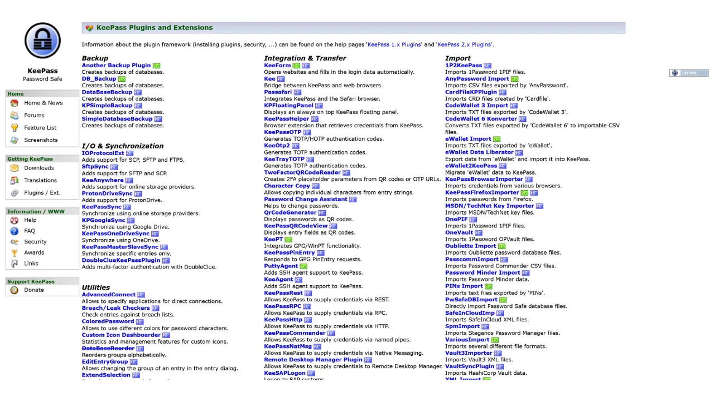
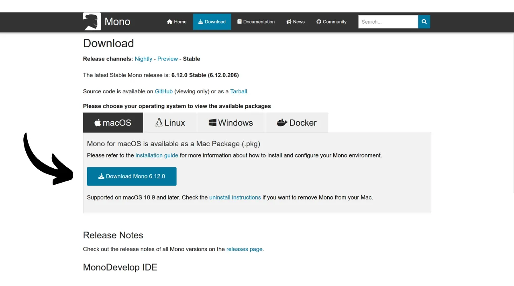
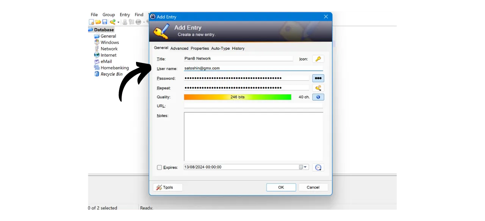

デジタル時代において、私たちは銀行、金融プラットフォーム、メール、ファイルストレージ、健康、行政、ソーシャルネットワーク、ビデオゲームなど、日常生活の様々な側面をカバーする多数のオンラインアカウントを管理する必要があります。

これらのアカウントのそれぞれに自分を認証するために、私たちは識別子（しばしばメールアドレス）とパスワードを使用します。多くのユニークなパスワードを記憶することが不可能であるため、同じパスワードを再利用したり、共通の基盤をわずかに変更して覚えやすくすることを試みるかもしれません。しかし、これらの慣行はアカウントのセキュリティを深刻に損ないます。

パスワードに従うべき最初の原則は、それらを再利用しないことです。オンラインアカウントはそれぞれ独自で完全に異なるパスワードで保護されるべきです。これは重要です。なぜなら、攻撃者があなたのパスワードの1つを侵害した場合、彼らがあなたのすべてのアカウントにアクセスできるようにしたくないからです。各アカウントにユニークなパスワードを持つことは、潜在的な攻撃を隔離し、その範囲を限定します。例えば、ビデオゲームプラットフォームとメールの両方で同じパスワードを使用していて、そのパスワードがゲームプラットフォームに関連するフィッシングサイトを通じて侵害された場合、攻撃者は簡単にあなたのメールにアクセスし、他のすべてのオンラインアカウントを制御することができます。

二つ目の重要な原則はパスワードの強度です。パスワードが強いとは、ブルートフォース（試行錯誤による推測）が難しいことを意味します。つまり、パスワードはできるだけランダムで、長く、文字の多様性（小文字、大文字、数字、記号）を含む必要があります。

これら2つのパスワードセキュリティ原則（ユニークさと堅牢性）を日常生活で適用することは難しいかもしれません。なぜなら、私たちのすべてのアカウントに対してユニークでランダムで強力なパスワードを記憶することはほぼ不可能だからです。ここでパスワードマネージャーの出番です。

パスワードマネージャーは強力なパスワードを生成し、安全に保存することで、個々にそれらを記憶する必要なく、すべてのオンラインアカウントにアクセスできるようにします。覚える必要があるのは1つのパスワード、マスターパスワードだけで、これによりマネージャーに保存されたすべてのパスワードにアクセスできます。パスワードマネージャーを使用することは、パスワードの再利用を防ぎ、ランダムなパスワードを体系的に生成することで、オンラインセキュリティを強化します。しかし、アカウントの日常使用を簡素化し、機密情報へのアクセスを一元化することも意味します。
このチュートリアルでは、オンラインセキュリティを強化するためにローカルパスワードマネージャーを設定し、使用する方法を学びます。ここでは、KeePassを紹介します。しかし、初心者で複数のデバイス間で同期が可能なオンラインパスワードマネージャーをお探しの場合は、Bitwardenに関するチュートリアルをお勧めします：
https://planb.network/tutorials/others/bitwarden

---

*注意：パスワードマネージャーはパスワードの保存には最適ですが、**ビットコインウォレットのニーモニックフレーズをそれに保存してはいけません！** ニーモニックフレーズは、紙や金属のような物理的な形式でのみ保存されるべきです。*

---

## KeePassの紹介

KeePassは、ローカル管理のための無料でオープンソースのパスワードマネージャーで、無料で安全なソリューションを求める人に最適です。これは、プラグインを追加しない限り、インターネットと通信しないPCにインストールされるソフトウェアです。これは、前のチュートリアルで取り上げたBitwardenとは根本的に異なるアプローチです。Bitwardenは、KeePassとは異なり、複数のデバイス間での同期を可能にし、パスワードをオンラインサーバーに保存することを要求します。
デフォルトでは、KeePassはBitwardenのようなブラウザ拡張機能の使用をサポートしていません。そのため、ソフトウェアからパスワードを手動でコピー＆ペーストする必要があります。これは制約のように思えるかもしれませんが、自動入力を使用するのではなく、パスワードをコピー＆ペーストすることは、オンラインセキュリティにとって良い習慣です。
KeePassは、軽量で使いやすい設計でありながら、高いセキュリティ基準を守っています。このソフトウェアは、資格情報の最適な保護のために、データベースをローカルで暗号化します。また、KeePassは、フランスのサイバーセキュリティ機関であるANSSI（Agence nationale de la sécurité des systèmes d'information）によって検証された唯一のパスワードマネージャーです。

KeePassの主な利点の一つはその柔軟性です。インストールなしでUSBスティック上で使用するなど、さまざまな方法で使用できます。さらに、[プラグイン環境](https://keepass.info/plugins.html)のおかげで、KeePassはより特定のニーズに合わせてカスタマイズすることができます。

## KeePassのダウンロード方法は？

KeePassのインストールプロセスは、使用しているオペレーティングシステムによって異なります。WindowsまたはLinuxユーザーの場合、インストールは比較的簡単です。しかし、macOSを使用している場合は、KeePassが.NETプラットフォーム上で開発されており、macOSに直接サポートされていないため、追加のステップが必要です。そのため、AppleデバイスでKeePassを実行できるように、互換性のある環境を設定する必要があります。

Debian/Ubuntuユーザーの場合、ターミナルを開いて以下のコマンドを入力します：

```bash
sudo apt-get update
sudo apt-get install keepass2
```

Fedoraの場合：

```bash
sudo dnf install keepass
```

Arch Linuxの場合：

```bash
sudo pacman -S keepass
```

Windowsコンピューターを使用している場合は、[公式KeePassダウンロードページ](https://keepass.info/download.html)にアクセスし、インストーラーの最新バージョンをダウンロードしてください：

ダウンロードしたファイルをクリックして実行し、セットアップウィザードの指示に従ってインストールを完了します（次のセクションを参照）。

macOSユーザーの場合、インストールは少し複雑です。Windows上のオリジナルバージョンのKeePassを使用したい場合は、以下の指示に従ってください。それ以外の場合は、macOSと互換性のある代替バージョンである[KeePassXC](https://keepassxc.org/)を選択できます。これは、少し異なるインターフェースを提供します。

KeePassを使用するには、.NETアプリケーション用のランタイム環境が必要です。これにはMonoのインストールをお勧めします。"*macOS*"セクションの[公式Monoページ](https://www.mono-project.com/download/stable/#download-mac)にアクセスし、リンクをクリックしてインストールパッケージ（`.pkg`）をダウンロードしてください。

ダウンロードした`.pkg`ファイルを開き、指示に従ってMacにMonoをインストールします。

次に、公式KeePassウェブサイトにアクセスし、最新のポータブルバージョンを`.zip`形式でダウンロードします。

`.zip`ファイルをダウンロードしたら、ダブルクリックして解凍します。`KeePass.exe`を含む複数のファイルが入ったフォルダが得られます。ターミナルを開き、KeePassフォルダに移動します（`xx`をバージョン番号に置き換えてください）：

```bash
cd ~/Downloads/KeePass-2.xx
```

最後に、MonoでKeePassを実行します：

```bash
mono KeePass.exe
```

## KeePassのインストール方法は？

初回起動時には、インターフェース言語を選択できます。

ライセンスの条件を受け入れてください。
KeePassをインストールするフォルダを選択してください。

必要に応じて、インストールされるアプリケーションのコンポーネントを変更することができます。十分なスペースがある場合は、単に「*フルインストール*」を選択できます。

そして最後に、デスクトップにショートカットを追加することを選択できます。

「*インストール*」ボタンをクリックしてください。

インストール中は待ち、その後「*完了*」ボタンをクリックしてください。

## KeePassの設定方法は？

これで、KeePassのインターフェースに到着しました。
最初のデータベースを作成するには、「*ファイル*」タブをクリックしてください。

次に「*新規*」メニューを選択してください。

ソフトウェアは、パスワードが保存される新しいデータベースを作成します。このフォルダの場所を選択する必要があります。簡単にアクセスできる場所を選択してください。

その後、コンピュータの紛失、損傷、盗難の場合に資格情報を失うことがないように、このフォルダの定期的なバックアップを考えるべきです。例えば、毎週USBスティックにデータベースをコピーすることができます。データベースを含むファイルは`Database.kdbx`と名付けられており（ドキュメントはマスターパスワードで暗号化されています）、最適なバックアップ方法については、この他のチュートリアルも参照することをお勧めします：

https://planb.network/tutorials/others/proton-drive

次に、マスターパスワードの選択があります。

序章で見たように、このパスワードは非常に重要で、データベース内の他のすべての保存されたパスワードへのアクセスを可能にします。このパスワードは`Database.kdbx`データベースを暗号化するために使用されます。主に2つのリスクがあります：紛失と侵害。このパスワードへのアクセスを失うと、すべての資格情報にアクセスできなくなります。パスワードが盗まれた場合、暗号化されたデータベースに加えて、攻撃者はすべてのアカウントにアクセスできるようになります。

紛失のリスクを最小限に抑えるために、マスターパスワードの物理的なバックアップを紙にして、安全な場所に保管することをお勧めします。可能であれば、このバックアップを安全な封筒に封印して、他の誰もアクセスしていないことを定期的に確認してください。

マスターパスワードの侵害を防ぐためには、非常に強固でなければなりません。できるだけ長く、さまざまな文字を使用し、ランダムに選ばれるべきです。2024年の安全なパスワードの最小推奨事項は、パスワードが本当にランダムであることを前提として、数字、小文字と大文字の文字、および記号を含む13文字です。しかし、より長い時間安全を保証するために、すべての可能なタイプの文字を含む少なくとも20文字のパスワードを選択することをお勧めします。

専用のボックスにマスターパスワードを入力し、次のボックスでそれを確認した後、「*OK*」をクリックしてください。

データベースに名前を付け、必要に応じて説明を追加してください。これは、個人用とプロフェッショナル用など、複数のデータベースを作成する場合に、異なるデータベースを区別するのに役立ちます。

その他の設定については、デフォルトのオプションを維持することをお勧めします。その後、「*OK*」ボタンをクリックしてください。
KeePassでは、緊急シートの印刷を提案しています。
このシートには、ファイル内のデータベースの場所、マスターパスワードを手書きで記入するスペース、およびそれにアクセスするための指示が記載されています。このシートは、問題が発生した場合に資格情報へのアクセスを回復することを可能にするため、信頼できる個人に託すべきです。

しかし、このシートはマスターパスワードを明らかにすることでパスワードへのアクセスを提供するため、注意して使用する必要があります。最低限、封筒に密封して保管し、定期的にチェックして誰かに見られたかどうかを確認することが勧められます。このシートを使用する義務はありませんし、愛する人のために他のバックアップ方法を検討することもできます。

その後、パスワードマネージャーにアクセスできます。

資格情報を保存し始める前に、パスワード生成設定を変更することをお勧めします。これを行うには、「*Tools*」タブに移動し、「*Generate Password...*」を選択します。

ここでは、生成されるパスワードの長さを40文字に増やすことをお勧めします。パスワードマネージャーが覚えてくれるので、文字数をケチる必要はありません。さらに、パスワードを手書きで記録する必要はなく、コピー＆ペーストできるので、40文字の非常に長いパスワードを持つことに何の違いもありません。しかし、そのセキュリティは大幅に向上します。これを行い、特殊文字のチェックボックスをオンにすることをお勧めします。

小さな保存アイコンをクリックして確認します。

パスワードプロファイルに名前を追加します。

## KeePassでアカウントを保護する方法は？

KeePassマネージャーに新しい資格情報を登録するには、緑の矢印が付いた鍵のアイコンをクリックするだけです。
生成および保存ウィンドウで、小さな鍵のアイコンをクリックし、40文字のパスワードプロファイルを選択します。
このアカウントのユーザー名と、データベースで簡単に見つけられるタイトルを入力してください。  また、後でショートカットを使用したい場合はURLを追加することもできますし、必要であればメモも追加できます。  すべてがご満足いただける場合は、"*OK*"をクリックしてパスワードを保存してください。  KeePassマネージャーのホームページでパスワードを見つけることができます。  パスワードをコピーするには、単にダブルクリックします。これにより、クリップボードに12秒間保持され、次回のログイン時にウェブサイトに貼り付けることができます。  パスワードがクリップボードに残る時間を延長したい場合は、"*ツール*"タブをクリックし、"*オプション...*"を選択してください。  "*セキュリティ*"タブの下で、"*クリップボード自動クリア時間*"ボックス内の秒数を変更して時間を調整します。その後、"*OK*"をクリックして変更を保存してください。  インターフェースの左側には、パスワードを整理するためのいくつかのフォルダがあることに気づくでしょう。  デフォルトのフォルダを削除するか、右クリックして"*グループの追加...*"を選択して新しいフォルダを追加するオプションがあります。  新しいフォルダに名前を付け、アイコンを選択します。`.ico`形式で自分のアイコンをインポートすることもできます。その後、"*OK*"ボタンをクリックしてフォルダの作成を完了してください。  フォルダは左側に表示されます。  フォルダにパスワードを追加するには、単にデータベースから希望するフォルダにドラッグします。  この機能により、パスワードマネージャーを整理し、資格情報を簡単に見つけることができます。
パスワードを見つける別の方法は、検索機能を使用することです。インターフェースの上部にある検索バーに、見つけたい識別子のタイトルを入力すると、直接アクセスできます。  KeePassはテキストドキュメントのように少し動作するため、注意してください。アプリケーションを閉じる前に、マネージャーに新しいアイテムを追加した場合は、データベースを保存することを忘れないでください。これは、保存アイコンをクリックするか、キーボードショートカット`Ctrl+S`を使用して行うことができます。 
KeePassをバックグラウンドで開いたままにしておくと、ソフトウェアはデフォルトでは閉じません。しかし、KeePassを閉じるか、コンピューターをシャットダウンすると、ソフトウェアを再開する際にマスターパスワードを入力してデータベースを復号化する必要があります。 
これでKeePassの基本機能について説明しました。もちろん、この初心者向けチュートリアルでは、このソフトウェアで利用可能な多くのオプションの表面をかすめただけです。さらに多くの追加機能を探求することができますし、KeePassの機能をさらに拡張することができる[コミュニティによって開発されたすべてのプラグイン](https://keepass.info/plugins.html)もあります。

オンラインアカウントのセキュリティを大幅に向上させ、2FAを使用してハッキングを避ける方法を学びたい場合は、この他のチュートリアルもチェックすることをお勧めします：

https://planb.network/tutorials/others/authy