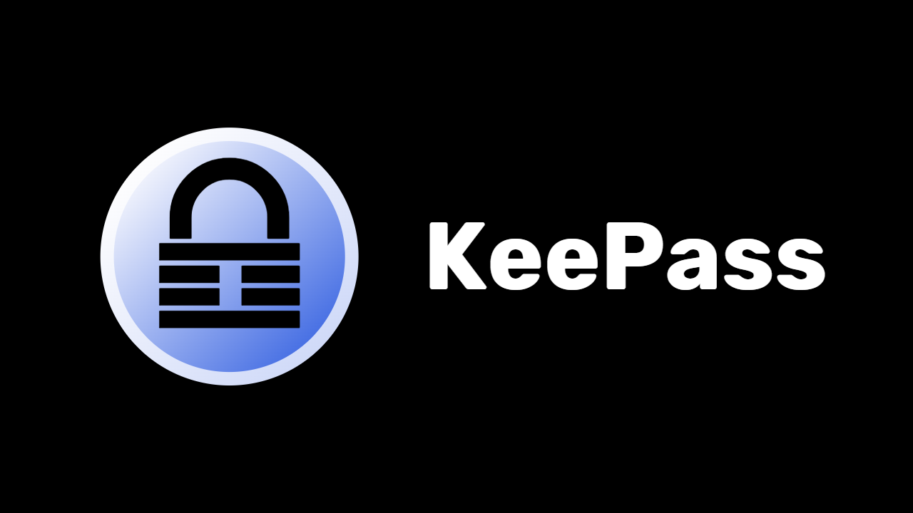
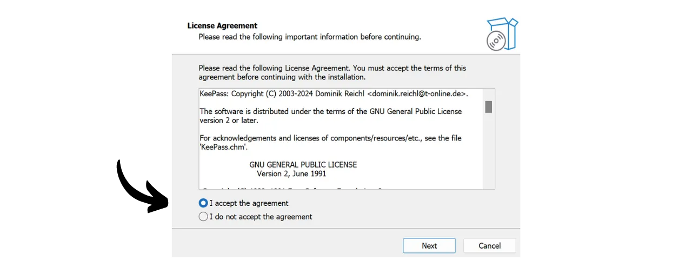
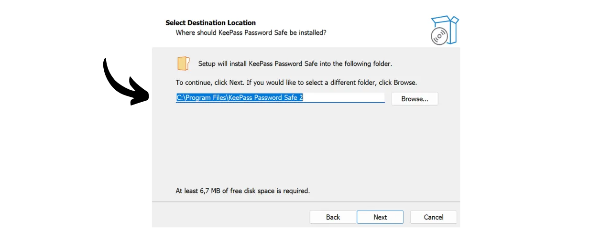
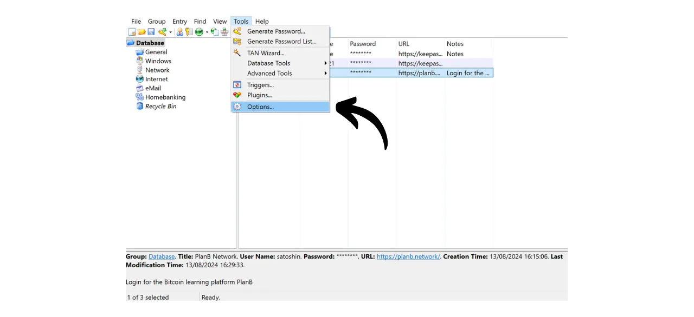

Na era digital, precisamos gerenciar uma infinidade de contas online que cobrem vários aspectos de nossas vidas diárias, incluindo bancos, plataformas financeiras, emails, armazenamento de arquivos, saúde, administração, redes sociais, jogos de vídeo, etc.

Para nos autenticarmos em cada uma dessas contas, usamos um identificador, muitas vezes um endereço de email, acompanhado por uma senha. Diante da impossibilidade de memorizar um grande número de senhas únicas, pode-se ser tentado a reutilizar a mesma senha ou a modificar ligeiramente uma base comum para facilitar a memorização. No entanto, essas práticas comprometem seriamente a segurança de suas contas.

O primeiro princípio a seguir para as senhas é não reutilizá-las. Cada conta online deve ser protegida por uma senha única e completamente distinta. Isso é importante porque, se um atacante conseguir comprometer uma de suas senhas, você não quer que ele tenha acesso a todas as suas contas. Ter uma senha única para cada conta isola ataques potenciais e limita seu escopo. Por exemplo, se você usa a mesma senha para uma plataforma de jogos de vídeo e para seu email, e essa senha é comprometida via um site de phishing relacionado à plataforma de jogos, o atacante poderia então facilmente acessar seu email e assumir o controle de todas as suas outras contas online.

O segundo princípio essencial é a força da senha. Uma senha é considerada forte se for difícil de ser descoberta por tentativa e erro, ou seja, por força bruta. Isso significa que suas senhas devem ser o mais aleatórias possível, longas e incluir uma diversidade de caracteres (minúsculas, maiúsculas, números e símbolos).

Aplicar esses dois princípios de segurança de senha (unicidade e robustez) pode provar ser difícil no dia a dia, já que é quase impossível memorizar uma senha única, aleatória e forte para todas as nossas contas. É aqui que entra o gerenciador de senhas.

Um gerenciador de senhas gera e armazena de forma segura senhas fortes, permitindo que você acesse todas as suas contas online sem a necessidade de memorizá-las individualmente. Você só precisa lembrar de uma senha, a senha mestre, que lhe dá acesso a todas as suas senhas salvas no gerenciador. Usar um gerenciador de senhas aumenta sua segurança online porque impede a reutilização de senhas e gera sistematicamente senhas aleatórias. Mas também simplifica o uso diário de suas contas centralizando o acesso às suas informações sensíveis.
Neste tutorial, aprenderemos como configurar e usar um gerenciador de senhas local para melhorar sua segurança online. Aqui, vou apresentá-lo ao KeePass. No entanto, se você é iniciante e gostaria de ter um gerenciador de senhas online capaz de sincronizar entre vários dispositivos, recomendo seguir nosso tutorial sobre o Bitwarden:
https://planb.network/tutorials/others/bitwarden

---

*Cuidado: Um gerenciador de senhas é ótimo para armazenar senhas, mas **você nunca deve armazenar a frase mnemônica da sua carteira Bitcoin nele!** Lembre-se, uma frase mnemônica deve ser exclusivamente salva em um formato físico, como um pedaço de papel ou metal.*

---

## Introdução ao KeePass

KeePass é um gerenciador de senhas gratuito e de código aberto, perfeito para aqueles que desejam uma solução gratuita e segura para gerenciamento local. É um software a ser instalado no seu PC que, sem a adição de plugins, não se comunica com a Internet. Esta é uma abordagem radicalmente diferente daquela do Bitwarden, que cobrimos em um tutorial anterior. Bitwarden, ao contrário do KeePass, permite a sincronização entre vários dispositivos e, portanto, requer o armazenamento de suas senhas em um servidor online.
Por padrão, o KeePass não suporta o uso de extensões de navegador como o Bitwarden; portanto, você precisará copiar e colar suas senhas manualmente do software. Embora isso possa parecer uma limitação, copiar e colar senhas em vez de usar o preenchimento automático é uma boa prática para a sua segurança online.
O KeePass é projetado para ser leve e fácil de usar, aderindo a altos padrões de segurança. O software criptografa seu banco de dados localmente para proteção ótima de suas credenciais. O KeePass é também o único gerenciador de senhas validado pela ANSSI (a autoridade francesa de cibersegurança).

Uma das principais vantagens do KeePass é sua flexibilidade. Ele pode ser usado de várias maneiras diferentes, como em um pendrive sem a necessidade de instalação em um computador. Além disso, graças ao seu [ambiente de plugins](https://keepass.info/plugins.html), o KeePass pode ser personalizado para atender necessidades mais específicas.

## Como Baixar o KeePass?

O processo de instalação do KeePass varia dependendo do sistema operacional que você está usando. Para usuários de Windows ou Linux, a instalação é relativamente simples. No entanto, se você estiver usando o macOS, um passo adicional é necessário devido ao desenvolvimento do KeePass na plataforma .NET, que não é diretamente suportada pelo macOS. Portanto, você precisará configurar um ambiente compatível para permitir que o KeePass funcione em dispositivos Apple.

Para usuários de Debian/Ubuntu, abra o terminal e insira os seguintes comandos:

```bash
sudo apt-get update
sudo apt-get install keepass2
```

Para Fedora:

```bash
sudo dnf install keepass
```

Para Arch Linux:

```bash
sudo pacman -S keepass
```

Se você estiver em um computador Windows, vá para a [página oficial de download do KeePass](https://keepass.info/download.html) e baixe a versão mais recente do instalador:

Clique no arquivo baixado para executá-lo, depois siga as instruções do assistente de configuração para completar a instalação (veja a próxima seção).

Para usuários de macOS, a instalação é um pouco mais complexa. Se você deseja usar a versão original do KeePass como no Windows, siga as instruções abaixo. Caso contrário, você pode optar pelo [KeePassXC](https://keepassxc.org/), uma versão alternativa compatível com macOS, que oferece uma interface um pouco diferente.

Para usar o KeePass, você precisará de um ambiente de tempo de execução para aplicações .NET. Eu recomendo instalar o Mono para isso. Vá para a [página oficial do Mono](https://www.mono-project.com/download/stable/#download-mac) na seção "*macOS*", e clique no link para baixar o pacote de instalação (`.pkg`).

Abra o arquivo `.pkg` baixado e siga as instruções para instalar o Mono no seu Mac.

Em seguida, vá para o site oficial do KeePass e baixe a versão portátil mais recente em formato `.zip`.

Após baixar o arquivo `.zip`, dê um duplo clique para extraí-lo. Você obterá uma pasta contendo vários arquivos, incluindo `KeePass.exe`. Abra um terminal, navegue até a pasta KeePass (substitua `xx` pelo número da versão):

```bash
cd ~/Downloads/KeePass-2.xx
```

E finalmente, execute o KeePass com o Mono:

```bash
mono KeePass.exe
```

## Como instalar o KeePass?

Na primeira execução, você pode escolher o idioma da interface.

Aceite os termos da licença.

Escolha a pasta onde o KeePass será instalado.

Opcionalmente, você pode modificar os componentes da aplicação que serão instalados. Se você tiver espaço suficiente, pode simplesmente escolher "*Instalação completa*".

E, finalmente, você pode escolher adicionar um atalho na sua área de trabalho.

Clique no botão "*Instalar*".

Aguarde durante a instalação e, em seguida, clique no botão "*Concluir*".

## Como configurar o KeePass?

Você agora chega à interface do KeePass.
Para criar seu primeiro banco de dados, clique na aba "*Arquivo*".

Em seguida, no menu "*Novo*".

O software criará um novo banco de dados onde suas senhas serão armazenadas. Você precisa selecionar o local para esta pasta. Escolha um local de fácil acesso.

Depois, você deve pensar em fazer backup regularmente desta pasta para evitar perder suas credenciais em caso de perda, dano ou roubo do seu computador. Por exemplo, você poderia copiar o banco de dados para um pendrive toda semana. O arquivo contendo seu banco de dados é nomeado `Database.kdbx` (o documento é criptografado com sua senha mestra). Para mais conselhos sobre as melhores práticas de backup, recomendo também consultar este outro tutorial:

https://planb.network/tutorials/others/proton-drive

A seguir, vem a escolha da sua senha mestra.

Como vimos na introdução, esta senha é muito importante, pois dá acesso a todas as suas outras senhas salvas no banco de dados. Esta senha será usada para criptografar o banco de dados `Database.kdbx`. Ela apresenta dois principais riscos: perda e comprometimento. Se você perder o acesso a esta senha, não poderá mais acessar todas as suas credenciais. Se sua senha for roubada, além do banco de dados criptografado, o atacante poderá acessar todas as suas contas.

Para minimizar o risco de perda, recomendo fazer um backup físico da sua senha mestra em papel e armazená-lo em um local seguro. Se possível, sele este backup em um envelope seguro para garantir regularmente que mais ninguém teve acesso a ele.

Para prevenir o comprometimento da sua senha mestra, ela deve ser extremamente robusta. Deve ser o mais longa possível, usar uma grande variedade de caracteres e ser escolhida aleatoriamente. Em 2024, as recomendações mínimas para uma senha segura são 13 caracteres incluindo números, letras minúsculas e maiúsculas, bem como símbolos, desde que a senha seja verdadeiramente aleatória. No entanto, recomendo optar por uma senha de pelo menos 20 caracteres, incluindo todos os tipos possíveis de caracteres, para garantir sua segurança por mais tempo.

Digite sua senha mestra no campo dedicado e confirme-a no campo seguinte, depois clique em "*OK*".

Nomeie seu banco de dados e adicione uma descrição, se necessário. Isso pode ajudá-lo a distinguir entre diferentes bancos de dados se você criar vários, por exemplo, um para uso pessoal e outro para uso profissional.

Para outras configurações, recomendo manter as opções padrão. Em seguida, clique no botão "*OK*".
O KeePass então oferece para imprimir uma ficha de emergência.

Nesta ficha, você encontrará a localização do seu banco de dados nos seus arquivos, um espaço para anotar manualmente sua senha mestra, bem como instruções para acessá-la. Esta ficha deve ser confiada a pessoas de confiança, pois permite a recuperação do acesso às suas credenciais em caso de problema.

No entanto, uma vez que esta ficha proporciona acesso às suas senhas ao revelar sua senha mestra, deve ser usada com cautela. É aconselhável mantê-la em um envelope lacrado no mínimo, o que permite verificações periódicas para garantir que não foi consultada. Você não é obrigado a usar esta ficha e pode considerar outros métodos de backup para seus entes queridos.

Você pode então acessar seu gerenciador de senhas.

Antes de começar a salvar suas credenciais, recomendo alterar as configurações de geração de senha. Para fazer isso, vá até a aba "*Tools*" e selecione "*Generate Password...*".

Aqui, aconselho a aumentar o comprimento das senhas geradas para 40 caracteres. Agora que você tem um gerenciador de senhas para lembrá-las por você, não há necessidade de economizar no número de caracteres. Além disso, você não precisará anotar as senhas à mão, já que pode copiá-las e colá-las. Então, não faz diferença para você ter senhas muito longas de 40 caracteres, no entanto, a segurança delas é grandemente aumentada. Aconselho a fazer isso, e também a marcar a caixa para caracteres especiais.

Confirme clicando no pequeno ícone de salvar.

Adicione um nome ao seu perfil de senha.

## Como proteger suas contas com o KeePass?

Para registrar uma nova credencial no seu gerenciador KeePass, basta clicar no ícone de chave com a seta verde.

Na janela de geração e salvamento, clique no pequeno ícone de chave e selecione seu perfil de senha de 40 caracteres.

Insira o nome de usuário para esta conta, bem como um título para encontrá-la facilmente em seu banco de dados.  Também é possível adicionar uma URL se desejar usar atalhos mais tarde, e, se necessário, uma nota.  Se tudo estiver conforme sua satisfação, clique em "*OK*" para salvar a senha.  Você pode encontrar sua senha na página inicial do seu gerenciador KeePass.  Para copiar uma senha, basta dar um duplo clique nela. Ela permanecerá na sua área de transferência por 12 segundos, permitindo que você a cole no site durante seu próximo login.  Se desejar estender a duração da senha na área de transferência, clique na aba "*Ferramentas*", depois em "*Opções...*".  Na aba "*Segurança*", ajuste a duração alterando o número de segundos na caixa "*Tempo de limpeza automática da área de transferência*". Então clique em "*OK*" para salvar suas alterações.  No lado esquerdo da sua interface, você notará que existem várias pastas para organizar suas senhas.  Você tem a opção de deletar as pastas padrão ou adicionar novas clicando com o botão direito e selecionando "*Adicionar Grupo...*".  Escolha um nome para a nova pasta e selecione um ícone. Você também pode importar seus próprios ícones no formato `.ico`. Então clique no botão "*OK*" para finalizar a criação da pasta.  Sua pasta aparece à esquerda.  Para adicionar uma senha a uma pasta, simplesmente arraste-a do banco de dados para a pasta desejada.  Esta funcionalidade ajuda você a organizar seu gerenciador de senhas e encontrar suas credenciais mais facilmente.
Outro método para localizar uma senha é usar a função de busca. Digite o título do identificador que deseja encontrar na barra de busca localizada no topo da interface, e você terá acesso direto a ele.  Seja vigilante, pois o KeePass funciona um pouco como um documento de texto. Antes de fechar o aplicativo, se você adicionou novos itens ao seu gerenciador, lembre-se de salvar o banco de dados. Você pode fazer isso clicando no ícone de salvar ou usando o atalho de teclado `Ctrl+S`. 
Se você deixar o KeePass aberto em segundo plano, o software não fechará por padrão. No entanto, se você fechar o KeePass ou desligar seu computador, precisará inserir sua senha mestra para descriptografar seu banco de dados ao reabrir o software. 
Isso cobre as funcionalidades básicas do KeePass. Claro, este tutorial voltado para iniciantes apenas arranhou a superfície das muitas opções disponíveis com este software. Há uma infinidade de recursos adicionais para explorar, sem mencionar [todos os plugins desenvolvidos pela comunidade](https://keepass.info/plugins.html) que podem estender ainda mais as capacidades do KeePass.

Se você estiver interessado em aprender como melhorar drasticamente a segurança de suas contas online para evitar hacking com 2FA, também recomendo conferir este outro tutorial:

https://planb.network/tutorials/others/authy