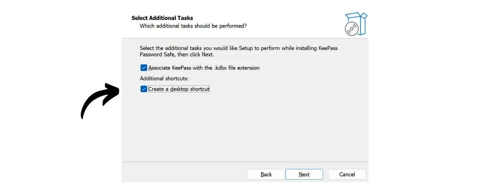
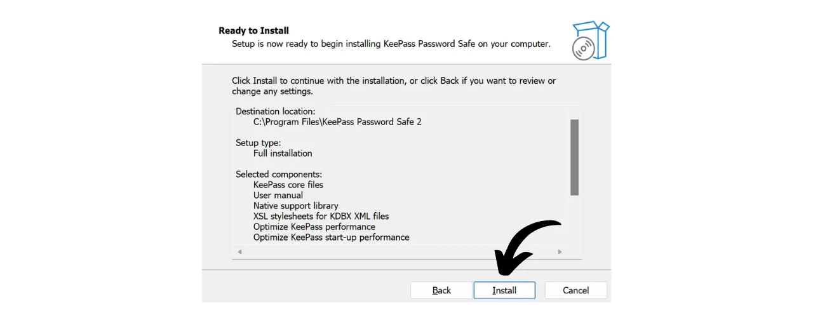
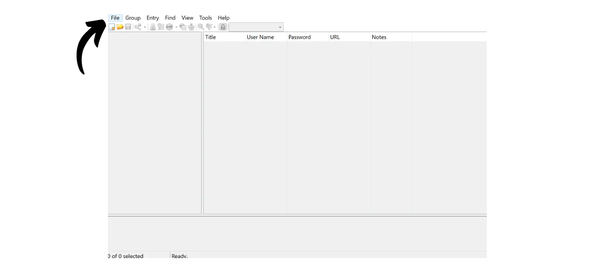
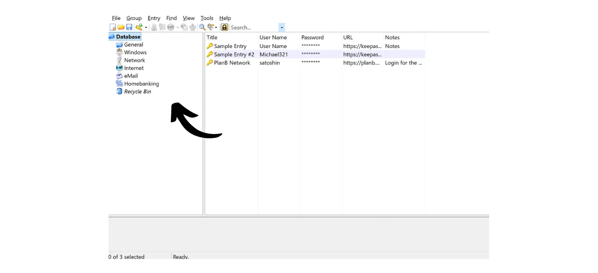

В цифровую эпоху нам необходимо управлять множеством онлайн-аккаунтов, охватывающих различные аспекты нашей повседневной жизни, включая банковские услуги, финансовые платформы, электронную почту, хранение файлов, здоровье, администрирование, социальные сети, видеоигры и т.д.

Для аутентификации в каждом из этих аккаунтов мы используем идентификатор, часто адрес электронной почты, сопровождаемый паролем. Перед лицом невозможности запомнить большое количество уникальных паролей, можно было бы поддаться искушению использовать один и тот же пароль или незначительно изменять общую базу, чтобы облегчить его запоминание. Однако эти практики серьезно компрометируют безопасность ваших аккаунтов.

Первый принцип, которому следует следовать для паролей, - не использовать их повторно. Каждый онлайн-аккаунт должен быть защищен уникальным и полностью отличным паролем. Это важно, потому что, если злоумышленник сможет скомпрометировать один из ваших паролей, вы не хотите, чтобы у него был доступ ко всем вашим аккаунтам. Наличие уникального пароля для каждого аккаунта изолирует потенциальные атаки и ограничивает их масштаб. Например, если вы используете один и тот же пароль для платформы видеоигр и для вашей электронной почты, и этот пароль будет скомпрометирован через фишинговый сайт, связанный с игровой платформой, злоумышленник сможет легко получить доступ к вашей электронной почте и взять под контроль все ваши другие онлайн-аккаунты.

Второй существенный принцип - сила пароля. Пароль считается надежным, если его трудно подобрать методом перебора, то есть угадать методом проб и ошибок. Это означает, что ваши пароли должны быть максимально случайными, длинными и включать разнообразие символов (строчные и прописные буквы, цифры и символы).

Применение этих двух принципов безопасности паролей (уникальность и надежность) может оказаться сложным в повседневной жизни, поскольку практически невозможно запомнить уникальный, случайный и надежный пароль для всех наших аккаунтов. Здесь на помощь приходит менеджер паролей.

Менеджер паролей генерирует и безопасно хранит надежные пароли, позволяя вам получать доступ ко всем вашим онлайн-аккаунтам без необходимости запоминать их индивидуально. Вам нужно запомнить только один пароль, мастер-пароль, который дает вам доступ ко всем сохраненным паролям в менеджере. Использование менеджера паролей повышает вашу онлайн-безопасность, поскольку предотвращает повторное использование паролей и систематически генерирует случайные пароли. Но это также упрощает вашу ежедневную работу с аккаунтами, централизуя доступ к вашей конфиденциальной информации.
В этом уроке мы узнаем, как настроить и использовать локальный менеджер паролей для повышения вашей онлайн-безопасности. Здесь я представлю вам KeePass. Однако, если вы новичок и хотели бы иметь онлайн-менеджер паролей, способный синхронизироваться на нескольких устройствах, я рекомендую следовать нашему уроку по Bitwarden:
https://planb.network/tutorials/others/bitwarden

---

*Внимание: Менеджер паролей отлично подходит для хранения паролей, но **никогда не храните в нем мнемоническую фразу вашего биткойн-кошелька!** Помните, мнемоническая фраза должна быть исключительно сохранена в физическом формате, например, на листе бумаги или металле.*

---

## Введение в KeePass

KeePass - это бесплатный и открытый менеджер паролей, идеально подходящий для тех, кто хочет бесплатное и безопасное решение для локального управления. Это программное обеспечение, которое устанавливается на ваш ПК и, без добавления плагинов, не взаимодействует с Интернетом. Это радикально отличается от подхода Bitwarden, который мы рассмотрели в предыдущем уроке. Bitwarden, в отличие от KeePass, позволяет синхронизировать данные на нескольких устройствах и, таким образом, требует хранения ваших паролей на онлайн-сервере.
По умолчанию KeePass не поддерживает использование расширений для браузеров, таких как Bitwarden; поэтому вам нужно будет вручную копировать и вставлять свои пароли из программы. Хотя это может показаться ограничением, копирование и вставка паролей вместо использования автозаполнения является хорошей практикой для вашей онлайн-безопасности.
KeePass разработан так, чтобы быть одновременно легким в использовании и соответствовать высоким стандартам безопасности. Программа шифрует вашу базу данных локально для оптимальной защиты ваших учетных данных. KeePass также является единственным менеджером паролей, проверенным ANSSI (французским органом по кибербезопасности).

Одним из основных преимуществ KeePass является его гибкость. Его можно использовать разными способами, например, на USB-накопителе без необходимости установки на компьютер. Более того, благодаря [среде плагинов](https://keepass.info/plugins.html), KeePass можно настроить для удовлетворения более специфических потребностей.

## Как скачать KeePass?

Процесс установки KeePass зависит от операционной системы, которую вы используете. Для пользователей Windows или Linux установка относительно проста. Однако, если вы используете macOS, необходим дополнительный шаг из-за разработки KeePass на платформе .NET, которая не поддерживается macOS напрямую. Поэтому вам нужно будет настроить совместимую среду, чтобы KeePass мог работать на устройствах Apple.

Для пользователей Debian/Ubuntu откройте терминал и введите следующие команды:

```bash
sudo apt-get update
sudo apt-get install keepass2
```

Для Fedora:

```bash
sudo dnf install keepass
```

Для Arch Linux:

```bash
sudo pacman -S keepass
```

Если вы используете компьютер с Windows, перейдите на [официальную страницу загрузки KeePass](https://keepass.info/download.html) и скачайте последнюю версию установщика:

Нажмите на скачанный файл, чтобы запустить его, затем следуйте инструкциям мастера установки, чтобы завершить установку (см. следующий раздел).

Для пользователей macOS установка немного сложнее. Если вы хотите использовать оригинальную версию KeePass, как в Windows, следуйте инструкциям ниже. В противном случае, вы можете выбрать [KeePassXC](https://keepassxc.org/), альтернативную версию, совместимую с macOS, которая предлагает немного другой интерфейс.

Для использования KeePass вам понадобится среда выполнения для приложений .NET. Я рекомендую установить Mono для этого. Перейдите на [официальную страницу Mono](https://www.mono-project.com/download/stable/#download-mac) в разделе "*macOS*", и нажмите на ссылку для загрузки установочного пакета (`.pkg`).

Откройте скачанный файл `.pkg` и следуйте инструкциям для установки Mono на ваш Mac.

Далее, перейдите на официальный сайт KeePass и скачайте последнюю портативную версию в формате `.zip`.

После загрузки файла `.zip` дважды щелкните по нему, чтобы извлечь его. Вы получите папку, содержащую несколько файлов, включая `KeePass.exe`. Откройте терминал, перейдите в папку KeePass (замените `xx` на номер версии):

```bash
cd ~/Downloads/KeePass-2.xx
```

И, наконец, запустите KeePass с помощью Mono:

```bash
mono KeePass.exe
```

## Как установить KeePass?

При первом запуске вы можете выбрать язык интерфейса.

Принять условия лицензии.

Выберите папку, в которой будет установлен KeePass.

При желании вы можете изменить компоненты приложения, которые будут установлены. Если у вас достаточно места, вы можете просто выбрать "*Полная установка*".

И, наконец, вы можете добавить ярлык на рабочий стол.

Нажмите кнопку "*Установить*".

Подождите во время установки, затем нажмите кнопку "*Завершить*".

## Как настроить KeePass?

Теперь вы попадаете в интерфейс KeePass.
Чтобы создать вашу первую базу данных, нажмите на вкладку "*Файл*".

Затем на меню "*Создать*".

Программа создаст новую базу данных, где будут храниться ваши пароли. Вам нужно выбрать место для этой папки. Выберите легкодоступное место.

После этого вам следует подумать о регулярном создании резервных копий этой папки, чтобы избежать потери ваших учетных данных в случае потери, повреждения или кражи вашего компьютера. Например, вы могли бы копировать базу данных на USB-накопитель каждую неделю. Файл с вашей базой данных называется `Database.kdbx` (документ зашифрован вашим мастер-паролем). Для получения дополнительных советов о лучших практиках резервного копирования я также рекомендую проконсультироваться с этим другим руководством:

https://planb.network/tutorials/others/proton-drive

Далее следует выбор вашего мастер-пароля.

Как мы видели во введении, этот пароль очень важен, так как он дает вам доступ ко всем вашим другим сохраненным паролям в базе данных. Этот пароль будет использоваться для шифрования базы данных `Database.kdbx`. Он представляет два основных риска: потерю и компрометацию. Если вы потеряете доступ к этому паролю, вы больше не сможете получить доступ ко всем вашим учетным данным. Если ваш пароль будет украден, помимо зашифрованной базы данных, злоумышленник сможет получить доступ ко всем вашим аккаунтам.

Чтобы минимизировать риск потери, я рекомендую сделать физическую резервную копию вашего мастер-пароля на бумаге и хранить ее в безопасном месте. По возможности запечатайте эту резервную копию в защищенном конверте, чтобы регулярно убеждаться, что никто другой не имел к нему доступа.

Чтобы предотвратить компрометацию вашего мастер-пароля, он должен быть чрезвычайно надежным. Он должен быть как можно длиннее, использовать широкий ассортимент символов и выбираться случайным образом. В 2024 году минимальные рекомендации для надежного пароля составляют 13 символов, включая цифры, строчные и прописные буквы, а также символы, при условии, что пароль действительно случаен. Однако я рекомендую выбирать пароль длиной не менее 20 символов, включая все возможные типы символов, чтобы обеспечить его безопасность на более длительное время.

Введите ваш мастер-пароль в соответствующее поле и подтвердите его в следующем поле, затем нажмите на "*ОК*".

Назовите вашу базу данных и при необходимости добавьте описание. Это может помочь вам различать разные базы данных, если вы создадите несколько, например, одну для личного использования и другую для профессионального использования.

Для других настроек я рекомендую оставить параметры по умолчанию. Затем нажмите кнопку "*ОК*".
Затем KeePass предлагает распечатать аварийный лист.

На этом листе вы найдете расположение вашей базы данных в файлах, место для ручного записывания вашего мастер-пароля, а также инструкции по доступу к нему. Этот лист следует доверить надежным лицам, поскольку он позволяет восстановить доступ к вашим учетным данным в случае возникновения проблем.

Однако, поскольку этот лист предоставляет доступ к вашим паролям, раскрывая ваш мастер-пароль, его необходимо использовать с осторожностью. Рекомендуется хранить его как минимум в запечатанном конверте, что позволяет периодически проверять, не был ли он просмотрен. Вы не обязаны использовать этот лист и можете рассмотреть другие методы резервного копирования для ваших близких.

Затем вы можете получить доступ к вашему менеджеру паролей.

Прежде чем начать сохранять ваши учетные данные, я рекомендую изменить настройки генерации паролей. Для этого перейдите на вкладку "*Инструменты*" и выберите "*Сгенерировать пароль...*".

Здесь я советую увеличить длину генерируемых паролей до 40 символов. Теперь, когда у вас есть менеджер паролей, который помнит их за вас, нет необходимости экономить на количестве символов. Более того, вам не нужно записывать пароли вручную, поскольку вы можете копировать и вставлять их. Так что для вас нет разницы иметь очень длинные пароли из 40 символов, однако, их безопасность значительно увеличивается. Я советую вам это сделать, а также отметить галочку для специальных символов.

Подтвердите, нажав на маленький значок сохранения.

Добавьте имя вашему профилю пароля.

## Как защитить свои аккаунты с помощью KeePass?

Чтобы зарегистрировать новые учетные данные в вашем менеджере KeePass, просто нажмите на значок ключа со стрелкой зеленого цвета.

В окне генерации и сохранения нажмите на маленький значок ключа и выберите ваш профиль пароля из 40 символов.

Введите имя пользователя для этой учетной записи, а также заголовок, чтобы легко найти его в вашей базе данных.  Также возможно добавить URL, если вы хотите использовать ярлыки позже, и при необходимости заметку.  Если все устраивает, нажмите на "*OK*", чтобы сохранить пароль.  Вы можете найти свой пароль на главной странице вашего менеджера KeePass.  Чтобы скопировать пароль, просто дважды щелкните по нему. Он останется в буфере обмена на 12 секунд, позволяя вам вставить его на сайте при следующем входе в систему.  Если вы хотите увеличить время, в течение которого пароль остается в буфере обмена, нажмите на вкладку "*Инструменты*", затем на "*Настройки...*".  Во вкладке "*Безопасность*" настройте продолжительность, изменив количество секунд в поле "*Время автоочистки буфера обмена*". Затем нажмите на "*OK*", чтобы сохранить изменения.  С левой стороны интерфейса вы заметите, что есть несколько папок для организации ваших паролей.  У вас есть возможность удалить стандартные папки или добавить новые, щелкнув правой кнопкой мыши и выбрав "*Добавить группу...*".  Выберите имя для новой папки и выберите иконку. Вы также можете импортировать свои собственные иконки в формате `.ico`. Затем нажмите кнопку "*OK*", чтобы завершить создание папки.  Ваша папка появится слева.  Чтобы добавить пароль в папку, просто перетащите его из базы данных в желаемую папку.  Эта функция помогает вам организовать ваш менеджер паролей и легче находить ваши учетные данные.
Другой способ найти пароль - использовать функцию поиска. Введите название идентификатора, который вы хотите найти, в строку поиска, расположенную в верхней части интерфейса, и вы сразу же получите к нему доступ.  Будьте внимательны, так как KeePass работает немного как текстовый документ. Перед закрытием приложения, если вы добавили новые элементы в ваш менеджер, не забудьте сохранить базу данных. Это можно сделать, нажав на иконку сохранения или используя сочетание клавиш `Ctrl+S`. 
Если вы оставите KeePass открытым в фоновом режиме, программное обеспечение по умолчанию не закроется. Однако, если вы закроете KeePass или выключите компьютер, вам будет необходимо ввести ваш мастер-пароль для расшифровки базы данных при повторном открытии программы. 
Это основные функции KeePass. Конечно, этот учебник для начинающих лишь слегка затрагивает множество доступных опций этого программного обеспечения. Существует множество дополнительных функций для изучения, не говоря уже о [всех плагинах, разработанных сообществом](https://keepass.info/plugins.html), которые могут значительно расширить возможности KeePass.

Если вас интересует, как значительно улучшить безопасность ваших онлайн-аккаунтов, чтобы избежать взлома с помощью 2FA, я также рекомендую ознакомиться с этим другим учебником:

https://planb.network/tutorials/others/authy