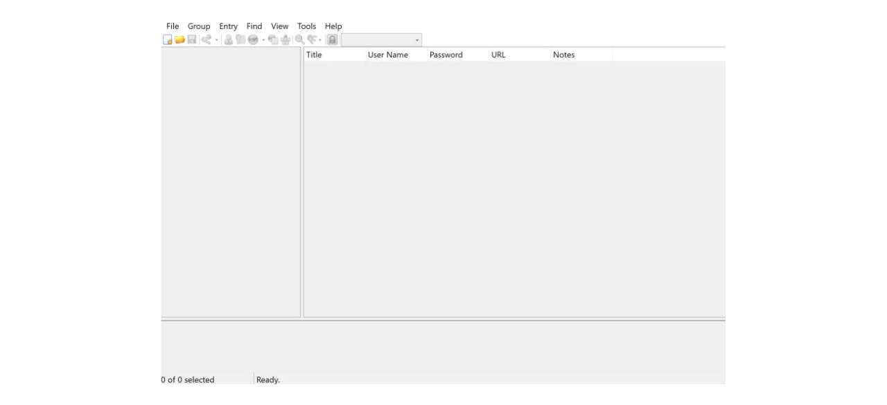
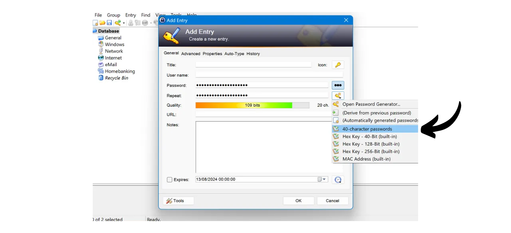

Trong kỷ nguyên số, chúng ta cần quản lý nhiều tài khoản trực tuyến khác nhau bao gồm các khía cạnh khác nhau trong cuộc sống hàng ngày của mình, bao gồm ngân hàng, nền tảng tài chính, email, lưu trữ tệp, sức khỏe, quản lý, mạng xã hội, trò chơi video, v.v.

Để xác thực bản thân trên mỗi tài khoản này, chúng ta sử dụng một định danh, thường là địa chỉ email, kèm theo một mật khẩu. Đối mặt với việc không thể ghi nhớ một số lượng lớn mật khẩu duy nhất, người ta có thể bị cám dỗ để sử dụng lại cùng một mật khẩu hoặc chỉnh sửa nhẹ một cơ sở chung để dễ nhớ hơn. Tuy nhiên, những thực hành này nghiêm trọng làm giảm an toàn của các tài khoản của bạn.

Nguyên tắc đầu tiên cần tuân theo đối với mật khẩu là không tái sử dụng chúng. Mỗi tài khoản trực tuyến nên được bảo vệ bởi một mật khẩu duy nhất và hoàn toàn khác biệt. Điều này quan trọng vì, nếu một kẻ tấn công quản lý để xâm phạm một trong những mật khẩu của bạn, bạn không muốn họ có quyền truy cập vào tất cả các tài khoản của bạn. Có một mật khẩu duy nhất cho mỗi tài khoản cô lập các cuộc tấn công tiềm năng và giới hạn phạm vi của chúng. Ví dụ, nếu bạn sử dụng cùng một mật khẩu cho một nền tảng trò chơi video và cho email của bạn, và mật khẩu đó bị xâm phạm qua một trang web lừa đảo liên quan đến nền tảng trò chơi, kẻ tấn công có thể dễ dàng truy cập vào email của bạn và kiểm soát tất cả các tài khoản trực tuyến khác của bạn.

Nguyên tắc thiết yếu thứ hai là độ mạnh của mật khẩu. Một mật khẩu được coi là mạnh nếu nó khó bị bẻ khóa, tức là, khó đoán thông qua thử và sai. Điều này có nghĩa là mật khẩu của bạn phải càng ngẫu nhiên càng tốt, dài và bao gồm sự đa dạng của các ký tự (chữ thường, chữ hoa, số và ký hiệu).

Áp dụng hai nguyên tắc bảo mật mật khẩu này (độc đáo và mạnh mẽ) có thể chứng minh là khó khăn trong cuộc sống hàng ngày, vì gần như không thể ghi nhớ một mật khẩu duy nhất, ngẫu nhiên và mạnh mẽ cho tất cả các tài khoản của chúng ta. Đây là nơi trình quản lý mật khẩu đóng vai trò.

Một trình quản lý mật khẩu tạo và lưu trữ an toàn các mật khẩu mạnh, cho phép bạn truy cập vào tất cả các tài khoản trực tuyến của mình mà không cần phải ghi nhớ chúng một cách riêng lẻ. Bạn chỉ cần nhớ một mật khẩu, mật khẩu chính, cho phép bạn truy cập vào tất cả các mật khẩu đã lưu trong trình quản lý. Sử dụng một trình quản lý mật khẩu tăng cường an ninh trực tuyến của bạn vì nó ngăn chặn việc tái sử dụng mật khẩu và hệ thống tạo ra các mật khẩu ngẫu nhiên. Nhưng nó cũng đơn giản hóa việc sử dụng hàng ngày các tài khoản của bạn bằng cách tập trung truy cập vào thông tin nhạy cảm của bạn.
Trong hướng dẫn này, chúng ta sẽ học cách thiết lập và sử dụng một trình quản lý mật khẩu cục bộ để tăng cường an ninh trực tuyến của bạn. Tại đây, tôi sẽ giới thiệu bạn với KeePass. Tuy nhiên, nếu bạn là người mới bắt đầu và muốn có một trình quản lý mật khẩu trực tuyến có khả năng đồng bộ hóa trên nhiều thiết bị, tôi khuyên bạn nên theo dõi hướng dẫn của chúng tôi về Bitwarden:
https://planb.network/tutorials/others/bitwarden

---

*Cảnh báo: Một trình quản lý mật khẩu rất tốt để lưu trữ mật khẩu, nhưng **bạn không bao giờ nên lưu cụm từ gợi nhớ của ví Bitcoin trong đó!** Nhớ rằng, một cụm từ gợi nhớ nên được lưu trữ độc quyền trong một định dạng vật lý, như một tờ giấy hoặc kim loại.*

---

## Giới thiệu về KeePass

KeePass là một trình quản lý mật khẩu miễn phí và mã nguồn mở, hoàn hảo cho những ai muốn một giải pháp miễn phí và an toàn cho quản lý cục bộ. Đó là phần mềm được cài đặt trên PC của bạn mà, không cần thêm plugin, không giao tiếp với Internet. Đây là một cách tiếp cận hoàn toàn khác biệt so với Bitwarden, mà chúng tôi đã đề cập trong một hướng dẫn trước đó. Bitwarden, không giống như KeePass, cho phép đồng bộ hóa trên nhiều thiết bị và do đó yêu cầu lưu trữ mật khẩu của bạn trên một máy chủ trực tuyến.
Mặc định, KeePass không hỗ trợ việc sử dụng các tiện ích mở rộng trình duyệt như Bitwarden; do đó, bạn sẽ cần phải sao chép và dán mật khẩu của mình từ phần mềm một cách thủ công. Mặc dù điều này có vẻ như là một hạn chế, việc sao chép và dán mật khẩu thay vì sử dụng tự động điền là một thực hành tốt cho an ninh trực tuyến của bạn.

KeePass được thiết kế để vừa nhẹ nhàng và dễ sử dụng, đồng thời tuân thủ các tiêu chuẩn an ninh cao. Phần mềm mã hóa cơ sở dữ liệu của bạn một cách địa phương để bảo vệ tối ưu các thông tin đăng nhập của bạn. KeePass cũng là trình quản lý mật khẩu duy nhất được xác nhận bởi ANSSI (cơ quan an ninh mạng của Pháp).

Một trong những ưu điểm chính của KeePass là sự linh hoạt của nó. Nó có thể được sử dụng theo nhiều cách khác nhau, chẳng hạn như trên một USB không cần cài đặt trên máy tính. Hơn nữa, nhờ vào [môi trường plugin](https://keepass.info/plugins.html), KeePass có thể được tùy chỉnh để đáp ứng nhu cầu cụ thể hơn.

## Làm thế nào để tải KeePass?

Quy trình cài đặt KeePass thay đổi tùy thuộc vào hệ điều hành bạn đang sử dụng. Đối với người dùng Windows hoặc Linux, việc cài đặt tương đối đơn giản. Tuy nhiên, nếu bạn sử dụng macOS, một bước bổ sung là cần thiết do KeePass được phát triển trên nền tảng .NET, không được hỗ trợ trực tiếp bởi macOS. Do đó, bạn sẽ cần cấu hình một môi trường tương thích để cho phép KeePass chạy trên các thiết bị của Apple.

Đối với người dùng Debian/Ubuntu, mở terminal và nhập các lệnh sau:

```bash
sudo apt-get update
sudo apt-get install keepass2
```

Đối với Fedora:

```bash
sudo dnf install keepass
```

Đối với Arch Linux:

```bash
sudo pacman -S keepass
```

Nếu bạn đang sử dụng máy tính Windows, truy cập vào [trang tải xuống chính thức của KeePass](https://keepass.info/download.html), và tải xuống phiên bản mới nhất của bộ cài đặt:

Nhấp vào tệp đã tải xuống để chạy nó, sau đó làm theo hướng dẫn của trình hướng dẫn cài đặt để hoàn thành việc cài đặt (xem phần tiếp theo).

Đối với người dùng macOS, việc cài đặt phức tạp hơn một chút. Nếu bạn muốn sử dụng phiên bản gốc của KeePass như trên Windows, hãy làm theo hướng dẫn dưới đây. Nếu không, bạn có thể chọn [KeePassXC](https://keepassxc.org/), một phiên bản thay thế tương thích với macOS, cung cấp một giao diện hơi khác.

Để sử dụng KeePass, bạn sẽ cần một môi trường thời gian chạy cho các ứng dụng .NET. Tôi khuyên bạn nên cài đặt Mono cho mục đích này. Truy cập vào [trang chính thức của Mono](https://www.mono-project.com/download/stable/#download-mac) trong phần "*macOS*", và nhấp vào liên kết để tải xuống gói cài đặt (`.pkg`).

Mở tệp `.pkg` đã tải xuống và làm theo hướng dẫn để cài đặt Mono trên Mac của bạn.

Tiếp theo, truy cập vào trang web chính thức của KeePass và tải xuống phiên bản di động mới nhất dưới dạng `.zip`.

Sau khi tải xuống tệp `.zip`, nhấp đúp để giải nén. Bạn sẽ nhận được một thư mục chứa nhiều tệp, bao gồm `KeePass.exe`. Mở một terminal, điều hướng đến thư mục KeePass (thay thế `xx` bằng số phiên bản):

```bash
cd ~/Downloads/KeePass-2.xx
```

Và cuối cùng, chạy KeePass với Mono:

```bash
mono KeePass.exe
```

## Làm thế nào để cài đặt KeePass?

Khi khởi chạy lần đầu, bạn có thể chọn ngôn ngữ giao diện.

Chấp nhận các điều khoản của giấy phép.

Chọn thư mục nơi KeePass sẽ được cài đặt.

Bạn có thể tùy chọn chỉnh sửa các thành phần của ứng dụng được cài đặt. Nếu bạn có đủ không gian, bạn có thể chọn "*Cài đặt đầy đủ*".

Và cuối cùng, bạn có thể chọn thêm một lối tắt trên màn hình desktop của mình.

Nhấn vào nút "*Cài đặt*".

Chờ trong quá trình cài đặt, sau đó nhấn vào nút "*Hoàn tất*".

## Làm thế nào để cấu hình KeePass?

Bây giờ bạn đã đến giao diện KeePass của mình.
Để tạo cơ sở dữ liệu đầu tiên của bạn, nhấn vào tab "*File*".

Sau đó vào menu "*Mới*".

Phần mềm sẽ tạo một cơ sở dữ liệu mới nơi mật khẩu của bạn sẽ được lưu trữ. Bạn cần chọn vị trí cho thư mục này. Chọn một vị trí dễ truy cập.

Sau đó, bạn nên nghĩ đến việc sao lưu thường xuyên thư mục này để tránh mất dữ liệu trong trường hợp mất, hỏng, hoặc bị đánh cắp máy tính. Ví dụ, bạn có thể sao chép cơ sở dữ liệu vào một ổ USB mỗi tuần. File chứa cơ sở dữ liệu của bạn được đặt tên là `Database.kdbx` (tài liệu được mã hóa bằng mật khẩu chính của bạn). Để biết thêm lời khuyên về các phương pháp sao lưu tốt nhất, tôi cũng khuyên bạn nên tham khảo hướng dẫn khác này:

https://planb.network/tutorials/others/proton-drive

Tiếp theo là việc chọn mật khẩu chính của bạn.

Như chúng ta đã thấy trong phần giới thiệu, mật khẩu này rất quan trọng, vì nó cho phép bạn truy cập vào tất cả các mật khẩu khác đã lưu trong cơ sở dữ liệu. Mật khẩu này sẽ được sử dụng để mã hóa cơ sở dữ liệu `Database.kdbx`. Nó đặt ra hai rủi ro chính: mất và bị xâm phạm. Nếu bạn mất quyền truy cập vào mật khẩu này, bạn sẽ không thể truy cập vào tất cả các thông tin đăng nhập của mình. Nếu mật khẩu của bạn bị đánh cắp, ngoài việc có được cơ sở dữ liệu đã mã hóa, kẻ tấn công cũng có thể truy cập vào tất cả các tài khoản của bạn.

Để giảm thiểu rủi ro mất mát, tôi khuyên bạn nên sao lưu mật khẩu chính của mình trên giấy và lưu trữ nó ở một nơi an toàn. Nếu có thể, đóng gói bản sao lưu này trong một phong bì an toàn để định kỳ đảm bảo rằng không ai khác có thể truy cập vào nó.

Để ngăn chặn việc mật khẩu chính bị xâm phạm, nó phải cực kỳ mạnh mẽ. Nó nên dài nhất có thể, sử dụng đa dạng các ký tự, và được chọn một cách ngẫu nhiên. Trong năm 2024, các khuyến nghị tối thiểu cho một mật khẩu an toàn là 13 ký tự bao gồm số, chữ thường và chữ hoa, cũng như các biểu tượng, miễn là mật khẩu thực sự ngẫu nhiên. Tuy nhiên, tôi khuyên bạn nên chọn một mật khẩu ít nhất 20 ký tự, bao gồm tất cả các loại ký tự có thể, để đảm bảo an toàn cho nó trong thời gian dài hơn.

Nhập mật khẩu chính của bạn vào ô dành riêng và xác nhận nó trong ô tiếp theo, sau đó nhấn vào "*OK*".

Đặt tên cho cơ sở dữ liệu của bạn và thêm mô tả nếu cần. Điều này có thể giúp bạn phân biệt giữa các cơ sở dữ liệu khác nhau nếu bạn tạo nhiều cơ sở dữ liệu, ví dụ, một cho mục đích cá nhân và một khác cho mục đích chuyên nghiệp.

Đối với các cài đặt khác, tôi khuyên bạn nên giữ các tùy chọn mặc định. Sau đó nhấn vào nút "*OK*".
KeePass sau đó đề nghị in một tờ khẩn cấp.

Trên tờ này, bạn sẽ tìm thấy vị trí của cơ sở dữ liệu của mình trong các tệp, một không gian để viết tay mật khẩu chính của bạn, cũng như hướng dẫn để truy cập vào nó. Tờ này nên được giao cho những người đáng tin cậy, vì nó cho phép khôi phục quyền truy cập vào các thông tin đăng nhập của bạn trong trường hợp có vấn đề.

Tuy nhiên, vì tờ này cung cấp quyền truy cập vào các mật khẩu của bạn bằng cách tiết lộ mật khẩu chính của bạn, nó phải được sử dụng một cách cẩn thận. Được khuyến nghị giữ nó trong một phong bì niêm phong ít nhất, điều này cho phép kiểm tra định kỳ để đảm bảo nó không được xem xét. Bạn không bắt buộc phải sử dụng tờ này và có thể xem xét các phương pháp sao lưu khác cho người thân của mình.

Sau đó, bạn có thể truy cập vào trình quản lý mật khẩu của mình.

Trước khi bạn bắt đầu lưu các thông tin đăng nhập của mình, tôi khuyên bạn nên thay đổi cài đặt tạo mật khẩu. Để làm điều này, hãy đi đến tab "*Công cụ*" và chọn "*Tạo Mật khẩu...*".

Ở đây, tôi khuyên bạn nên tăng độ dài của các mật khẩu được tạo lên 40 ký tự. Bây giờ bạn đã có một trình quản lý mật khẩu để nhớ chúng cho bạn, không cần phải tiết kiệm số lượng ký tự. Hơn nữa, bạn sẽ không cần phải viết tay các mật khẩu, vì bạn có thể sao chép và dán chúng. Vì vậy, việc có các mật khẩu dài 40 ký tự không khác biệt gì đối với bạn, tuy nhiên, độ bảo mật của chúng được cải thiện đáng kể. Tôi khuyên bạn nên làm điều này, và cũng kiểm tra hộp cho các ký tự đặc biệt.

Xác nhận bằng cách nhấp vào biểu tượng lưu nhỏ.

Thêm một tên cho hồ sơ mật khẩu của bạn.

## Làm thế nào để bảo mật tài khoản của bạn với KeePass?

Để đăng ký một thông tin đăng nhập mới trong trình quản lý KeePass của bạn, chỉ cần nhấp vào biểu tượng chìa khóa với mũi tên màu xanh.

Trong cửa sổ tạo và lưu, nhấp vào biểu tượng chìa khóa nhỏ và chọn hồ sơ mật khẩu 40 ký tự của bạn.

Nhập tên người dùng cho tài khoản này cũng như một tiêu đề để dễ dàng tìm kiếm nó trong cơ sở dữ liệu của bạn.  Bạn cũng có thể thêm một URL nếu bạn muốn sử dụng các phím tắt sau này, và nếu cần, một ghi chú.  Nếu mọi thứ đều làm bạn hài lòng, nhấn vào "*OK*" để lưu mật khẩu.  Bạn có thể tìm thấy mật khẩu của mình trên trang chủ của trình quản lý KeePass của bạn.  Để sao chép một mật khẩu, chỉ cần nhấp đúp vào nó. Nó sẽ ở trong bộ nhớ tạm của bạn trong 12 giây, cho phép bạn dán nó vào trang web trong lần đăng nhập tiếp theo của bạn.  Nếu bạn muốn kéo dài thời gian mật khẩu còn lại trong bộ nhớ tạm, nhấn vào tab "*Công cụ*", sau đó chọn "*Tùy chọn...*".  Dưới tab "*Bảo mật*", điều chỉnh thời gian bằng cách thay đổi số giây trong ô "*Thời gian tự động xóa bộ nhớ tạm*". Sau đó nhấn vào "*OK*" để lưu thay đổi của bạn.  Ở phía bên trái của giao diện của bạn, bạn sẽ nhận thấy rằng có một số thư mục để tổ chức mật khẩu của bạn.  Bạn có tùy chọn xóa các thư mục mặc định hoặc thêm mới bằng cách nhấp chuột phải và chọn "*Thêm Nhóm...*".  Chọn một tên cho thư mục mới và chọn một biểu tượng. Bạn cũng có thể nhập các biểu tượng của riêng mình ở định dạng `.ico`. Sau đó nhấn vào nút "*OK*" để hoàn tất việc tạo thư mục.  Thư mục của bạn xuất hiện ở bên trái.  Để thêm một mật khẩu vào thư mục, chỉ cần kéo nó từ cơ sở dữ liệu vào thư mục mong muốn.  Tính năng này giúp bạn tổ chức trình quản lý mật khẩu và tìm thông tin đăng nhập của mình dễ dàng hơn.
Một phương pháp khác để tìm một mật khẩu là sử dụng chức năng tìm kiếm. Gõ tiêu đề của định danh bạn muốn tìm vào thanh tìm kiếm ở phía trên cùng của giao diện, và bạn sẽ trực tiếp truy cập vào nó.  Hãy cẩn thận, vì KeePass hoạt động giống như một tài liệu văn bản. Trước khi đóng ứng dụng, nếu bạn đã thêm các mục mới vào trình quản lý của mình, hãy nhớ lưu cơ sở dữ liệu. Bạn có thể làm điều này bằng cách nhấn vào biểu tượng lưu hoặc sử dụng phím tắt `Ctrl+S`. 
Nếu bạn để KeePass mở ở chế độ nền, phần mềm sẽ không tự đóng theo mặc định. Tuy nhiên, nếu bạn đóng KeePass hoặc tắt máy tính, bạn sẽ cần nhập mật khẩu chính để giải mã cơ sở dữ liệu của mình khi mở lại phần mềm. 
Đó là những tính năng cơ bản của KeePass. Tất nhiên, hướng dẫn này dành cho người mới bắt đầu chỉ mới chạm vào bề mặt của nhiều tùy chọn có sẵn với phần mềm này. Có rất nhiều tính năng bổ sung để khám phá, chưa kể đến [tất cả các plugin được phát triển bởi cộng đồng](https://keepass.info/plugins.html) có thể mở rộng thêm khả năng của KeePass.

Nếu bạn quan tâm đến việc học cách cải thiện đáng kể an ninh cho các tài khoản trực tuyến của mình để tránh bị hack với 2FA, tôi cũng khuyên bạn nên xem hướng dẫn khác này:

https://planb.network/tutorials/others/authy