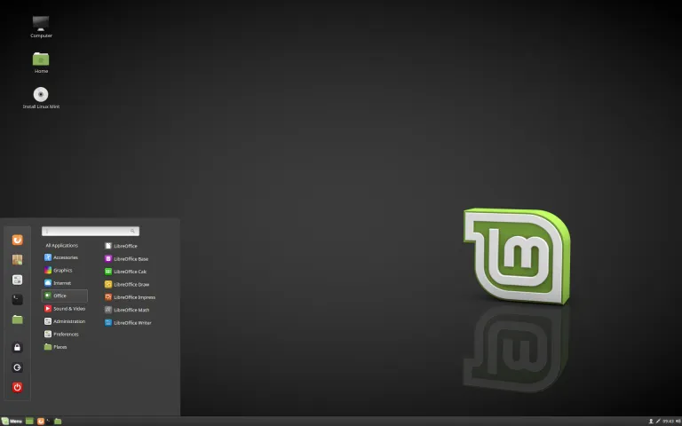

## Was ist falsch, wenn Sie einen normalen Computer verwenden?

Bei Bitcoin-Transaktionen ist es ideal, wenn Ihr Computer keine Malware hat. Offensichtlich.

Wenn Sie Ihren Bitcoin-Schlüsselsatz (normalerweise 12 oder 24 Wörter) außerhalb des Computers mit einem Signiergerät (z. B. einer Hardware-Wallet - sein Hauptzweck) aufbewahren, könnten Sie denken, dass es nicht so wichtig ist, einen "sauberen" Computer zu haben - das ist nicht wahr.

Ein mit Malware infizierter Computer kann Ihre Bitcoin-Adressen lesen und Ihr Guthaben einem Angreifer aussetzen - sie können Bitcoin nur anhand der Adresse nicht nehmen, aber sie können sehen, wie viel Sie haben, und daraus berechnen, ob Sie ein lohnendes Ziel sind. Sie können auch auf irgendeine Weise herausfinden, wo Sie wohnen, und Ihnen Fingernägel oder Kinder entnehmen, um Sie zur Zahlung eines Lösegeldes zu zwingen.

## Was ist die Lösung?

Ich ermutige die meisten Bitcoin-Nutzer, einen dedizierten, malwarefreien Computer (mit Internetzugang) für Bitcoin-Transaktionen zu verwenden. Ich schlage vor, dass die Leute ein Open-Source-Betriebssystem wie Linux Mint verwenden, aber wenn Sie müssen, verwenden Sie Windows oder Mac - das ist besser als die Verwendung eines regulären, gut genutzten Computers, der zwangsläufig Malware enthält.

Ein Hindernis, auf das die Leute stoßen, ist die Installation eines neuen Betriebssystems auf solchen Computern. Diese Anleitung soll dabei helfen.

Es gibt viele Varianten von Linux, und ich habe mehrere ausprobiert. Meine Empfehlung für Bitcoin-Nutzer ist Linux Mint, weil es einfach zu installieren ist, sehr schnell ist (insbesondere beim Starten und Herunterfahren), nicht aufgebläht ist (jedes zusätzliche Softwarestück ist ein Risiko) und selten abgestürzt ist oder sich seltsam verhalten hat (im Vergleich zu anderen Versionen wie Ubuntu und Debian).

Einige mögen sehr widerstandsfähig gegen ein neues Betriebssystem sein und Windows oder Mac OS bevorzugen. Ich verstehe das, aber die Windows- und Apple-Betriebssysteme sind Closed Source, also müssen wir darauf vertrauen, was sie tun; Ich glaube nicht, dass das eine gute Politik ist, aber es ist nicht alles oder nichts. Ich würde es viel lieber sehen, wenn die Leute einen dedizierten frisch installierten Windows- oder Mac OS-Computer verwenden würden, anstatt einen gut genutzten Computer (auf dem sich wer weiß welche Malware angesammelt hat). Einen Schritt besser ist die Verwendung eines frisch installierten Linux-Computers, was ich demonstrieren werde.

Wenn Sie sich wegen des Unbekannten Sorgen machen, Linux zu verwenden, ist das natürlich, aber es ist auch natürlich, etwas Zeit zum Lernen zu investieren. So viele Informationen sind online verfügbar. Hier ist ein ausgezeichnetes kurzes Video, das die Grundlagen der Befehlszeile einführt und das ich sehr empfehle.
Wählen Sie einen Computer aus

Ich werde mit der aus meiner Sicht besten Option beginnen. Dann werde ich meine Meinung zu Alternativen abgeben.

Ideale Option:

Meine Empfehlung, wenn Sie es sich leisten können und wenn die Größe Ihres Bitcoin-Stapels es rechtfertigt, ist der Kauf eines brandneuen Einsteiger-Laptops. Das einfachste Modell, das heutzutage gebaut wird, ist gut genug, um damit umzugehen, wofür es verwendet wird. Die Prozessor- und RAM-Spezifikationen sind nicht relevant, da sie alle gut genug sein werden.

Vermeiden Sie:

- Jede Tablet-Kombination, einschließlich Surface Pro
- Chromebooks - oft ist die Speicherkapazität zu gering
- Jeder Computer mit einem eMMC-Laufwerk; Wenn es eine SSD hat, ist das perfekt
- Macs - sie sind teuer, und die Hardware harmoniert meiner Erfahrung nach nicht gut mit Linux-Betriebssystemen
- Alles, was generalüberholt oder gebraucht ist (aber kein absolutes Ausschlusskriterium)
  Stattdessen suchen Sie nach einem Windows 11 Laptop (Derzeit ist Windows 11 die neueste Version. Wir werden diese Software loswerden, keine Sorge.). Ich habe auf amazon.com nach "Windows 11 Laptop" gesucht und dieses gute Beispiel gefunden:
  

Der Preis dieses oben genannten Modells ist gut. Die Spezifikationen sind ausreichend. Es hat eine eingebaute Kamera, die wir für QR-Code-PSBT-Transaktionen verwenden können (ansonsten müssten Sie eine USB-Kamera kaufen, um das zu tun). Machen Sie sich keine Sorgen darüber, dass es keine bekannte Marke ist (es ist günstig). Wenn Sie eine bessere Marke möchten, kostet es Sie mehr, z.B.:


Einige der günstigeren Modelle haben nur 64 GB Speicherplatz; Ich habe noch keine Laptops mit so kleinem Speicher getestet - es ist wahrscheinlich in Ordnung, 64 GB zu haben, aber es könnte knapp werden.

## Andere Optionen - Tails

Tails ist ein Betriebssystem, das von einem USB-Stick gebootet wird und vorübergehend die Hardware eines beliebigen Computers übernimmt. Es verwendet nur Tor-Verbindungen, daher müssen Sie sich mit der Verwendung von Tor wohl fühlen. Keine der Daten, die Sie während Ihrer Sitzung in den Speicher schreiben, wird auf dem Laufwerk gespeichert (es startet jedes Mal neu), es sei denn, Sie passen die Einstellungen an und erstellen eine permanente Speicheroption (auf dem USB-Stick), die Sie mit einem Passwort schützen.

Es ist keine schlechte Option und es ist kostenlos, aber es ist etwas umständlich für unseren Zweck. Das Installieren neuer Software darauf ist nicht ganz einfach. Eine gute Funktion ist, dass es mit Electrum geliefert wird, aber der Nachteil dabei ist, dass Sie es nicht selbst installiert haben. Stellen Sie sicher, dass der USB-Stick, den Sie verwenden, mindestens 8 GB groß ist.

Ihre Flexibilität ist eingeschränkt, wenn Sie Tails verwenden. Sie können möglicherweise verschiedenen Anleitungen nicht folgen, um das einzurichten, was Sie benötigen, und es ordnungsgemäß zum Laufen zu bringen. Wenn Sie beispielsweise meiner Anleitung zur Installation von Bitcoin Core folgen, sind Modifikationen erforderlich, um es zum Laufen zu bringen. Ich glaube nicht, dass ich eine spezifische Anleitung für Tails erstellen werde, daher müssen Sie Ihre Fähigkeiten entwickeln und es alleine tun.

Ich bin auch nicht sicher, wie gut Hardware-Wallets mit diesem Betriebssystem interagieren werden.

Nach all dem ist ein Tails-Computer für Bitcoin-Transaktionen eine schöne zusätzliche Option und wird Ihnen sicherlich helfen, Ihre allgemeinen Datenschutzkenntnisse zu verbessern.

## Andere Optionen - Live OS Boot

Dies ist sehr ähnlich wie Tails, außer dass das Betriebssystem nicht auf Datenschutz ausgerichtet ist. Die grundlegende Art, dies zu verwenden, besteht darin, einen USB-Stick mit dem Linux-Betriebssystem Ihrer Wahl zu flashen und den Computer davon statt von der internen Festplatte zu booten. Wie das funktioniert, wird später erklärt.

Der Vorteil besteht darin, dass Sie weniger eingeschränkt sind und die Dinge ohne fortgeschrittene Anpassungen funktionieren.

Ich bin mir nicht sicher, wie gut ein solches System Malware auf dem vorhandenen Computer von dem USB-Boot-Laufwerk isoliert, das das neue Betriebssystem enthält. Es macht wahrscheinlich einen guten Job und ist wahrscheinlich nicht so gut wie Tails. Da ich es nicht weiß, bevorzuge ich den dedizierten Laptop.
Andere Optionen - Ihr eigener gebrauchter Laptop oder Desktop-Computer

Die Verwendung eines gebrauchten Computers ist nicht ideal, hauptsächlich weil ich nicht über die inneren Abläufe ausgeklügelter Malware informiert bin, noch ob das Löschen einer Festplatte ausreicht, um sie loszuwerden. Es ist wahrscheinlich so, aber ich möchte nicht unterschätzen, wie clever bösartige Hacker sein können. Sie können entscheiden, ich möchte mich nicht festlegen.
Wenn Sie sich dafür entscheiden, anstelle eines alten Laptops einen alten Desktop zu verwenden, ist das in Ordnung, außer dass er dauerhaft Platz für Ihre wahrscheinlich seltenen Bitcoin-Transaktionen beansprucht. Sie sollten ihn nicht für etwas anderes verwenden. Mit einem Laptop können Sie ihn einfach weglegen und sogar verstecken, um zusätzliche Sicherheit zu gewährleisten.

## Linux Mint auf jedem Computer installieren

Dies sind Anweisungen, um jedes Betriebssystem von Ihrem neuen Laptop zu löschen und Linux Mint zu installieren, aber Sie können es anpassen, um praktisch jede Linux-Version auf praktisch jedem Computer zu installieren.

Wir werden einen beliebigen Computer verwenden, um das Betriebssystem auf einen USB-Stick zu übertragen. Es spielt keine Rolle, welchen USB-Stick Sie verwenden, solange er mit einem USB-Anschluss kompatibel ist, und ich empfehle mindestens 16 GB.

Besorgen Sie sich eines dieser Dinge:


Oder Sie können so etwas verwenden:


Navigieren Sie als Nächstes zu linuxmint.com


Bewegen Sie die Maus über das Menü "Download" oben und klicken Sie dann auf den Link "Linux Mint 20.3" oder die neueste empfohlene Version zum Zeitpunkt der Durchführung dieser Anleitung.


Es gibt einige "Varianten", aus denen Sie wählen können. Wählen Sie "Cinnamon", um dieser Anleitung zu folgen. Klicken Sie auf die Schaltfläche "Download".


Auf der nächsten Seite können Sie nach unten scrollen, um die Spiegelserver (Mirrors) zu sehen (Mirrors sind verschiedene Server, die eine Kopie der Datei halten, die wir möchten). Sie können den Download mit SHA256 und gpg überprüfen (empfohlen), aber ich werde hier nicht erklären, wie das geht, da ich bereits Anleitungen dazu geschrieben habe.


Wählen Sie einen Spiegelserver aus, der Ihnen am nächsten liegt, und klicken Sie auf den Link (der grüne Text in der Spaltenspalte). Die Datei beginnt heruntergeladen zu werden - die Version, die ich herunterlade, ist 2,1 Gigabyte groß.

Sobald der Download abgeschlossen ist, können Sie die Datei auf ein tragbares Speichergerät übertragen und es bootfähig machen. Der einfachste Weg, dies zu tun, besteht darin, Balena Etcher zu verwenden. Laden Sie es herunter und installieren Sie es, wenn Sie es noch nicht haben.

Führen Sie es dann aus:


Klicken Sie auf "Flash from file" und wählen Sie die heruntergeladene LinuxMint-Datei aus.

Klicken Sie dann auf "Select target". Stellen Sie sicher, dass das Speichergerät eingesteckt ist und stellen Sie sicher, dass Sie das richtige Laufwerk auswählen, da Sie sonst den Inhalt des falschen Laufwerks zerstören können!

Danach wählen Sie "Flash!" aus. Möglicherweise müssen Sie Ihr Passwort eingeben. Wenn der Vorgang abgeschlossen ist, kann Ihr Windows- oder Mac-Computer das Laufwerk wahrscheinlich nicht lesen, da es in ein Linux-Gerät umgewandelt wurde. Ziehen Sie es einfach heraus.

Vorbereitung des Zielcomputers

Schalten Sie den neuen Laptop ein und halten Sie während des Hochfahrens die BIOS-Taste gedrückt. Dies ist normalerweise F2, kann aber auch F1, F8, F10, F11, F12 oder Löschen sein. Probieren Sie jede Taste aus, bis Sie sie finden, oder suchen Sie im Internet nach dem Modell Ihres Computers und stellen Sie die richtige Frage.

Zum Beispiel "BIOS-Taste Dell-Laptops".

Jeder Computer hat ein anderes BIOS-Menü. Erkunden Sie es und finden Sie heraus, welches Menü es Ihnen ermöglicht, die Boot-Reihenfolge zu konfigurieren. Für unsere Zwecke möchten wir, dass der Computer versucht, von einem angeschlossenen USB-Gerät zu booten, bevor er versucht, von der internen Festplatte zu booten (sonst wird Windows geladen). Sobald Sie das eingestellt haben, müssen Sie möglicherweise vor dem Verlassen speichern oder es wird automatisch gespeichert.

Starten Sie den Computer neu und er sollte vom USB-Speichergerät laden. Wir können Linux nicht auf der internen Festplatte installieren und Windows wird endgültig entfernt.
Wenn Sie den folgenden Bildschirm erreichen, wählen Sie "OEM-Installation (für Hersteller)". Wenn Sie stattdessen "Linux Mint starten" wählen, wird eine Linux Mint-Sitzung von dem Speichergerät geladen, aber sobald Sie den Computer ausschalten, werden keine Ihrer Informationen gespeichert - es handelt sich im Grunde um eine temporäre Sitzung, damit Sie es ausprobieren können.


Sie werden durch einen grafischen Assistenten geführt, der Ihnen eine Reihe von Fragen stellt, die einfach sein sollten. Eine davon sind die Spracheinstellungen, eine andere ist Ihre Heim-Internetverbindung und das Passwort. Wenn Sie aufgefordert werden, zusätzliche Software zu installieren, lehnen Sie dies ab. Wenn Sie zur Frage nach dem Installationstyp kommen, könnten einige Leute zögern - Sie müssen "Festplatte löschen und Linux Mint installieren" wählen. Verschlüsseln Sie außerdem nicht das Laufwerk und wählen Sie nicht LVM aus.

Schließlich gelangen Sie zum Desktop. An diesem Punkt sind Sie noch nicht ganz fertig. Sie handeln tatsächlich als Hersteller (d.h. jemand, der einen Computer zusammenbaut und Linux für den Kunden einrichtet). Sie müssen das Desktop-Symbol "Linux Mint installieren" doppelklicken, um es abzuschließen.



Denken Sie daran, den USB-Stick zu entfernen und dann neu zu starten. Nach dem Neustart verwenden Sie das Betriebssystem zum ersten Mal als neuer Benutzer. Herzlichen Glückwunsch.

Eine der ersten Aufgaben (und regelmäßig durchzuführen) ist es, das System auf dem neuesten Stand zu halten.

Öffnen Sie die Terminal-Anwendung und geben Sie Folgendes ein:

```
    sudo apt-get update
```

drücken Sie <Enter>, bestätigen Sie Ihre Auswahl und geben Sie dann diesen Befehl ein:

```
    sudo apt-get upgrade
```

drücken Sie <Enter> und bestätigen Sie Ihre Auswahl.

Lassen Sie es seine Arbeit erledigen, es könnte mehrere Minuten dauern.

Als Nächstes installiere ich gerne Tor (Groß- und Kleinschreibung beachten):

```
    sudo apt-get install tor
```

> _ZUSATZ: Sie können auch den Linux Mint-Start von "OEM-Installation" ausführen (Stellen Sie sicher, dass Sie mit dem Internet verbunden sind, sonst könnten Fehler auftreten). Wenn Sie dies tun, müssen Sie später auf das Symbol "An den Endbenutzer versenden" klicken, das sich auf dem Desktop befinden sollte. Starten Sie dann das Betriebssystem neu, als ob Sie den Computer zum ersten Mal öffnen würden._

Dieser Leitfaden erklärt, warum Sie möglicherweise einen dedizierten Computer für Bitcoin-Transaktionen benötigen und wie Sie ein frisches Linux Mint-Betriebssystem darauf installieren.
