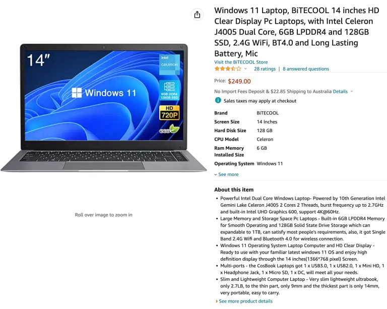

## Mis on valesti, kui kasutad tavalist arvutit?

Bitcoin'i tehingute tegemisel on ideaalne, kui su arvutis ei ole pahavara. Ilmselgelt.

Kui hoiad oma Bitcoin'i seemnefraasi (tavaliselt 12 või 24 sõna) arvutist eemal allkirjastamisseadmega (nt riistvarakott – selle peamine eesmärk), siis võid arvata, et "puhta" arvuti omamine pole nii tähtis – see ei ole tõsi.

Pahavaraga nakatunud arvuti võib lugeda sinu Bitcoin'i aadresse, paljastades sinu saldo ründajale – nad ei saa lihtsalt aadressi teades bitcoine võtta, kuid nad näevad, kui palju sul on, ja arvutavad sellest, kas sa oled väärt sihtmärk. Nad võivad ka kuidagi välja selgitada, kus sa elad, näiteks, ja välja pressida sinult lunaraha, ähvardades su lapsi või isegi sinu füüsilist heaolu.

## Mis on lahendus?

Ma julgustan enamikku Bitcoin'i kasutajaid kasutama pühendatud pahavaravaba arvutit (internetiühendusega) Bitcoin'i tehingute tegemiseks. Ma soovitan inimestel kasutada avatud lähtekoodiga operatsioonisüsteemi nagu Linux Mint, kuid kasuta Windowsit või Maci, kui pead – see on parem kui kasutada tavalist, palju kasutatud arvutit, milles paratamatult on peidetud pahavara.

Üks takistus, millega inimesed kokku puutuvad, on uue operatsioonisüsteemi installimine sellistele arvutitele. See juhend on mõeldud selleks, et sellega aidata.

Linuxi variante on palju ja ma olen proovinud mitmeid. Minu soovitus Bitcoin'i kasutajatele on Linux Mint, sest see on lihtne paigaldada, väga kiire (eriti käivitamisel ja väljalülitamisel), mitte ülekoormatud (iga lisatarkvara on risk) ja on harva minul kokku jooksnud või imelikult käitunud (võrreldes teiste versioonidega nagu Ubuntu ja Debian).

Mõned võivad olla väga vastumeelsed uue operatsioonisüsteemi suhtes, eelistades Windowsit või Mac OS-i. Ma saan aru, kuid Windowsi ja Apple'i operatsioonisüsteemid on suletud lähtekoodiga, nii et me peame usaldama, mida nad teevad; ma ei arva, et see on hea poliitika, kuid see ei ole kõik-või-mitte-midagi. Ma eelistaksin palju rohkem, et inimesed kasutaksid pühendatud, värskelt paigaldatud Windowsi või Mac OS-i arvutit, mitte palju kasutatud arvutit (kelle teab, milline pahavara on sellel kogunenud). Üks samm parem on kasutada värskelt paigaldatud Linuxi arvutit, mida ma demonstreerin.

Kui sa oled Linuxi kasutamise pärast mures, sest see on tundmatu, siis see on loomulik, kuid samuti on loomulik veeta aega õppimiseks. Internetis on saadaval palju teavet. Siin on suurepärane lühike video, mis tutvustab käsurea põhitõdesid ja mida ma väga soovitan.
Vali arvuti

Ma alustan sellest, mida ma pean parimaks võimaluseks. Seejärel annan oma arvamuse alternatiividest.

Ideaalne valik:

Minu soovitus, kui sa seda endale lubada saad ja kui su bitcoin'i varu seda õigustab, on saada täiesti uus sisenemistaseme sülearvuti. Tänapäeval ehitatud kõige lihtsam mudel on piisavalt hea selleks, mida see kasutatakse. Protsessori ja RAM-i spetsifikatsioonid ei ole olulised, sest need kõik on piisavalt head.

Väldi:

- Iga tahvelarvuti kombot, kaasa arvatud Surface Pro
- Chromebookid – tihti on nende salvestusmaht liiga väike
- Iga arvuti eMMC draiviga; Kui sellel on SSD draiv, siis see on ideaalne
- Macid – need on kallid ja riistvara ei sobi minu kogemuse järgi hästi Linuxi operatsioonisüsteemidega
- Kõik taastatud või teise ringi arvutid (kuigi see ei ole absoluutne tehingumurdja)

Selle asemel otsi Windows 11 sülearvutit (Praegu on Windows 11 viimane väljalase. Me vabaneme sellest tarkvarast, ärge muretsege.). Ma otsisin amazon.com'ist "Windows 11 Laptop" ja leidsin selle hea näite:

Selle ülaloleva hinna ja tehnilised näitajad on head. Sellel on sisseehitatud kaamera, mida saame kasutada QR-koodi PSBT tehingute jaoks (muidu peaks ostma USB-kaamera selleks). Ärge muretsege, et see pole hästi tuntud bränd (see on odav). Kui soovite paremat brändi, läheb see maksma, näiteks:


Mõned odavamad mudelid on ainult 64Gb kõvakettaga; ma pole testinud sülearvuteid nii väikese draiviruumiga – tõenäoliselt on 64Gb OK, aga see võib olla piiripealne.

## Muud valikud – Tails

Tails on operatsioonisüsteem, mis käivitub USB mälupulgalt ja võtab ajutiselt üle mis tahes arvuti riistvara. See kasutab ainult Tor ühendusi, nii et peate olema mugav Tor'i kasutamisega. Ükski andmetest, mida mällu kirjutate sessiooni ajal, ei salvestu draivile (see algab iga kord puhtalt lehelt), välja arvatud juhul, kui muudate seadeid ja loote püsiva salvestusvõimaluse (USB mälupulgal) – mille lukustate parooliga.

See pole halb valik ja see on tasuta, kuid meie eesmärgil veidi kohmakas. Uue tarkvara installimine pole lihtne. Üks hea omadus on, et sellega tuleb kaasa Electrum, kuid selle miinus on see, et te ei installinud seda ise. Veenduge, et kasutatav USB draiv on vähemalt 8Gb.

Teie paindlikkus on piiratud, kui kasutate Tailsi. Võib juhtuda, et te ei saa järgida erinevaid juhiseid, mida vajate seadistamiseks ja korralikuks tööle saamiseks. Näiteks, kui järgite minu juhendit Bitcoin Core'i installimiseks, on vajalikud muudatused, et see töötaks. Ma ei arva, et ma teen Tailsile spetsiifilist juhendit, nii et peate arendama oma oskusi ja tegema seda üksi.

Ma pole ka kindel, kui hästi riistvara rahakotid selle OS-iga suhtlevad.

Kõike seda öeldes on Tailsi arvuti Bitcoin tehingute jaoks toredaks lisavalikuks ja kindlasti aitab see parandada teie üldisi privaatsusoskusi, õppides Tailsi kasutama.

## Muud valikud – Live OS Boot

See on väga sarnane Tailsidega, välja arvatud see, et operatsioonisüsteem ei ole privaatsusele pühendunud. Selle kasutamise põhiline viis on välklambi ettevalmistamine Linuxi operatsioonisüsteemiga, mida soovite, ja arvuti käivitamine sellelt, mitte sisemiselt draivilt. Kuidas seda teha, selgitatakse hiljem.

Eelis on see, et te olete vähem piiratud ja asjad töötavad ilma keerukate kohandusteta.

Ma pole kindel, kui hästi selline süsteem isoleerib olemasoleva arvuti pahavara USB käivitusdraivist, mida kasutate uue operatsioonisüsteemi jaoks. Tõenäoliselt teeb see head tööd ja tõenäoliselt pole see nii hea kui Tails. Kuna ma ei tea, eelistan ma pühendatud sülearvutit.
Muud valikud – Teie enda kasutatud sülearvuti või lauaarvuti

Kasutatud arvuti kasutamine pole ideaalne, peamiselt seetõttu, et ma ei ole teadlik keerukate pahavara sisemisest tööst, ega sellest, kas draivi pühkimine on piisav, et sellest lahti saada. Tõenäoliselt on, kuid ma ei taha alahinnata, kui nutikad võivad olla pahatahtlikud häkkerid. Võite otsustada, ma ei taha kohustuda.

Kui otsustate kasutada vana lauaarvutit vana sülearvuti asemel, on see korras, välja arvatud see, et see võtab alaliselt ruumi teie tõenäoliselt harvadele bitcoin tehingutele; te ei tohiks seda muuks otstarbeks kasutada. Sülearvutiga saate selle lihtsalt ära panna ja isegi lisaturvalisuse huvides peita.

## Linux Minti installimine mis tahes arvutisse
Siin on juhised, kuidas kustutada oma uuest sülearvutist mis tahes operatsioonisüsteem ja paigaldada Linux Mint, kuid neid saab kohandada peaaegu iga Linuxi versiooni paigaldamiseks peaaegu igale arvutile.
Me kasutame suvalist arvutit, et välkmäluseadmele paigaldada operatsioonisüsteem. Pole tähtis, millist mälupulka kasutate, peaasi, et see ühildub USB-portiga, ja soovitan vähemalt 16Gb.

Hangi üks neist asjadest:


Või võid kasutada midagi sellist:


Järgmiseks mine aadressile linuxmint.com


Liiguta hiir üle Download menüü ülaosas ja seejärel klõpsa lingil „Linux Mint 20.3“ või mis iganes on hetkel soovitatud uusim versioon.


Seal on mõned „maitsed“, mille vahel valida. Järgi seda juhendit, valides „Cinnamon“. Klõpsa Download nuppu.


Järgmisel lehel saad kerida alla, et näha peegleid (Peeglid on erinevad serverid, mis hoiavad faili koopiat, mida me tahame). Saad allalaadimist kontrollida kasutades SHA256 ja gpg (soovitatav), kuid ma jätan selle siin selgitamata, kuna olen sellest juba juhendeid kirjutanud.


Vali endale lähim peegel ja klõpsa selle lingil (roheline tekst peegli veerus). Fail hakkab allalaadima – minu allalaaditav versioon on 2.1 gigabaiti.

Kui see on allalaaditud, saad faili välkmäluseadmele paigaldada ja teha selle käivitatavaks. Selleks on kõige lihtsam viis kasutada Balena Etcherit. Laadi see alla ja paigalda, kui sul seda veel pole.

Seejärel käivita see:


Klõpsa flash from file ja vali allalaaditud Linux Minti fail.

Seejärel klõpsa Select target. Veendu, et mäluseade on ühendatud ja et valiksid õige draivi, vastasel juhul võid hävitada vale draivi sisu!

Pärast seda vali Flash! Võib-olla pead sisestama oma parooli. Kui see on lõpetatud, ei pruugi draiv olla loetav sinu Windowsi või Maci arvutis, kuna see on muudetud Linuxi seadmeks. Lihtsalt tõmba see välja.
Sihtmärgi arvuti ettevalmistamine

Lülita sisse uus sülearvuti ja kui see käivitub, hoia all BIOS võtit. See on tavaliselt F2, kuid võib olla ka F1, F8, F10, F11, F12 või Delete. Proovi igaüht, kuni saad selle õige, või otsi internetist oma arvuti mudeli järgi ja küsi õiget küsimust.

Nt „BIOS võti Dell sülearvutites“.

Igal arvutil on erinev BIOS menüü. Uuri ja leia, milline menüü võimaldab sul seadistada käivitusjärjekorda. Meie eesmärgil tahame, et arvuti prooviks käivituda USB-ühendatud seadmest (kui see on ühendatud), enne kui proovib käivituda sisemiselt kõvakettalt (muidu laadib Windows). Kui oled selle seadistanud, võib-olla pead enne väljumist salvestama või see võib salvestuda automaatselt.

Taaskäivita arvuti ja see peaks laadima USB mäluseadmest. Nüüd saame Linuxi paigaldada sisemisele draivile ja Windows eemaldatakse lõplikult.

Kui jõuad järgmisele ekraanile, vali „OEM install (tootjatele)“. Kui valiksid selle asemel „Start Linux Mint“, laaditakse Linux Minti seanss mäluseadmelt, kuid kui arvuti välja lülitad, ei salvestata ühtegi sinu teavet – see on põhimõtteliselt ajutine seanss, et saaksid seda proovida.
Teid juhatatakse läbi graafilise viisardi, mis esitab teile mitmeid lihtsaid küsimusi. Üks neist puudutab keeleseadeid, teine teie koduse internetivõrgu ühendust ja parooli. Kui teilt küsitakse täiendava tarkvara installimist, lükake see tagasi. Jõudes küsimuseni installitüübi kohta, võivad mõned inimesed kõhklema jääda – peate valima „Kustuta ketas ja installi Linux Mint“. Samuti ärge krüpteerige draivi ega valige LVM-i.

Lõpuks jõuate töölauale. Sel hetkel ei ole te veel lõpetanud. Tegelikult toimite te tootjana (st keegi, kes ehitab arvutit ja seadistab Linuxi kliendi jaoks). Peate topeltklõpsama töölaua ikoonil „Installi Linux Mint“, et see lõpule viia.

Mäletage eemaldada mälupulk ja seejärel taaskäivitage. Pärast taaskäivitamist kasutate te operatsioonisüsteemi esimest korda uue kasutajana. Õnnitlused.

Üks esimesi asju, mida teha (ja teha regulaarselt), on süsteemi ajakohasena hoidmine.

Avage Terminali rakendus ja tippige järgnev:

```bash
sudo apt-get update
```

vajutage <enter>, kinnitage oma valik ja seejärel see käsk:

```bash
sudo apt-get upgrade
```

vajutage <enter> ja kinnitage oma valik.

Laske sellel toimida, see võib võtta mitu minutit.

Järgmisena meeldib mulle installida Tor (tõstutundlik):

```bash
sudo apt-get install tor
```

> _LISAND: Võite käivitada ka Linux Minti buutimise „OEM installi“ kaudu (Veenduge, et olete ühendatud internetiga, vastasel juhul võite saada vigu). Kui teete seda, peate hiljem klõpsama töölaua ikoonil „saada lõppkasutajale“, seejärel taaskäivitage ja alustage operatsioonisüsteemi kasutamist nagu avaksite arvuti esimest korda._

See juhend selgitas, miks võite vajada spetsiaalset arvutit Bitcoin tehingute jaoks ja kuidas installida sellele värske Linux Mint operatsioonisüsteem.