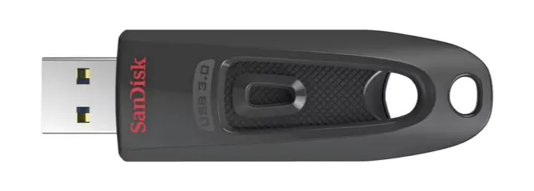
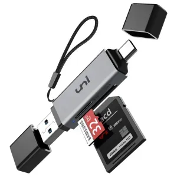
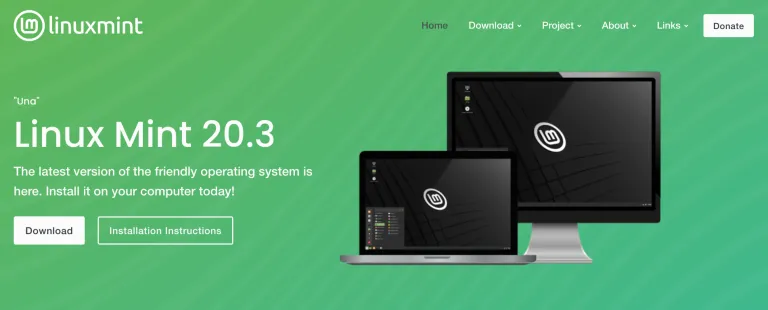
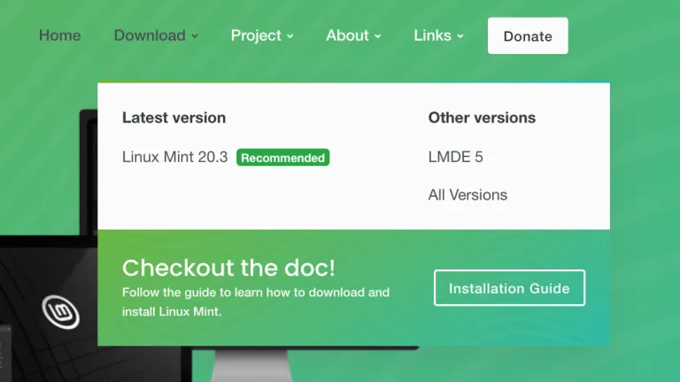
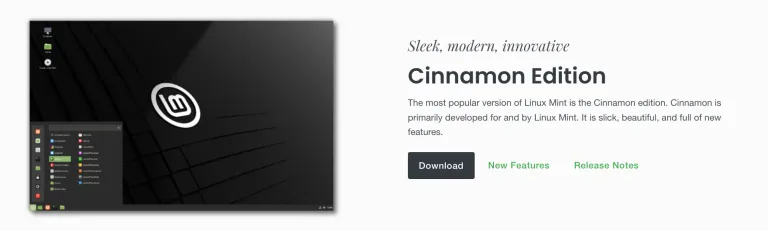

## 通常のコンピューターを使用すると何が問題なのか？

ビットコイン取引を行う際、コンピューターにマルウェアがないことが理想です。明らかに。

ビットコインのシードフレーズ（通常は12または24の単語）をサインデバイス（例えばハードウェアウォレット - その主な目的）でコンピューター外に保持している場合、"クリーン"なコンピューターを持つことがそれほど重要ではないと思うかもしれませんが、それは違います。

マルウェアに感染したコンピューターは、あなたのビットコインアドレスを読み取り、攻撃者にあなたの残高をさらす可能性があります - アドレスを知っているだけではビットコインを盗むことはできませんが、どれだけ持っているかを見て、あなたが価値のあるターゲットかどうかを計算することができます。また、どこに住んでいるかを何とか突き止め、身代金を支払うようにあなたを脅迫するために、指の爪や子供を連れ去ることもあります。

## 解決策は何ですか？

ほとんどのビットコイナーには、ビットコイン取引を行うために専用のマルウェアフリーのコンピューター（インターネットアクセス付き）を使用することをお勧めします。私は人々にLinux Mintのようなオープンソースのオペレーティングシステムを使用することを提案しますが、必要であればWindowsやMacを使用しても構いません - それは、必ず隠されたマルウェアを持っている通常のよく使用されるコンピューターを使用するよりも良いです。

人々が直面する障害の1つは、そのようなコンピューターに新しいオペレーティングシステムをインストールすることです。このガイドは、それを助けるためのものです。

Linuxには多くのバリエーションがあり、私はいくつか試しました。ビットコイナーに対する私の推薦はLinux Mintです。なぜなら、インストールが簡単で、非常に高速（特に起動とシャットダウン時）、膨張していない（余分なソフトウェアはリスクです）、そして私が使用した他のバージョン（UbuntuやDebianなど）と比べて、めったにクラッシュしたり変な挙動を示したりしないからです。

新しいオペレーティングシステムに非常に抵抗がある人もいるかもしれませんが、WindowsやMac OSを好むでしょう。理解しますが、WindowsとAppleのオペレーティングシステムはクローズドソースなので、彼らが何をしているかを信頼しなければなりません。それは良い方針だとは思いませんが、全てか無かではありません。私は、よく使用されたコンピューター（それにどんなマルウェアが蓄積されているか分かったものではない）よりも、専用の新しくインストールされたWindowsまたはMac OSのコンピューターを使用してほしいと強く願っています。もっと良いのは、新しくインストールされたLinuxコンピューターを使用することですが、それをデモンストレーションします。

未知のものを使用することに不安があるのは自然なことですが、学ぶ時間を少し費やすことも自然です。オンラインで非常に多くの情報が利用可能です。ここに、コマンドラインの基本を紹介する優れた短いビデオがありますので、強くお勧めします。
コンピューターを選ぶ

私は最良のオプションから始めます。その後、代替案について私の意見を述べます。

理想的なオプション：

もしあなたがそれを買う余裕があり、そしてあなたのビットコインの量がそれを正当化するならば、私の推薦は、真新しいエントリーレベルのラップトップを手に入れることです。現在製造されている最も基本的なモデルは、それが使用されることになるものを処理するには十分に良いです。プロセッサとRAMの仕様は関係ありません、なぜならそれらはすべて十分に良いからです。

避けるべき：

- Surface Proを含む任意のタブレットコンボ
- Chromebooks - しばしばストレージ容量が低すぎる
- eMMCドライブを搭載したコンピューター; SSDドライブを搭載していれば、それは完璧です
- Macs - 彼らは高価であり、私の経験ではLinuxオペレーティングシステムとはうまく連携しません
- 改装されたものや中古品（絶対的な取引破棄ではありませんが）

代わりに、Windows 11ラップトップを探してください（現在Windows 11は最新のリリースです。そのソフトウェアを取り除く予定ですので、心配しないでください）。私はamazon.comで「Windows 11 Laptop」と検索し、この良い例を見つけました：
この上のものの価格は良いです。スペックも十分です。QRコードPSBTトランザクションに使用できる内蔵カメラがあります（そうでなければ、それを行うためにUSBカメラを購入する必要があります）。それがあまり認知されていないブランドであるという事実について心配しないでください（それは安価です）。もしより良いブランドが欲しいなら、それなりの費用がかかります、例えば：

安価なものの中にはドライブスペースが64Gbしかないものもあります。私はそのような小さなドライブを搭載したラップトップをテストしたことがありません - 64Gbで大丈夫かもしれませんが、少し無理があるかもしれません。

## 他のオプション - Tails

TailsはUSBサムドライブから起動し、任意のコンピュータのハードウェアを一時的に引き継ぐオペレーティングシステムです。Tor接続のみを使用するため、Torの使用に慣れている必要があります。セッション中にメモリに書き込んだデータはドライブに保存されず（毎回新鮮な状態でスタートします）、設定を調整してパスワードでロックする永続的なストレージオプションを（USBサムドライブ上に）作成しない限り、保存されません。

それは悪いオプションではありませんし、無料ですが、私たちの目的には少し不便です。新しいソフトウェアをインストールするのは簡単ではありません。良い点は、Electrumが付属していることですが、自分でインストールしていないというデメリットがあります。使用するUSBドライブは少なくとも8Gbであることを確認してください。

Tailsを使用すると柔軟性が低下します。必要なものを設定し、適切に動作させるためのさまざまなガイドに従うことができないかもしれません。例えば、Bitcoin Coreのインストールガイドに従う場合、それを動作させるためには修正が必要です。Tails専用のガイドを作成する予定はありませんので、スキルを身につけ、自分で行う必要があります。

また、ハードウェアウォレットがこのOSとどのように相互作用するかについても確信がありません。

これらすべてを言った上で、Bitcoinトランザクション用のTailsコンピュータは、Tailsの使用方法を学ぶことで全体的なプライバシースキルが向上するため、良い追加オプションです。

## 他のオプション - Live OS Boot

これはTailsと非常に似ていますが、オペレーティングシステムはプライバシーに特化していません。これを使用する基本的な方法は、選択したLinuxオペレーティングシステムでUSBドライブをフラッシュし、内部ドライブの代わりにそれからコンピュータを起動させることです。これの方法は後で説明されます。

利点は、制限が少なく、高度な調整なしで物事が機能することです。

既存のコンピュータのマルウェアを新しいオペレーティングシステムを持つUSBブートドライブからどの程度隔離できるかについては確信がありません。おそらくそれはうまくいくでしょうが、Tailsほど良くはないかもしれません。わからないので、私の好みは専用のラップトップです。
他のオプション – 自分の中古のラップトップまたはデスクトップコンピュータ

中古のコンピュータを使用することは理想的ではありません。主に、洗練されたマルウェアの内部構造や、ドライブをワイプすることがそれを取り除くのに十分かどうかを私が知らないためです。おそらく大丈夫ですが、悪意のあるハッカーがどれほど賢いかを過小評価したくありません。決めるのはあなたです、私は決めたくありません。

古いデスクトップを古いラップトップの代わりに使用する場合、それは問題ありませんが、おそらく稀にしか行わないBitcoinトランザクションのために永久にスペースを占有することになります。それ以外の目的で使用すべきではありません。一方、ラップトップの場合は、それを片付けて、さらにセキュリティを高めるために隠すことができます。

## 任意のコンピュータにLinux Mintをインストールする
これは、新しいラップトップからどのオペレーティングシステムも消去し、Linux Mintをインストールするための手順ですが、ほぼどのようなコンピューターにも、ほぼどのようなLinuxバージョンもインストールするために適応させることができます。
何らかの形のメモリースティックにオペレーティングシステムをフラッシュするために、どのコンピューターを使用しても構いません。どのメモリースティックでも構いませんが、USBポートと互換性があるものであること、そして最低16Gbをお勧めします。

これらのいずれかを手に入れてください：



または、このようなものを使用することもできます：



次に、linuxmint.comにアクセスしてください。



マウスを上部のダウンロードメニューに合わせてから、「Linux Mint 20.3」またはその時点で最新の推奨バージョンであるリンクをクリックします。



いくつかの「フレーバー」から選択できます。このガイドに沿って「Cinnamon」を選んでください。ダウンロードボタンをクリックします。



次のページでは、下にスクロールしてミラー（私たちが欲しいファイルのコピーを持っているさまざまなサーバー）を見ることができます。SHA256とgpgを使用してダウンロードを検証することが推奨されますが、ここでは説明を省略します（既にこの件についてガイドを書いています）。


あなたに最も近いミラーを選択し、そのリンク（ミラーコラムの緑色のテキスト）をクリックします。ファイルのダウンロードが開始されます - 私がダウンロードしているバージョンは2.1ギガバイトです。

ダウンロードが完了したら、ファイルをポータブルメモリーデバイスにフラッシュして、ブータブルにすることができます。これを行う最も簡単な方法は、Balena Etcherを使用することです。持っていない場合はダウンロードしてインストールしてください。

そして、実行してください：


ファイルからフラッシュをクリックし、ダウンロードしたLinuxMintファイルを選択します。

次に、ターゲットを選択をクリックします。メモリーデバイスが接続されていること、そして正しいドライブを選択していることを確認してください。そうでないと、間違ったドライブの内容を破壊する可能性があります！

その後、フラッシュを選択します！パスワードの入力が必要になるかもしれません。完了すると、ドライブはWindowsやMacコンピューターでは読み取り不可能になる可能性が高いです。なぜなら、それはLinuxデバイスに変換されているからです。そのまま抜いてください。
ターゲットコンピューターの準備

新しいラップトップをオンにし、起動している間にBIOSキーを押し続けます。これは通常F2ですが、F1、F8、F10、F11、F12、またはDeleteの可能性もあります。一つずつ試すか、インターネットでコンピューターのモデルを検索し、正しい質問をしてください。

例えば「BIOSキー Dell laptops」。

すべてのコンピューターには異なるBIOSメニューがあります。ブート順序を設定できるメニューを探索してください。私たちの目的のためには、コンピューターが内蔵ハードドライブからブートする前に（そうでなければWindowsがロードされます）、USB接続デバイスからブートしようとするように設定したいです。設定したら、終了する前に保存する必要があるかもしれませんし、自動的に保存されるかもしれません。

コンピューターを再起動すると、USBメモリーデバイスからロードされるはずです。これで、内蔵ドライブにLinuxをインストールすることができ、Windowsは完全に削除されます。

次の画面に到達したら、「OEM install (for manufacturers)」を選択してください。代わりに「Start Linux Mint」を選択すると、メモリーデバイスからロードされたLinux Mintセッションが開始されますが、コンピューターをシャットダウンすると、情報は保存されません - 基本的には試してみるための一時的なセッションです。
グラフィカルなウィザードを通じて、いくつかの簡単な質問に答えていただきます。その中には、言語設定や自宅のインターネットネットワーク接続とパスワードに関するものがあります。追加ソフトウェアのインストールを求められた場合は、拒否してください。インストールタイプに関する質問になった時、一部の人は躊躇するかもしれませんが、「ディスクを消去してLinux Mintをインストールする」を選択する必要があります。また、ドライブの暗号化は行わず、LVMも選択しないでください。

最終的にデスクトップに到達します。この時点で完了したわけではありません。実際には、製造者（つまり、顧客のためにコンピュータを組み立ててLinuxを設定する人）として行動しています。デスクトップアイコン「Linux Mintをインストール」をダブルクリックして、最終的な設定を行ってください。

メモリースティックを取り外し、その後再起動してください。再起動後、新しいユーザーとして初めてオペレーティングシステムを使用します。おめでとうございます。

最初に（そして定期的に）行うべきことの一つは、システムを最新の状態に保つことです。

ターミナルアプリケーションを開き、以下を入力してください：

```bash
sudo apt-get update
```

<enter>を押し、選択を確認した後、このコマンドを入力します：

```bash
sudo apt-get upgrade
```

<enter>を押し、選択を確認してください。

処理を実行させてください。これには数分かかることがあります。

次に、私はTorをインストールすることを好みます（大文字小文字に注意）：

```bash
sudo apt-get install tor
```

> _追加情報：「OEMインストール」からLinux Mintのブートを実行することもできます（インターネットに接続していることを確認してください。そうでないとエラーが発生する可能性があります）。これを行うと、後でデスクトップ上にあるはずの「エンドユーザーに出荷」アイコンをクリックする必要があります。その後、再起動して、コンピュータを初めて開くかのようにオペレーティングシステムを起動します。_

このガイドでは、Bitcoin取引用の専用コンピュータが必要な理由と、新しいLinux Mintオペレーティングシステムをそれにインストールする方法について説明しました。