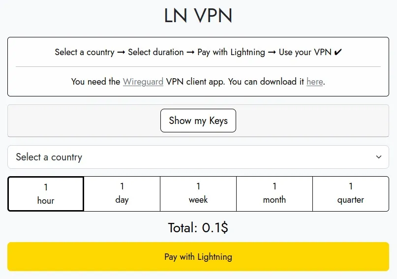

LN VPN ist ein VPN-Service à la carte, der nur Lightning-Zahlungen akzeptiert. Heute zeige ich dir, wie du es benutzen kannst und weniger Spuren hinterlässt, wenn du im Internet surfst.

Es gibt viele qualitativ hochwertige VPN-Serviceanbieter, wir haben in diesem Artikel eine umfassende Überprüfung durchgeführt (Hyperlink), aber LN VPN sticht heraus und wir konnten es nicht ignorieren.

Die meisten VPN-Serviceanbieter wie ProtonVPN und Mullvad bieten die Möglichkeit, mit Bitcoins zu bezahlen, erfordern jedoch die Erstellung eines Kontos und den Kauf eines lang- oder kurzfristigen Tarifs, was nicht unbedingt zu jedem Budget passt.

LN VPN ermöglicht die Nutzung eines VPN à la carte für eine so kurze Dauer wie eine Stunde dank seiner Implementierung von Bitcoin-Zahlungen über das Lightning-Netzwerk. Blitzschnell und anonym eröffnen Lightning-Zahlungen eine Welt der Möglichkeiten für Mikrozahlungen.

> 💡 Dieser Leitfaden beschreibt, wie man LN VPN von einem Linux Ubuntu 22.04 LTS-System aus verwendet.

## Voraussetzung: Wireguard

Einfach ausgedrückt dient Wireguard dazu, einen sicheren Tunnel zwischen deinem Computer und dem entfernten Server zu erstellen, über den du im Internet surfen wirst. Die IP-Adresse dieses Servers wird während der Laufzeit des Vertrags, den du gemäß diesem Leitfaden abschließt, als deine eigene erscheinen.

Offizieller Wireguard-Installationsleitfaden: https://www.wireguard.com/install/

```
Wireguard-Installation
          $ sudo apt-get update
          $ sudo apt install wireguard
```

## Voraussetzung: Bitcoin Lightning Wallet

Wenn du noch kein Bitcoin Lightning Wallet hast, keine Sorge, wir haben einen sehr einfachen Leitfaden für dich erstellt, hier. (Der LN-Tutorial-Abschnitt kann dir helfen)

## Schritt 1: Vertrag abschließen

Auf https://lnvpn.com musst du das Land der IP-Adresse des VPN-Tunnels und eine Laufzeit auswählen. Sobald diese Parameter festgelegt sind, klicke auf "Mit Lightning bezahlen".



Eine Lightning-Rechnung wird angezeigt, die du einfach mit deinem Lightning-Wallet scannen musst.

Nachdem die Rechnung bezahlt wurde, musst du einige Sekunden bis zu etwa zwei Minuten warten, bis deine Wireguard-Konfigurationsparameter generiert werden. Wenn es etwas länger dauert, keine Panik, wir haben diesen Vorgang dutzende Male durchgeführt, manchmal dauert es etwas länger.
'L'écran suivant s'affichera et il te suffira de cliquer sur "Download as File" pour recevoir ton fichier de config, celui-ci portera un nom qui ressemblera à lnvpn-xx-xx.conf où les "xx" correspondront à la date du jour.


## Schritt 2: Tunnel aktivieren

Zuerst musst du die Konfigurationsdatei, die du im vorherigen Schritt erhalten hast, umbenennen, damit sie automatisch von Wireguard erkannt werden kann.

Gehe in deinen Download-Ordner, entweder in einem Terminalfenster oder mit dem Datei-Explorer, und benenne die Datei lnvpn-xx-xx.conf wie folgt um: wg0.conf

```
    $ sudo ln -s usrbin/resolvectl usrlocal/bin/resolvconf
    $ sudo wg-quick up ~/Downloads/wg0.conf
```

Das war's! Der Tunnel ist aktiviert!

## Schritt 3: Überprüfen

Verwende einen Online-Dienst wie whatismyip, um zu überprüfen, ob deine öffentliche IP-Adresse jetzt die des VPN ist, das du gerade aktiviert hast.

## Schritt 4: Deaktivieren

Wenn dein Lease abgelaufen ist, musst du die Verbindung deaktivieren, um wieder Zugriff auf das Internet zu erhalten. Du kannst dann problemlos die Schritte 1 bis 3 wiederholen, wenn du einen Lease mit LN VPN abschließen möchtest.

Tunnel deaktivieren:

```
    $ sudo ip link delete dev wg0
```

Das war's! Du weißt jetzt, wie du LN VPN, einen einzigartigen VPN-Dienst, nutzen kannst!
