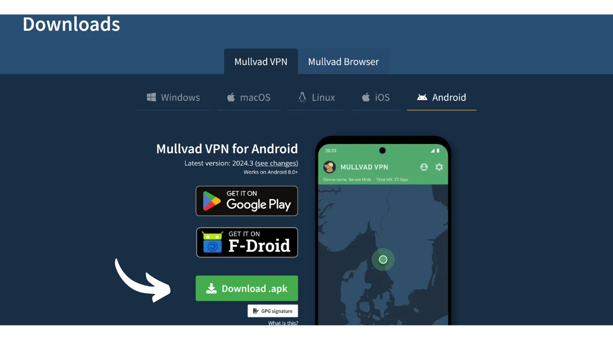
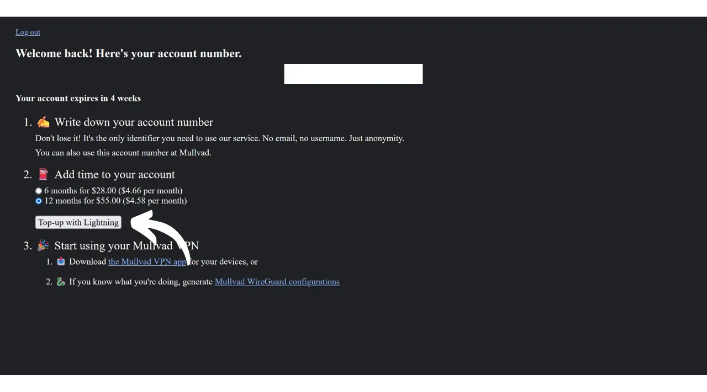
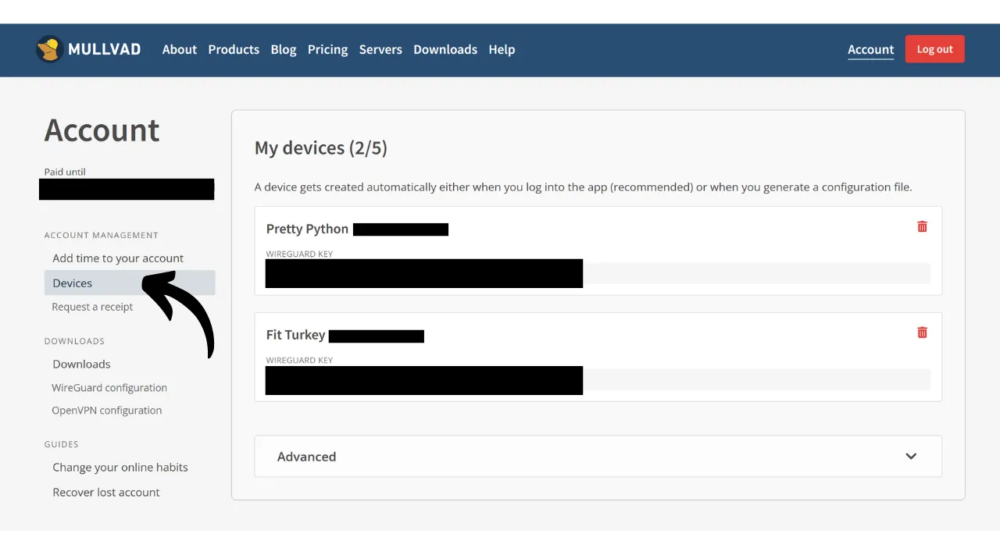

VPN ("*Virtual Private Network*" neboli Virtuální privátní síť) je služba, která vytváří bezpečné a šifrované spojení mezi vaším telefonem nebo počítačem a vzdáleným serverem spravovaným poskytovatelem VPN.

Technicky, když se připojíte k VPN, váš internetový provoz je přesměrován skrze šifrovaný tunel na server VPN. Tento proces ztěžuje třetím stranám, jako jsou poskytovatelé internetových služeb (ISP) nebo zákeřní aktéři, zachytit nebo číst vaše data. Server VPN pak funguje jako prostředník, který se za vás připojuje k službě, kterou chcete používat. Přiřadí vašemu připojení novou IP adresu, což pomáhá skrýt vaši skutečnou IP adresu před navštívenými weby. Nicméně, na rozdíl od toho, co naznačují některé online reklamy, používání VPN vám neumožní procházet internet anonymně, protože vyžaduje určitou úroveň důvěry v poskytovatele VPN, který může vidět veškerý váš provoz.

Výhody používání VPN jsou četné. Za prvé, chrání soukromí vaší online aktivity před ISP nebo vládami, za předpokladu, že poskytovatel VPN nesdílí vaše informace. Za druhé, zabezpečuje vaše data, zejména když jste připojeni k veřejným Wi-Fi sítím, které jsou zranitelné vůči útokům MITM ("**man-in-the-middle**"). Za třetí, skrytím vaší IP adresy VPN umožňuje obejít geografická omezení a cenzuru, aby bylo možné přistupovat k obsahu, který by jinak nebyl dostupný nebo byl ve vaší oblasti blokován.

Jak vidíte, VPN přesouvá riziko pozorování provozu na poskytovatele VPN. Proto je při výběru vašeho poskytovatele VPN důležité zvážit osobní údaje vyžadované pro registraci. Pokud poskytovatel požaduje informace, jako je vaše telefonní číslo, e-mailová adresa, údaje o bankovní kartě, nebo co je horší, vaši poštovní adresu, riziko spojení vaší identity s vaším provozem se zvyšuje. V případě kompromitace poskytovatele nebo právního zajištění by bylo snadné spojit váš provoz s vašimi osobními údaji. Proto se doporučuje vybrat poskytovatele, který nevyžaduje žádné osobní informace a přijímá anonymní platby, například bitcoiny.

V tomto tutoriálu vám představím jednoduché, efektivní a cenově dostupné řešení VPN, které nevyžaduje žádné osobní informace pro jeho použití.

## Úvod do Mullvad VPN
Mullvad VPN je švédská služba, která se vyznačuje svým závazkem k ochraně soukromí uživatelů. Na rozdíl od hlavních poskytovatelů VPN, Mullvad nevyžaduje při registraci žádné osobní údaje. Není třeba poskytovat e-mailovou adresu, telefonní číslo nebo jméno; místo toho vám Mullvad přiřadí anonymní číslo účtu, které se používá pro platbu a přístup ke službě. Navíc Mullvad tvrdí, že neuchovává žádné záznamy o aktivitě, která prochází jejich servery.

Pro platbu není nutné poskytovat informace o kreditní kartě, protože Mullvad přijímá platby v bitcoinech (pouze onchain na jejich oficiálním webu, ale existuje neoficiální metoda platby přes Lightning). Přijímají také platby v hotovosti poštou.

Mullvad VPN se také odlišuje svou transparentností a bezpečností. Jejich software je open-source a pravidelně podstupují nezávislé bezpečnostní audity, aby posoudili své aplikace a infrastrukturu, jejichž výsledky jsou [publikovány na jejich webových stránkách](https://mullvad.net/fr/blog/tag/audits). Společnost za Mullvadem sídlí ve Švédsku, zemi známé svými přísnými zákony o ochraně soukromí. Výhradně používají vlastní hostované servery, čímž eliminují rizika spojená s používáním služeb třetích stran v cloudu, jako jsou hyperscalers AWS, Google Cloud nebo Microsoft Azure.
Pokud jde o funkce, Mullvad nabízí vše, co se od kvalitního VPN klienta očekává, včetně kill switch, který chrání váš provoz v případě odpojení VPN, možnost zakázat VPN pro konkrétní aplikace a schopnost směrovat váš provoz přes více VPN serverů.
Samozřejmě, tato kvalita služby má svou cenu, ale spravedlivá cena často signalizuje kvalitu a poctivost. Může to naznačovat, že společnost má obchodní model, který nepotřebuje prodat vaše osobní údaje třetím stranám. Mullvad VPN nabízí jednotnou sazbu 5 eur za měsíc, použitelnou na až 5 různých zařízeních.

Na rozdíl od hlavních poskytovatelů VPN, Mullvad má model nákupu přístupového času ke službě namísto pravidelného, automatického předplatného. Jednoduše provedete jednorázovou platbu v bitcoinech na zvolenou dobu. Například, pokud si koupíte jeden rok přístupu, můžete službu používat po tuto dobu, po které musíte znovu navštívit webové stránky Mullvadu, abyste obnovili svůj přístupový čas.
Ve srovnání s IVPN, dalším poskytovatelem VPN vysoké kvality, je Mullvad mírně ekonomičtější. Například, i když se rozhodnete pro tříletý nákup u IVPN, měsíční náklady činí asi 5,40 €. IVPN však nabízí některé další služby a má také levnější plán než Mullvad (Standardní plán), ale ten je omezen pouze na 2 zařízení a nezahrnuje protokol "multi-hop".
Také jsem provedl několik neformálních testů rychlosti, abych porovnal IVPN a Mullvad. Ačkoli IVPN prokázal mírnou nadřazenost z hlediska výkonu, rychlosti u Mullvadu byly stále velmi uspokojivé. Ve srovnání s hlavními poskytovateli VPN se IVPN a Mullvad ukázali být alespoň stejně efektivní, pokud ne v některých případech nadřazení.

## Jak nainstalovat Mullvad VPN na počítač?

Navštivte [oficiální webové stránky Mullvadu](https://mullvad.net/en/download/) a klikněte na menu "*Stažení*".

Pro uživatele Windows nebo macOS stáhněte software přímo ze stránky a postupujte podle pokynů instalačního průvodce pro dokončení instalace.

Pro uživatele Linuxu najdete instrukce specifické pro vaši distribuci v sekci ["*Linux*"](https://mullvad.net/en/download/vpn/linux).

Po dokončení instalace budete muset zadat své ID účtu. Jak toto získat, uvidíme v následujících částech tohoto návodu.

## Jak nainstalovat Mullvad VPN na smartphone?

Stáhněte si Mullvad VPN z vašeho obchodu s aplikacemi, ať už je to [AppStore](https://apps.apple.com/us/app/mullvad-vpn/id1488466513) pro uživatele iOS, [Google Play Store](https://play.google.com/store/apps/details?id=net.mullvad.mullvadvpn) pro Android, nebo [F-Droid](https://f-droid.org/packages/net.mullvad.mullvadvpn/). Pokud používáte Android, máte také možnost stáhnout soubor `.apk` přímo z [webových stránek Mullvadu](https://mullvad.net/en/download/vpn/android).

Při prvním použití aplikace budete odhlášeni. Budete muset zadat své ID účtu, aby byla služba aktivována.
Nyní přejděme k aktivaci Mullvadu na vašich zařízeních.

## Jak zaplatit a aktivovat Mullvad VPN?

Přejděte na [oficiální webové stránky Mullvadu](https://mullvad.net/) a klikněte na tlačítko "*Začít*".

Klikněte na tlačítko "*Vygenerovat číslo účtu*".
Mullvad poté vytvoří váš účet. Není potřeba poskytovat žádné osobní informace. K přihlášení vám postačí pouze číslo vašeho účtu, které funguje podobně jako přístupový klíč. Uložte si jej na bezpečné místo, například do správce hesel. Můžete si také udělat papírovou kopii.

Poté klikněte na tlačítko "*Přidat čas k vašemu účtu*".

Dostanete se na přihlašovací stránku vašeho účtu. Zadejte číslo vašeho účtu a poté klikněte na tlačítko "*Přihlásit se*".

Vyberte způsob platby. Doporučuji platbu v bitcoinech, protože získáte 10% slevu, což sníží cenu na 4,50 € za měsíc. Pokud preferujete platbu přes Lightning, alternativní metodu poskytnu v další části.

Klikněte na tlačítko "*Vytvořit jednorázovou platební adresu*".

Poté zaplaťte z vaší Bitcoin peněženky uvedenou částku na přijímací adresu, která vám byla dána.

Může trvat několik minut, než stránka detekuje vaši platbu, jakmile je transakce potvrzena. Jakmile Mullvad detekuje platbu, doba trvání vašeho předplatného se objeví v levém horním rohu stránky, místo zmínky "*Žádný zbývající čas*".

Poté můžete zadat číslo vašeho účtu do softwaru pro aktivaci VPN.

Pro aktivaci VPN ve vaší mobilní aplikaci je postup přesně stejný. Stačí zadat číslo vašeho účtu.

## Jak zaplatit za Mullvad VPN pomocí Lightning?

Jak jste pochopili, Mullvad zatím nepřijímá platby přes Lightning Network. Díky doporučení od [Lounèse](https://x.com/louneskmt) jsem však objevil neformální službu, která vám umožní obejít toto omezení. Tato služba, dostupná na [vpn.sovereign.engineering](https://vpn.sovereign.engineering/), přijímá vaše platby na Lightning a vrací vám platný plán pro Mullvad.

Na tomto webu máte dvě různé možnosti: můžete důvěřovat správci webu a přímo zadat číslo svého účtu, poté kliknout na tlačítko "*Přihlásit se*", aby byl váš balíček Mullvad automaticky ověřen. Nebo můžete kliknout na tlačítko "*Heck yeah!*" a koupit Voucher v Lightning, který poté můžete použít na oficiálním webu Mullvad k získání vašeho balíčku.  V obou případech budete poté požádáni, abyste vybrali dobu trvání vašeho balíčku. Můžete si vybrat mezi 6 měsíci a 1 rokem.  Poté klikněte na tlačítko "*Dobít pomocí Lightning*".  Pro dokončení nákupu zaplaťte fakturu pomocí vaší Lightning peněženky.  Pokud jste se rozhodli koupit Voucher, na webu Mullvad vyberte mezi dostupnými platebními metodami na vašem účtu možnost "*Voucher*". Poté zadejte číslo Voucheru, které jste obdrželi z webu vpn.sovereign.engineering do určeného pole.  ## Jak používat a konfigurovat Mullvad VPN?
Nyní, když máte aktivní účet a zadali jste číslo svého účtu do softwaru nebo aplikace Mullvad, můžete plně využívat služby vašeho VPN.  Pro odpojení od VPN jednoduše klikněte na tlačítko "*Odpojit*".  Malá červená šipka vedle tlačítka "*Odpojit*" vám umožní změnit servery bez změny aktuální lokality.  Pokud chcete změnit města pro váš VPN server, klikněte na "*Změnit lokaci*", abyste si vybrali novou lokaci.  V horní části obrazovky uvidíte přezdívku vašeho zařízení a zbývající dobu trvání vašeho balíčku.  Kliknutím na ikonu malého muže získáte podrobné informace o vašem účtu.  Pro přístup k nastavení klikněte na ozubené kolo.  V menu "*Nastavení uživatelského rozhraní*" můžete přizpůsobit nastavení vašeho softwaru, včetně jazyka rozhraní a jeho chování ve vašem systému.  V menu "*Nastavení VPN*" najdete možnosti související s vaším VPN. Doporučuji povolit možnosti "*Spustit aplikaci při startu*" a "*Automatické připojení*", aby se vaše VPN připojení automaticky spustilo, když váš stroj začne.
 V submenu "*Blokování obsahu DNS*" máte možnost filtrovat a blokovat DNS požadavky na škodlivé, reklamní nebo nechtěné webové stránky.

Nakonec menu "*Split tunneling*" umožňuje vybrat konkrétní aplikace na vašem stroji, pro které nebude internetový provoz směrován přes VPN.

Pro přehled o vašem účtu Mullvad a správu různých připojených zařízení můžete kliknout na menu "*Zařízení*" na webu.
A tady to máte, nyní jste plně vybaveni k užívání Mullvad VPN. Pokud máte zájem objevit dalšího poskytovatele VPN podobného Mullvadu, jak z hlediska funkcí, tak cenové politiky, doporučuji také prohlédnout náš návod na IVPN:

https://planb.network/tutorials/others/ivpn