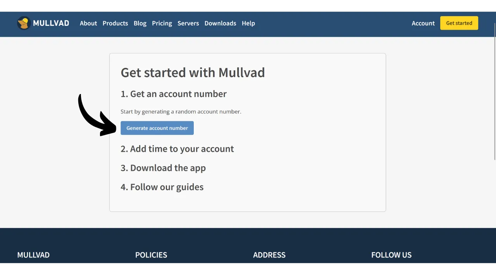
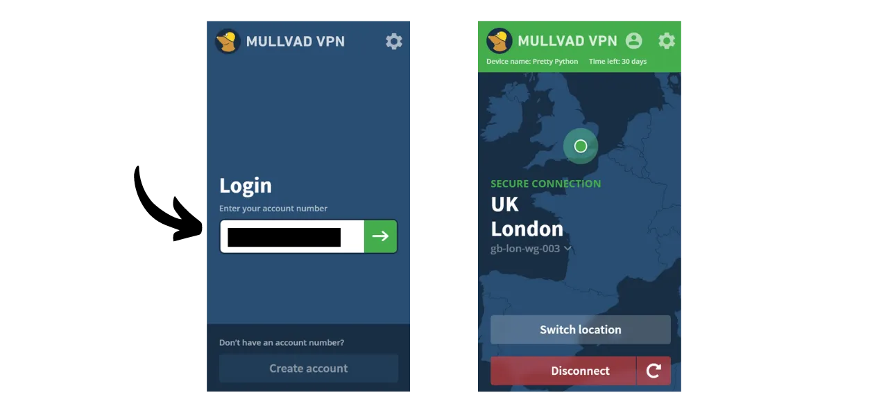
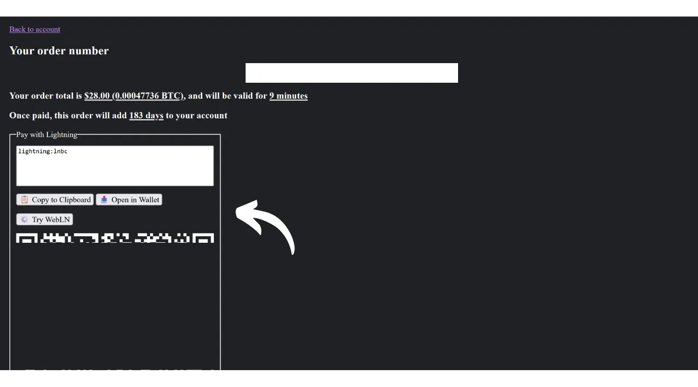
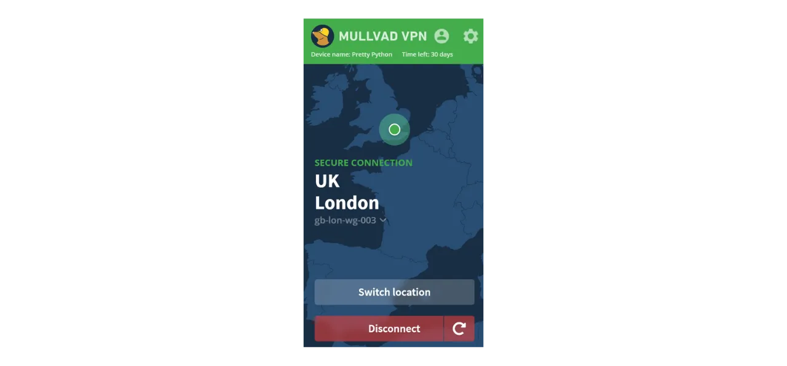
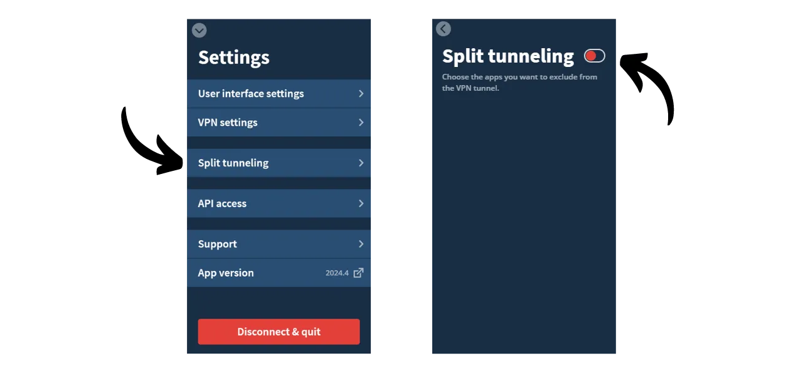

Ein VPN ("*Virtual Private Network*") ist ein Dienst, der eine sichere und verschlüsselte Verbindung zwischen Ihrem Telefon oder Computer und einem entfernten Server herstellt, der von einem VPN-Anbieter verwaltet wird.

Technisch gesehen wird beim Verbinden mit einem VPN Ihr Internetverkehr durch einen verschlüsselten Tunnel zum VPN-Server umgeleitet. Dieser Prozess erschwert es Dritten, wie Internetdienstanbietern (ISPs) oder bösartigen Akteuren, Ihre Daten abzufangen oder zu lesen. Der VPN-Server fungiert dann als Vermittler, der sich in Ihrem Namen mit dem Dienst verbindet, den Sie nutzen möchten. Er weist Ihrer Verbindung eine neue IP-Adresse zu, was dazu beiträgt, Ihre echte IP-Adresse vor den besuchten Websites zu verbergen. Allerdings erlaubt die Nutzung eines VPNs, entgegen dem, was einige Online-Werbungen vorschlagen mögen, nicht, das Internet anonym zu durchsuchen, da es ein gewisses Maß an Vertrauen in den VPN-Anbieter erfordert, der all Ihren Verkehr sehen kann.

Die Vorteile der Nutzung eines VPNs sind zahlreich. Erstens bewahrt es die Privatsphäre Ihrer Online-Aktivitäten vor ISPs oder Regierungen, vorausgesetzt, der VPN-Anbieter teilt Ihre Informationen nicht. Zweitens sichert es Ihre Daten, besonders wenn Sie mit öffentlichen WLAN-Netzwerken verbunden sind, die anfällig für MITM ("**man-in-the-middle**")-Angriffe sind. Drittens ermöglicht ein VPN durch das Verbergen Ihrer IP-Adresse das Umgehen geografischer Beschränkungen und Zensur, um auf Inhalte zuzugreifen, die sonst in Ihrer Region nicht verfügbar oder blockiert wären.

Wie Sie sehen, verlagert das VPN das Risiko der Verkehrsbeobachtung auf den VPN-Anbieter. Daher ist es wichtig, bei der Auswahl Ihres VPN-Anbieters die für die Registrierung erforderlichen persönlichen Daten zu berücksichtigen. Wenn der Anbieter Informationen wie Ihre Telefonnummer, E-Mail-Adresse, Bankkartendetails oder schlimmer noch, Ihre Postanschrift verlangt, erhöht sich das Risiko, Ihre Identität mit Ihrem Verkehr in Verbindung zu bringen. Im Falle eines Kompromisses des Anbieters oder einer rechtlichen Beschlagnahme wäre es einfach, Ihren Verkehr mit Ihren persönlichen Daten in Verbindung zu bringen. Daher wird empfohlen, einen Anbieter zu wählen, der keine persönlichen Informationen verlangt und anonyme Zahlungen akzeptiert, wie zum Beispiel mit Bitcoins.

In diesem Tutorial werde ich eine einfache, effiziente und preislich angemessene VPN-Lösung vorstellen, die keine persönlichen Informationen für ihre Nutzung erfordert.

## Einführung in Mullvad VPN
Mullvad VPN ist ein schwedischer Dienst, der sich durch sein Engagement für die Privatsphäre der Nutzer auszeichnet. Im Gegensatz zu den meisten VPN-Anbietern erfordert Mullvad keine persönlichen Daten bei der Anmeldung. Es ist nicht notwendig, eine E-Mail-Adresse, Telefonnummer oder Namen anzugeben; stattdessen weist Mullvad Ihnen eine anonyme Kontonummer zu, die für die Zahlung und den Zugang zum Dienst verwendet wird. Zusätzlich behauptet Mullvad, keine Aktivitätsprotokolle zu führen, die durch ihre Server gehen.

Für die Zahlung ist es nicht unbedingt erforderlich, Kreditkarteninformationen anzugeben, da Mullvad Bitcoin-Zahlungen akzeptiert (nur onchain auf ihrer offiziellen Seite, aber es gibt eine inoffizielle Methode, über Lightning zu bezahlen). Sie akzeptieren auch Barzahlungen per Post.

Mullvad VPN zeichnet sich auch durch seine Transparenz und Sicherheit aus. Ihre Software ist Open-Source, und sie unterziehen sich regelmäßig unabhängigen Sicherheitsaudits, um ihre Anwendungen und Infrastruktur zu bewerten, deren Ergebnisse auf ihrer [Website veröffentlicht werden](https://mullvad.net/fr/blog/tag/audits). Das Unternehmen hinter Mullvad hat seinen Sitz in Schweden, einem Land, das für seine strengen Datenschutzgesetze bekannt ist. Sie verwenden ausschließlich selbst gehostete Server und eliminieren damit die Risiken, die mit der Nutzung von Cloud-Diensten Dritter verbunden sind, wie z. B. Hyperscaler AWS, Google Cloud oder Microsoft Azure.
In Bezug auf Funktionen bietet Mullvad alles, was man von einem guten VPN-Client erwartet, einschließlich eines Kill-Switch, der Ihren Datenverkehr schützt, falls die VPN-Verbindung unterbrochen wird, einer Option, das VPN für bestimmte Anwendungen zu deaktivieren, und der Möglichkeit, Ihren Datenverkehr durch mehrere VPN-Server zu leiten.
Natürlich hat diese Qualität ihren Preis, aber ein fairer Preis ist oft ein Indikator für Qualität und Ehrlichkeit. Es kann signalisieren, dass das Unternehmen ein Geschäftsmodell hat, ohne Ihre persönlichen Daten an Dritte verkaufen zu müssen. Mullvad VPN bietet einen Pauschaltarif von 5 Euro pro Monat, nutzbar auf bis zu 5 verschiedenen Geräten.

Im Gegensatz zu den Mainstream-VPN-Anbietern hat Mullvad ein Modell, bei dem man Zugangszeit zum Dienst kauft, anstatt ein wiederkehrendes, automatisches Abonnement. Sie machen einfach eine einmalige Zahlung in Bitcoins für die gewählte Dauer. Wenn Sie beispielsweise ein Jahr Zugang kaufen, können Sie den Dienst für diesen Zeitraum nutzen, nach dem Sie zur Website von Mullvad zurückkehren müssen, um Ihre Zugangszeit zu erneuern.
Im Vergleich zu IVPN, einem anderen hochwertigen VPN-Anbieter, ist Mullvad etwas günstiger. Beispielsweise beträgt die monatliche Kosten bei einer dreijährigen Buchung mit IVPN etwa 5,40 €. Allerdings bietet IVPN einige zusätzliche Dienste und hat auch einen günstigeren Tarif als Mullvad (den Standardtarif), der jedoch auf nur 2 Geräte beschränkt ist und das "Multi-Hop"-Protokoll ausschließt.
Ich habe auch einige informelle Geschwindigkeitstests durchgeführt, um IVPN und Mullvad zu vergleichen. Obwohl IVPN in Bezug auf die Leistung eine leichte Überlegenheit zeigte, waren die Geschwindigkeiten bei Mullvad immer noch sehr zufriedenstellend. Im Vergleich zu den Mainstream-VPN-Anbietern erwiesen sich IVPN und Mullvad als mindestens genauso effizient, wenn nicht in einigen Fällen sogar überlegen.

## Wie installiert man Mullvad VPN auf einem Computer?

Besuchen Sie die [offizielle Mullvad-Website](https://mullvad.net/en/download/) und klicken Sie auf das Menü "*Downloads*".

Für Windows- oder macOS-Benutzer laden Sie die Software direkt von der Website herunter und folgen den Anweisungen des Installationsassistenten, um die Installation abzuschließen.

Für Linux-Benutzer finden Sie die spezifischen Anweisungen für Ihre Distribution im Abschnitt ["*Linux*"](https://mullvad.net/en/download/vpn/linux).

Sobald die Installation abgeschlossen ist, müssen Sie Ihre Konten-ID eingeben. Wie Sie diese erhalten, sehen wir in den folgenden Abschnitten dieses Tutorials.

## Wie installiert man Mullvad VPN auf einem Smartphone?

Laden Sie Mullvad VPN aus Ihrem App-Store herunter, egal ob es der [AppStore](https://apps.apple.com/us/app/mullvad-vpn/id1488466513) für iOS-Benutzer, der [Google Play Store](https://play.google.com/store/apps/details?id=net.mullvad.mullvadvpn) für Android oder [F-Droid](https://f-droid.org/packages/net.mullvad.mullvadvpn/) ist. Wenn Sie Android verwenden, haben Sie auch die Möglichkeit, die `.apk`-Datei direkt von [der Mullvad-Website](https://mullvad.net/en/download/vpn/android) herunterzuladen.

Bei der ersten Verwendung der App werden Sie abgemeldet. Sie müssen Ihre Konten-ID eingeben, um den Dienst zu aktivieren.
Nun, lassen Sie uns damit beginnen, Mullvad auf Ihren Geräten zu aktivieren.

## Wie bezahlt und aktiviert man Mullvad VPN?

Gehen Sie auf die [offizielle Mullvad-Website](https://mullvad.net/) und klicken Sie auf den Button "*Loslegen*".

Klicken Sie auf den Button "*Kontonummer generieren*".
Mullvad wird dann Ihr Konto erstellen. Sie müssen keine persönlichen Informationen angeben. Nur Ihre Kontonummer ermöglicht es Ihnen, sich einzuloggen. Sie fungiert quasi wie ein Zugangsschlüssel. Bewahren Sie sie an einem sicheren Ort auf, beispielsweise in Ihrem Passwortmanager. Sie können auch eine Papierkopie anfertigen.

Klicken Sie dann auf den Button "*Zeit zu Ihrem Konto hinzufügen*".

Sie gelangen dann zur Anmeldeseite für Ihr Konto. Geben Sie Ihre Kontonummer ein und klicken Sie dann auf den Button "*Einloggen*".

Wählen Sie Ihre Zahlungsmethode. Ich empfehle die Zahlung in Bitcoins, da Sie von einem 10% Rabatt profitieren, was die Kosten auf 4,50 € pro Monat senkt. Wenn Sie lieber über Lightning bezahlen möchten, werde ich im folgenden Teil eine alternative Methode vorstellen.

Klicken Sie auf den Button "*Eine einmalige Zahlungsadresse erstellen*".

Bezahlen Sie dann mit Ihrer Bitcoin-Wallet den angegebenen Betrag an die Ihnen mitgeteilte Empfangsadresse.

Es kann einige Minuten dauern, bis die Seite Ihre Zahlung erkennt, sobald die Transaktion bestätigt ist. Sobald die Zahlung von Mullvad erkannt wird, erscheint die Dauer Ihres Abonnements oben links auf der Seite, anstelle der Erwähnung "*Keine Zeit übrig*".

Sie können dann Ihre Kontonummer in der Software eingeben, um das VPN zu aktivieren.

Um das VPN in Ihrer mobilen Anwendung zu aktivieren, ist der Prozess genau derselbe. Sie müssen lediglich Ihre Kontonummer eingeben.

## Wie bezahlt man Mullvad VPN mit Lightning?

Wie Sie verstanden haben, akzeptiert Mullvad noch keine Zahlungen über das Lightning-Netzwerk. Dank einer Empfehlung von [Lounès](https://x.com/louneskmt) habe ich jedoch einen inoffiziellen Dienst entdeckt, der es Ihnen ermöglicht, diese Einschränkung zu umgehen. Dieser Dienst, verfügbar auf [vpn.sovereign.engineering](https://vpn.sovereign.engineering/), akzeptiert Ihre Zahlungen über Lightning und stellt Ihnen im Gegenzug einen gültigen Plan für Mullvad zur Verfügung.

Auf dieser Website haben Sie zwei verschiedene Optionen: Sie können dem Seitenmanager vertrauen und Ihre Kontonummer direkt eingeben, dann auf "*Einloggen*" klicken, damit Ihr Mullvad-Paket automatisch validiert wird. Oder Sie können auf den "*Heck yeah!*" Button klicken, um einen Gutschein in Lightning zu kaufen, den Sie dann auf der offiziellen Mullvad-Website verwenden können, um Ihr Paket zu erhalten.  In beiden Fällen werden Sie dann gebeten, die Laufzeit Ihres Pakets auszuwählen. Sie können zwischen 6 Monaten und 1 Jahr wählen.  Klicken Sie dann auf den "*Mit Lightning aufladen*" Button.  Um den Kauf abzuschließen, bezahlen Sie die Rechnung mit Ihrer Lightning-Wallet.  Wenn Sie sich entschieden haben, einen Gutschein zu kaufen, wählen Sie auf der Mullvad-Website "*Gutschein*" unter den verfügbaren Zahlungsmethoden auf Ihrem Konto aus. Geben Sie dann die Gutscheinnummer, die Sie von der Website vpn.sovereign.engineering erhalten haben, in das vorgesehene Feld ein.  ## Wie verwendet und konfiguriert man Mullvad VPN?
Jetzt, da Sie ein aktives Konto haben und Ihre Kontonummer in der Mullvad-Software oder App eingegeben haben, können Sie die Dienste Ihres VPN vollständig genießen.  Um die Verbindung zum VPN zu trennen, klicken Sie einfach auf den "*Trennen*" Button.  Der kleine rote Pfeil neben dem "*Trennen*" Button ermöglicht es Ihnen, Server zu wechseln, ohne den aktuellen Standort zu ändern.  Wenn Sie die Stadt für Ihren VPN-Server wechseln möchten, klicken Sie auf "*Standort wechseln*", um einen neuen Standort auszuwählen.  Oben auf dem Bildschirm sehen Sie den Spitznamen Ihres Geräts sowie die verbleibende Laufzeit Ihres Pakets.  Durch Klicken auf das Symbol des kleinen Mannes erhalten Sie detaillierte Informationen über Ihr Konto.  Um auf Einstellungen zuzugreifen, klicken Sie auf das Zahnrad.  Im Menü "*Benutzeroberflächeneinstellungen*" können Sie die Einstellungen Ihrer Software anpassen, einschließlich der Sprache der Benutzeroberfläche und ihres Verhaltens auf Ihrem System.  Im Menü "*VPN-Einstellungen*" finden Sie Optionen, die sich auf Ihr VPN beziehen. Ich empfehle, die Optionen "*App beim Start ausführen*" und "*Automatisch verbinden*" zu aktivieren, damit Ihre VPN-Verbindung automatisch startet, wenn Ihre Maschine hochfährt.
 Im Untermenü "*DNS-Inhaltsblocker*" haben Sie die Möglichkeit, DNS-Anfragen zu bösartigen, werbenden oder unerwünschten Websites zu filtern und zu blockieren.

Schließlich ermöglicht Ihnen das Menü "*Split-Tunneling*", spezifische Anwendungen auf Ihrer Maschine auszuwählen, für die der Internetverkehr nicht durch das VPN geleitet wird.

Um einen Überblick über Ihr Mullvad-Konto zu erhalten und die verschiedenen verbundenen Geräte zu verwalten, können Sie im Website-Menü auf "*Geräte*" klicken.
Und da haben Sie es, Sie sind jetzt bestens ausgestattet, um Mullvad VPN vollständig zu genießen. Wenn Sie an der Entdeckung eines weiteren VPN-Anbieters interessiert sind, der Mullvad in Bezug auf Funktionen und Preise ähnlich ist, empfehle ich Ihnen auch, unser Tutorial über IVPN zu prüfen:

https://planb.network/tutorials/others/ivpn