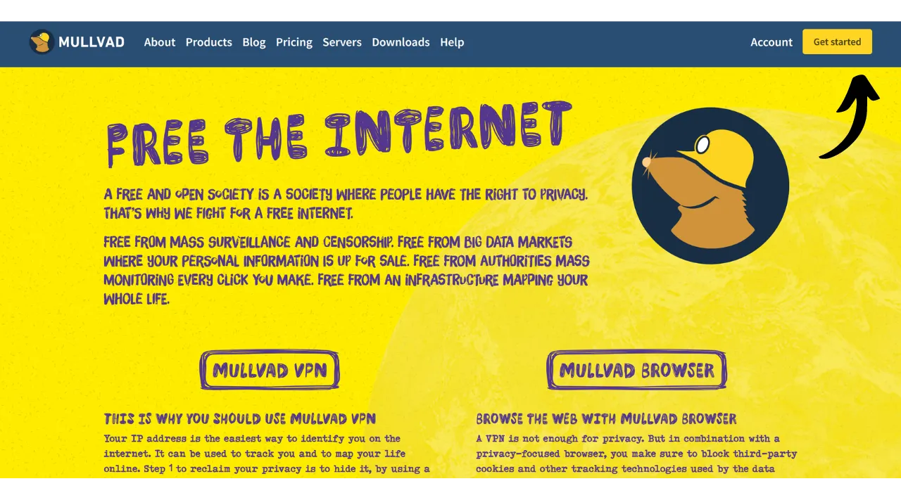
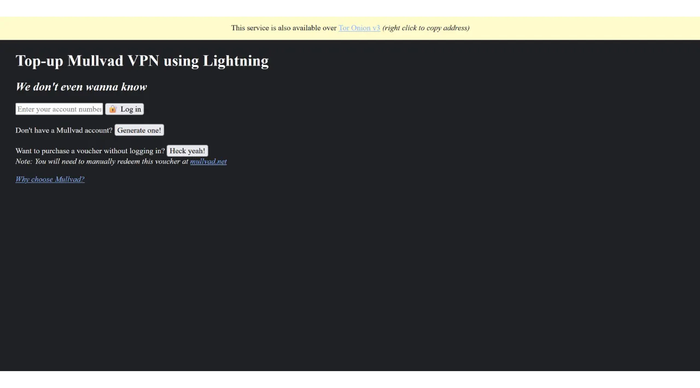
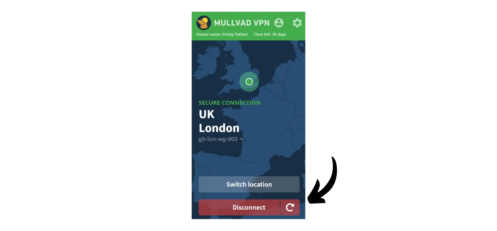

Una VPN ("*Virtual Private Network*" o Red Privada Virtual) es un servicio que establece una conexión segura y cifrada entre tu teléfono o computadora y un servidor remoto gestionado por un proveedor de VPN.

Técnicamente, al conectarte a una VPN, tu tráfico de internet es redirigido a través de un túnel cifrado hacia el servidor VPN. Este proceso dificulta que terceros, como los Proveedores de Servicios de Internet (ISPs) o actores maliciosos, intercepten o lean tus datos. El servidor VPN actúa entonces como un intermediario que se conecta al servicio que deseas utilizar en tu nombre. Asigna una nueva dirección IP a tu conexión, lo que ayuda a ocultar tu dirección IP real de los sitios que visitas. Sin embargo, contrario a lo que algunas publicidades en línea pueden sugerir, usar una VPN no te permite navegar por internet de forma anónima, ya que requiere un nivel de confianza en el proveedor de VPN que puede ver todo tu tráfico.

Los beneficios de usar una VPN son numerosos. En primer lugar, preserva la privacidad de tu actividad en línea de los ISPs o gobiernos, siempre que el proveedor de VPN no comparta tu información. En segundo lugar, asegura tus datos, especialmente cuando estás conectado a redes Wi-Fi públicas, que son vulnerables a ataques de tipo "**man-in-the-middle**" (hombre en el medio). En tercer lugar, al ocultar tu dirección IP, una VPN te permite sortear restricciones geográficas y censura, para acceder a contenido que de otro modo estaría no disponible o bloqueado en tu región.

Como puedes ver, la VPN traslada el riesgo de observación del tráfico al proveedor de VPN. Por lo tanto, al elegir tu proveedor de VPN, es importante considerar los datos personales requeridos para el registro. Si el proveedor solicita información como tu número de teléfono, dirección de correo electrónico, detalles de tarjeta bancaria, o peor aún, tu dirección postal, el riesgo de asociar tu identidad con tu tráfico aumenta. En caso de un compromiso del proveedor o una incautación legal, sería fácil asociar tu tráfico con tus datos personales. Por lo tanto, se recomienda elegir un proveedor que no requiera ninguna información personal y acepte pagos anónimos, como con bitcoins.

En este tutorial, presentaré una solución VPN simple, eficiente y a un precio razonable que no requiere información personal para su uso.

## Introducción a Mullvad VPN
Mullvad VPN es un servicio sueco que se destaca por su compromiso con la privacidad del usuario. A diferencia de los proveedores de VPN convencionales, Mullvad no requiere datos personales al registrarse. No es necesario proporcionar una dirección de correo electrónico, número de teléfono o nombre; en su lugar, Mullvad te asigna un número de cuenta anónimo utilizado para el pago y acceso al servicio. Además, Mullvad afirma no mantener registros de actividad que pasen por sus servidores.

Para el pago, no es necesariamente requerido proporcionar información de tarjeta de crédito, ya que Mullvad acepta pagos con bitcoin (solo onchain en su sitio oficial, pero hay un método no oficial para pagar a través de Lightning). También aceptan pagos en efectivo por correo.

Mullvad VPN también se distingue por su transparencia y seguridad. Su software es de código abierto, y regularmente se someten a auditorías de seguridad independientes para evaluar sus aplicaciones e infraestructura, cuyos resultados son [publicados en su sitio web](https://mullvad.net/fr/blog/tag/audits). La compañía detrás de Mullvad tiene su sede en Suecia, un país conocido por sus estrictas leyes de privacidad. Utilizan exclusivamente servidores autoalojados, eliminando así los riesgos asociados con el uso de servicios en la nube de terceros, como los hiperescaladores AWS, Google Cloud o Microsoft Azure.
En términos de características, Mullvad ofrece todo lo que uno espera de un buen cliente VPN, incluyendo un interruptor de apagado que protege tu tráfico si la VPN se desconecta, una opción para deshabilitar la VPN para aplicaciones específicas y la capacidad de enrutar tu tráfico a través de múltiples servidores VPN.
Naturalmente, esta calidad de servicio tiene un costo, pero un precio justo es a menudo un indicador de calidad y honestidad. Puede señalar que la compañía tiene un modelo de negocio sin necesidad de vender tus datos personales a terceros. Mullvad VPN ofrece una tarifa plana de 5 euros por mes, utilizable en hasta 5 dispositivos diferentes.

A diferencia de los proveedores de VPN más conocidos, Mullvad tiene un modelo de compra de tiempo de acceso al servicio en lugar de una suscripción automática recurrente. Simplemente haces un pago único en bitcoins por la duración elegida. Por ejemplo, si compras un año de acceso, puedes usar el servicio durante ese período, después del cual debes regresar al sitio web de Mullvad para renovar tu tiempo de acceso.
Comparado con IVPN, otro proveedor de VPN de alta calidad, Mullvad es ligeramente más económico. Por ejemplo, incluso al optar por una compra de tres años con IVPN, el costo mensual asciende a unos 5,40 €. Sin embargo, IVPN sí ofrece algunos servicios adicionales y también tiene un plan más barato que el de Mullvad (el plan Estándar), pero este está limitado a solo 2 dispositivos y excluye el protocolo "multi-hop".
También realicé algunas pruebas de velocidad informales para comparar IVPN y Mullvad. Aunque IVPN mostró una ligera superioridad en términos de rendimiento, las velocidades en Mullvad todavía eran muy satisfactorias. Comparados con los proveedores de VPN más conocidos, IVPN y Mullvad demostraron ser al menos tan eficientes, si no superiores en algunos casos.

## ¿Cómo instalar Mullvad VPN en una computadora?

Visita el [sitio oficial de Mullvad](https://mullvad.net/en/download/) y haz clic en el menú "*Descargas*".

Para usuarios de Windows o macOS, descarga el software directamente desde el sitio y sigue las instrucciones proporcionadas por el asistente de instalación para completar la instalación.

Para usuarios de Linux, puedes encontrar las instrucciones específicas para tu distribución en la sección ["*Linux*"](https://mullvad.net/en/download/vpn/linux).

Una vez completada la instalación, necesitarás ingresar tu ID de cuenta. Veremos cómo obtener esto en las siguientes secciones de este tutorial.

## ¿Cómo instalar Mullvad VPN en un smartphone?

Descarga Mullvad VPN desde tu tienda de aplicaciones, ya sea la [AppStore](https://apps.apple.com/us/app/mullvad-vpn/id1488466513) para usuarios de iOS, la [Google Play Store](https://play.google.com/store/apps/details?id=net.mullvad.mullvadvpn) para Android, o [F-Droid](https://f-droid.org/packages/net.mullvad.mullvadvpn/). Si estás utilizando Android, también tienes la opción de descargar el archivo `.apk` directamente desde [el sitio de Mullvad](https://mullvad.net/en/download/vpn/android).

Al usar la app por primera vez, estarás deslogueado. Necesitarás ingresar tu ID de cuenta para activar el servicio.
Ahora, pasemos a activar Mullvad en tus dispositivos.

## ¿Cómo pagar y activar Mullvad VPN?

Ve al [sitio oficial de Mullvad](https://mullvad.net/) y haz clic en el botón "*Empezar*".

Haz clic en el botón "*Generar número de cuenta*".
Mullvad creará tu cuenta. No necesitas proporcionar ninguna información personal. Solo tu número de cuenta te permitirá iniciar sesión. Actúa algo así como una llave de acceso. Guárdalo en un lugar seguro, como tu gestor de contraseñas, por ejemplo. También puedes hacer una copia en papel.

Luego haz clic en el botón "*Añadir tiempo a tu cuenta*".

Entonces llegarás a la página de inicio de sesión de tu cuenta. Ingresa tu número de cuenta y luego haz clic en el botón "*Iniciar sesión*".

Elige tu método de pago. Recomiendo pagar con bitcoins, ya que te beneficiarás de un descuento del 10%, lo que reduce el costo a €4.50 por mes. Si prefieres pagar a través de Lightning, proporcionaré un método alternativo en la siguiente parte.

Haz clic en el botón "*Crear una dirección de pago única*".

Luego paga con tu billetera Bitcoin el monto indicado a la dirección de recepción que se te ha dado.

Puede tardar unos minutos antes de que el sitio detecte tu pago, una vez que la transacción esté confirmada. Una vez que el pago sea detectado por Mullvad, la duración de tu suscripción aparecerá en la parte superior izquierda de la página, en lugar de la mención "*No queda tiempo*".

Entonces puedes ingresar tu número de cuenta en el software para activar la VPN.

Para activar la VPN en tu aplicación móvil, el proceso es exactamente el mismo. Solo necesitas ingresar tu número de cuenta.

## ¿Cómo pagar Mullvad VPN con Lightning?

Como has entendido, Mullvad aún no acepta pagos a través de la red Lightning. Sin embargo, gracias a una recomendación de [Lounès](https://x.com/louneskmt), descubrí un servicio informal que te permite sortear esta limitación. Este servicio, disponible en [vpn.sovereign.engineering](https://vpn.sovereign.engineering/), acepta tus pagos en Lightning y te proporciona un plan válido para Mullvad a cambio.

Tienes 2 opciones diferentes en este sitio: puedes confiar en el administrador del sitio e ingresar tu número de cuenta directamente, luego hacer clic en "*Iniciar sesión*" para que tu paquete de Mullvad sea validado automáticamente. O, puedes hacer clic en el botón "*¡Heck yeah!*" para comprar un Vale en Lightning, que luego puedes usar en el sitio oficial de Mullvad para obtener tu paquete.  En ambos casos, luego se te pedirá que selecciones la duración de tu paquete. Puedes elegir entre 6 meses y 1 año.  Luego haz clic en el botón "*Recargar con Lightning*".  Para finalizar la compra, paga la factura con tu billetera Lightning.  Si optaste por comprar un Vale, en el sitio de Mullvad, selecciona "*Vale*" entre los métodos de pago disponibles en tu cuenta. Luego, ingresa el número del Vale que recibiste del sitio vpn.sovereign.engineering en el cuadro designado.  ## ¿Cómo usar y configurar Mullvad VPN?
Ahora que tienes una cuenta activa y has ingresado tu número de cuenta en el software o aplicación de Mullvad, puedes disfrutar plenamente de los servicios de tu VPN.  Para desconectarte de la VPN, simplemente haz clic en el botón "*Desconectar*".  La pequeña flecha roja al lado del botón "*Desconectar*" te permite cambiar de servidores sin cambiar la ubicación actual.  Si deseas cambiar de ciudad para tu servidor VPN, haz clic en "*Cambiar ubicación*" para elegir una nueva ubicación.  En la parte superior de la pantalla, verás el apodo de tu dispositivo así como la duración restante de tu paquete.  Al hacer clic en el icono del hombrecito, accederás a información detallada sobre tu cuenta.  Para acceder a la configuración, haz clic en la rueda dentada.  En el menú de "*Configuración de la interfaz de usuario*", puedes personalizar la configuración de tu software, incluyendo el idioma de la interfaz y su comportamiento en tu sistema.  En el menú de "*Configuración de VPN*", encontrarás opciones relacionadas con tu VPN. Recomiendo habilitar las opciones "*Iniciar aplicación al arrancar*" y "*Conexión automática*" para que tu conexión VPN se inicie automáticamente cuando tu máquina se encienda.
 En el submenú de "*Bloqueadores de contenido DNS*", tienes la opción de filtrar y bloquear solicitudes DNS a sitios web maliciosos, publicitarios o no deseados.

Finalmente, el menú de "*Túnel dividido*" te permite seleccionar aplicaciones específicas en tu máquina para las cuales el tráfico de internet no será enrutado a través de la VPN.

Para obtener una visión general de tu cuenta de Mullvad y gestionar los diversos dispositivos conectados, puedes hacer clic en el menú de "*Dispositivos*" en el sitio web.
 Y ahí lo tienes, ahora estás preparado para disfrutar plenamente de Mullvad VPN. Si estás interesado en descubrir otro proveedor de VPN similar a Mullvad, tanto en términos de características como de precios, también te recomiendo que consultes nuestro tutorial sobre IVPN:

https://planb.network/tutorials/others/ivpn