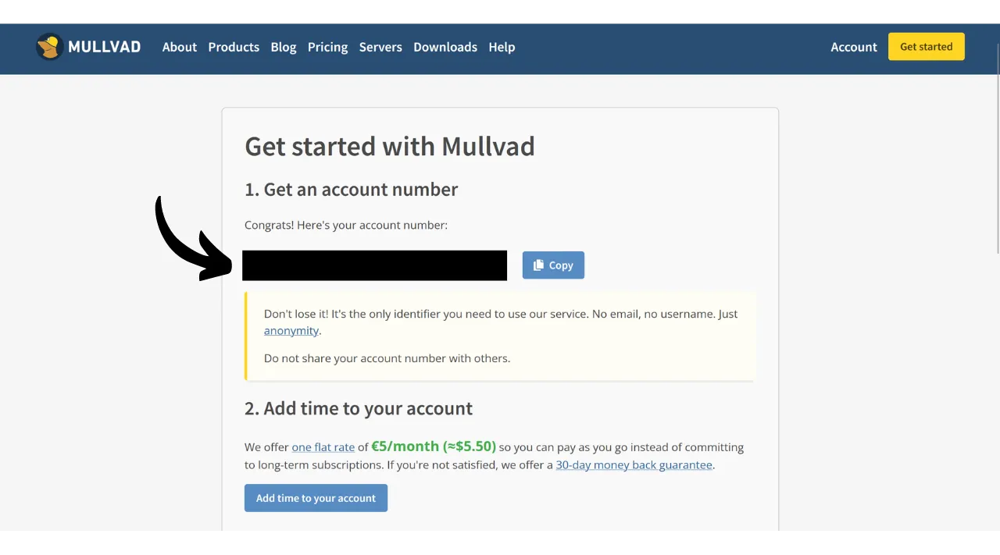
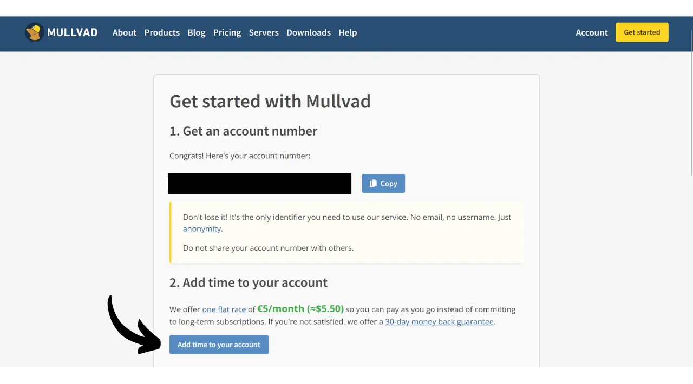

VPN ("*Virtual Private Network*" ehk virtuaalne privaatvõrk) on teenus, mis loob turvalise ja krüpteeritud ühenduse teie telefoni või arvuti ning VPN-i pakkuja hallatava kaugserveri vahel.

Tehniliselt, kui ühendute VPN-iga, suunatakse teie internetiliiklus läbi krüpteeritud tunneli VPN-serverisse. See protsess muudab kolmandate osapoolte, nagu internetiteenuse pakkujate (ISP-d) või pahatahtlike tegelaste, jaoks teie andmete pealtkuulamise või lugemise keeruliseks. VPN-server toimib seejärel vahendajana, mis ühendab teid teie soovitud teenusega teie nimel. See omistab teie ühendusele uue IP-aadressi, mis aitab varjata teie tegelikku IP-aadressi külastatavatelt saitidelt. Siiski, vastupidiselt mõnele veebireklaamile, ei võimalda VPN-i kasutamine sirvida internetis anonüümselt, kuna see nõuab usaldustaseme olemasolu VPN-i pakkuja suhtes, kes näeb kogu teie liiklust.

VPN-i kasutamise eelised on arvukad. Esiteks kaitseb see teie veebitegevuse privaatsust ISP-de või valitsuste eest, eeldusel, et VPN-i pakkuja ei jaga teie teavet. Teiseks turvab see teie andmeid, eriti kui olete ühendatud avalike Wi-Fi võrkudega, mis on haavatavad MITM ("**man-in-the-middle**" ehk mees-keskel) rünnakute suhtes. Kolmandaks võimaldab IP-aadressi varjamine VPN-il mööda minna geograafilistest piirangutest ja tsensuurist, et pääseda ligi sisule, mis muidu oleks teie piirkonnas kättesaamatu või blokeeritud.

Nagu näete, nihutab VPN liikluse jälgimise riski VPN-i pakkujale. Seetõttu on VPN-i pakkuja valimisel oluline kaaluda registreerimiseks nõutavaid isikuandmeid. Kui pakkuja küsib teavet, nagu teie telefoninumber, e-posti aadress, pangakaardi andmed või veel hullem, teie postiaadress, suureneb risk seostada teie identiteeti teie liiklusega. Kui pakkuja kompromiteeritakse või toimub õiguslik arest, oleks lihtne seostada teie liiklust teie isikuandmetega. Seetõttu soovitatakse valida pakkuja, kes ei nõua isikuandmeid ja aktsepteerib anonüümseid makseid, nagu bitcoinidega.

Selles õpetuses tutvustan lihtsat, tõhusat ja mõistliku hinnaga VPN-i lahendust, mis ei nõua selle kasutamiseks isikuandmeid.

## Mullvad VPN-i tutvustus
Mullvad VPN on Rootsi teenus, mis paistab silma oma pühendumusega kasutaja privaatsusele. Erinevalt peavoolu VPN-i pakkujatest ei nõua Mullvad registreerimisel isikuandmeid. Pole vaja esitada e-posti aadressi, telefoninumbrit ega nime; selle asemel määrab Mullvad teile anonüümse konto numbri, mida kasutatakse maksmiseks ja teenusele juurdepääsuks. Lisaks väidab Mullvad, et nad ei pea logisid tegevustest, mis nende serverite kaudu toimuvad.

Maksmiseks ei ole tingimata vaja esitada krediitkaardi andmeid, kuna Mullvad aktsepteerib bitcoinide makseid (ainult oma ametlikul saidil onchain meetodil, kuid on olemas mitteametlik meetod maksmiseks Lightningu kaudu). Nad aktsepteerivad ka sularahamakseid posti teel.

Mullvad VPN eristub ka oma läbipaistvuse ja turvalisuse poolest. Nende tarkvara on avatud lähtekoodiga ja nad läbivad regulaarselt sõltumatuid turvaauditeid, et hinnata oma rakendusi ja infrastruktuuri, mille tulemused on [avalikustatud nende veebisaidil](https://mullvad.net/fr/blog/tag/audits). Mullvadi taga olev ettevõte asub Rootsis, riigis, mis on tuntud oma range privaatsusseaduste poolest. Nad kasutavad ainult ise majutatud servereid, vähendades sellega riske, mis kaasnevad kolmandate osapoolte pilveteenuste kasutamisega, nagu hyperscalerid AWS, Google Cloud või Microsoft Azure.
Funktsioonide osas pakub Mullvad kõike, mida healt VPN-kliendilt oodata võib, sealhulgas kill switch'i, mis kaitseb teie liiklust, kui VPN katkeb, võimalust VPN teatud rakenduste jaoks välja lülitada ning võimalust suunata oma liiklus läbi mitme VPN-serveri.
Loomulikult tuleb sellise kvaliteediga teenus omal hinnal, kuid aus hind on sageli kvaliteedi ja aususe näitaja. See võib viidata sellele, et ettevõttel on ärimudel, mis ei nõua teie isikuandmete müümist kolmandatele osapooltele. Mullvad VPN pakub fikseeritud hinda 5 eurot kuus, mida saab kasutada kuni viiel erineval seadmel.

Erinevalt peavoolu VPN-teenuse pakkujatest on Mullvadil mudel, kus ostetakse juurdepääsuaega teenusele, mitte ei ole korduv, automaatne tellimus. Teete lihtsalt ühekordse makse bitcoiniides valitud kestuse eest. Näiteks, kui ostate ühe aasta juurdepääsu, saate teenust kasutada selle perioodi jooksul, pärast mida peate naasma Mullvadi veebisaidile, et uuendada oma juurdepääsuaega.
Võrreldes IVPN-iga, teise kvaliteetse VPN-teenuse pakkujaga, on Mullvad veidi soodsam. Näiteks isegi kui valite IVPN-iga kolmeaastase ostu, on kuukulu umbes 5,40 eurot. Siiski pakub IVPN mõningaid lisateenuseid ja omab ka odavamat plaani kui Mullvadi oma (Standard plaan), kuid see on piiratud ainult kahe seadmega ja ei hõlma "multi-hop" protokolli.
Viisin läbi ka mõned mitteametlikud kiirustestid, et võrrelda IVPN-i ja Mullvadi. Kuigi IVPN näitas veidi paremat jõudlust, olid kiirused Mullvadis siiski väga rahuldavad. Võrreldes peavoolu VPN-teenuse pakkujatega, osutusid IVPN ja Mullvad vähemalt sama tõhusaks, kui mitte mõnel juhul paremaks.

## Kuidas paigaldada Mullvad VPN arvutisse?

Külastage [ametlikku Mullvadi veebisaiti](https://mullvad.net/en/download/) ja klõpsake menüül "*Downloads*".

Windowsi või macOSi kasutajad saavad tarkvara otse saidilt alla laadida ja järgida paigaldusviisardi juhiseid paigalduse lõpuleviimiseks.

Linuxi kasutajad leiavad oma distributsioonile spetsiifilised juhised jaotisest ["*Linux*"](https://mullvad.net/en/download/vpn/linux).

Paigalduse lõpetamisel peate sisestama oma konto ID. Järgmistes selle juhendi jaotistes näeme, kuidas seda saada.

## Kuidas paigaldada Mullvad VPN nutitelefoni?

Laadige Mullvad VPN alla oma rakenduste poest, olgu see siis [AppStore](https://apps.apple.com/us/app/mullvad-vpn/id1488466513) iOSi kasutajatele, [Google Play Store](https://play.google.com/store/apps/details?id=net.mullvad.mullvadvpn) Androidile või [F-Droid](https://f-droid.org/packages/net.mullvad.mullvadvpn/). Kui kasutate Androidi, on teil võimalus laadida `.apk` fail otse [Mullvadi saidilt](https://mullvad.net/en/download/vpn/android).

Rakenduse esmakordsel kasutamisel logitakse teid välja. Teenuse aktiveerimiseks peate sisestama oma konto ID.
Nüüd liigume edasi Mullvadi aktiveerimisele teie seadmetes.

## Kuidas maksta ja aktiveerida Mullvad VPN?

Mine [ametlikule Mullvadi veebilehele](https://mullvad.net/) ja klõpsa nupul "*Alusta*".

Vajuta nupule "*Genereeri konto number*".
Seejärel loob Mullvad sinu konto. Sa ei pea esitama mingit isiklikku teavet. Ainult sinu konto number võimaldab sul sisse logida. See toimib omamoodi juurdepääsuvõtmena. Salvesta see turvalisse kohta, näiteks oma paroolihaldurisse. Võid teha ka paberkoopia.

Seejärel klõpsa nupul "*Lisa aega oma kontole*".

Seejärel jõuad oma konto sisselogimislehele. Sisesta oma konto number ja seejärel klõpsa nupul "*Logi sisse*".

Vali oma makseviis. Soovitan maksta bitcoinides, kuna saad 10% allahindlust, mis toob kuu maksumuse alla 4,50 eurole. Kui eelistad maksta Lightningu kaudu, pakun alternatiivset meetodit järgmises osas.

Klõpsa nupul "*Loo ühekordse makse aadress*".

Seejärel maksa oma Bitcoin rahakotist näidatud summa antud vastuvõtu aadressile.

Makse tuvastamiseks võib kuluda mõni minut, kui tehing on kinnitatud. Kui Mullvad tuvastab makse, ilmub lehe ülaossa sinu tellimuse kestus, mitte märge "*Aega pole jäänud*".

Seejärel saad sisestada oma konto numbri tarkvarasse, et aktiveerida VPN.

VPN-i aktiveerimiseks oma mobiilirakenduses on protsess täpselt sama. Peate lihtsalt sisestama oma konto numbri.

## Kuidas maksta Mullvad VPN eest Lightningu kaudu?

Nagu sa juba aru said, ei aktsepteeri Mullvad veel makseid Lightning Networki kaudu. Siiski, tänu soovitusele [Lounèsilt](https://x.com/louneskmt), avastasin mitteametliku teenuse, mis võimaldab sellest piirangust mööda minna. See teenus, mis on saadaval aadressil [vpn.sovereign.engineering](https://vpn.sovereign.engineering/), aktsepteerib sinu makseid Lightningu kaudu ja annab sulle vastutasuks kehtiva plaani Mullvadile.

Teil on sellel saidil 2 erinevat võimalust: võite usaldada saidi haldajat ja sisestada otse oma konto numbri, seejärel klõpsata nupul "*Logi sisse*", et teie Mullvad pakett automaatselt valideeritaks. Või võite klõpsata nupul "*Heck yeah!*", et osta Voucher Lightningus, mida saate seejärel kasutada ametlikul Mullvad saidil oma paketi saamiseks.  Mõlemal juhul palutakse teil seejärel valida oma paketi kestus. Võite valida 6 kuu ja 1 aasta vahel.  Seejärel klõpsake nupul "*Top-up with Lightning*".  Ostude lõpuleviimiseks makske arve oma Lightning rahakotiga.  Kui otsustasite osta Voucheri, valige Mullvad saidil makseviiside hulgas "*Voucher*". Seejärel sisestage vpn.sovereign.engineering saidilt saadud Voucheri number ettenähtud kasti.  ## Kuidas kasutada ja seadistada Mullvad VPN-i?
Nüüd, kui teil on aktiivne konto ja olete Mullvad tarkvaras või rakenduses sisestanud oma konto numbri, saate täielikult nautida oma VPN-i teenuseid.  VPN-ühenduse katkestamiseks klõpsake lihtsalt nupul "*Katkesta ühendus*".  Väike punane nool nupu "*Katkesta ühendus*" kõrval võimaldab teil servereid vahetada ilma praegust asukohta muutmata.  Kui soovite oma VPN-serveri linna vahetada, klõpsake nupul "*Vaheta asukohta*", et valida uus asukoht.  Ekraani ülaosas näete oma seadme hüüdnime ning paketi järelejäänud kestust.  Väikese mehe ikoonil klõpsates pääsete juurde oma konto detailsele teabele.  Seadetele juurdepääsemiseks klõpsake hammasratta ikoonil.  Menüüs "*Kasutajaliidese seaded*" saate kohandada oma tarkvara seadeid, sealhulgas liidese keelt ja selle käitumist teie süsteemis.  Menüüs "*VPN seaded*" leiate oma VPN-iga seotud valikud. Soovitan lubada valikud "*Käivita rakendus käivitamisel*" ja "*Ühenda automaatselt*", et teie VPN-ühendus käivituks automaatselt, kui teie masin käivitub.
 Alammenüüs "*DNS sisu blokeerijad*" on teil võimalus filtreerida ja blokeerida DNS päringuid pahatahtlikele, reklaamidele või soovimatutele veebisaitidele.

Lõpuks võimaldab menüü "*Jagatud tunnelimine*" valida konkreetseid rakendusi teie masinas, mille internetiliiklust ei suunata läbi VPN-i.

Ülevaate saamiseks oma Mullvad kontost ja erinevate ühendatud seadmete haldamiseks võite klõpsata veebisaidil menüül "*Seadmed*".
Ja ongi kõik, nüüd olete valmis täielikult nautima Mullvad VPN-i. Kui olete huvitatud teise VPN-i pakkujaga tutvumisest, mis on sarnane Mullvadiga nii omaduste kui ka hinnastamise poolest, soovitan teil vaadata ka meie õpetust IVPN kohta:

https://planb.network/tutorials/others/ivpn