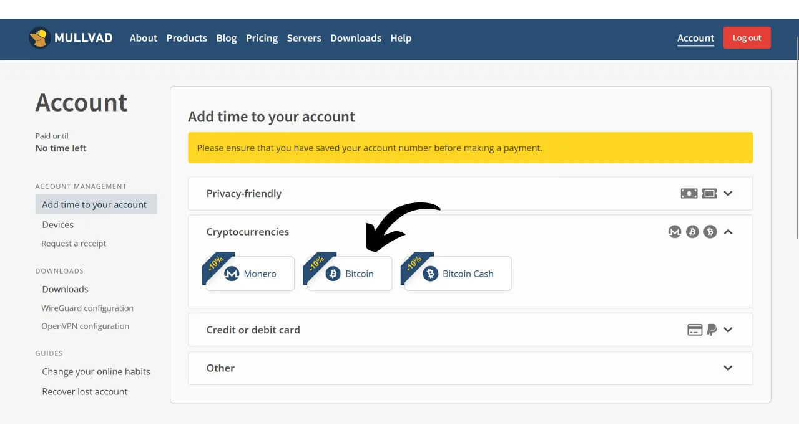
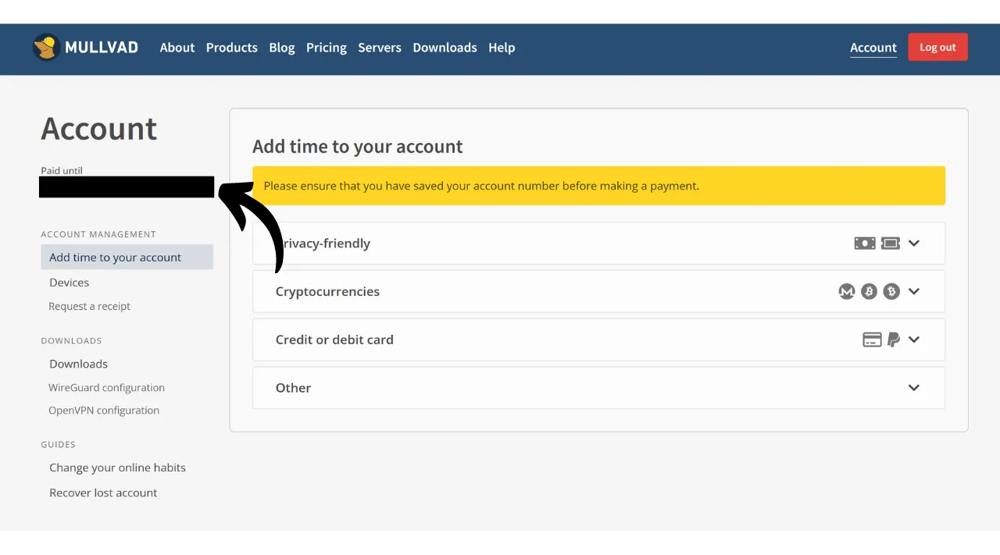

VPN ("*Virtual Private Network*" eli virtuaalinen erillisverkko) on palvelu, joka luo turvallisen ja salatun yhteyden puhelimesi tai tietokoneesi ja VPN-tarjoajan hallinnoiman etäpalvelimen välille.

Teknisesti ottaen VPN-yhteyden muodostamisen yhteydessä internet-liikenteesi ohjataan salatun tunnelin kautta VPN-palvelimelle. Tämä prosessi vaikeuttaa kolmansien osapuolien, kuten internet-palveluntarjoajien (ISP) tai haitallisten toimijoiden, mahdollisuutta kaapata tai lukea tietojasi. VPN-palvelin toimii välittäjänä, joka yhdistää sinut haluamaasi palveluun puolestasi. Se antaa yhteydellesi uuden IP-osoitteen, mikä auttaa piilottamaan todellisen IP-osoitteesi vierailemiltasi sivustoilta. Kuitenkin, toisin kuin jotkut verkossa olevat mainokset saattavat ehdottaa, VPN:n käyttö ei mahdollista nimetöntä internetin selaamista, sillä se vaatii luottamustason VPN-tarjoajaan, joka näkee kaiken liikenteesi.

VPN:n käytön hyödyt ovat lukuisat. Ensinnäkin, se säilyttää online-toimintasi yksityisyyden internet-palveluntarjoajilta tai hallituksilta, edellyttäen, että VPN-tarjoaja ei jaa tietojasi. Toiseksi, se turvaa tietosi, erityisesti kun olet yhteydessä julkisiin Wi-Fi-verkkoihin, jotka ovat alttiita MITM ("**man-in-the-middle**") -hyökkäyksille. Kolmanneksi, IP-osoitteesi piilottamisen avulla VPN mahdollistaa maantieteellisten rajoitusten ja sensuurin kiertämisen, pääsyn sisältöön, joka muuten olisi saatavilla tai estetty alueellasi.

Kuten näet, VPN siirtää liikenteen tarkkailuriskin VPN-tarjoajalle. Siksi VPN-tarjoajaa valittaessa on tärkeää harkita rekisteröitymiseen vaadittavia henkilötietoja. Jos tarjoaja pyytää tietoja, kuten puhelinnumerosi, sähköpostiosoitteesi, pankkikorttitietosi tai pahempaa, postiosoitteesi, riski yhdistää henkilöllisyytesi liikenteeseesi kasvaa. Tarjoajan kompromissin tai laillisen takavarikon tapauksessa olisi helppo yhdistää liikenteesi henkilötietoihisi. Siksi on suositeltavaa valita tarjoaja, joka ei vaadi henkilötietoja ja hyväksyy anonyymit maksut, kuten bitcoinit.

Tässä oppaassa esittelen yksinkertaisen, tehokkaan ja kohtuuhintaisen VPN-ratkaisun, joka ei vaadi henkilötietoja käyttöönsä.

## Johdanto Mullvad VPN:ään
Mullvad VPN on ruotsalainen palvelu, joka erottuu sitoutumisellaan käyttäjien yksityisyyteen. Toisin kuin valtavirran VPN-tarjoajat, Mullvad ei vaadi henkilötietoja rekisteröityessä. Sähköpostiosoitetta, puhelinnumeroa tai nimeä ei tarvitse antaa; sen sijaan Mullvad antaa sinulle anonyymin tilinumeron, jota käytetään maksamiseen ja palvelun käyttöön. Lisäksi Mullvad väittää, ettei se säilytä mitään lokitietoja palvelimiensa kautta kulkevasta liikenteestä.

Maksamiseen ei välttämättä tarvitse antaa luottokorttitietoja, sillä Mullvad hyväksyy bitcoin-maksut (vain ketjussa heidän virallisella sivustollaan, mutta on olemassa epävirallinen menetelmä maksaa Lightningin kautta). He hyväksyvät myös käteismaksut postitse.

Mullvad VPN erottuu myös läpinäkyvyydellään ja turvallisuudellaan. Heidän ohjelmistonsa on avoimen lähdekoodin, ja he suorittavat säännöllisesti riippumattomia turvallisuusauditointeja sovelluksilleen ja infrastruktuurilleen, joiden tulokset julkaistaan [heidän verkkosivustollaan](https://mullvad.net/fr/blog/tag/audits). Mullvadin taustalla oleva yritys sijaitsee Ruotsissa, maassa, joka on tunnettu tiukoista yksityisyydensuojalaeistaan. He käyttävät yksinomaan itse isännöityjä palvelimia, mikä eliminoi kolmannen osapuolen pilvipalveluiden, kuten hyperskaalaajien AWS, Google Cloud tai Microsoft Azure, käyttöön liittyvät riskit.
Ominaisuuksien osalta Mullvad tarjoaa kaiken, mitä hyvältä VPN-asiakasohjelmalta odottaa, mukaan lukien kill switch -toiminnon, joka suojaa liikennettäsi, jos VPN-yhteys katkeaa, vaihtoehdon poistaa VPN käytöstä tietyissä sovelluksissa, sekä mahdollisuuden reitittää liikenteesi useiden VPN-palvelimien kautta.
Luonnollisesti tämän tason palvelu maksaa, mutta reilu hinta on usein laadun ja rehellisyyden merkki. Se voi viestiä, että yrityksellä on liiketoimintamalli, joka ei vaadi henkilökohtaisten tietojesi myymistä kolmansille osapuolille. Mullvad VPN tarjoaa kiinteän hinnan 5 euroa kuukaudessa, ja sitä voi käyttää jopa viidellä eri laitteella.

Toisin kuin valtavirran VPN-tarjoajat, Mullvadilla on malli, jossa ostetaan pääsyaikaa palveluun sen sijaan, että olisi toistuva, automaattinen tilaus. Maksat vain kerran bitcoineilla valitsemastasi ajasta. Esimerkiksi, jos ostat yhden vuoden pääsyn, voit käyttää palvelua kyseisen ajan, jonka jälkeen sinun täytyy palata Mullvadin verkkosivustolle uusimaan pääsyaikasi.
Verrattuna IVPN:iin, toiseen laadukkaaseen VPN-tarjoajaan, Mullvad on hieman edullisempi. Esimerkiksi, vaikka valitsisit kolmen vuoden oston IVPN:ltä, kuukausikustannus on noin 5,40 euroa. IVPN kuitenkin tarjoaa joitakin lisäpalveluita ja sillä on myös halvempi suunnitelma kuin Mullvadin (Standard-suunnitelma), mutta tämä on rajoitettu vain kahteen laitteeseen ja siitä puuttuu "multi-hop" -protokolla.
Tein myös joitakin epävirallisia nopeustestejä vertaillakseni IVPN:ää ja Mullvadia. Vaikka IVPN osoitti hieman parempaa suorituskykyä, Mullvadin nopeudet olivat silti erittäin tyydyttäviä. Verrattuna valtavirran VPN-tarjoajiin, IVPN ja Mullvad osoittautuivat vähintään yhtä tehokkaiksi, jos eivät joissakin tapauksissa paremmiksi.

## Kuinka asentaa Mullvad VPN tietokoneelle?

Vieraile [virallisilla Mullvad-verkkosivuilla](https://mullvad.net/en/download/) ja klikkaa "*Lataukset*" -valikkoa.

Windows- tai macOS-käyttäjille, lataa ohjelmisto suoraan sivustolta ja noudata asennusvelhon ohjeita asennuksen loppuun saattamiseksi.

Linux-käyttäjille, löydät jakelukohtaiset ohjeet ["*Linux*"](https://mullvad.net/en/download/vpn/linux) -osiosta.

Kun asennus on valmis, sinun täytyy syöttää tilisi ID. Näemme, kuinka tämä hankitaan seuraavissa tämän oppaan osioissa.

## Kuinka asentaa Mullvad VPN älypuhelimeen?

Lataa Mullvad VPN sovelluskaupastasi, olipa se sitten [AppStore](https://apps.apple.com/us/app/mullvad-vpn/id1488466513) iOS-käyttäjille, [Google Play Store](https://play.google.com/store/apps/details?id=net.mullvad.mullvadvpn) Androidille, tai [F-Droid](https://f-droid.org/packages/net.mullvad.mullvadvpn/). Jos käytät Androidia, sinulla on myös vaihtoehto ladata `.apk` tiedosto suoraan [Mullvadin sivustolta](https://mullvad.net/en/download/vpn/android).

Sovelluksen ensimmäisellä käyttökerralla sinut kirjataan ulos. Sinun täytyy syöttää tilisi ID aktivoidaksesi palvelun.
Siirrytään nyt aktivoimaan Mullvad laitteillasi.

## Miten maksaa ja aktivoida Mullvad VPN?

Siirry [viralliselle Mullvad-sivustolle](https://mullvad.net/) ja klikkaa "*Aloita*" -painiketta.

Klikkaa "*Luo tilinumero*" -painiketta.
Mullvad luo sen jälkeen tilisi. Sinun ei tarvitse antaa mitään henkilökohtaisia tietoja. Ainoastaan tilinumerosi mahdollistaa kirjautumisen. Se toimii ikään kuin pääsyavaimena. Tallenna se turvalliseen paikkaan, kuten salasananhallintaohjelmaasi. Voit myös tehdä paperikopion.

Klikkaa sen jälkeen "*Lisää aikaa tilillesi*" -painiketta.

Tämän jälkeen saavut tilisi kirjautumissivulle. Syötä tilinumerosi ja klikkaa "*Kirjaudu sisään*" -painiketta.

Valitse maksutapasi. Suosittelen maksamista bitcoineilla, sillä saat 10% alennuksen, mikä laskee kuukausikustannuksen 4,50 euroon. Jos haluat maksaa Lightningin kautta, tarjoan vaihtoehtoisen menetelmän seuraavassa osassa.

Klikkaa "*Luo kertamaksuosoite*" -painiketta.

Maksa sitten Bitcoin-lompakollasi ilmoitettu summa sinulle annettuun vastaanotto-osoitteeseen.

Maksun havaitseminen sivustolla voi kestää muutaman minuutin, kunnes transaktio on vahvistettu. Kun Mullvad havaitsee maksun, tilauksesi kesto näkyy sivun vasemmassa yläkulmassa, "*Ei aikaa jäljellä*" -maininnan sijaan.

Voit sen jälkeen syöttää tilinumerosi ohjelmistoon VPN:n aktivoimiseksi.

VPN:n aktivoiminen mobiilisovelluksessa tapahtuu täsmälleen samalla tavalla. Sinun tarvitsee vain syöttää tilinumerosi.

## Miten maksaa Mullvad VPN Lightningin kautta?

Kuten olet ymmärtänyt, Mullvad ei vielä hyväksy maksuja Lightning-verkon kautta. Kuitenkin, [Lounèsin](https://x.com/louneskmt) suosituksesta löysin epävirallisen palvelun, joka mahdollistaa tämän rajoituksen kiertämisen. Tämä palvelu, saatavilla osoitteessa [vpn.sovereign.engineering](https://vpn.sovereign.engineering/), hyväksyy maksusi Lightningin kautta ja tarjoaa sinulle vastineeksi voimassa olevan suunnitelman Mullvadille.

Tällä sivustolla sinulla on kaksi eri vaihtoehtoa: voit luottaa sivuston ylläpitäjään ja syöttää tilinumerosi suoraan, jonka jälkeen klikkaat "*Kirjaudu sisään*" -painiketta, jolloin Mullvad-pakettisi vahvistetaan automaattisesti. Tai voit klikata "*Heck yeah!*" -painiketta ostaa Voucherin Lightningin kautta, jonka voit sitten käyttää virallisella Mullvad-sivustolla pakettisi saamiseksi.  Molemmissa tapauksissa sinua pyydetään sen jälkeen valitsemaan pakettisi kesto. Voit valita 6 kuukauden ja 1 vuoden väliltä.  Klikkaa sitten "*Lataa saldoa Lightningin kautta*" -painiketta.  Oston lopullistamiseksi, maksa lasku Lightning-lompakollasi.  Jos päätit ostaa Voucherin, Mullvad-sivustolla, valitse maksutavoista "*Voucher*" tililläsi. Syötä sitten vpn.sovereign.engineering -sivustolta saamasi Voucher-numero määrättyyn kenttään.  ## Kuinka käyttää ja määrittää Mullvad VPN?
Nyt kun sinulla on aktiivinen tili ja olet syöttänyt tilinumerosi Mullvad-ohjelmistoon tai sovellukseen, voit nauttia VPN-palveluistasi täysin rinnoin.  VPN-yhteyden katkaisemiseksi klikkaa yksinkertaisesti "*Katkaise yhteys*" -painiketta.  Pieni punainen nuoli "*Katkaise yhteys*" -painikkeen vieressä mahdollistaa palvelimien vaihdon muuttamatta nykyistä sijaintia.  Jos haluat vaihtaa kaupunkia VPN-palvelimellesi, klikkaa "*Vaihda sijaintia*" valitaksesi uuden sijainnin.  Näytön yläosassa näet laitteesi lempinimen sekä jäljellä olevan pakettisi keston.  Klikkaamalla pienen miehen kuvaketta pääset katsomaan tiliisi liittyviä yksityiskohtaisia tietoja.  Asetuksiin päästäksesi, klikkaa hammasrattaan kuvaketta.  "*Käyttöliittymän asetukset*" -valikossa voit mukauttaa ohjelmistosi asetuksia, mukaan lukien käyttöliittymän kielen ja sen käyttäytymisen järjestelmässäsi.  "*VPN-asetukset*" -valikosta löydät vaihtoehtoja VPN-yhteyteesi liittyen. Suosittelen "*Käynnistä sovellus käynnistyksen yhteydessä*" ja "*Yhdistä automaattisesti*" -vaihtoehtojen käyttöönottoa, jotta VPN-yhteytesi käynnistyy automaattisesti koneesi käynnistyessä.
 "*DNS-sisällön estäjät*" -alivalikossa sinulla on mahdollisuus suodattaa ja estää DNS-pyyntöjä haitallisille, mainostaville tai ei-toivotuille verkkosivustoille.

Lopuksi, "*Jaettu tunnelointi*" -valikko mahdollistaa tiettyjen sovellusten valitsemisen koneellasi, joiden internet-liikennettä ei reititetä VPN:n kautta.

Saadaksesi yleiskatsauksen Mullvad-tilistäsi ja hallitaksesi eri yhdistettyjä laitteita, voit klikata "*Laitteet*" -valikkoa verkkosivustolla.
Ja siinä se on, nyt olet valmis nauttimaan täysin Mullvad VPN:stä. Jos olet kiinnostunut tutustumaan toiseen VPN-palveluntarjoajaan, joka on samankaltainen kuin Mullvad sekä ominaisuuksiltaan että hinnoittelultaan, suosittelen myös tutustumaan oppaaseemme IVPN:stä:

https://planb.network/tutorials/others/ivpn