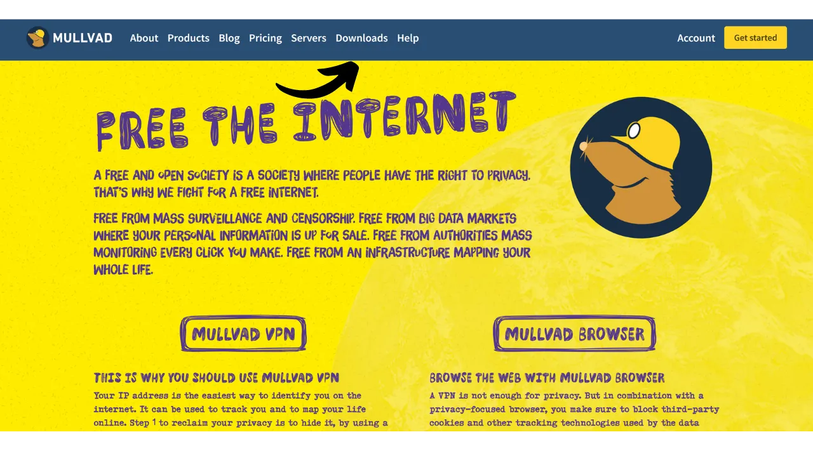

VPN ("*Virtual Private Network*") adalah layanan yang membangun koneksi yang aman dan terenkripsi antara ponsel atau komputer Anda dengan server jarak jauh yang dikelola oleh penyedia VPN.

Secara teknis, ketika terhubung ke VPN, lalu lintas internet Anda dialihkan melalui terowongan terenkripsi ke server VPN. Proses ini membuatnya sulit bagi pihak ketiga, seperti Penyedia Layanan Internet (ISP) atau aktor jahat, untuk mengintersepsi atau membaca data Anda. Server VPN kemudian bertindak sebagai perantara yang terhubung ke layanan yang ingin Anda gunakan atas nama Anda. Ini menetapkan alamat IP baru ke koneksi Anda, yang membantu menyembunyikan alamat IP asli Anda dari situs yang Anda kunjungi. Namun, berbeda dengan apa yang mungkin disarankan oleh beberapa iklan online, menggunakan VPN tidak memungkinkan Anda untuk menjelajah internet secara anonim, karena memerlukan tingkat kepercayaan pada penyedia VPN yang dapat melihat seluruh lalu lintas Anda.

Manfaat menggunakan VPN sangat banyak. Pertama, itu menjaga privasi aktivitas online Anda dari ISP atau pemerintah, asalkan penyedia VPN tidak membagikan informasi Anda. Kedua, itu mengamankan data Anda, terutama ketika Anda terhubung ke jaringan Wi-Fi publik, yang rentan terhadap serangan MITM ("**man-in-the-middle**"). Ketiga, dengan menyembunyikan alamat IP Anda, VPN memungkinkan Anda untuk melewati pembatasan geografis dan sensor, untuk mengakses konten yang sebaliknya tidak tersedia atau diblokir di wilayah Anda.

Seperti yang Anda lihat, VPN mengalihkan risiko pengamatan lalu lintas ke penyedia VPN. Oleh karena itu, saat memilih penyedia VPN Anda, penting untuk mempertimbangkan data pribadi yang diperlukan untuk pendaftaran. Jika penyedia meminta informasi seperti nomor telepon, alamat email, detail kartu bank, atau lebih buruk lagi, alamat pos Anda, risiko mengaitkan identitas Anda dengan lalu lintas Anda meningkat. Dalam hal kompromi penyedia atau penyitaan hukum, akan mudah untuk mengaitkan lalu lintas Anda dengan data pribadi Anda. Oleh karena itu, disarankan untuk memilih penyedia yang tidak memerlukan informasi pribadi apa pun dan menerima pembayaran anonim, seperti dengan bitcoin.

Dalam tutorial ini, saya akan memperkenalkan solusi VPN yang sederhana, efisien, dengan harga yang wajar yang tidak memerlukan informasi pribadi untuk penggunaannya.

## Pengenalan Mullvad VPN
Mullvad VPN adalah layanan dari Swedia yang menonjol karena komitmennya pada privasi pengguna. Tidak seperti penyedia VPN arus utama, Mullvad tidak memerlukan data pribadi saat pendaftaran. Tidak perlu menyediakan alamat email, nomor telepon, atau nama; sebaliknya, Mullvad memberi Anda nomor akun anonim yang digunakan untuk pembayaran dan mengakses layanan. Selain itu, Mullvad mengklaim tidak menyimpan log aktivitas yang melewati server mereka.

Untuk pembayaran, tidak perlu menyediakan informasi kartu kredit, karena Mullvad menerima pembayaran bitcoin (hanya onchain di situs resmi mereka, tetapi ada metode tidak resmi untuk membayar melalui Lightning). Mereka juga menerima pembayaran tunai melalui pos.

Mullvad VPN juga membedakan dirinya melalui transparansi dan keamanannya. Perangkat lunak mereka bersifat open-source, dan mereka secara rutin menjalani audit keamanan independen untuk menilai aplikasi dan infrastruktur mereka, hasilnya [dipublikasikan di situs web mereka](https://mullvad.net/fr/blog/tag/audits). Perusahaan di balik Mullvad berbasis di Swedia, negara yang dikenal dengan undang-undang privasinya yang ketat. Mereka secara eksklusif menggunakan server yang dihosting sendiri, dengan demikian mengeliminasi risiko yang terkait dengan menggunakan layanan cloud pihak ketiga, seperti hyperscalers AWS, Google Cloud, atau Microsoft Azure.
Dari segi fitur, Mullvad menawarkan segala yang diharapkan dari klien VPN yang baik, termasuk kill switch yang melindungi lalu lintas Anda jika VPN terputus, opsi untuk menonaktifkan VPN untuk aplikasi tertentu, dan kemampuan untuk merutekan lalu lintas Anda melalui beberapa server VPN.
Tentu saja, kualitas layanan ini datang dengan harga, tetapi harga yang wajar sering kali merupakan indikator kualitas dan kejujuran. Ini bisa menandakan bahwa perusahaan memiliki model bisnis tanpa perlu menjual data pribadi Anda ke pihak ketiga. Mullvad VPN menawarkan tarif tetap sebesar 5 euro per bulan, dapat digunakan pada hingga 5 perangkat berbeda.

Berbeda dengan penyedia VPN mainstream, Mullvad memiliki model pembelian waktu akses ke layanan daripada langganan otomatis yang berulang. Anda cukup melakukan pembayaran satu kali dalam bitcoin untuk durasi yang dipilih. Misalnya, jika Anda membeli satu tahun akses, Anda dapat menggunakan layanan tersebut untuk periode tersebut, setelah itu Anda harus kembali ke situs web Mullvad untuk memperbarui waktu akses Anda.
Dibandingkan dengan IVPN, penyedia VPN berkualitas tinggi lainnya, Mullvad sedikit lebih ekonomis. Misalnya, bahkan ketika memilih pembelian tiga tahun dengan IVPN, biaya bulanan mencapai sekitar €5,40. Namun, IVPN menawarkan beberapa layanan tambahan dan juga memiliki rencana yang lebih murah daripada Mullvad (rencana Standar), tetapi ini terbatas hanya untuk 2 perangkat dan tidak termasuk protokol "multi-hop".
Saya juga melakukan beberapa tes kecepatan informal untuk membandingkan IVPN dan Mullvad. Meskipun IVPN menunjukkan sedikit keunggulan dalam hal kinerja, kecepatan di Mullvad masih sangat memuaskan. Dibandingkan dengan penyedia VPN mainstream, IVPN dan Mullvad terbukti setidaknya sama efisiennya, jika tidak lebih unggul dalam beberapa kasus.

## Bagaimana cara menginstal Mullvad VPN di komputer?

Kunjungi [situs resmi Mullvad](https://mullvad.net/en/download/) dan klik pada menu "*Downloads*".

Untuk pengguna Windows atau macOS, unduh perangkat lunak langsung dari situs tersebut dan ikuti instruksi yang diberikan oleh wizard pengaturan untuk menyelesaikan instalasi.

Untuk pengguna Linux, Anda dapat menemukan instruksi khusus untuk distribusi Anda di bagian ["*Linux*"](https://mullvad.net/en/download/vpn/linux).

Setelah instalasi selesai, Anda akan perlu memasukkan ID akun Anda. Kita akan melihat bagaimana mendapatkan ini di bagian selanjutnya dari tutorial ini.

## Bagaimana cara menginstal Mullvad VPN di smartphone?

Unduh Mullvad VPN dari toko aplikasi Anda, baik itu [AppStore](https://apps.apple.com/us/app/mullvad-vpn/id1488466513) untuk pengguna iOS, [Google Play Store](https://play.google.com/store/apps/details?id=net.mullvad.mullvadvpn) untuk Android, atau [F-Droid](https://f-droid.org/packages/net.mullvad.mullvadvpn/). Jika Anda menggunakan Android, Anda juga memiliki opsi untuk mengunduh file `.apk` langsung dari [situs Mullvad](https://mullvad.net/en/download/vpn/android).

Pada penggunaan pertama aplikasi, Anda akan keluar. Anda perlu memasukkan ID akun Anda untuk mengaktifkan layanan.
Sekarang, mari kita lanjutkan ke aktivasi Mullvad di perangkat Anda.

## Bagaimana cara membayar dan mengaktifkan Mullvad VPN?

Kunjungi [situs resmi Mullvad](https://mullvad.net/) dan klik tombol "*Get Started*".

Klik pada tombol "*Generate account number*".
Mullvad kemudian akan membuat akun Anda. Anda tidak perlu memberikan informasi pribadi apa pun. Hanya nomor akun Anda yang akan memungkinkan Anda untuk masuk. Ini bertindak agak seperti kunci akses. Simpan di tempat yang aman seperti manajer kata sandi Anda, misalnya. Anda juga dapat membuat salinan kertas.

Kemudian klik pada tombol "*Add time to your account*".

Anda kemudian akan tiba di halaman login untuk akun Anda. Masukkan nomor akun Anda kemudian klik pada tombol "*Log in*".

Pilih metode pembayaran Anda. Saya merekomendasikan membayar dengan bitcoin, karena Anda akan mendapatkan diskon 10%, yang menurunkan biaya menjadi €4,50 per bulan. Jika Anda lebih suka membayar melalui Lightning, saya akan menyediakan metode alternatif di bagian berikut.

Klik pada tombol "*Create a one-time payment address*".

Kemudian bayar dengan dompet Bitcoin Anda jumlah yang ditunjukkan ke alamat penerima yang diberikan kepada Anda.

Mungkin memerlukan beberapa menit sebelum situs mendeteksi pembayaran Anda, setelah transaksi dikonfirmasi. Setelah pembayaran terdeteksi oleh Mullvad, durasi langganan Anda akan muncul di kiri atas halaman, bukan tulisan "*No time left*".

Anda kemudian dapat memasukkan nomor akun Anda pada perangkat lunak untuk mengaktifkan VPN.

Untuk mengaktifkan VPN di aplikasi seluler Anda, prosesnya persis sama. Anda hanya perlu memasukkan nomor akun Anda.

## Bagaimana cara membayar Mullvad VPN dengan Lightning?

Seperti yang Anda pahami, Mullvad belum menerima pembayaran melalui Jaringan Lightning. Namun, berkat rekomendasi dari [Lounès](https://x.com/louneskmt), saya menemukan layanan informal yang memungkinkan Anda untuk mengatasi keterbatasan ini. Layanan ini, tersedia di [vpn.sovereign.engineering](https://vpn.sovereign.engineering/), menerima pembayaran Anda di Lightning dan memberikan Anda rencana yang valid untuk Mullvad sebagai gantinya.

Anda memiliki 2 opsi berbeda di situs ini: Anda dapat mempercayai pengelola situs dan memasukkan nomor akun Anda langsung, kemudian klik pada tombol "*Log in*" agar paket Mullvad Anda secara otomatis divalidasi. Atau, Anda dapat mengklik tombol "*Heck yeah!*" untuk membeli Voucher di Lightning, yang kemudian dapat Anda gunakan di situs resmi Mullvad untuk mendapatkan paket Anda.  Dalam kedua kasus, Anda kemudian akan diminta untuk memilih durasi paket Anda. Anda dapat memilih antara 6 bulan dan 1 tahun.  Kemudian klik pada tombol "*Top-up with Lightning*".  Untuk menyelesaikan pembelian, bayar faktur dengan dompet Lightning Anda.  Jika Anda memilih untuk membeli Voucher, di situs Mullvad, pilih "*Voucher*" di antara metode pembayaran yang tersedia di akun Anda. Kemudian, masukkan nomor Voucher yang Anda terima dari situs vpn.sovereign.engineering di kotak yang ditentukan.  ## Bagaimana cara menggunakan dan mengkonfigurasi Mullvad VPN?
Sekarang Anda memiliki akun aktif dan telah memasukkan nomor akun Anda di perangkat lunak atau aplikasi Mullvad, Anda dapat sepenuhnya menikmati layanan VPN Anda.  Untuk memutuskan koneksi dari VPN, cukup klik pada tombol "*Disconnect*".  Panah merah kecil di sebelah tombol "*Disconnect*" memungkinkan Anda untuk mengganti server tanpa mengubah lokasi saat ini.  Jika Anda ingin mengganti kota untuk server VPN Anda, klik pada "*Switch location*" untuk memilih lokasi baru.  Di bagian atas layar, Anda akan melihat nama panggilan perangkat Anda serta durasi sisa paket Anda.  Dengan mengklik pada ikon orang kecil, Anda akan mengakses informasi detail tentang akun Anda.  Untuk mengakses pengaturan, klik pada roda gigi.  Di menu "*User interface settings*", Anda dapat menyesuaikan pengaturan perangkat lunak Anda, termasuk bahasa antarmuka dan perilakunya di sistem Anda.  Di menu "*VPN settings*", Anda akan menemukan opsi yang terkait dengan VPN Anda. Saya merekomendasikan untuk mengaktifkan opsi "*Launch app on start-up*" dan "*Auto-connect*" agar koneksi VPN Anda secara otomatis diluncurkan ketika mesin Anda mulai.
 Di submenu "*DNS content blockers*", Anda memiliki opsi untuk menyaring dan memblokir permintaan DNS ke situs web berbahaya, iklan, atau yang tidak diinginkan.

Akhirnya, menu "*Split tunneling*" memungkinkan Anda untuk memilih aplikasi spesifik di mesin Anda yang lalu lintas internetnya tidak akan dialihkan melalui VPN.

Untuk mendapatkan gambaran umum tentang akun Mullvad Anda dan mengelola berbagai perangkat yang terhubung, Anda dapat mengklik pada menu "*Devices*" di situs web.
Dan dengan itu, Anda sekarang telah siap untuk sepenuhnya menikmati Mullvad VPN. Jika Anda tertarik untuk menemukan penyedia VPN lain yang serupa dengan Mullvad, baik dalam hal fitur maupun harga, saya juga merekomendasikan untuk melihat tutorial kami tentang IVPN:

https://planb.network/tutorials/others/ivpn