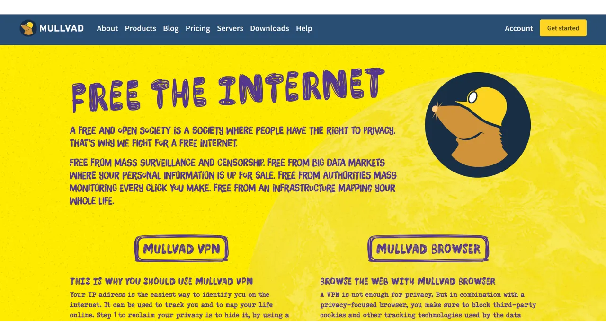

Una VPN ("*Virtual Private Network*") è un servizio che stabilisce una connessione sicura e criptata tra il tuo telefono o computer e un server remoto gestito da un fornitore di VPN.

Tecnicamente, quando ti connetti a una VPN, il tuo traffico internet viene reindirizzato attraverso un tunnel criptato verso il server VPN. Questo processo rende difficile per terze parti, come i fornitori di servizi internet (ISP) o attori malevoli, intercettare o leggere i tuoi dati. Il server VPN agisce quindi come un intermediario che si connette al servizio che desideri utilizzare per tuo conto. Assegna un nuovo indirizzo IP alla tua connessione, il che aiuta a nascondere il tuo vero indirizzo IP dai siti che visiti. Tuttavia, contrariamente a quanto suggeriscono alcuni annunci online, l'uso di una VPN non ti permette di navigare in internet in modo anonimo, poiché richiede un livello di fiducia nel fornitore di VPN che può vedere tutto il tuo traffico.

I benefici dell'uso di una VPN sono numerosi. In primo luogo, preserva la privacy della tua attività online da ISP o governi, a condizione che il fornitore di VPN non condivida le tue informazioni. In secondo luogo, protegge i tuoi dati, specialmente quando sei connesso a reti Wi-Fi pubbliche, che sono vulnerabili ad attacchi di tipo "**man-in-the-middle**". In terzo luogo, nascondendo il tuo indirizzo IP, una VPN ti permette di aggirare restrizioni geografiche e censura, per accedere a contenuti che altrimenti non sarebbero disponibili o bloccati nella tua regione.

Come puoi vedere, la VPN sposta il rischio di osservazione del traffico al fornitore di VPN. Pertanto, quando scegli il tuo fornitore di VPN, è importante considerare i dati personali richiesti per la registrazione. Se il fornitore chiede informazioni come il tuo numero di telefono, indirizzo email, dettagli della carta di credito, o peggio, il tuo indirizzo postale, il rischio di associare la tua identità al tuo traffico aumenta. In caso di compromissione del fornitore o di sequestro legale, sarebbe facile associare il tuo traffico ai tuoi dati personali. Pertanto, si raccomanda di scegliere un fornitore che non richieda alcuna informazione personale e accetti pagamenti anonimi, come con i bitcoin.

In questo tutorial, presenterò una soluzione VPN semplice, efficiente e a prezzo ragionevole che non richiede alcuna informazione personale per il suo utilizzo.

## Introduzione a Mullvad VPN
Mullvad VPN è un servizio svedese che si distingue per il suo impegno nella privacy degli utenti. A differenza dei fornitori di VPN mainstream, Mullvad non richiede dati personali al momento della registrazione. Non è necessario fornire un indirizzo email, numero di telefono o nome; invece, Mullvad ti assegna un numero di conto anonimo utilizzato per il pagamento e l'accesso al servizio. Inoltre, Mullvad afferma di non conservare alcun log delle attività che passano attraverso i loro server.

Per il pagamento, non è necessariamente richiesto di fornire informazioni sulla carta di credito, poiché Mullvad accetta pagamenti in bitcoin (solo onchain sul loro sito ufficiale, ma esiste un metodo non ufficiale per pagare tramite Lightning). Accettano anche pagamenti in contanti tramite posta.

Mullvad VPN si distingue anche per la sua trasparenza e sicurezza. Il loro software è open-source, e si sottopongono regolarmente a audit di sicurezza indipendenti per valutare le loro applicazioni e infrastrutture, i cui risultati sono [pubblicati sul loro sito web](https://mullvad.net/fr/blog/tag/audits). L'azienda dietro Mullvad ha sede in Svezia, un paese noto per le sue rigide leggi sulla privacy. Utilizzano esclusivamente server auto-ospitati, eliminando così i rischi associati all'uso di servizi cloud di terze parti, come gli iperscalatori AWS, Google Cloud o Microsoft Azure.
Per quanto riguarda le funzionalità, Mullvad offre tutto ciò che ci si aspetta da un buon client VPN, inclusa una funzione di kill switch che protegge il tuo traffico in caso di disconnessione della VPN, un'opzione per disabilitare la VPN per applicazioni specifiche e la capacità di instradare il tuo traffico attraverso più server VPN.
Naturalmente, questa qualità di servizio ha un costo, ma un prezzo equo è spesso un indicatore di qualità e onestà. Può segnalare che l'azienda ha un modello di business senza la necessità di vendere i tuoi dati personali a terze parti. Mullvad VPN offre una tariffa fissa di 5 euro al mese, utilizzabile su fino a 5 dispositivi diversi.

A differenza dei fornitori di VPN mainstream, Mullvad adotta un modello di acquisto del tempo di accesso al servizio piuttosto che un abbonamento ricorrente e automatico. Effettui semplicemente un pagamento una tantum in bitcoin per la durata scelta. Ad esempio, se acquisti un anno di accesso, puoi utilizzare il servizio per quel periodo, dopo il quale devi tornare sul sito web di Mullvad per rinnovare il tuo tempo di accesso.
Rispetto a IVPN, un altro fornitore di VPN di alta qualità, Mullvad è leggermente più economico. Ad esempio, anche optando per un acquisto di tre anni con IVPN, il costo mensile ammonta a circa 5,40 €. Tuttavia, IVPN offre alcuni servizi aggiuntivi ed ha anche un piano più economico rispetto a quello di Mullvad (il piano Standard), ma questo è limitato a soli 2 dispositivi ed esclude il protocollo "multi-hop".
Ho anche condotto alcuni test di velocità informali per confrontare IVPN e Mullvad. Sebbene IVPN abbia mostrato una leggera superiorità in termini di prestazioni, le velocità su Mullvad erano comunque molto soddisfacenti. Rispetto ai fornitori di VPN mainstream, IVPN e Mullvad si sono dimostrati almeno altrettanto efficienti, se non superiori in alcuni casi.

## Come installare Mullvad VPN su un computer?

Visita il [sito ufficiale di Mullvad](https://mullvad.net/en/download/) e clicca sul menu "*Downloads*".

Per gli utenti Windows o macOS, scarica il software direttamente dal sito e segui le istruzioni fornite dalla procedura guidata di installazione per completare l'installazione.

Per gli utenti Linux, puoi trovare le istruzioni specifiche per la tua distribuzione nella sezione ["*Linux*"](https://mullvad.net/en/download/vpn/linux).

Una volta completata l'installazione, dovrai inserire il tuo ID account. Vedremo come ottenere questo nelle sezioni seguenti di questo tutorial.

## Come installare Mullvad VPN su uno smartphone?

Scarica Mullvad VPN dal tuo app store, che sia l'[AppStore](https://apps.apple.com/us/app/mullvad-vpn/id1488466513) per gli utenti iOS, il [Google Play Store](https://play.google.com/store/apps/details?id=net.mullvad.mullvadvpn) per Android, o [F-Droid](https://f-droid.org/packages/net.mullvad.mullvadvpn/). Se utilizzi Android, hai anche l'opzione di scaricare il file `.apk` direttamente dal [sito di Mullvad](https://mullvad.net/en/download/vpn/android).

Al primo utilizzo dell'app, verrai disconnesso. Dovrai inserire il tuo ID account per attivare il servizio.
Ora, passiamo all'attivazione di Mullvad sui tuoi dispositivi.

## Come pagare e attivare Mullvad VPN?

Vai al [sito ufficiale di Mullvad](https://mullvad.net/) e clicca sul pulsante "*Inizia*".
Clicca sul pulsante "*Genera numero di account*". Mullvad creerà quindi il tuo account. Non è necessario fornire alcuna informazione personale. È solo il tuo numero di account che ti permetterà di accedere. Agisce in qualche modo come una chiave di accesso. Salvalo in un luogo sicuro come il tuo gestore di password, ad esempio. Puoi anche fare una copia cartacea.
Poi clicca sul pulsante "*Aggiungi tempo al tuo account*".
Arriverai quindi alla pagina di login del tuo account. Inserisci il tuo numero di account e poi clicca sul pulsante "*Accedi*".
Scegli il tuo metodo di pagamento. Ti consiglio di pagare in bitcoin, poiché beneficerai di uno sconto del 10%, che porta il costo a €4,50 al mese. Se preferisci pagare tramite Lightning, fornirò un metodo alternativo nella parte seguente.
Clicca sul pulsante "*Crea un indirizzo di pagamento una tantum*".
Poi paga con il tuo portafoglio Bitcoin l'importo indicato all'indirizzo di ricezione fornito.
Potrebbero essere necessari alcuni minuti prima che il sito rilevi il tuo pagamento, una volta confermata la transazione. Una volta che il pagamento è rilevato da Mullvad, la durata del tuo abbonamento apparirà in alto a sinistra della pagina, invece della dicitura "*Nessun tempo rimasto*".
Puoi quindi inserire il tuo numero di account nel software per attivare la VPN.
Per attivare la VPN sulla tua applicazione mobile, il processo è esattamente lo stesso. Devi solo inserire il tuo numero di account.
## Come pagare Mullvad VPN con Lightning?

Come avrai capito, Mullvad non accetta ancora pagamenti tramite la rete Lightning. Tuttavia, grazie a un consiglio di [Lounès](https://x.com/louneskmt), ho scoperto un servizio informale che ti permette di aggirare questa limitazione. Questo servizio, disponibile su [vpn.sovereign.engineering](https://vpn.sovereign.engineering/), accetta i tuoi pagamenti su Lightning e ti fornisce in cambio un piano valido per Mullvad.
Hai 2 opzioni diverse su questo sito: puoi fidarti del gestore del sito e inserire direttamente il tuo numero di conto, poi cliccare su "*Accedi*" per far validare automaticamente il tuo pacchetto Mullvad. Oppure, puoi cliccare sul pulsante "*Heck yeah!*" per comprare un Voucher in Lightning, che poi potrai utilizzare sul sito ufficiale di Mullvad per ottenere il tuo pacchetto.  In entrambi i casi, ti verrà poi chiesto di selezionare la durata del tuo pacchetto. Puoi scegliere tra 6 mesi e 1 anno.  Poi clicca sul pulsante "*Ricarica con Lightning*".  Per finalizzare l'acquisto, paga la fattura con il tuo portafoglio Lightning.  Se hai optato per l'acquisto di un Voucher, sul sito di Mullvad, seleziona "*Voucher*" tra i metodi di pagamento disponibili sul tuo account. Poi, inserisci il numero del Voucher che hai ricevuto dal sito vpn.sovereign.engineering nella casella designata.  ## Come usare e configurare Mullvad VPN?
Ora che hai un account attivo e hai inserito il tuo numero di conto nel software o nell'app di Mullvad, puoi godere appieno dei servizi del tuo VPN.  Per disconnetterti dal VPN, basta cliccare sul pulsante "*Disconnetti*".  La piccola freccia rossa accanto al pulsante "*Disconnetti*" ti permette di cambiare server senza cambiare l'attuale posizione.  Se vuoi cambiare città per il tuo server VPN, clicca su "*Cambia posizione*" per scegliere una nuova località.  In alto sullo schermo, vedrai il soprannome del tuo dispositivo così come la durata rimanente del tuo pacchetto.  Cliccando sull'icona del piccolo uomo, accederai a informazioni dettagliate sul tuo account.  Per accedere alle impostazioni, clicca sulla ruota dentata.  Nel menu "*Impostazioni dell'interfaccia utente*", puoi personalizzare le impostazioni del tuo software, inclusa la lingua dell'interfaccia e il suo comportamento sul tuo sistema.  Nel menu "*Impostazioni VPN*", troverai opzioni relative al tuo VPN. Ti consiglio di abilitare le opzioni "*Avvia app all'avvio*" e "*Connessione automatica*" in modo che la connessione VPN si avvii automaticamente quando il tuo dispositivo si accende.
 Nel submenu "*Blocco contenuti DNS*", hai l'opzione di filtrare e bloccare le richieste DNS verso siti web maligni, pubblicitari o indesiderati.

Infine, il menu "*Split tunneling*" ti permette di selezionare applicazioni specifiche sul tuo dispositivo per le quali il traffico internet non verrà instradato attraverso il VPN.

Per avere una panoramica del tuo account Mullvad e gestire i vari dispositivi connessi, puoi cliccare sul menu "*Dispositivi*" sul sito web.
Ecco fatto, ora sei completamente attrezzato per goderti appieno Mullvad VPN. Se sei interessato a scoprire un altro fornitore di VPN simile a Mullvad, sia per quanto riguarda le funzionalità che i prezzi, ti consiglio anche di dare un'occhiata al nostro tutorial su IVPN:

https://planb.network/tutorials/others/ivpn