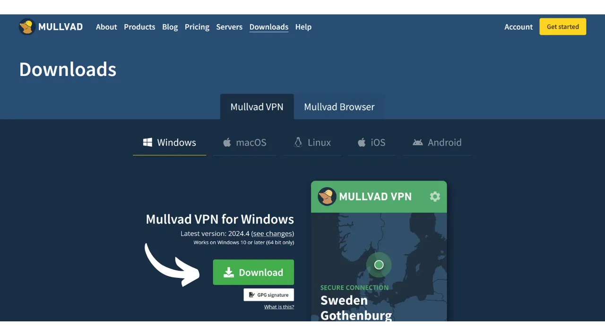
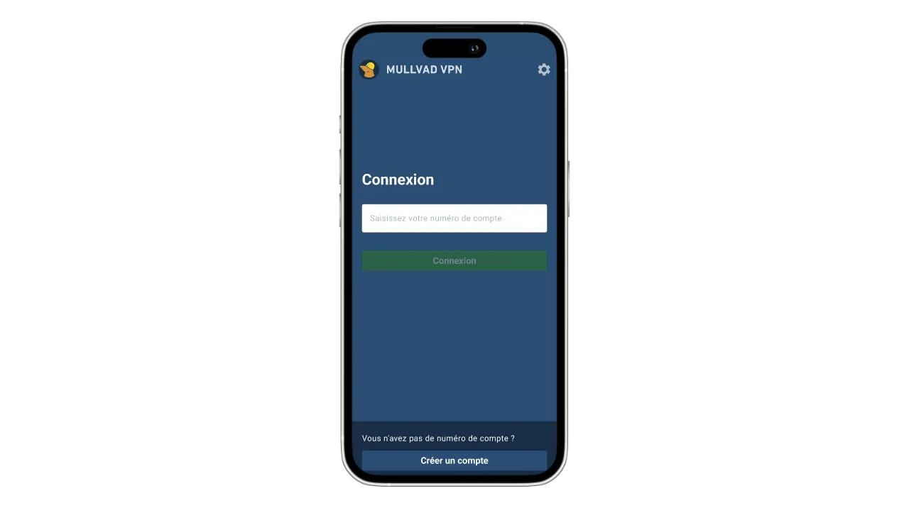
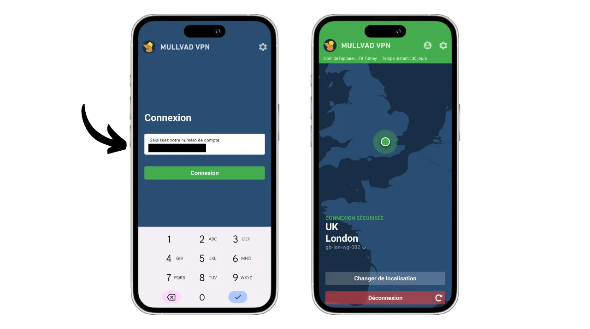
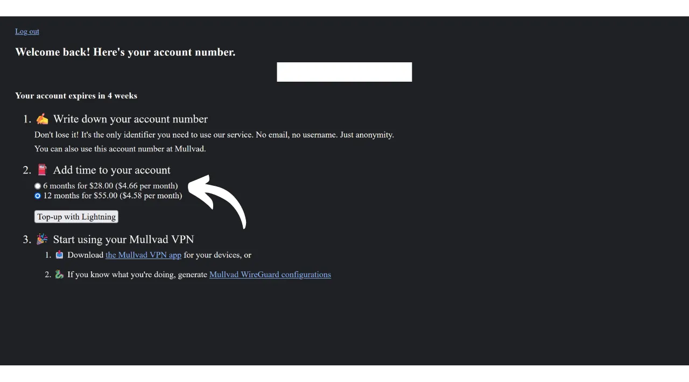
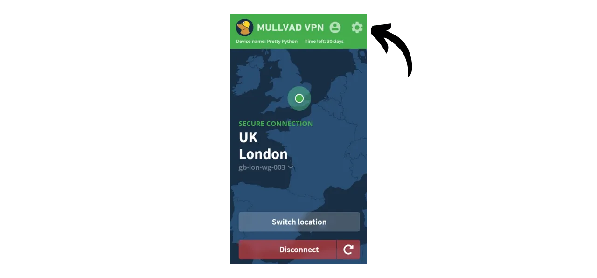
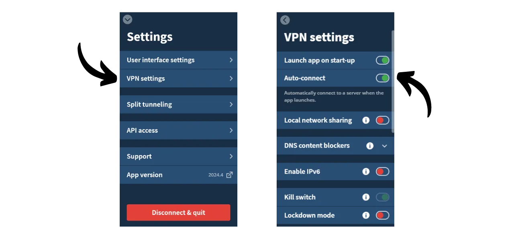

VPN（"*Virtual Private Network*"、仮想私設ネットワーク）は、あなたの電話やコンピュータとVPNプロバイダーが管理するリモートサーバーとの間に安全で暗号化された接続を確立するサービスです。

技術的には、VPNに接続すると、インターネットトラフィックは暗号化されたトンネルを通じてVPNサーバーにリダイレクトされます。このプロセスにより、インターネットサービスプロバイダー（ISP）や悪意のあるアクターなどの第三者がデータを傍受または読み取ることが困難になります。VPNサーバーは、あなたに代わって使用したいサービスに接続する仲介者として機能します。それはあなたの接続に新しいIPアドレスを割り当て、訪問するサイトからあなたの実際のIPアドレスを隠すのに役立ちます。しかし、一部のオンライン広告が示唆するように、VPNを使用しても、VPNプロバイダーがあなたの全てのトラフィックを見ることができるため、インターネットを匿名で閲覧することはできません。

VPNを使用する利点は数多くあります。まず、VPNプロバイダーがあなたの情報を共有しない限り、ISPや政府からオンライン活動のプライバシーを保護します。次に、特に公共Wi-Fiネットワークに接続している場合にデータを保護します。これらのネットワークはMITM（"**man-in-the-middle**"、中間者攻撃）に弱いです。第三に、IPアドレスを隠すことにより、VPNは地理的な制限や検閲を回避し、あなたの地域では利用できないかブロックされているコンテンツへのアクセスを可能にします。

ご覧のとおり、VPNはトラフィックの監視リスクをVPNプロバイダーに移します。したがって、VPNプロバイダーを選択する際は、登録に必要な個人データを考慮することが重要です。プロバイダーが電話番号、メールアドレス、銀行カードの詳細、あるいはもっと悪いことに郵便住所などの情報を求める場合、あなたの身元をあなたのトラフィックと関連付けるリスクが増加します。プロバイダーが妥協されたり、法的に押収されたりした場合、あなたのトラフィックをあなたの個人データと関連付けることは容易です。そのため、個人情報を必要とせず、ビットコインなどの匿名の支払いを受け入れるプロバイダーを選択することが推奨されます。

このチュートリアルでは、個人情報を必要とせず、シンプルで効率的で手頃な価格のVPNソリューションを紹介します。

## Mullvad VPNの紹介
Mullvad VPNは、ユーザープライバシーへの取り組みで際立っているスウェーデンのサービスです。主流のVPNプロバイダーとは異なり、Mullvadはサインアップ時に個人データを一切必要としません。メールアドレス、電話番号、または名前を提供する必要はありません。代わりに、Mullvadは支払いとサービスへのアクセスに使用される匿名アカウント番号を割り当てます。さらに、Mullvadは自分たちのサーバーを通過する活動ログを一切保持しないと主張しています。

支払いには、クレジットカード情報を提供する必要は必ずしもありません。Mullvadはビットコイン支払いを受け入れます（公式サイトではオンチェーンのみですが、Lightningを介した非公式の方法もあります）。また、郵便での現金支払いも受け付けています。

Mullvad VPNは、透明性とセキュリティを通じても自己を区別します。彼らのソフトウェアはオープンソースであり、定期的に独立したセキュリティ監査を受けており、その結果は[彼らのウェブサイトに公開されています](https://mullvad.net/fr/blog/tag/audits)。Mullvadを運営する会社は、厳格なプライバシー法で知られるスウェーデンに拠点を置いています。彼らは自社ホストのサーバーのみを使用し、AWS、Google Cloud、Microsoft Azureなどのハイパースケーラーを含む第三者のクラウドサービスを使用することに伴うリスクを排除しています。
機能面では、Mullvadは優れたVPNクライアントから期待されるすべてを提供しています。これには、VPNが切断された場合にトラフィックを保護するキルスイッチ、特定のアプリケーションに対してVPNを無効にするオプション、そしてトラフィックを複数のVPNサーバーを経由してルーティングする能力が含まれます。
当然ながら、この品質のサービスにはコストがかかりますが、公正な価格はしばしば品質と誠実さの指標となります。これは、会社が個人データを第三者に販売する必要なくビジネスモデルを持っていることを示す信号となることがあります。Mullvad VPNは、月額5ユーロの定額料金を提供しており、最大5台の異なるデバイスで使用可能です。

主流のVPNプロバイダーとは異なり、Mullvadは定期的な自動サブスクリプションではなく、サービスへのアクセス時間を購入するモデルを採用しています。ビットコインで選択した期間の一回払いを行うだけです。例えば、1年間のアクセスを購入した場合、その期間サービスを利用でき、その後はMullvadのウェブサイトに戻ってアクセス時間を更新する必要があります。
高品質なVPNプロバイダーであるIVPNと比較して、Mullvadはわずかに経済的です。例えば、IVPNで3年間の購入を選択した場合でも、月額コストは約5.40ユーロになります。しかし、IVPNは追加のサービスを提供しており、またMullvadのものよりも安いプラン（スタンダードプラン）もありますが、これは2台のデバイスに限定されており、「マルチホップ」プロトコルは除外されています。
また、IVPNとMullvadを比較するためにいくつか非公式の速度テストを実施しました。IVPNはパフォーマンスの面でわずかに優れていることが示されましたが、Mullvadでの速度も非常に満足のいくものでした。主流のVPNプロバイダーと比較して、IVPNとMullvadは少なくとも同等の効率性を示し、場合によってはそれ以上の優れた性能を発揮しました。

## コンピューターにMullvad VPNをインストールする方法は？

[公式Mullvadウェブサイト](https://mullvad.net/en/download/)を訪れて、"*Downloads*"メニューをクリックしてください。

WindowsまたはmacOSユーザーの場合、サイトから直接ソフトウェアをダウンロードし、セットアップウィザードによって提供される指示に従ってインストールを完了してください。

Linuxユーザーの場合、お使いのディストリビューションに特化した指示を["*Linux*"](https://mullvad.net/en/download/vpn/linux)セクションで見つけることができます。

インストールが完了したら、アカウントIDを入力する必要があります。このチュートリアルの後続セクションで、これを取得する方法を見ていきます。

## スマートフォンにMullvad VPNをインストールする方法は？

iOSユーザーの場合は[AppStore](https://apps.apple.com/us/app/mullvad-vpn/id1488466513)、Androidユーザーの場合は[Google Play Store](https://play.google.com/store/apps/details?id=net.mullvad.mullvadvpn)または[F-Droid](https://f-droid.org/packages/net.mullvad.mullvadvpn/)からMullvad VPNをダウンロードしてください。Androidを使用している場合は、[Mullvadサイト](https://mullvad.net/en/download/vpn/android)から直接`.apk`ファイルをダウンロードするオプションもあります。

アプリを初めて使用する際にはログアウト状態になります。サービスをアクティブにするためには、アカウントIDを入力する必要があります。
では、あなたのデバイスでMullvadをアクティブ化する方法について見ていきましょう。

## Mullvad VPNの支払いとアクティブ化方法は？

[公式Mullvadウェブサイト](https://mullvad.net/)にアクセスし、"*Get Started*"ボタンをクリックしてください。

"*Generate account number*"ボタンをクリックします。
するとMullvadがあなたのアカウントを作成します。個人情報を提供する必要はありません。ログインに必要なのはアカウント番号のみです。これはアクセスキーのようなものです。パスワードマネージャーなど、安全な場所に保存してください。紙のコピーを作ることもできます。

次に、"*Add time to your account*"ボタンをクリックします。

するとアカウントのログインページに到着します。アカウント番号を入力し、"*Log in*"ボタンをクリックしてください。

支払い方法を選択します。ビットコインで支払うことをお勧めします。これにより10%の割引が適用され、月額費用が€4.50になります。ライトニング経由で支払いたい場合は、次の部分で代替方法を提供します。

"*Create a one-time payment address*"ボタンをクリックします。

次に、指定された受信アドレスにビットコインウォレットから指定された金額を支払います。

サイトがあなたの支払いを検出するまで数分かかる場合がありますが、トランザクションが確認されるとすぐに行われます。Mullvadが支払いを検出すると、ページの左上にあなたのサブスクリプションの期間が"*No time left*"の言及の代わりに表示されます。

その後、ソフトウェアにアカウント番号を入力してVPNをアクティブ化できます。

モバイルアプリケーションでVPNをアクティブ化するプロセスは全く同じです。アカウント番号を入力するだけです。

## LightningでMullvad VPNを支払う方法は？

ご理解のとおり、MullvadはまだLightning Network経由の支払いを受け付けていません。しかし、[Lounès](https://x.com/louneskmt)からの推薦により、この制限を回避する非公式サービスを発見しました。このサービスは[vpn.sovereign.engineering](https://vpn.sovereign.engineering/)で利用可能で、Lightningでの支払いを受け付け、代わりにMullvadの有効なプランを提供します。

このサイトでは2つの異なるオプションがあります：サイト管理者を信頼してアカウント番号を直接入力し、「*ログイン*」をクリックすると、Mullvadパッケージが自動的に認証されます。または、「*Heck yeah!*」ボタンをクリックしてLightningでバウチャーを購入し、そのバウチャーを公式のMullvadサイトで使用してパッケージを入手することもできます。  どちらの場合も、その後パッケージの期間を選択するよう求められます。6ヶ月と1年の間で選択できます。  その後、「*Lightningでチャージ*」ボタンをクリックします。  購入を完了するために、Lightningウォレットで請求書を支払います。  バウチャーを購入した場合は、Mullvadサイトで「*バウチャー*」をアカウントの利用可能な支払い方法の中から選択します。その後、vpn.sovereign.engineeringサイトから受け取ったバウチャー番号を指定されたボックスに入力します。  ## Mullvad VPNの使用方法と設定方法は？
アクティブなアカウントを持ち、Mullvadソフトウェアまたはアプリにアカウント番号を入力したので、VPNのサービスを完全に楽しむことができます。  VPNから切断するには、「*切断*」ボタンをクリックするだけです。  「*切断*」ボタンの隣の小さな赤い矢印をクリックすると、現在の場所を変更せずにサーバーを変更できます。  VPNサーバーの都市を変更したい場合は、「*場所を変更*」をクリックして新しい場所を選択します。  画面の上部には、デバイスのニックネームとパッケージの残り期間が表示されます。  小さな人のアイコンをクリックすると、アカウントに関する詳細情報にアクセスできます。  設定にアクセスするには、歯車のアイコンをクリックします。  「*ユーザーインターフェース設定*」メニューでは、ソフトウェアの設定をカスタマイズできます。これには、インターフェースの言語やシステム上の動作が含まれます。  「*VPN設定*」メニューでは、VPNに関連するオプションを見つけることができます。「*起動時にアプリを起動*」と「*自動接続*」のオプションを有効にすることをお勧めします。これにより、マシンが起動するときにVPN接続が自動的に開始されます。
 「*DNSコンテンツブロッカー*」サブメニューでは、悪意のある、広告、または望ましくないウェブサイトへのDNSリクエストをフィルタリングしてブロックするオプションがあります。

最後に、「*スプリットトンネリング*」メニューでは、VPNを介してインターネットトラフィックがルーティングされない特定のアプリケーションをマシンで選択できます。

Mullvadアカウントの概要を確認し、さまざまな接続されたデバイスを管理するには、ウェブサイトの「*デバイス*」メニューをクリックします。
MULLVAD VPNをフルに活用する準備が整いました。Mullvadと機能や価格で似ている別のVPNプロバイダーを探している場合は、IVPNに関する私たちのチュートリアルもぜひご覧ください：

https://planb.network/tutorials/others/ivpn