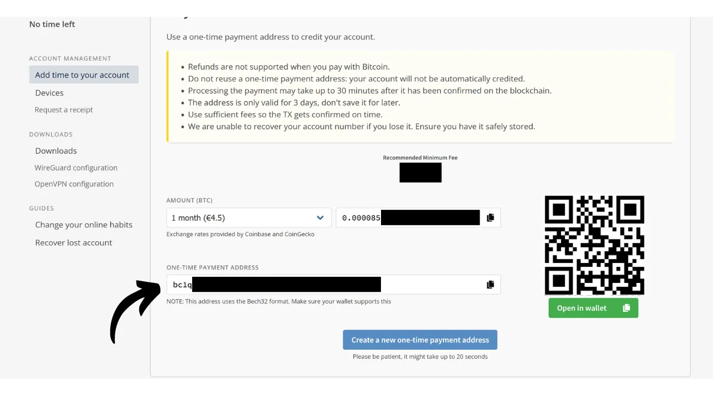
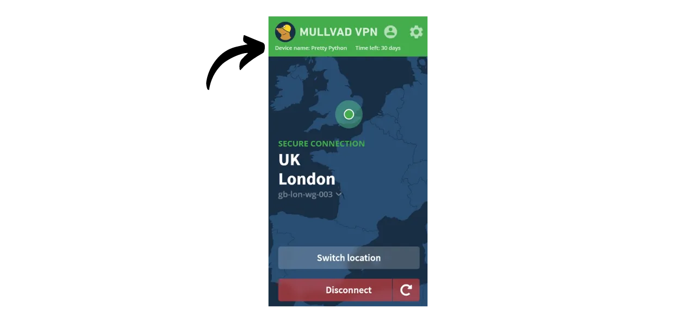
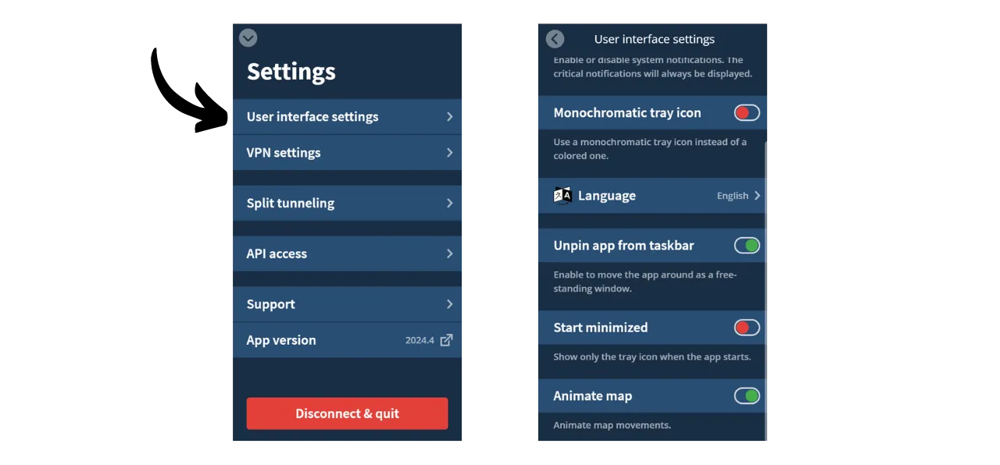
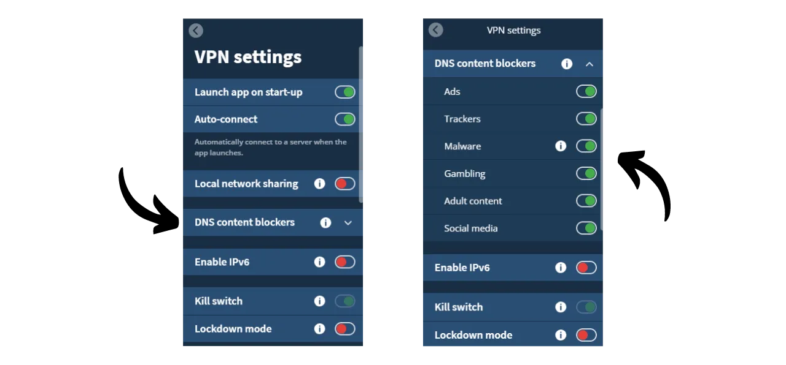

Uma VPN ("*Virtual Private Network*" ou Rede Privada Virtual) é um serviço que estabelece uma conexão segura e criptografada entre seu telefone ou computador e um servidor remoto gerenciado por um provedor de VPN.

Tecnicamente, ao se conectar a uma VPN, seu tráfego de internet é redirecionado através de um túnel criptografado para o servidor da VPN. Esse processo dificulta que terceiros, como Provedores de Serviços de Internet (ISPs) ou atores maliciosos, interceptem ou leiam seus dados. O servidor da VPN então atua como um intermediário que se conecta ao serviço que você deseja usar em seu nome. Ele atribui um novo endereço IP à sua conexão, o que ajuda a ocultar seu endereço IP real dos sites que você visita. No entanto, ao contrário do que alguns anúncios online podem sugerir, usar uma VPN não permite que você navegue na internet anonimamente, pois requer um nível de confiança no provedor da VPN, que pode ver todo o seu tráfego.

Os benefícios de usar uma VPN são numerosos. Primeiramente, preserva a privacidade da sua atividade online de ISPs ou governos, desde que o provedor da VPN não compartilhe suas informações. Em segundo lugar, protege seus dados, especialmente quando você está conectado a redes Wi-Fi públicas, que são vulneráveis a ataques de MITM ("**man-in-the-middle**" ou homem no meio). Terceiramente, ao ocultar seu endereço IP, uma VPN permite que você contorne restrições geográficas e censura, para acessar conteúdo que de outra forma estaria indisponível ou bloqueado em sua região.

Como você pode ver, a VPN transfere o risco de observação do tráfego para o provedor da VPN. Portanto, ao escolher seu provedor de VPN, é importante considerar os dados pessoais exigidos para o registro. Se o provedor pedir informações como seu número de telefone, endereço de e-mail, detalhes do cartão bancário, ou pior, seu endereço postal, o risco de associar sua identidade ao seu tráfego aumenta. No caso de um comprometimento do provedor ou uma apreensão legal, seria fácil associar seu tráfego aos seus dados pessoais. Portanto, é recomendado escolher um provedor que não exija nenhuma informação pessoal e aceite pagamentos anônimos, como com bitcoins.

Neste tutorial, apresentarei uma solução de VPN simples, eficiente e com preço razoável que não requer nenhuma informação pessoal para seu uso.

## Introdução ao Mullvad VPN
Mullvad VPN é um serviço sueco que se destaca pelo seu compromisso com a privacidade do usuário. Diferentemente dos provedores de VPN mainstream, o Mullvad não exige dados pessoais no momento da inscrição. Não é necessário fornecer um endereço de e-mail, número de telefone ou nome; em vez disso, o Mullvad lhe atribui um número de conta anônimo usado para pagamento e acesso ao serviço. Além disso, o Mullvad afirma não manter nenhum registro de atividades que passem por seus servidores.

Para pagamento, não é necessariamente exigido fornecer informações de cartão de crédito, pois o Mullvad aceita pagamentos em bitcoin (apenas onchain em seu site oficial, mas existe um método não oficial para pagar via Lightning). Eles também aceitam pagamentos em dinheiro enviados pelo correio.

O Mullvad VPN também se distingue pela sua transparência e segurança. Seu software é de código aberto, e eles passam regularmente por auditorias de segurança independentes para avaliar suas aplicações e infraestrutura, cujos resultados são [publicados em seu site](https://mullvad.net/fr/blog/tag/audits). A empresa por trás do Mullvad está baseada na Suécia, um país conhecido por suas rigorosas leis de privacidade. Eles usam exclusivamente servidores autogeridos, eliminando assim os riscos associados ao uso de serviços de nuvem de terceiros, como os hiperescaladores AWS, Google Cloud ou Microsoft Azure.
Em termos de recursos, o Mullvad oferece tudo o que se espera de um bom cliente VPN, incluindo um kill switch que protege seu tráfego se a VPN se desconectar, uma opção para desativar a VPN para aplicativos específicos e a capacidade de rotear seu tráfego através de múltiplos servidores VPN.
Naturalmente, essa qualidade de serviço tem um custo, mas um preço justo é frequentemente um indicador de qualidade e honestidade. Isso pode sinalizar que a empresa tem um modelo de negócios sem a necessidade de vender seus dados pessoais para terceiros. O Mullvad VPN oferece uma tarifa fixa de 5 euros por mês, utilizável em até 5 dispositivos diferentes.

Diferente dos provedores de VPN mainstream, o Mullvad tem um modelo de compra de tempo de acesso ao serviço em vez de uma assinatura recorrente e automática. Você simplesmente faz um pagamento único em bitcoins pela duração escolhida. Por exemplo, se você comprar um ano de acesso, pode usar o serviço por esse período, após o qual deve retornar ao site do Mullvad para renovar seu tempo de acesso.
Comparado ao IVPN, outro provedor de VPN de alta qualidade, o Mullvad é ligeiramente mais econômico. Por exemplo, mesmo optando pela compra de três anos com o IVPN, o custo mensal é de cerca de €5,40. No entanto, o IVPN oferece alguns serviços adicionais e também tem um plano mais barato que o do Mullvad (o plano Standard), mas este é limitado a apenas 2 dispositivos e exclui o protocolo "multi-hop".
Também realizei alguns testes de velocidade informais para comparar o IVPN e o Mullvad. Embora o IVPN tenha mostrado uma ligeira superioridade em termos de desempenho, as velocidades no Mullvad ainda foram muito satisfatórias. Comparados aos provedores de VPN mainstream, o IVPN e o Mullvad provaram ser pelo menos tão eficientes, se não superiores em alguns casos.

## Como instalar o Mullvad VPN em um computador?

Visite o [site oficial do Mullvad](https://mullvad.net/en/download/) e clique no menu "*Downloads*".

Para usuários de Windows ou macOS, baixe o software diretamente do site e siga as instruções fornecidas pelo assistente de instalação para completar a instalação.

Para usuários de Linux, você pode encontrar as instruções específicas para sua distribuição na seção ["*Linux*"](https://mullvad.net/en/download/vpn/linux).

Uma vez que a instalação esteja completa, você precisará inserir seu ID de conta. Veremos como obter isso nas próximas seções deste tutorial.

## Como instalar o Mullvad VPN em um smartphone?

Baixe o Mullvad VPN da sua loja de aplicativos, seja a [AppStore](https://apps.apple.com/us/app/mullvad-vpn/id1488466513) para usuários de iOS, a [Google Play Store](https://play.google.com/store/apps/details?id=net.mullvad.mullvadvpn) para Android, ou [F-Droid](https://f-droid.org/packages/net.mullvad.mullvadvpn/). Se você estiver usando Android, também tem a opção de baixar o arquivo `.apk` diretamente do [site do Mullvad](https://mullvad.net/en/download/vpn/android).

Na primeira utilização do aplicativo, você será deslogado. Será necessário inserir seu ID de conta para ativar o serviço.
Agora, vamos prosseguir para ativar o Mullvad nos seus dispositivos.

## Como pagar e ativar o Mullvad VPN?

Acesse o [site oficial do Mullvad](https://mullvad.net/) e clique no botão "*Começar*".

Clique no botão "*Gerar número da conta*".
O Mullvad então criará sua conta. Você não precisa fornecer nenhuma informação pessoal. Apenas o número da sua conta permitirá que você faça login. Ele funciona como uma chave de acesso. Salve-o em um local seguro, como seu gerenciador de senhas, por exemplo. Você também pode fazer uma cópia em papel.

Em seguida, clique no botão "*Adicionar tempo à sua conta*".

Você chegará então à página de login da sua conta. Insira seu número de conta e clique no botão "*Entrar*".

Escolha seu método de pagamento. Eu recomendo pagar com bitcoins, pois você se beneficiará de um desconto de 10%, o que reduz o custo para €4,50 por mês. Se preferir pagar via Lightning, fornecerei um método alternativo na parte seguinte.

Clique no botão "*Criar um endereço de pagamento único*".

Então, pague com sua carteira Bitcoin o valor indicado para o endereço de recebimento fornecido.

Pode levar alguns minutos até o site detectar seu pagamento, uma vez que a transação seja confirmada. Uma vez que o pagamento seja detectado pelo Mullvad, a duração da sua assinatura aparecerá no canto superior esquerdo da página, ao invés da menção "*Sem tempo restante*".

Você pode então inserir seu número de conta no software para ativar o VPN.

Para ativar o VPN no seu aplicativo móvel, o processo é exatamente o mesmo. Você só precisa inserir seu número de conta.

## Como pagar o Mullvad VPN com Lightning?

Como você entendeu, o Mullvad ainda não aceita pagamentos via Lightning Network. No entanto, graças a uma recomendação de [Lounès](https://x.com/louneskmt), descobri um serviço informal que permite contornar essa limitação. Este serviço, disponível em [vpn.sovereign.engineering](https://vpn.sovereign.engineering/), aceita seus pagamentos em Lightning e fornece em troca um plano válido para o Mullvad.

Você tem 2 opções diferentes neste site: você pode confiar no gerente do site e inserir seu número de conta diretamente, em seguida, clicar em "*Log in*" para que seu pacote Mullvad seja automaticamente validado. Ou, você pode clicar no botão "*Heck yeah!*" para comprar um Voucher em Lightning, que você pode então usar no site oficial do Mullvad para obter seu pacote.  Em ambos os casos, você será então solicitado a selecionar a duração do seu pacote. Você pode escolher entre 6 meses e 1 ano.  Em seguida, clique no botão "*Top-up with Lightning*".  Para finalizar a compra, pague a fatura com sua carteira Lightning.  Se você optou por comprar um Voucher, no site do Mullvad, selecione "*Voucher*" entre os métodos de pagamento disponíveis na sua conta. Então, insira o número do Voucher que você recebeu do site vpn.sovereign.engineering na caixa designada.  ## Como usar e configurar o Mullvad VPN?
Agora que você tem uma conta ativa e inseriu seu número de conta no software ou app do Mullvad, você pode desfrutar plenamente dos serviços do seu VPN.  Para se desconectar do VPN, basta clicar no botão "*Disconnect*".  A pequena seta vermelha ao lado do botão "*Disconnect*" permite que você mude de servidores sem alterar a localização atual.  Se você quiser mudar de cidade para o seu servidor VPN, clique em "*Switch location*" para escolher uma nova localização.  No topo da tela, você verá o apelido do seu dispositivo, bem como a duração restante do seu pacote.  Ao clicar no ícone do homenzinho, você acessará informações detalhadas sobre sua conta.  Para acessar as configurações, clique na roda dentada.  No menu "*User interface settings*", você pode personalizar as configurações do seu software, incluindo o idioma da interface e seu comportamento no seu sistema.  No menu "*VPN settings*", você encontrará opções relacionadas ao seu VPN. Eu recomendo habilitar as opções "*Launch app on start-up*" e "*Auto-connect*" para que sua conexão VPN seja automaticamente iniciada quando sua máquina for ligada.
 No submenu "*DNS content blockers*", você tem a opção de filtrar e bloquear solicitações DNS para sites maliciosos, publicitários ou indesejados.

Finalmente, o menu "*Split tunneling*" permite que você selecione aplicativos específicos no seu computador para os quais o tráfego da internet não será roteado através do VPN.

Para obter uma visão geral da sua conta Mullvad e gerenciar os diversos dispositivos conectados, você pode clicar no menu "*Devices*" no site.
 E aí está, agora você está preparado para aproveitar plenamente o Mullvad VPN. Se você tem interesse em descobrir outro provedor de VPN similar ao Mullvad, tanto em termos de recursos quanto de preços, eu também recomendo conferir nosso tutorial sobre o IVPN:

https://planb.network/tutorials/others/ivpn