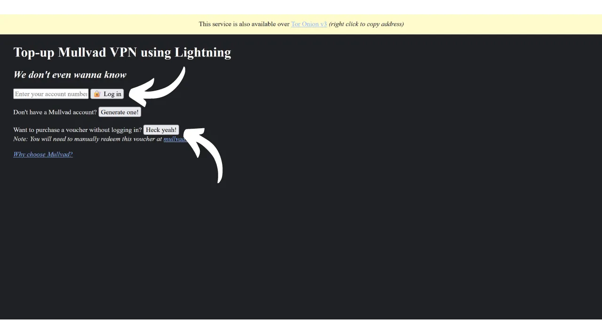

VPN («*Виртуальная Частная Сеть*») - это сервис, который создает безопасное и зашифрованное соединение между вашим телефоном или компьютером и удаленным сервером, управляемым провайдером VPN.

Технически, при подключении к VPN ваш интернет-трафик перенаправляется через зашифрованный туннель к серверу VPN. Этот процесс затрудняет для третьих сторон, таких как провайдеры интернет-услуг (ISP) или злоумышленники, возможность перехватить или прочитать ваши данные. Затем сервер VPN выступает в качестве посредника, который подключается к нужной вам службе от вашего имени. Он назначает вашему соединению новый IP-адрес, что помогает скрыть ваш реальный IP-адрес от посещаемых сайтов. Однако, вопреки тому, что могут предлагать некоторые онлайн-рекламы, использование VPN не позволяет анонимно серфить в интернете, поскольку это требует определенного уровня доверия к провайдеру VPN, который видит весь ваш трафик.

Преимущества использования VPN многочисленны. Во-первых, это сохранение конфиденциальности вашей онлайн-активности от ISP или правительств, при условии, что провайдер VPN не делится вашей информацией. Во-вторых, это защита ваших данных, особенно когда вы подключены к общественным Wi-Fi сетям, которые уязвимы для атак типа "человек посередине" (MITM). В-третьих, скрывая ваш IP-адрес, VPN позволяет обходить географические ограничения и цензуру, чтобы получить доступ к контенту, который в противном случае был бы недоступен или заблокирован в вашем регионе.

Как видите, VPN переносит риск наблюдения за трафиком на провайдера VPN. Поэтому, выбирая провайдера VPN, важно учитывать личные данные, требуемые для регистрации. Если провайдер запрашивает информацию, такую как ваш номер телефона, адрес электронной почты, данные банковской карты или, что еще хуже, ваш почтовый адрес, риск ассоциации вашей личности с вашим трафиком увеличивается. В случае компрометации провайдера или юридического изъятия данных, было бы легко связать ваш трафик с вашими личными данными. Поэтому рекомендуется выбирать провайдера, который не требует никакой личной информации и принимает анонимные платежи, такие как биткоины.

В этом руководстве я представлю простое, эффективное и разумно ценовое решение VPN, которое не требует никакой личной информации для его использования.

## Введение в Mullvad VPN
Mullvad VPN - это шведский сервис, который выделяется своей приверженностью конфиденциальности пользователей. В отличие от основных провайдеров VPN, Mullvad не требует личных данных при регистрации. Нет необходимости предоставлять адрес электронной почты, номер телефона или имя; вместо этого Mullvad присваивает вам анонимный номер учетной записи, используемый для оплаты и доступа к сервису. Кроме того, Mullvad утверждает, что не сохраняет никаких журналов активности, проходящих через их серверы.

Для оплаты не обязательно предоставлять информацию о кредитной карте, поскольку Mullvad принимает платежи биткоинами (только через официальный сайт, но есть неофициальный метод оплаты через Lightning). Они также принимают наличные платежи по почте.

Mullvad VPN также отличается своей прозрачностью и безопасностью. Их программное обеспечение является открытым исходным кодом, и они регулярно проходят независимые аудиты безопасности для оценки своих приложений и инфраструктуры, результаты которых [публикуются на их веб-сайте](https://mullvad.net/fr/blog/tag/audits). Компания, стоящая за Mullvad, базируется в Швеции, стране, известной своими строгими законами о конфиденциальности. Они исключительно используют собственные серверы, тем самым исключая риски, связанные с использованием сторонних облачных сервисов, таких как гипермасштабируемые AWS, Google Cloud или Microsoft Azure.
В плане функционала Mullvad предлагает все, что ожидается от хорошего VPN-клиента, включая аварийный выключатель, который защищает ваш трафик, если VPN отключается, опцию отключения VPN для определенных приложений и возможность направлять ваш трафик через несколько VPN-серверов.
Естественно, такое качество услуги имеет свою цену, но справедливая цена часто является показателем качества и честности. Это может сигнализировать о том, что компания имеет бизнес-модель, которая не требует продажи ваших личных данных третьим лицам. Mullvad VPN предлагает единую ставку в 5 евро в месяц, доступную на до 5 различных устройствах.

В отличие от основных VPN-провайдеров, Mullvad предлагает модель покупки времени доступа к сервису, а не повторяющуюся автоматическую подписку. Вы просто делаете одноразовый платеж в биткойнах на выбранный срок. Например, если вы покупаете доступ на один год, вы можете использовать сервис в течение этого периода, после чего вам нужно будет вернуться на сайт Mullvad, чтобы обновить время доступа.
По сравнению с IVPN, другим провайдером VPN высокого качества, Mullvad немного более экономичен. Например, даже при выборе покупки на три года с IVPN, месячная стоимость составляет около 5,40 евро. Однако IVPN также предлагает некоторые дополнительные услуги и имеет более дешевый план, чем у Mullvad (стандартный план), но он ограничен только 2 устройствами и не включает протокол "multi-hop".
Я также провел несколько неформальных тестов скорости, чтобы сравнить IVPN и Mullvad. Хотя IVPN показал небольшое превосходство в плане производительности, скорости в Mullvad все еще были очень удовлетворительными. По сравнению с основными VPN-провайдерами, IVPN и Mullvad оказались по крайней мере так же эффективными, если не лучше в некоторых случаях.

## Как установить Mullvad VPN на компьютер?

Посетите [официальный сайт Mullvad](https://mullvad.net/en/download/) и нажмите на меню "*Загрузки*".

Для пользователей Windows или macOS загрузите программное обеспечение непосредственно с сайта и следуйте инструкциям мастера установки, чтобы завершить установку.

Для пользователей Linux вы можете найти инструкции, специфичные для вашего дистрибутива, в разделе ["*Linux*"](https://mullvad.net/en/download/vpn/linux).

После завершения установки вам нужно будет ввести ваш идентификатор аккаунта. Как это сделать, мы увидим в следующих разделах этого руководства.

## Как установить Mullvad VPN на смартфон?

Загрузите Mullvad VPN из вашего магазина приложений, будь то [AppStore](https://apps.apple.com/us/app/mullvad-vpn/id1488466513) для пользователей iOS, [Google Play Store](https://play.google.com/store/apps/details?id=net.mullvad.mullvadvpn) для Android, или [F-Droid](https://f-droid.org/packages/net.mullvad.mullvadvpn/). Если вы используете Android, у вас также есть возможность загрузить файл `.apk` напрямую с [сайта Mullvad](https://mullvad.net/en/download/vpn/android).

При первом использовании приложения вы будете выведены из системы. Вам нужно будет ввести ваш идентификатор аккаунта, чтобы активировать сервис.
Теперь давайте перейдем к активации Mullvad на ваших устройствах.

## Как оплатить и активировать Mullvad VPN?

Перейдите на [официальный сайт Mullvad](https://mullvad.net/) и нажмите кнопку "*Начать*".

Нажмите кнопку "*Сгенерировать номер аккаунта*".
После этого Mullvad создаст ваш аккаунт. Вам не нужно предоставлять какую-либо личную информацию. Только ваш номер аккаунта позволит вам войти. Это действует как ключ доступа. Сохраните его в безопасном месте, например, в менеджере паролей. Вы также можете сделать бумажную копию.

Затем нажмите кнопку "*Добавить время к вашему аккаунту*".

Вы попадете на страницу входа в ваш аккаунт. Введите номер вашего аккаунта, а затем нажмите кнопку "*Войти*".

Выберите способ оплаты. Я рекомендую оплатить биткоинами, так как вы получите скидку 10%, что снизит стоимость до €4.50 в месяц. Если вы предпочитаете оплатить через Lightning, я предоставлю альтернативный метод в следующей части.

Нажмите кнопку "*Создать адрес одноразового платежа*".

Затем оплатите указанную сумму на полученный адрес с вашего биткоин-кошелька.

Может пройти несколько минут, прежде чем сайт обнаружит ваш платеж, как только транзакция будет подтверждена. Как только платеж будет обнаружен Mullvad, срок вашей подписки появится в верхнем левом углу страницы вместо упоминания "*Нет оставшегося времени*".

Затем вы можете ввести номер вашего аккаунта в программное обеспечение, чтобы активировать VPN.

Для активации VPN в мобильном приложении процесс точно такой же. Вам просто нужно ввести номер вашего аккаунта.

## Как оплатить Mullvad VPN через Lightning?

Как вы поняли, Mullvad пока не принимает платежи через сеть Lightning. Однако благодаря рекомендации от [Lounès](https://x.com/louneskmt), я обнаружил неофициальный сервис, который позволяет обойти это ограничение. Этот сервис, доступный на [vpn.sovereign.engineering](https://vpn.sovereign.engineering/), принимает ваши платежи через Lightning и предоставляет вам действительный план для Mullvad взамен.

На этом сайте у вас есть 2 различных варианта: вы можете довериться менеджеру сайта и напрямую ввести номер своего аккаунта, а затем нажать на кнопку "*Войти*", чтобы ваш пакет Mullvad был автоматически подтвержден. Или вы можете нажать на кнопку "*Ага, конечно!*", чтобы купить Ваучер в Lightning, который затем можно использовать на официальном сайте Mullvad для получения вашего пакета.  В обоих случаях вам будет предложено выбрать срок действия вашего пакета. Вы можете выбрать между 6 месяцами и 1 годом.  Затем нажмите на кнопку "*Пополнить через Lightning*".  Чтобы завершить покупку, оплатите счет с помощью вашего кошелька Lightning.  Если вы решили купить Ваучер, на сайте Mullvad выберите "*Ваучер*" среди доступных методов оплаты в вашем аккаунте. Затем введите номер Ваучера, который вы получили с сайта vpn.sovereign.engineering, в предназначенное для этого поле.  ## Как использовать и настроить Mullvad VPN?
Теперь, когда у вас есть активный аккаунт и вы ввели номер своего аккаунта в программное обеспечение или приложение Mullvad, вы можете полностью наслаждаться услугами вашего VPN.  Чтобы отключиться от VPN, просто нажмите на кнопку "*Отключить*".  Маленькая красная стрелка рядом с кнопкой "*Отключить*" позволяет вам сменить серверы, не меняя текущее местоположение.  Если вы хотите сменить город для вашего сервера VPN, нажмите на "*Сменить местоположение*", чтобы выбрать новое место.  В верхней части экрана вы увидите никнейм вашего устройства, а также оставшееся время действия вашего пакета.  Нажав на иконку маленького человечка, вы получите подробную информацию о вашем аккаунте.  Чтобы получить доступ к настройкам, нажмите на шестеренку.  В меню "*Настройки пользовательского интерфейса*" вы можете настроить параметры вашего программного обеспечения, включая язык интерфейса и его поведение в вашей системе.  В меню "*Настройки VPN*" вы найдете опции, связанные с вашим VPN. Я рекомендую включить опции "*Запускать приложение при старте*" и "*Автоподключение*", чтобы ваше VPN-соединение автоматически запускалось при старте вашей машины.
 В подменю "*Блокировщики содержимого DNS*" у вас есть возможность фильтровать и блокировать DNS-запросы к вредоносным, рекламным или нежелательным веб-сайтам.

Наконец, меню "*Раздельное туннелирование*" позволяет выбрать конкретные приложения на вашей машине, трафик которых не будет направляться через VPN.

Чтобы получить обзор вашего аккаунта Mullvad и управлять различными подключенными устройствами, вы можете нажать на меню "*Устройства*" на веб-сайте.
 И вот вы теперь полностью готовы пользоваться Mullvad VPN. Если вас интересует изучение другого провайдера VPN, похожего на Mullvad как по функционалу, так и по цене, я также рекомендую ознакомиться с нашим руководством по IVPN:

https://planb.network/tutorials/others/ivpn