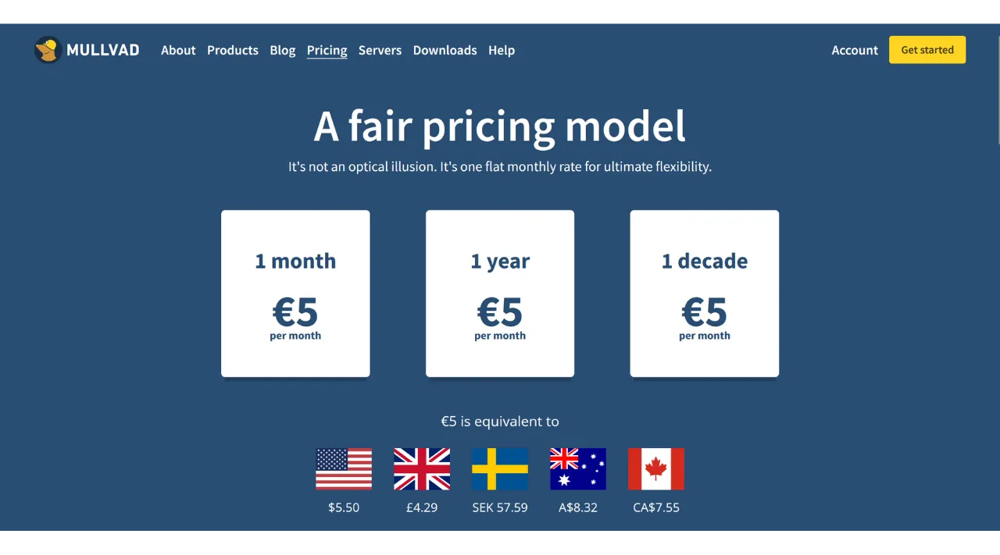
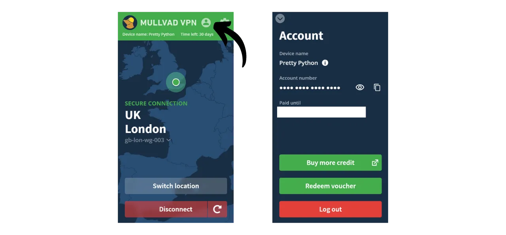

VPN ("*Virtual Private Network*" - Mạng Riêng Ảo) là một dịch vụ thiết lập một kết nối an toàn và được mã hóa giữa điện thoại hoặc máy tính của bạn với một máy chủ từ xa được quản lý bởi nhà cung cấp VPN.

Về mặt kỹ thuật, khi kết nối với VPN, lưu lượng internet của bạn được chuyển hướng qua một đường hầm được mã hóa đến máy chủ VPN. Quá trình này làm cho việc bên thứ ba, như Nhà cung cấp Dịch vụ Internet (ISPs) hoặc những kẻ xấu, khó có thể chặn hoặc đọc dữ liệu của bạn. Máy chủ VPN sau đó hoạt động như một trung gian kết nối với dịch vụ bạn muốn sử dụng thay mặt bạn. Nó gán một địa chỉ IP mới cho kết nối của bạn, giúp ẩn địa chỉ IP thực của bạn khỏi các trang web bạn truy cập. Tuy nhiên, trái với những gì một số quảng cáo trực tuyến có thể gợi ý, sử dụng VPN không cho phép bạn duyệt internet một cách ẩn danh, vì nó đòi hỏi một mức độ tin tưởng vào nhà cung cấp VPN, người có thể thấy tất cả lưu lượng truy cập của bạn.

Lợi ích của việc sử dụng VPN là rất nhiều. Đầu tiên, nó bảo vệ sự riêng tư của hoạt động trực tuyến của bạn khỏi ISPs hoặc chính phủ, miễn là nhà cung cấp VPN không chia sẻ thông tin của bạn. Thứ hai, nó bảo vệ dữ liệu của bạn, đặc biệt khi bạn kết nối với mạng Wi-Fi công cộng, nơi dễ bị tấn công MITM ("**man-in-the-middle**"). Thứ ba, bằng cách ẩn địa chỉ IP của bạn, VPN cho phép bạn vượt qua các hạn chế địa lý và kiểm duyệt, để truy cập nội dung mà nếu không sẽ không khả dụng hoặc bị chặn trong khu vực của bạn.

Như bạn thấy, VPN chuyển rủi ro quan sát lưu lượng truy cập sang nhà cung cấp VPN. Do đó, khi chọn nhà cung cấp VPN của bạn, điều quan trọng là phải xem xét dữ liệu cá nhân được yêu cầu khi đăng ký. Nếu nhà cung cấp yêu cầu thông tin như số điện thoại, địa chỉ email, chi tiết thẻ ngân hàng, hoặc tồi tệ hơn, địa chỉ bưu điện của bạn, rủi ro liên kết danh tính của bạn với lưu lượng truy cập của bạn tăng lên. Trong trường hợp nhà cung cấp bị xâm phạm hoặc bị tịch thu pháp lý, việc liên kết lưu lượng truy cập của bạn với dữ liệu cá nhân sẽ trở nên dễ dàng. Do đó, được khuyến nghị chọn một nhà cung cấp không yêu cầu bất kỳ thông tin cá nhân nào và chấp nhận thanh toán ẩn danh, như bằng bitcoin.

Trong hướng dẫn này, tôi sẽ giới thiệu một giải pháp VPN đơn giản, hiệu quả, có giá cả hợp lý mà không yêu cầu thông tin cá nhân nào để sử dụng.

## Giới thiệu về Mullvad VPN
Mullvad VPN là một dịch vụ của Thụy Điển nổi bật với cam kết về quyền riêng tư của người dùng. Không giống như các nhà cung cấp VPN chính thống, Mullvad không yêu cầu dữ liệu cá nhân khi đăng ký. Bạn không cần cung cấp địa chỉ email, số điện thoại, hoặc tên; thay vào đó, Mullvad gán cho bạn một số tài khoản ẩn danh được sử dụng để thanh toán và truy cập dịch vụ. Ngoài ra, Mullvad tuyên bố không giữ bất kỳ nhật ký hoạt động nào qua máy chủ của họ.

Đối với việc thanh toán, không nhất thiết phải cung cấp thông tin thẻ tín dụng, vì Mullvad chấp nhận thanh toán bằng bitcoin (chỉ trên trang web chính thức của họ bằng onchain, nhưng có một phương pháp không chính thức để thanh toán qua Lightning). Họ cũng chấp nhận thanh toán bằng tiền mặt qua thư.

Mullvad VPN cũng nổi bật với sự minh bạch và an ninh của mình. Phần mềm của họ là mã nguồn mở, và họ thường xuyên trải qua các cuộc kiểm toán bảo mật độc lập để đánh giá các ứng dụng và cơ sở hạ tầng của họ, kết quả của đó được [công bố trên trang web của họ](https://mullvad.net/fr/blog/tag/audits). Công ty đứng sau Mullvad có trụ sở tại Thụy Điển, một quốc gia nổi tiếng với các luật riêng tư nghiêm ngặt. Họ chỉ sử dụng máy chủ tự lưu trữ, do đó loại bỏ rủi ro liên quan đến việc sử dụng dịch vụ đám mây của bên thứ ba, như hyperscalers AWS, Google Cloud, hoặc Microsoft Azure.
Về mặt tính năng, Mullvad cung cấp mọi thứ mà người ta mong đợi từ một ứng dụng VPN tốt, bao gồm một công tắc tự động ngắt giúp bảo vệ lưu lượng truy cập của bạn nếu VPN mất kết nối, một tùy chọn để vô hiệu hóa VPN cho các ứng dụng cụ thể, và khả năng điều hướng lưu lượng truy cập của bạn qua nhiều máy chủ VPN.
Tất nhiên, chất lượng dịch vụ như vậy đi kèm với một mức giá, nhưng một mức giá công bằng thường là một chỉ báo của chất lượng và sự trung thực. Điều này có thể cho thấy rằng công ty có một mô hình kinh doanh mà không cần phải bán dữ liệu cá nhân của bạn cho bên thứ ba. Mullvad VPN cung cấp một mức giá cố định là 5 euro mỗi tháng, có thể sử dụng trên tối đa 5 thiết bị khác nhau.

Khác với các nhà cung cấp VPN chính thống, Mullvad có một mô hình mua thời gian truy cập dịch vụ thay vì một đăng ký tự động, lặp lại. Bạn chỉ cần thực hiện một lần thanh toán bằng bitcoin cho thời gian đã chọn. Ví dụ, nếu bạn mua một năm truy cập, bạn có thể sử dụng dịch vụ trong khoảng thời gian đó, sau đó bạn phải quay lại trang web của Mullvad để gia hạn thời gian truy cập.
So với IVPN, một nhà cung cấp VPN chất lượng cao khác, Mullvad có giá cả phải chăng hơn một chút. Ví dụ, ngay cả khi chọn mua ba năm với IVPN, chi phí hàng tháng lên đến khoảng 5.40 euro. Tuy nhiên, IVPN cũng cung cấp một số dịch vụ bổ sung và cũng có một kế hoạch rẻ hơn so với Mullvad (kế hoạch Tiêu chuẩn), nhưng kế hoạch này chỉ giới hạn cho 2 thiết bị và không bao gồm giao thức "multi-hop".
Tôi cũng đã tiến hành một số bài kiểm tra tốc độ không chính thức để so sánh IVPN và Mullvad. Mặc dù IVPN cho thấy một sự vượt trội nhẹ về hiệu suất, tốc độ tại Mullvad vẫn rất đáng hài lòng. So với các nhà cung cấp VPN chính thống, IVPN và Mullvad đã chứng minh là ít nhất cũng hiệu quả, nếu không muốn nói là vượt trội trong một số trường hợp.

## Cách cài đặt Mullvad VPN trên máy tính?

Truy cập [trang web chính thức của Mullvad](https://mullvad.net/en/download/) và nhấp vào menu "*Tải xuống*".

Đối với người dùng Windows hoặc macOS, tải phần mềm trực tiếp từ trang web và làm theo hướng dẫn được cung cấp bởi trình hướng dẫn cài đặt để hoàn thành việc cài đặt.

Đối với người dùng Linux, bạn có thể tìm thấy hướng dẫn cụ thể cho bản phân phối của mình trong mục ["*Linux*"](https://mullvad.net/en/download/vpn/linux).

Sau khi hoàn tất cài đặt, bạn sẽ cần nhập ID tài khoản của mình. Chúng ta sẽ xem cách lấy ID này trong các phần tiếp theo của hướng dẫn này.

## Cách cài đặt Mullvad VPN trên điện thoại thông minh?

Tải xuống Mullvad VPN từ cửa hàng ứng dụng của bạn, dù là [AppStore](https://apps.apple.com/us/app/mullvad-vpn/id1488466513) cho người dùng iOS, [Google Play Store](https://play.google.com/store/apps/details?id=net.mullvad.mullvadvpn) cho Android, hoặc [F-Droid](https://f-droid.org/packages/net.mullvad.mullvadvpn/). Nếu bạn sử dụng Android, bạn cũng có tùy chọn tải tệp `.apk` trực tiếp từ [trang web của Mullvad](https://mullvad.net/en/download/vpn/android).

Khi sử dụng ứng dụng lần đầu, bạn sẽ được đăng xuất. Bạn sẽ cần nhập ID tài khoản của mình để kích hoạt dịch vụ.
Bây giờ, chúng ta hãy tiếp tục với việc kích hoạt Mullvad trên các thiết bị của bạn.

## Làm thế nào để thanh toán và kích hoạt Mullvad VPN?

Truy cập [trang web chính thức của Mullvad](https://mullvad.net/) và nhấn vào nút "*Bắt đầu*".

Nhấn vào nút "*Tạo số tài khoản*".
Mullvad sẽ tạo tài khoản cho bạn. Bạn không cần cung cấp bất kỳ thông tin cá nhân nào. Chỉ có số tài khoản của bạn mới cho phép bạn đăng nhập. Nó hoạt động giống như một chìa khóa truy cập. Lưu nó ở một nơi an toàn như trình quản lý mật khẩu của bạn, chẳng hạn. Bạn cũng có thể tạo một bản sao giấy.

Sau đó nhấn vào nút "*Thêm thời gian cho tài khoản của bạn*".

Bạn sẽ đến trang đăng nhập cho tài khoản của mình. Nhập số tài khoản của bạn và sau đó nhấn vào nút "*Đăng nhập*".

Chọn phương thức thanh toán của bạn. Tôi khuyên bạn nên thanh toán bằng bitcoin, vì bạn sẽ được giảm giá 10%, giảm chi phí xuống còn €4.50 mỗi tháng. Nếu bạn muốn thanh toán qua Lightning, tôi sẽ cung cấp một phương thức thay thế trong phần tiếp theo.

Nhấn vào nút "*Tạo một địa chỉ thanh toán một lần*".

Sau đó thanh toán với ví Bitcoin của bạn số tiền được chỉ định đến địa chỉ nhận được cung cấp cho bạn.

Có thể mất vài phút trước khi trang web phát hiện thanh toán của bạn, sau khi giao dịch được xác nhận. Một khi thanh toán được Mullvad phát hiện, thời hạn đăng ký của bạn sẽ xuất hiện ở góc trên bên trái của trang, thay vì dòng chữ "*Không còn thời gian*".

Bạn có thể sau đó nhập số tài khoản của mình vào phần mềm để kích hoạt VPN.

Để kích hoạt VPN trên ứng dụng di động của bạn, quy trình là hoàn toàn giống nhau. Bạn chỉ cần nhập số tài khoản của mình.

## Làm thế nào để thanh toán cho Mullvad VPN bằng Lightning?

Như bạn đã hiểu, Mullvad chưa chấp nhận thanh toán qua Mạng Lưới Lightning. Tuy nhiên, nhờ một gợi ý từ [Lounès](https://x.com/louneskmt), tôi đã khám phá ra một dịch vụ không chính thức cho phép bạn vượt qua hạn chế này. Dịch vụ này, có sẵn trên [vpn.sovereign.engineering](https://vpn.sovereign.engineering/), chấp nhận thanh toán của bạn trên Lightning và cung cấp cho bạn một kế hoạch hợp lệ cho Mullvad đổi lại.

Bạn có 2 lựa chọn khác nhau trên trang web này: bạn có thể tin tưởng quản lý trang web và nhập trực tiếp số tài khoản của mình, sau đó nhấp vào nút "*Đăng nhập*" để gói Mullvad của bạn được xác thực tự động. Hoặc, bạn có thể nhấp vào nút "*Heck yeah!*" để mua một Phiếu quà tặng bằng Lightning, sau đó bạn có thể sử dụng trên trang chính thức của Mullvad để nhận gói dịch vụ của mình.  Trong cả hai trường hợp, bạn sẽ được yêu cầu chọn thời hạn của gói dịch vụ. Bạn có thể chọn giữa 6 tháng và 1 năm.  Sau đó nhấp vào nút "*Nạp tiền bằng Lightning*".  Để hoàn tất việc mua hàng, thanh toán hóa đơn bằng ví Lightning của bạn.  Nếu bạn chọn mua Phiếu quà tặng, trên trang Mullvad, chọn "*Phiếu quà tặng*" trong số các phương thức thanh toán có sẵn trên tài khoản của bạn. Sau đó, nhập số Phiếu quà tặng bạn nhận được từ trang vpn.sovereign.engineering vào ô được chỉ định.  ## Làm thế nào để sử dụng và cấu hình Mullvad VPN?
Bây giờ bạn đã có một tài khoản hoạt động và đã nhập số tài khoản của mình vào phần mềm hoặc ứng dụng Mullvad, bạn có thể tận hưởng đầy đủ các dịch vụ của VPN của mình.  Để ngắt kết nối từ VPN, chỉ cần nhấp vào nút "*Ngắt kết nối*".  Mũi tên đỏ nhỏ bên cạnh nút "*Ngắt kết nối*" cho phép bạn thay đổi máy chủ mà không thay đổi vị trí hiện tại.  Nếu bạn muốn thay đổi thành phố cho máy chủ VPN của mình, nhấp vào "*Chuyển vị trí*" để chọn một vị trí mới.  Ở đầu màn hình, bạn sẽ thấy biệt danh thiết bị của mình cũng như thời hạn còn lại của gói dịch vụ.  Bằng cách nhấp vào biểu tượng người nhỏ, bạn sẽ truy cập thông tin chi tiết về tài khoản của mình.  Để truy cập cài đặt, nhấp vào bánh răng.  Trong menu "*Cài đặt giao diện người dùng*", bạn có thể tùy chỉnh cài đặt của phần mềm, bao gồm ngôn ngữ giao diện và hành vi của nó trên hệ thống của bạn.  Trong menu "*Cài đặt VPN*", bạn sẽ tìm thấy các tùy chọn liên quan đến VPN của mình. Tôi khuyên bạn nên kích hoạt các tùy chọn "*Khởi chạy ứng dụng khi khởi động*" và "*Tự động kết nối*" để kết nối VPN của bạn tự động khởi động khi máy của bạn bắt đầu.
 Trong submenu "*Chặn nội dung DNS*", bạn có tùy chọn lọc và chặn các yêu cầu DNS đến các trang web độc hại, quảng cáo hoặc không mong muốn.

Cuối cùng, menu "*Chia tách đường hầm*" cho phép bạn chọn các ứng dụng cụ thể trên máy của mình mà lưu lượng internet sẽ không được định tuyến qua VPN.

Để có cái nhìn tổng quan về tài khoản Mullvad của bạn và quản lý các thiết bị kết nối khác nhau, bạn có thể nhấp vào menu "*Thiết bị*" trên trang web.
Và đó chính xác là những gì bạn cần, giờ đây bạn đã sẵn sàng để tận hưởng trọn vẹn Mullvad VPN. Nếu bạn quan tâm đến việc khám phá một nhà cung cấp VPN khác tương tự như Mullvad, cả về tính năng lẫn giá cả, tôi cũng khuyên bạn nên xem hướng dẫn của chúng tôi về IVPN:

https://planb.network/tutorials/others/ivpn