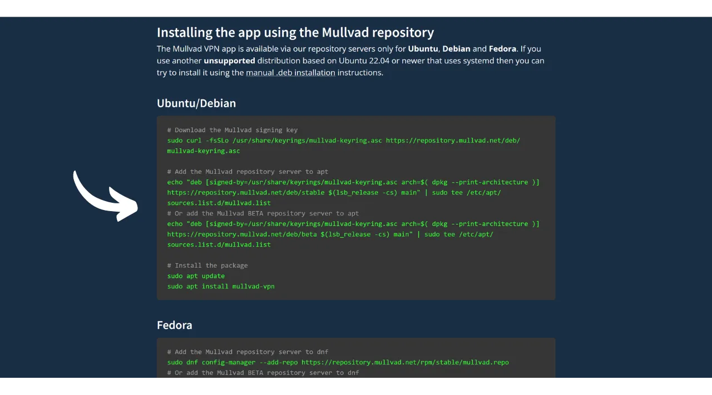
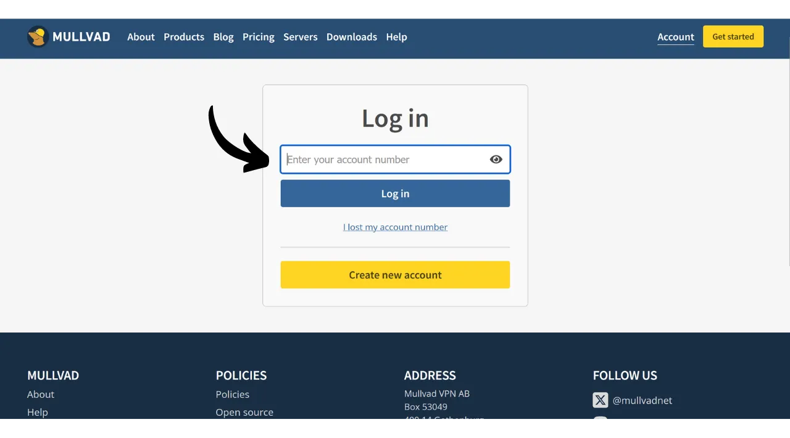
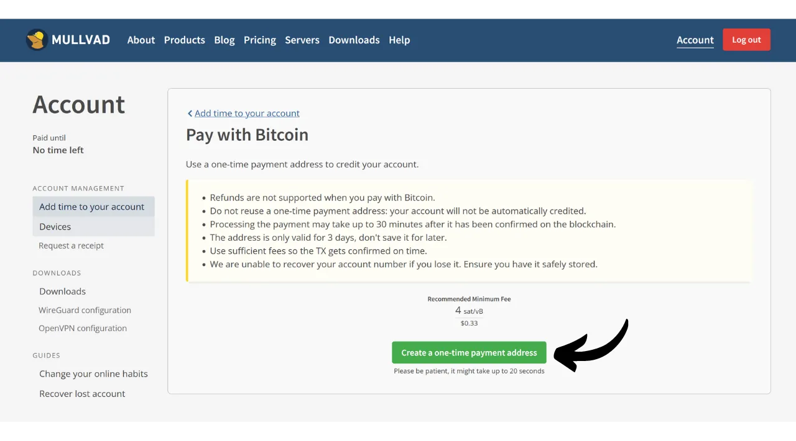
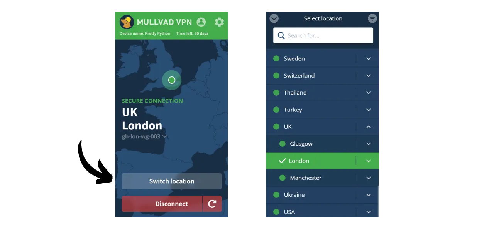

VPN（*虚拟私人网络*）是一项服务，它在您的手机或计算机与VPN提供商管理的远程服务器之间建立一个安全且加密的连接。

技术上讲，连接到VPN时，您的互联网流量会通过一个加密隧道重定向到VPN服务器。这个过程使得第三方，如互联网服务提供商（ISPs）或恶意行为者，难以拦截或读取您的数据。然后VPN服务器充当中介，代表您连接到您希望使用的服务。它为您的连接分配一个新的IP地址，这有助于隐藏您访问的网站的真实IP地址。然而，与一些在线广告可能暗示的相反，使用VPN并不允许您匿名浏览互联网，因为这需要对VPN提供商有一定程度的信任，VPN提供商可以看到您的所有流量。

使用VPN的好处有很多。首先，它保护您的在线活动隐私不受ISPs或政府的侵犯，前提是VPN提供商不共享您的信息。其次，它保护您的数据，特别是当您连接到公共Wi-Fi网络时，这些网络容易受到MITM（**中间人**）攻击。第三，通过隐藏您的IP地址，VPN允许您绕过地理限制和审查，访问在您所在地区否则无法获得或被封锁的内容。

如您所见，VPN将流量观察的风险转移到了VPN提供商身上。因此，在选择VPN提供商时，考虑注册所需的个人数据很重要。如果提供商要求提供诸如电话号码、电子邮件地址、银行卡详细信息，或更糟的是，您的邮政地址等信息，将您的身份与您的流量关联的风险就会增加。如果提供商遭到妥协或法律查封，将您的流量与您的个人数据关联起来将会很容易。因此，建议选择一个不需要任何个人信息并接受匿名支付的提供商，比如使用比特币。

在本教程中，我将介绍一个简单、高效、价格合理的VPN解决方案，使用它不需要任何个人信息。

## 介绍Mullvad VPN
Mullvad VPN是一项瑞典服务，以其对用户隐私的承诺而脱颖而出。与主流VPN提供商不同，Mullvad在注册时不需要任何个人数据。无需提供电子邮件地址、电话号码或姓名；相反，Mullvad为您分配一个匿名账号，用于支付和访问服务。此外，Mullvad声称不保留通过其服务器传递的任何活动日志。

对于支付，不一定需要提供信用卡信息，因为Mullvad接受比特币支付（仅在其官方网站上链支付，但有通过Lightning支付的非官方方法）。他们还接受通过邮件支付现金。

Mullvad VPN还通过其透明度和安全性区别于其他服务。他们的软件是开源的，他们定期接受独立安全审计，以评估他们的应用程序和基础设施，其结果[发布在他们的网站上](https://mullvad.net/fr/blog/tag/audits)。Mullvad背后的公司位于瑞典，一个以严格的隐私法律著称的国家。他们专门使用自托管服务器，从而消除了使用第三方云服务（如超大规模AWS、Google Cloud或Microsoft Azure）的风险。
在功能方面，Mullvad 提供了人们对优质 VPN 客户端的所有期望，包括在 VPN 断开连接时保护您流量的紧急停止开关、禁用特定应用程序的 VPN 选项，以及通过多个 VPN 服务器路由您的流量的能力。
自然，这种服务质量是有成本的，但公平的价格往往是质量和诚信的指标。这可以表明，公司有一个不需要将您的个人数据出售给第三方的商业模式。Mullvad VPN 提供每月 5 欧元的统一费率，可在多达 5 台不同设备上使用。

与主流 VPN 提供商不同，Mullvad 采用的是购买服务使用时间的模式，而不是循环自动订阅。您只需一次性用比特币支付所选时长的费用。例如，如果您购买了一年的使用权，您可以在该期间使用该服务，之后您必须返回 Mullvad 的网站续订使用时间。
与另一家高质量 VPN 提供商 IVPN 相比，Mullvad 略微更经济。例如，即使选择 IVPN 的三年购买方案，每月费用也约为 5.40 欧元。然而，IVPN 确实提供了一些额外的服务，并且还有一个比 Mullvad 的（标准计划）更便宜的计划，但这仅限于 2 台设备并且不包括“多跳”协议。
我还进行了一些非正式的速度测试来比较 IVPN 和 Mullvad。尽管 IVPN 在性能方面显示出轻微的优势，但 Mullvad 的速度仍然非常令人满意。与主流 VPN 提供商相比，IVPN 和 Mullvad 至少同样高效，如果不是在某些情况下更胜一筹。

## 如何在计算机上安装 Mullvad VPN？

访问[官方 Mullvad 网站](https://mullvad.net/en/download/)并点击“*下载*”菜单。

对于 Windows 或 macOS 用户，直接从网站下载软件，并按照安装向导提供的说明完成安装。

对于 Linux 用户，您可以在[“*Linux*”](https://mullvad.net/en/download/vpn/linux)部分找到针对您的发行版的特定说明。

安装完成后，您需要输入您的账户 ID。我们将在本教程的后续部分看到如何获取这个 ID。

## 如何在智能手机上安装 Mullvad VPN？

从您的应用商店下载 Mullvad VPN，无论是 iOS 用户的 [AppStore](https://apps.apple.com/us/app/mullvad-vpn/id1488466513)，Android 用户的 [Google Play 商店](https://play.google.com/store/apps/details?id=net.mullvad.mullvadvpn)，还是 [F-Droid](https://f-droid.org/packages/net.mullvad.mullvadvpn)。如果您使用的是 Android，您还可以选择直接从 [Mullvad 网站](https://mullvad.net/en/download/vpn/android)下载 `.apk` 文件。

首次使用该应用时，您将被登出。您需要输入您的账户 ID 来激活服务。
现在，让我们继续激活您的设备上的Mullvad。

## 如何支付并激活Mullvad VPN？

访问[官方Mullvad网站](https://mullvad.net/)并点击“*开始使用*”按钮。

点击“*生成账号号码*”按钮。
Mullvad随后会为您创建账号。您无需提供任何个人信息。只需您的账号号码即可登录。它有点像访问密钥。请将其保存在安全的地方，例如您的密码管理器中。您也可以制作纸质副本。

然后点击“*为您的账号添加时间*”按钮。

接下来您将进入账号的登录页面。输入您的账号号码，然后点击“*登录*”按钮。

选择您的支付方式。我推荐使用比特币支付，因为您将享受10%的折扣，这将使成本降至每月4.50欧元。如果您更愿意通过Lightning支付，我将在下一部分提供另一种方法。

点击“*创建一次性支付地址*”按钮。

然后使用您的比特币钱包支付给您提供的接收地址指定的金额。

网站可能需要几分钟时间来检测您的支付，一旦交易确认。一旦Mullvad检测到支付，您的订阅时长将出现在页面的左上角，而不是显示“*没有剩余时间*”。

然后您可以在软件中输入您的账号号码以激活VPN。

在您的移动应用程序上激活VPN的过程完全相同。您只需要输入您的账号号码。

## 如何通过Lightning支付Mullvad VPN？

正如您所理解的，Mullvad尚未接受通过Lightning Network的支付。然而，感谢来自[Lounès](https://x.com/louneskmt)的推荐，我发现了一个非正式服务，允许您绕过这一限制。这项服务，可通过[vpn.sovereign.engineering](https://vpn.sovereign.engineering/)获得，接受您通过Lightning的支付，并为您提供Mullvad的有效计划作为回报。

在这个网站上，您有两种不同的选择：您可以信任网站管理员并直接输入您的账号，然后点击“*登录*”按钮，以自动验证您的Mullvad套餐。或者，您可以点击“*当然啦！*”按钮，通过Lightning购买一张代金券，然后您可以在官方Mullvad网站上使用该代金券来获取您的套餐。 无论哪种情况，您都将被要求选择套餐的时长。您可以选择6个月或1年。 然后点击“*通过Lightning充值*”按钮。 为了完成购买，请使用您的Lightning钱包支付发票。 如果您选择购买代金券，在Mullvad网站上，选择“*代金券*”作为您账户上可用的支付方式之一。然后，在指定的框中输入您从vpn.sovereign.engineering网站收到的代金券号码。 ## 如何使用和配置Mullvad VPN？
现在您已经拥有了一个激活的账户，并且在Mullvad软件或应用中输入了您的账号，您可以完全享受您的VPN服务了。 要断开VPN连接，只需点击“*断开连接*”按钮。 “*断开连接*”按钮旁边的小红箭头允许您在不更改当前位置的情况下更换服务器。 如果您想为您的VPN服务器更换城市，点击“*切换位置*”以选择一个新的位置。 在屏幕顶部，您将看到您设备的昵称以及套餐的剩余时长。 通过点击小人图标，您将访问有关您账户的详细信息。 要访问设置，请点击齿轮图标。 在“*用户界面设置*”菜单中，您可以自定义软件的设置，包括界面语言及其在您系统上的行为。 在“*VPN设置*”菜单中，您将找到与您的VPN相关的选项。我推荐启用“*开机启动应用*”和“*自动连接*”选项，以便您的VPN连接在您的机器启动时自动启动。
 在“*DNS内容阻止器*”子菜单中，您可以选择过滤和阻止对恶意、广告或不想要的网站的DNS请求。

最后，“*分流*”菜单允许您选择特定的应用程序，这些应用程序的互联网流量将不会通过VPN路由。

要获取您的Mullvad账户概览并管理各种连接的设备，您可以在网站上点击“*设备*”菜单。
就这样，您现在已经准备好充分享受Mullvad VPN了。如果您对发现一个类似于Mullvad的VPN提供商感兴趣，无论是在功能还是定价方面，我还推荐您查看我们关于IVPN的教程：

https://planb.network/tutorials/others/ivpn