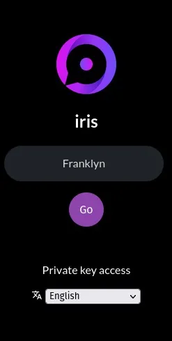
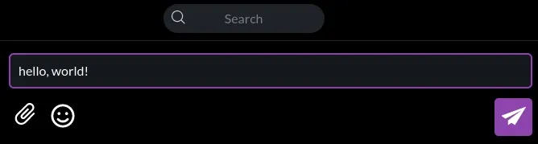
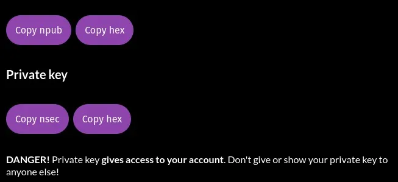

このガイドの終わりには、Nostrが何であるかを理解し、アカウントを作成し、それを使用できるようになります。

## Nostrとは何ですか？

Nostrは、Twitter、Telegram、その他のソーシャルメディアプラットフォームを置き換える力を持つプロトコルです。これは、一度に全世界で抵抗力のあるソーシャルネットワークを作成する能力を持つシンプルなオープンプロトコルです。

## それはどのように機能しますか？

Nostrは、キーペア、クライアント、およびリレーの3つのコンポーネントに基づいています。

各ユーザーには1つ以上のアイデンティティがあり、各アイデンティティは暗号化キーペアによって決定されます。

ネットワークにアクセスするには、クライアントソフトウェアを使用し、コンテンツの受信と送信のためにリレーに接続する必要があります。

## 1. 暗号化キー

FacebookやTwitterのように、ユーザーがプライベート企業にメールアドレスや多くの情報を提供する必要があるのとは異なり、Nostrは中央権威なしで運用されます。ユーザーは暗号化キーペア、秘密キー（プライベートキーとしても知られています）、および公開キーを生成します。

秘密キー（nsec）は、ユーザーのみが知っているもので、認証とコンテンツの公開に使用されます。

公開キー（npub）は、ユーザーが公開したすべてのコンテンツが添付される一意の識別子です。あなたの公開キーは、他のユーザーがあなたを見つけてあなたのNostrフィードを購読することを可能にするユーザーネームのようなものです。

## 2. クライアント

クライアントは、Nostrとのやり取りを可能にするソフトウェアです。主なクライアントは以下の通りです：

> iOS: damus
> Android: amethyst
> Web: iris.to; snort.social; astral.ninja

クライアントは、ユーザーが新しいキーペアを生成する（アカウントを作成するに等しい）か、既存のキーペアで認証することを可能にします。

## 3. リレー

リレーは、もしあなたがそれらが提供するコンテンツを好まない場合はいつでも放棄できる単純なサーバーです。また、希望があれば自分自身のリレーを運用することもできます。

> 💡 プロのヒント：有料のリレーは一般的にスパムや望ましくないコンテンツをフィルタリングするのにより効果的です。

# ガイド

これで、Nostrについて十分に知ることができ、このプロトコルで最初のアイデンティティを作成する準備ができました。

このガイドの目的のために、iris.to (https://iris.to/) を使用します。このWebクライアントはどのプラットフォームでも動作します。

## ステップ1：キーの生成

irisは、プロファイルの名前（実名または架空のもの）を入力するだけでキーセットを作成します。その後、GOをクリックして完了です！

> ⚠️ 注意！セッションを閉じた後もプロファイルに再度アクセスできるようにするには、キーを追跡しておく必要があります。このガイドの最後でその方法をお見せします。

## ステップ2：コンテンツの公開

コンテンツを公開するには、公開フィールドにいくつかの言葉を書くだけでシンプルかつ直感的です。

さあ、Nostrに最初のノートを公開しました。

## ステップ3：友達を見つける

Nostrで私を見つけて、二度と一人ぼっちにならないようにしましょう。私のフィードを購読する人は誰でもフォローバックします。これを行うには、単に私の公開キー

npub1hartx53w6t3q5wv9xdqdwrk7h6r5866t8u775q0304zedpn5zgssasp7d3 を検索バーに入力してください。

「フォロー」をクリックしてください。そうすれば数日以内に、私もあなたのフィードを購読します。友達になれます。メッセージを書きたい場合は、喜んで読ませていただきます。

最後に、Agora256のフィードも購読してください。新しいコンテンツを公開するたびに通知を受け取ることができます：npub1ag0rawstycy7nanuc6sz4v287rneen2yapcq3fd06972f8ncrhzqx

## ステップ4: プロフィールのカスタマイズ

プロフィールをカスタマイズするためには、まだいくつかの作業が必要です。これを行うには、画面の右上隅にあるirisが自動的に生成したアバターをクリックし、「プロフィールを編集」をクリックしてください。

あとは、irisにあなたの画像とプロフィールバナーをインターネット上でどこで見つけるかを教えるだけです。自分のコンテンツをホスティングすることをお勧めします：自分のものは守りましょう。

もし好みであれば、画像をアップロードすることもできます。それらはirisによってnostr.buildに保存されます。これはNostr用の無料のビジュアルコンテンツホスティングサービスです。

ご覧の通り、クライアントを設定してsatsを受け取ったり送ったりすることもできます。この方法で、気に入ったコンテンツの著者に報酬を与えたり、さらに良いことに、あなたが公開する素晴らしいコンテンツのためにsatsを蓄積することができます。

## ステップ5: キーペアのバックアップ

クライアントからログアウトした後やセッションが期限切れになった後もプロフィールへのアクセスを維持したい場合、このステップは重要です。
まず、歯車で表される「設定」アイコンをクリックしてください。

次に、npub、npub hex、nsec、およびnsec hexを一つずつコピーして、安全に保管するテキストファイルに貼り付けてください。できることなら、このファイルを暗号化することをお勧めします。

> ⚠️ irisがあなたに与える警告に注意してください。公開キーは恐れずに共有できますが、秘密キーについては話が異なります。後者を持っている人は誰でもあなたのアカウントにアクセスできるようになります。

## 結論

さあ、小さなダチョウさん、Nostrでの最初の一歩を踏み出しました。これからは、雷の速さで走ることを学ぶ必要があります。近々、キーの管理方法や、getalbyを使用してNostr体験にライトニングを統合する方法を示すガイドを公開します。