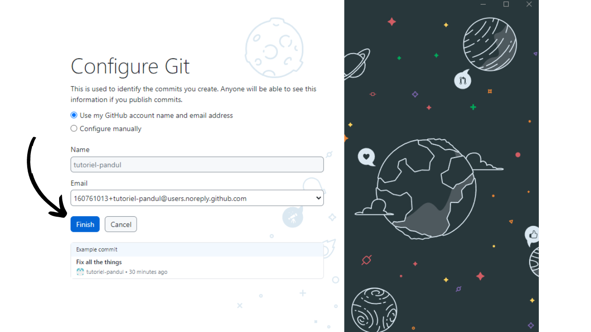
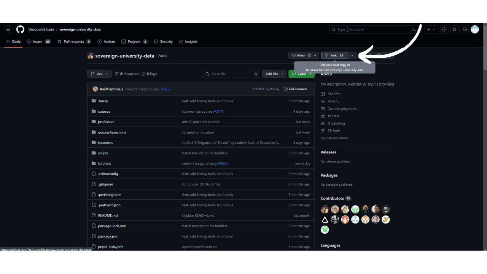
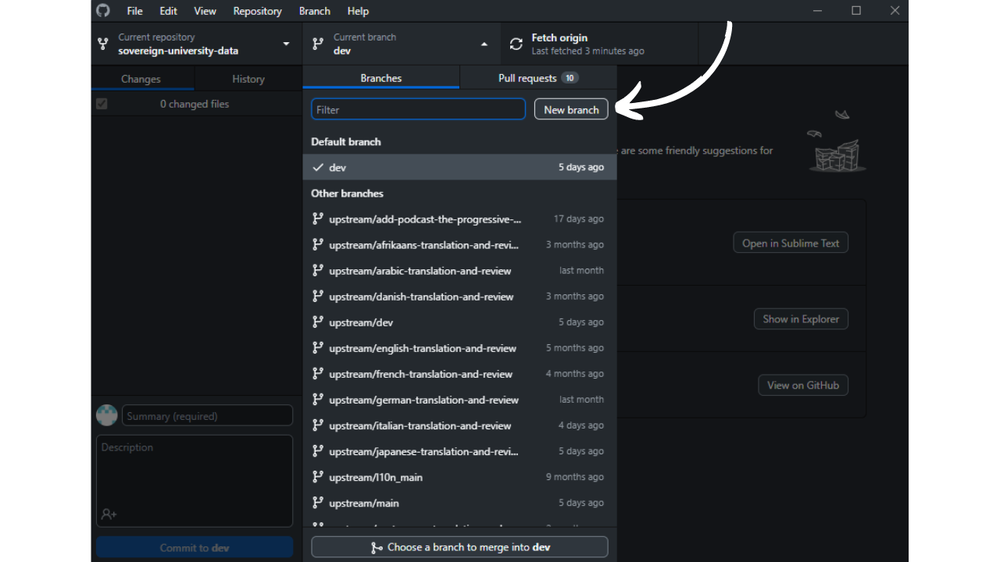
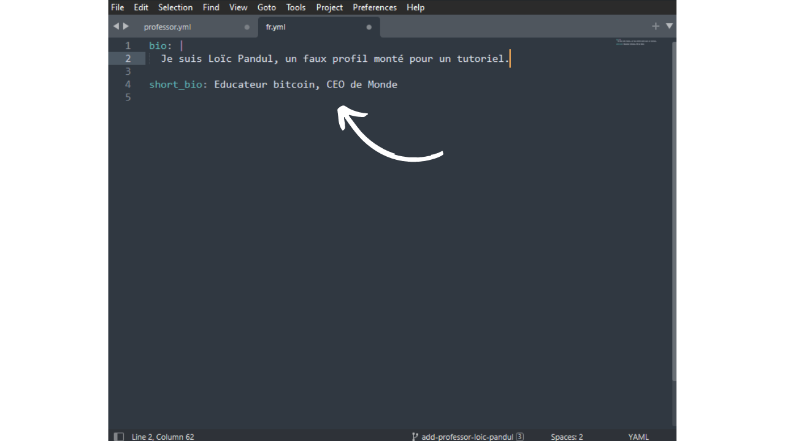

La mission de PlanB est de mettre à disposition des ressources éducatives de premier plan sur Bitcoin, et ce, dans un maximum de langues. L'intégralité des contenus publiés sur le site est open-source et est hébergée sur Github, offrant ainsi la possibilité à quiconque de participer à l'enrichissement de la plateforme. Les contributions peuvent prendre diverses formes : correction et relecture des textes existants, traduction dans d'autres langues, mise à jour des informations ou encore création de nouveaux tutoriels encore absents de notre site.

Si vous êtes rédacteur et désirez apporter votre pierre à l'édifice PlanB Network, mais que vous ne vous sentez pas à l'aise avec l'utilisation de Github, ce tutoriel est conçu spécialement pour vous. Nous allons voir en détail comment contribuer à PlanB Network via Github, tout en utilisant Obsidian, un outil conçu pour faciliter la rédaction.

Vous allez voir que la mise en place de tous le process de travail est assez longue, surtout si vous n'avez jamais utilisé GitHub. Mais l'utilisation de Git nous facilite la collaboration sur la rédaction de contenus car il permet un suivi précis des modifications, une gestion efficace des versions et permet également la revue et l'amélioration du contenu par d'autres contributeurs. De plus, une fois le processus de travail mis en place sur votre PC, vous verrez que Git facilitera grandement votre travail. Vous en ressortirez peut-être même avec l'envie d'utiliser Git pour vos autres projets personnels tellement ce protocole est efficace.

## Quel type de contenu rédiger ?
Nous recherchons en priorité des tutoriels sur des outils liés à Bitcoin ou à son écosystème. Ces contenus peuvent s'articuler autour de six catégories principales :
- Portefeuille ;
- Nœud ;
- Minage ;
- Marchand ;
- Échanger ;
- Confidentialité.

Au-delà de ces sujets spécifiquement liés à Bitcoin, PlanB cherche également des contributions sur des thèmes favorisant la souveraineté individuelle, tels que :
- Les outils open sources ;
- L'informatique ;
- La cryptographie ;
- L'énergie ;
- Les mathématiques ;
- L'économie ;
- Les DIY ;
- Le LifeHacking...

Par exemple, nous avons actuellement des tutoriels sur Tails, Nostr ou encore GrapheneOS. Ces outils ne sont pas directement en rapport avec Bitcoin, mais ce sont des systèmes qui peuvent nous intéresser dans une démarche de souveraineté dans le monde du numérique, ou dans l'apprentissage pour y arriver. Ces contenus peuvent être intégrés dans une sous-catégorie de la section « Autres ».

Vous avez le choix entre concevoir un tutoriel de zéro ou reprendre un tutoriel préalablement publié sur votre site web (à condition d'en détenir les droits d'auteur) pour le partager également sur PlanB Network, en y ajoutant un lien vers l'article d'origine.

Quel que soit votre choix, gardez à l'esprit que tous les contenus publiés sur PlanB Network sont sous la licence libre [CC-BY-SA](https://creativecommons.org/licenses/by-sa/4.0/). Cette licence autorise quiconque à copier et, potentiellement, à modifier votre contenu, à la seule condition que la source originale soit dûment créditée.

## Processus de contribution
Pour ajouter un tutoriel au site de PlanB Network, il faut faire une Pull Request sur le dépôt GitHub actuellement nommé [sovereign-university-data](https://github.com/DecouvreBitcoin/sovereign-university-data). Votre contribution doit se conformer à la structure standard et inclure tous les fichiers nécessaires. C'est justement ce que nous allons détailler dans les parties suivantes.

Ensuite, un administrateur examinera votre tutoriel. Si des ajustements sont requis, il vous en informera pour que les modifications soient apportées. Une fois approuvé, le tutoriel sera intégré au dépôt.

## Étape 1 : Création d'un compte GitHub
Si vous n'êtes pas encore inscrit sur GitHub, il vous faudra créer un compte. Pour cela, rendez-vous sur [https://github.com/signup](https://github.com/signup). Saisissez votre adresse email, puis choisissez un mot de passe solide.

Ensuite, choisissez votre nom d'utilisateur. Vous avez la possibilité de révéler votre véritable identité ou de préférer l'usage d'un pseudonyme. Cliquez sur `Continue` et complétez le Captcha. Un email contenant un code de confirmation vous sera envoyé ; vous devrez le saisir pour finaliser la création de votre compte.

Remplissez les questions si vous souhaitez que GitHub vous oriente vers certains outils, ou bien cliquez sur `skip personalization` pour passer.

Choisissez le plan gratuit en cliquant sur le bouton `Continue for free`.

Vous serez alors redirigé vers votre tableau de bord. Si vous le souhaitez, il vous est possible de personnaliser votre compte en cliquant sur votre photo de profil située en haut à droite de l'écran, puis en accédant au menu `Settings`.

Dans cette section, vous avez la possibilité d'ajouter une nouvelle photo de profil, de sélectionner un nom, de personnaliser votre biographie, ou encore d'ajouter un lien vers votre site web personnel.

Je vous conseille également d'aller faire un tour dans le menu `Password and authentication`, afin de mettre en place l'authentification à deux facteurs.

## Étape 2 : Installer GitHub Desktop 
Rendez-vous sur https://desktop.github.com/ pour télécharger le logiciel GitHub Desktop. Ce logiciel vous permet d'intéragir facilement avec Github, sans avoir à utiliser un terminal.

Lors du premier lancement du logiciel, il vous sera demandé de connecter votre compte GitHub. Pour ce faire, cliquez sur `Sign in to GitHub.com`.

Une page d'authentification s'ouvre sur votre navigateur. Entrez votre adresse email et votre mot de passe choisis à l'étape précédente, puis cliquez sur le bouton `Sign in`.

Cliquez sur `Authorize desktop` pour confirmer la connexion entre votre compte et le logiciel.

Vous serez automatiquement redirigé sur le logiciel GitHub Desktop. Cliquez sur `Finish`.

Si vous venez de créer votre compte GitHub, vous serez redirigé vers une page indiquant que vous n'avez encore créé aucun dépôt. À ce stade, mettez de côté le logiciel GitHub Desktop ; nous y reviendrons ultérieurement.

## Étape 3 : Installer Obsidian 
Passons à l'installation du logiciel de rédaction. Ici, vous disposez de plusieurs options. Il existe une multitude de logiciels spécialisés dans l'édition de fichiers Markdown, tels que Typora, conçus spécifiquement pour la rédaction. Bien que cela ne soit pas idéal, il est aussi possible de choisir un éditeur de code, comme Visual Studio Code (VSC) ou Sublime Text. Cependant, en tant que rédacteur, je préfère utiliser le logiciel Obsidian. Voyons ensemble comment l'installer et le prendre en main.

Rendez-vous sur https://obsidian.md/download et téléchargez le logiciel. Installez-le, choisissez votre langue, puis cliquez sur `Quick Start`.

Vous arriverez sur le logiciel Obsidian. Pour le moment, vous n'avez aucun fichier ouvert.

## Étape 4 : Fork le dépôt de PlanB Network
Rendez-vous sur le dépôt des données de PlanB Network à l'adresse suivante : [https://github.com/DecouvreBitcoin/sovereign-university-data](https://github.com/DecouvreBitcoin/sovereign-university-data). Si vous n'êtes pas connecté à votre compte GitHub, veuillez vous reconnecter.

Depuis cette page, cliquez sur le bouton `Fork` en haut à droite de la page.

Dans le menu de création, vous pouvez laisser les paramètres par défaut. Vérifiez que la case `Copy the dev branch only` soit bien cochée, puis cliquez sur le bouton `Create fork`.

Vous arriverez ensuite sur votre propre fork du dépôt de PlanB Network. 

Ce fork constitue donc un dépôt distinct de l'original, bien qu'il contienne pour le moment les mêmes données. C'est sur ce nouveau dépôt que vous allez désormais travailler.

## Étape 5 : Cloner votre dépôt 
Revenez sur le logiciel GitHub Desktop. À présent, votre fork devrait figurer dans la section `Your repositories`. Si vous ne le voyez pas immédiatement, utilisez le bouton des doubles flèches pour rafraîchir la liste. Lorsque votre fork apparaît, cliquez dessus pour le sélectionner.

Cliquez ensuite sur le bouton bleu : `Clone [votre nom]/sovereign-university-data`.

Par la suite, vous avez la possibilité de modifier le chemin d'accès local sur votre ordinateur où le clone de votre dépôt sera stocké. Vous pouvez conserver le chemin par défaut. Pour confirmer, cliquez sur le bouton bleu `Clone`.

Patientez le temps que GitHub Desktop clone votre fork en local.

Après le clonage du dépôt, le logiciel vous propose deux options. Vous devez sélectionner la première : `To contribute to the parent project`. Ce choix vous permettra présenter votre futur travail comme une contribution au projet parent (`DecouvreBitcoin/sovereign-university-data`), et non exclusivement comme une modification de votre fork personnel (`[username]/sovereign-university-data`). Une fois l'option choisie, cliquez sur `Continue`.

Votre GitHub Desktop est désormais correctement configuré. À présent, vous pouvez laisser le logiciel ouvert en arrière-plan pour suivre les modifications que nous effectuerons sur Obsidian.

## Étape 6 : Créer un nouveau coffre Obsidian
Ouvrez le logiciel Obsidian et cliquez sur la petite icône de coffre fort en bas à gauche de la fenêtre.

Cliquez sur le bouton `Open` afin de d'ouvrir un dossier existant comme un coffre.

Votre explorateur de fichier va s'ouvrir. Vous devez localiser et sélectionner le dossier intitulé `GitHub`, qui devrait se situer dans votre répertoire `Documents` parmi vos fichiers. Ce chemin correspond à celui que vous avez établi durant l'étape 5. Après avoir choisi le dossier, confirmez sa sélection. La création de votre coffre sur Obsidian se lancera alors sur une nouvelle page du logiciel. 

-> **Attention**, il est important de ne pas choisir le dossier `sovereign-university-data` lors de la création d'un nouveau coffre dans Obsidian. Sélectionnez plutôt le dossier parent, `GitHub`. Si vous sélectionnez le dossier `sovereign-university-data`, le dossier de configuration `.obsidian`, contenant vos paramètres Obsidian, sera automatiquement intégré au sein du dépôt. Nous souhaitons éviter cela, car il n'est pas nécessaire de transférer vos configurations Obsidian sur le dépôt de PlanB Network. Une alternative consiste à ajouter le dossier `.obsidian` au fichier `.gitignore`, mais cette méthode entraînerait également une modification du fichier `.gitignore` du dépôt source, ce qui n'est pas désirable.

Sur la gauche de la fenêtre, vous pouvez voir l'arborescence des fichiers avec vos différents dépôt GitHub qui ont été clonés en local. En cliquant sur les flèches situées à côté des noms de dossier, vous pouvez les dérouler pour accéder aux sous-dossiers des dépôts et à leurs documents.

N'oubliez pas de paramétrer Obsidian en dark mode : « *Light attracts bugs* » ;)

## Étape 7 : Installer un éditeur de code
La majorité de vos modifications porteront sur des fichiers au format Markdown (`.md`). Pour éditer ces documents, vous pouvez recourir à Obsidian, le logiciel dont nous avons discuté auparavant. Néanmoins, PlanB Network fait appel à d'autres formats de fichiers, et il vous faudra procéder à la modification de certains d'entre eux.

Par exemple, lors de la création d'un nouveau tutoriel, il vous sera nécessaire de créer un fichier YAML (`.yml`) pour y inscrire les tags de votre tutoriel, son titre, ainsi que votre identifiant de professeur. Obsidian n'offre pas la possibilité de modifier ce type de fichiers, vous aurez donc besoin d'un éditeur de code.

Pour cela, plusieurs options s'offrent à vous. Bien que le bloc-notes standard de votre ordinateur puisse être utilisé pour effectuer ces modifications, cette solution n'est pas idéale pour un travail soigné. Je vous recommande plutôt de choisir un logiciel spécifiquement conçu à cet effet, tel que [VS Code](https://code.visualstudio.com/download) ou [Sublime Text](https://www.sublimetext.com/download). Sublime Text, étant particulièrement léger, sera amplement suffisant pour nos besoins.

Installez un de ces logiciels, et gardez-le de côté pour la suite.

## Étape 8 : Ajouter un nouveau professeur (facultatif)
Si vous avez précédemment contribué à PlanB Network, vous possédez déjà un identifiant de contributeur. Vous pouvez le retrouver dans votre dossier de professeur accessible via [cette page](https://github.com/DecouvreBitcoin/sovereign-university-data/tree/dev/professors). Si c'est votre cas, vous pouvez passer cette étape et aller directement à l'étape 9.

Si vous n'avez pas encore contribué à PlanB Network, vous devrez créer votre profil pour que votre nom figure sur vos futurs tutoriels. Pour cela, nous allons commencer par créer une nouvelle branche dédiée à l'ajout de votre profil de professeur. Une branche dans Git est une version parallèle du projet, qui vous permet de faire des modifications sans affecter la branche principale, jusqu'à ce que le travail soit prêt à être fusionné.

Avant de procéder à la création d'une nouvelle branche, il est important de s'assurer que vous travaillez sur la version la plus récente du projet pour réduire les risques de conflits lors de la fusion de vos modifications. Pour ce faire, ouvrez votre navigateur et dirigez-vous vers la page de votre fork du dépôt de PlanB. Il s'agit du fork que vous avez établi sur GitHub à l'étape 4. L'URL de votre fork devrait ressembler à : `https://github.com/[votre-nom-d'utilisateur]/sovereign-university-data`.

Assurez-vous d'être sur la branche principale `dev` puis cliquez sur le bouton `Sync fork`. Si votre fork n'est pas à jour, GitHub vous proposera de mettre à jour votre branche. Procédez à cette mise à jour. Si, au contraire, votre branche est déjà à jour, GitHub vous en informera.

Maintenant que votre fork sur GitHub est synchronisé avec le dépôt source de PlanB Network, il est temps d'actualiser également le dépôt local sur votre ordinateur. Ouvrez le logiciel GitHub Desktop et assurez-vous que votre fork est correctement sélectionné dans le coin supérieur gauche de la fenêtre.

Cliquez sur le bouton `Fetch origin`. Si votre dépôt local est déjà à jour, GitHub Desktop ne suggérera aucune action supplémentaire. Dans le cas contraire, l'option `Pull origin` apparaîtra. Cliquez sur ce bouton afin de mettre à jour votre dépôt local.

Après avoir synchronisé votre dépôt avec les dernières contributions, vous êtes prêt à créer une nouvelle branche de travail. Toujours depuis GitHub Desktop, vérifiez que vous êtes bien sur la branche principale `dev`.

Cliquez sur cette branche, puis cliquez sur le bouton `New Branch`.

Assurez-vous que la nouvelle branche soit basée sur le dépôt source, à savoir `DecouvreBitcoin/sovereign-university-data`. Nommez votre branche de manière à ce que le titre soit clair quant à son objectif, en utilisant des tirets pour séparer chaque mot. Puisque cette branche est destinée à l'ajout d'un profil de professeur, un exemple de nom pourrait être : `add-professor-[votre-nom]`. Après avoir saisi le nom, cliquez sur `Create branch` pour confirmer sa création.

Cliquez maintenant sur le bouton `Publish branch` afin d'enregistrer votre nouvelle branche de travail sur votre fork en ligne sur GitHub.

À présent, sur GitHub Desktop, vous devriez vous trouver sur votre nouvelle branche. Cela signifie que toutes les modifications apportées localement sur votre ordinateur seront exclusivement enregistrées sur cette branche spécifique. Aussi, tant que cette branche reste sélectionnée sur GitHub Desktop, les fichiers visibles localement sur votre machine correspondent à ceux de cette branche (`add-professor-your-name`), et non à ceux de la branche principale (`dev`).

Pour ajouter votre profil de professeur, ouvrez votre explorateur de fichiers et dirigez-vous vers votre dépôt local, dans le dossier `professors`. Vous le trouverez sous le chemin :`\GitHub\sovereign-university-data\professors`.

Au sein de ce dossier, créez un nouveau dossier nommé avec votre nom ou votre pseudonyme. Veillez à ce qu'il n'y ait aucun espace dans le nom du dossier. Ainsi, si votre nom est « Loic Pandul » et qu'aucun autre professeur ne porte ce nom, le dossier à créer sera nommé `loic-pandul`.

Pour vous facilitez la tâche, vous pouvez déjà copier et coller tous les documents d'un autre professeur dans votre propre dossier. Nous procéderons ensuite à la modification de ces documents afin de les personnaliser selon votre profil.

Commencez par vous diriger vers le dossier `assets`. Supprimez l'image de profil du professeur que vous avez précédemment copié, et remplacez-la par votre propre image de profil. Il est impératif que cette image soit au format `.jpg` et qu'elle porte le nom `profile`, donnant ainsi le nom de fichier complet `profile.jpg`. Prenez en compte que cette image sera publiée sur Internet et accessible à tous.

Ensuite, ouvrez le fichier `professor.yml` avec votre éditeur de code (VSC ou Sublime Text). Vous arriverez sur le fichier copié depuis un professeur déjà existant.

Vous devez ensuite actualiser les informations existantes avec les vôtres :
- **name :** inscrivez votre nom ou votre pseudonyme ;
- **links :** indiquez vos comptes sur les réseaux sociaux tels que Twitter et Nostr, ainsi que l'URL de votre site web personnel (facultatif) ;
- **affiliation :** mentionnez le nom de l'entreprise qui vous emploie (facultatif) ;
- **tags :** spécifiez vos domaines de spécialisation parmi la liste suivante, en sachant que vous pouvez ajouter vos propres thématiques. Veillez toutefois à limiter le nombre de tags à 4 au maximum pour garantir une bonne UI :
	- privacy,
	- cryptography,
	- bitcoin,
	- mining,
	- lightning-network,
	- economy,
	- history,
	- merchants,
	- security,
	- ...
- **tips :** fournissez votre adresse Lightning pour les donations afin de permettre aux lecteurs de vos futurs tutoriels de vous envoyer quelques sats (facultatif) ;
- **company :** si vous en possédez une, indiquez le nom de votre entreprise (facultatif).

Vous devez également modifier le `contributor-id`. Cet identifiant sert à vous reconnaître sur le site web, mais n'est pas rendu public en dehors de GitHub. Vous êtes libre de choisir n'importe quelle combinaison de deux mots, en vous référant à la liste anglaise de 2048 mots du BIP39, accessible ici : [https://github.com/bitcoin/bips/blob/master/bip-0039/english.txt](https://github.com/bitcoin/bips/blob/master/bip-0039/english.txt). N'oubliez pas d'insérer un tiret entre les deux mots choisis. Par exemple, ici, j'ai choisi `crazy-cactus`.

Une fois que vous avez terminé la modification du document `professor.yml`, cliquez sur `File > Save` pour enregistrer votre fichier. Vous pouvez ensuite quitter votre éditeur de code.

Il est temps de procéder à la rédaction de votre biographie. Au sein de votre dossier de professeur, vous pouvez supprimer les documents rédigés dans les langues qui ne vous concernent pas, qui étaient initialement copiés d'un autre professeur. Gardez exclusivement le fichier correspondant à votre langue natale. Par exemple, dans mon cas, je n'ai conservé que le fichier `fr.yml`, étant donné que ma langue est le français.

Double-cliquez sur ce fichier pour l'ouvrir avec votre éditeur de code. Dans ce fichier, vous avez la possibilité d'inscrire votre biographie complète sous la rubrique `bio` et un résumé ou un titre succinct sous `short_bio`.

Après avoir sauvegardé votre document `fr.yml`, il est nécessaire de créer une copie de ce fichier pour chacune des six langues suivantes :
- Allemand (DE) ;
- Anglais (EN) ;
- Français (FR) ;
- Espagnol (ES) ;
- Italien (IT) ;
- Portugais (PT).

Procédez au copier-coller de votre fichier original, puis traduisez chaque document dans la langue correspondante. Si vous maîtrisez la langue, vous pouvez effectuer la traduction manuellement. Autrement, n'hésitez pas à utiliser un outil de traduction automatique ou un chat bot. Si vous préférez, il est également possible de ne conserver la biographie qu'en votre langue natale ; nous nous chargerons alors de la traduire après la soumission de votre Pull Request.

Votre dossier de professeur devrait donc ressembler à cela :

Retournez à présent sur GitHub Desktop. Sur la gauche de votre fenêtre, vous devriez observer l'ensemble des modifications apportées aux documents, spécifiques à votre branche. Assurez-vous que ces modifications sont bien justes.

Si les modifications vous semblent correctes, ajoutez un titre pour votre commit. Un commit est une sauvegarde des modifications apportées à la branche, accompagnée d'un message descriptif, permettant de suivre l'évolution d'un projet dans le temps. Une fois le titre saisi, appuyez sur le bouton bleu `Commit to [your branch]` pour valider ces modifications.

Cliquez ensuite sur le bouton `Push origin`. Cela va envoyer votre commit sur votre fork.

Si vous avez terminé vos modifications pour cette branche, cliquez maintenant sur le bouton `Preview Pull Request`. 

Vous pouvez vérifier une dernière fois que vos modifications sont bien justes, puis cliquez sur le bouton `Create pull request`. 

Vous allez être automatiquement renvoyé sur votre navigateur sur GitHub dans la page de préparation de votre Pull Request. Une Pull Request est une demande faite pour intégrer les modifications de votre branche vers la branche de principale du dépôt de PlanB Network, qui permet la revue et la discussion des changements avant leur fusion. 

Sur cette page de préparation, indiquez un titre qui résume brièvement les modifications que vous souhaitez fusionner avec le dépôt source. Ajoutez un bref commentaire décrivant ces changements. Après avoir complété ces étapes, cliquez sur le bouton vert `Create pull request` pour initier la demande de fusion.

Votre PR sera alors visible dans l'onglet `Pull Request` du dépôt principal de PlanB Network. Il ne vous reste plus qu'à patienter jusqu'à ce qu'un administrateur vous contacte pour confirmer la fusion de votre contribution ou pour solliciter d'éventuelles modifications complémentaires.

Après la fusion de votre PR avec la branche principale, il est recommandé de supprimer votre branche de travail (`add-professor-your-name`) pour maintenir un historique propre sur votre fork. GitHub vous proposera cette option automatiquement sur la page de votre PR :

Sur le logiciel GitHub Desktop, vous pouvez vous replacer sur la branche principale de votre fork (`dev`).

Si vous désirez apporter des modifications à votre contribution après avoir déjà soumis votre PR, la démarche à suivre dépend de l'état actuel de votre PR :
- Si votre PR est toujours ouverte et n'a pas encore été fusionnée, effectuez les modifications localement en restant sur la même branche. Une fois les modifications finalisées, utilisez le bouton `Push origin` pour ajouter un nouveau commit à votre PR ouverte ;
- Dans le cas où votre PR a déjà été fusionnée avec la branche principale, vous devrez refaire le processus depuis le début en créant une nouvelle branche, puis en soumettant une nouvelle PR. Assurez-vous que votre dépôt local soit synchronisé avec le dépôt source de PlanB Network avant de procéder.

## Étape 9 : Ajouter un nouveau tutoriel

Félicitations, vous avez passé toutes les étapes préalables ! Vous pouvez maintenant contribuer à PlanB Network.

LOIC : penses à parler des metadonnées des images et schémas